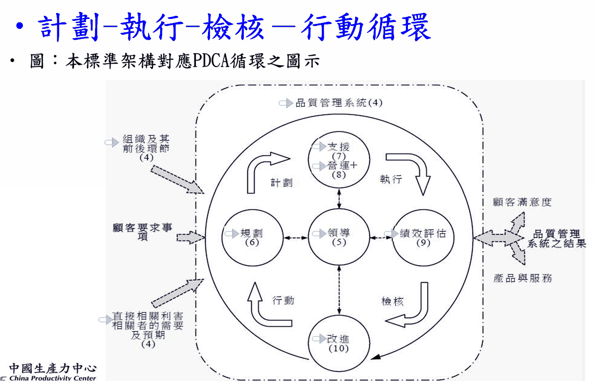

# 統計品管 考試速查筆記【乙單元・下午】

---

## ⓪-0 考場翻頁地圖（紙本第一頁）⭐先看這頁

> 📌 本冊使用法：
>
> - 本冊＝**乙單元（下午考）**：抽樣計畫 25%（乙一～乙十四章）＋品質概念 60%（乙十五～乙二十章）。甲單元（早上考）另有一冊，考甲帶甲冊。
> - 每一章都從新的一頁開始，章號就是頁籤——先查下面兩張表得到章號，再翻到該章。
> - 《抽樣檢驗》課本要翻第幾頁 → 翻**「乙十、抽樣檢驗課本查表索引」**。
> - 建議貼標籤：⓪、乙三、乙五、乙六、乙七、乙八、乙十、乙十二（⭐最常翻）。
> - ⚠️ 檢驗與測試 15%、品質概念 3-3（產品安全、進料管制、品質稽核）尚未開課，之後陸續補於本冊。

### 0. 甲乙單元對照（考試配分）

| 單元 | 子題（配分） | 對應章 | 狀態 |
|---|---|---|---|
| **甲（早上）** | 基本統計 **45%** | ⓪～十四（分區 A~D） | ✅ 已收錄 |
| | 管制圖與製程管制 **40%** | 十五～二十九（分區 E~G） | ✅ 已收錄 |
| | 品管七手法 **15%** | — | ⏳ 尚未開課，待補 |
| **乙（下午）** | 抽樣計畫 **25%** | 乙一～乙十四 | ✅ 已收錄 |
| | 檢驗與測試 **15%** | — | ⏳ 待補 |
| | 品質概念 **60%**：基本概念 10（含品質成本） | **乙十五** | ✅ 已收錄（第八堂課） |
| | 　國際品保／組織／標準化 20（乙最大子題） | **乙十九～乙二十** | ✅ 已收錄（ISO 9001／14001） |
| | 　產品安全／進料管制／品質稽核 15 | — | ⏳ 尚未開課，待補 |
| | 　品管圈／提案改善／品質成本 15 | **乙十六～乙十八**（品質成本在乙十五§4） | ✅ 已收錄 |

### 1. 分區 → 章號

🏷️ **考前準備**：實體課本標籤照 **乙十§5「乙場帶書貼標籤清單」** 貼好再進考場。

| 分區 | 章 |
|---|---|
| **抽樣計畫（第五堂）** | 乙一 基本概念（名詞、**單雙多比較⭐⭐**、型式與標準）｜乙二 允收機率（超幾何/二項/卜氏）｜**乙三 OC 曲線與 AQL/LTPD/α/β⭐⭐**｜**乙四 AQL 設定三法⭐**｜**乙五 規準型 JIS Z9002⭐**｜**乙六 選別型 AOQ/AOQL/ATI⭐**｜**乙七 調整型 CNS 2779-1/105E⭐⭐（轉換規則）**｜乙八 計量值 MIL-STD-414｜**乙十 抽樣檢驗課本查表索引⭐**（乙九已刪：CSP-1 與逐次抽樣不考） |
| **抽樣計畫（第六堂）** | **乙十一 計量值規準型 JIS Z9003/Z9004⭐（σ已知/未知）**｜乙八補強 CNS 9445-1 課本程序（s法/σ法/MSSD/MPSD/**轉換規則⭐⭐**/**混合抽樣⭐⭐**）｜**乙十二 MIL-STD-1916⭐⭐（考觀念）**｜乙十三 計量vs計數比較與常用抽樣表⭐｜乙十四 抽樣實施與抽樣技術 |
| 檢驗與測試 | ⏳ 待補 |
| **品質概念（第八堂課，60%）** | **乙十五 品質基本概念與品管大師⭐⭐（大師對照、Kano必考、品質成本、演化史）**｜**乙十六 品管圈QCC⭐（十大步驟、方針vs自主、評審配分、SDCA）**｜**乙十七 QC STORY⭐⭐（問題解決vs課題達成、目標達成率/進步率公式）**｜乙十八 提案改善制度（提案改善vs改善提案、BS四原則、X/Y/Z）｜**乙十九 ISO 9000系列與9001:2015⭐⭐（沿革、驗證體系、HLS、七原則、2008↔2015）**｜乙二十 ISO 14001:2015（守規義務、LCA陷阱、EPIs） |
| 品質概念 3-3（產品安全/進料/稽核） | ⏳ 尚未開課，待補 |

### 2. 看到這種題目 → 翻這章

**計算題**

| 題目關鍵字 | 翻 |
|---|---|
| 抽 n 件得 d 件不良的機率（超幾何/二項/卜氏、查表相減） | 乙二 |
| 單次抽樣求 Pa、繪 OC 曲線 | 乙三§4 |
| **雙次抽樣求 Pa（畫表格法）** | **乙三§5** |
| p₀、p₁ 查 JIS Z9002（含＊號用輔助表） | 乙五 |
| AOQ、**AOQL＝y(1/n−1/N)**、y 係數表 | 乙六§2~3 |
| ATI 計算、指定 LTPD 求最小 ATI | 乙六§4~5 |
| 調整型查計畫（N＋AQL＋水準→代字→n/Ac/Re） | 乙七§4（頁碼在乙十） |
| 轉換分數加分、AOQL＝係數×(1−n/N)、LQ 反查 AQL | 乙七§5~6 |
| 計量值 s 法/全距法/σ法、k 法 vs M 法判定 | 乙八 |
| 給 m₀/m₁ 或 p₀/p₁＋**σ 已知**，求允收界限 X̄ᵤ/X̄ʟ（JIS Z9003） | **乙十一§2~4** |
| **σ 未知**、x̄−ks ≥ Sʟ 判定（JIS Z9004）；查表空格用公式 | **乙十一§5** |
| Qᵤ/Q_L ≥ k 判定、MSSD/MPSD 雙邊合併管制 | **乙八§4~5** |
| MIL-STD-1916 查 n/k/F、K法/F法判定、20批轉換演練 | **乙十二§6~7** |

**觀念／選擇題**

| 題目關鍵字 | 翻 |
|---|---|
| 抽樣檢驗名詞（批量N/樣本n/Ac、缺點三級）、Dodge & Romig 創始 | 乙一§1~3 |
| 單次/雙次/多次比較（估計最準？行政費最少？） | 乙一§7 |
| 規準型/選別型/調整型、JIS/CNS/MIL-STD-1916 對照 | 乙一§8、**乙十三§4（表5.3 總表）** |
| 1916 特點（0收1退、CL 只有 A~E、VL 七級、**Cpk 門檻 2/1.33/1**、取代 105E） | **乙十二§1~3** |
| 1916 轉換法則（2~5批2拒→加嚴、連5批→正常、連10批→減量） | **乙十二§5** |
| 計量 vs 計數比較（樣本數 125/75/52/19、判斷力） | **乙十三§1~2** |
| 隨機抽樣四原則、系統/曲折/分層/區域/分段抽樣 | **乙十四§2~4** |
| 集合體抽樣（流體/泥狀體/連續體/塊粉）、變異相加公式 | **乙十四§5** |
| AQL、LTPD、α、β 定義與慣用值 | 乙三§2 |
| 比例抽檢 vs 定量抽檢、OC 曲線特性 | 乙三§3 |
| AQL 設定（經驗法/損益平衡/歸納分類、特採） | 乙四 |
| 選別型兩種保證、不適用破壞性檢驗 | 乙六§1 |
| Dodge-Romig SL/DL/SA/DA、p̄>½LTPD 無表 | 乙六§6 |
| **轉換規則（5批2拒→加嚴、轉換分數30→減量、加嚴5批→中止）** | **乙七§5** |
| 檢驗水準 II 預設、S-1~S-4、AQL≤10% 上限 | 乙七§2~3 |
| 三級缺點綜合判定（Ac 個別＋總量） | 乙七§7 |
| ISO 2859-1 vs MIL-STD-105E 差異（新舊制） | **乙七§5-1** |
| 抽樣 vs 全數檢驗（哪些該全檢？破壞性只能抽？） | 乙一§9 |
| 超幾何／卜氏的偏態（p＜1/2 右偏） | 乙二§1 |
| AOQ 曲線形狀（先升後降）、AOQL＝AOQ 最大值 | 乙六§2~3 |
| 一表多用：調整型表當選別型／LQ／規準型用 | 乙七§6 |
| 計量值 k 法 vs M 法、s 法／全距法／σ 法 | 乙八§1 |
| 計量＋計數混合抽樣（414 正常 IV → 105E 加嚴 II） | 乙八§3 |
| 「抽樣檢驗課本第幾頁」 | **乙十** |

**品質概念題（60%）**

| 題目關鍵字 | 翻 |
|---|---|
| 品質定義／大師配對（柏拉圖=裘蘭、ZD=克勞斯比、TQC=費根堡、品管圈=石川馨、損失函數=田口） | **乙十五§1、§3** |
| Kano 模式（魅力/必要/一維/無差異/反轉；成熟期→魅力） | **乙十五§5** |
| 品質成本四類（QCC 後預防成本增加、U 型最適點） | 乙十五§4 |
| 演化順序（檢查→製造→設計→管理；作業員→領班→檢驗員） | 乙十五§7 |
| QC=回饋 vs QA=前饋、QFD、國家品質獎=TQM、PDCA 階段歸屬 | 乙十五§8 |
| 品管圈定義/人數/創始、十大步驟×手法、目標三要素 | **乙十六§1~2** |
| 方針管理 vs 自主管理、SDCA vs PDCA、團結圈評審配分 | 乙十六§3、§5~6 |
| 問題解決型 vs 課題達成型（望差值、攻堅點、障礙排除） | **乙十七§1~2** |
| 目標達成率／進步率／改善值計算 | **乙十七§4** |
| 工作圈 vs 品管圈（先找主題再組圈、先標準化） | 乙十七§6 |
| 提案改善 vs 改善提案、評審配分 10/20/30/40、三發展階段 | **乙十八§2~3** |
| 腦力激盪四原則（量重於質）、列舉法、X/Y/Z 理論 | 乙十八§4 |
| ISO 沿革年份／章節數、驗證 vs 認證四團體、名片寫法 | **乙十九§1~2** |
| 2015 改版（刪品質手冊/管理代表、風險取代預防、七原則） | **乙十九§4~5** |
| 各產業標準（16949=汽車、TL9000=電信、13485=醫材、27001=資安） | **乙十九§7** |
| ISO 14001（守規義務、LCA 不強制、MPIs/OPIs/ECIs） | 乙二十 |

### 3. 抽樣計畫總覽決策表 ⭐⭐（先看這張，再翻章）

| 題目給你的關鍵字 | 這是哪一型 | 標準／計畫 | 查哪張表（課本頁） | 本冊章 |
|---|---|---|---|---|
| p₀（合格批**最高**不良率）＋p₁（不合格批**最低**不良率）；α=5%、β=10% | **規準型** | JIS Z9002（計數單次） | 本表 **P41**；交點是＊→輔助表 **P45** | 乙五§2~3 |
| 同上，但為**計量值**（給 m₀/m₁ 或規格界限＋σ） | 規準型（計量） | JIS Z9003（σ已知）／Z9004（σ未知） | 表3.1 **P122**／表3.3 **P124**／表3.4 **P129** | **乙十一** |
| **AQL＋批量 N＋檢驗水準**（未指定→II）；正常/加嚴/減量 | **調整型** | CNS 2779-1＝ISO 2859-1＝105E | 代字 **P323** → 主表 **P324~332** | 乙七§4 |
| 只有**單獨一批**（非連續批）＋**LQ** 界限品質 | 調整型表當 LQ 用 | ISO 2859-2 概念 | 表 7A／10K-1 **P352** | 乙七§6 |
| **LTPD（或 pt）＋作業平均 p̄** → 保證「**每一批**」 | **選別型** | Dodge-Romig **SL**（單次）／**DL**（雙次） | 附表三 P260~319 | 乙六§6 |
| **AOQL＋作業平均 p̄** → 保證「**長期平均**」 | **選別型** | Dodge-Romig **SA**（單次）／**DA**（雙次） | 附表三 P260~319 | 乙六§6 |
| 給 n、c、N 問「出廠品質**最壞**會多差」 | 選別型計算 | **AOQL＝y(1/n−1/N)** | y 係數表 **P49** | 乙六§3 |
| 已查到調整型計畫，但拒收批要**全檢剔選** | 調整型當選別型用 | **AOQL＝係數×(1−n/N)** | 表 8A／V-A **P342** | 乙七§6 |
| 問「平均**要驗幾件**／檢驗費用／工時」 | ATI／ASN | ATI＝n＋(1−Pa)(N−n) | ASN 曲線 **P344** | 乙六§4、乙七§7 |
| 給**觀測值**要算 X̄、s，問允收（k 法／M 法） | **計量調整型** | MIL-STD-414／CNS 9445-1 | 代字 P374~375、k 表、M 表 | 乙八 |
| 先驗少數計量、不行再補計數 | 混合抽樣 | 9445-1（正常）→ 2779-1（**加嚴**）；舊制 414→105E | 課本 P168~169 | 乙八§3 |
| 出現 **VL（查證水準）＋CL（A~E）**、**0收1退** | 連續調整型 | **MIL-STD-1916** | 表 I／II 同在 **P195**、III **P196**、IV **P197** | **乙十二** |

> 🎯 **一句話判型：看題目給的是「兩個不良率」還是「一個 AQL」**
>
> - 給 **p₀＋p₁**（兩個不良率）→ **規準型**（JIS Z9002）。
> - 給 **AQL＋N＋檢驗水準**（一個 AQL）→ **調整型**（CNS 2779-1／105E）。
> - 給 **LTPD 或 AOQL＋p̄**（出現「作業平均」四個字）→ **選別型**（Dodge-Romig）。
> - 題目給的是**量測數據（X̄、s、σ）**而非不良數 → 計量值：σ已知/未知＋規準型 → Z9003/Z9004（乙十一）；AQL＋代字 → CNS 9445-1（乙八）。
> - 出現 **VL／查證水準／0收1退** → **MIL-STD-1916**（乙十二）。

## ⓪-1 考前必看：工程計算機設定（Casio fx-350MS）

### 1. 進入統計模式（SD 模式）＋清除舊資料

| 步驟 | 按法 | 畫面 |
|---|---|---|
| 一：進入統計模式 | **MODE → 選 SD → 按 2** | COMP(1) / SD(2) / REG(3) |
| 二：清除舊資料 | **SHIFT → MODE → 選 Scl → 按 1 → = → AC** | 出現 Stat clear |

> ⚠️ **每次算新一組資料前先 Stat Clear**，否則舊數據會混進來。

### 2. 考完／算完恢復正常模式 ⚠️

| 步驟 | 按法 |
|---|---|
| 恢復一般計算模式 | **MODE 連按 3 次 → 選 Norm 按 3 → Norm 1~2? 選擇** |

> ⚠️ **統計算完一定要切回 Norm**，否則後面一般計算會出錯。

---

## ⓪-2 符號速查表

### 1. 統計符號

| 符號 | 唸法 | 意義 | 備註 |
|---|---|---|---|
| N | — | **群體**大小 | 大寫 = 群體 |
| n | — | **樣本**大小 | 小寫 = 樣本 |
| X̄ | X bar | 平均數 | ΣX/n |
| σ | sigma（小寫） | **群體**標準差 | 分母 ÷ n；是一個**數值** |
| σ² | sigma 平方 | **群體**變異數 | 分母 ÷ n |
| **S** | — | **樣本**（估計）標準差 | 分母 ÷ (n−1)；英文字母給樣本、希臘字母給群體 |
| S²、V | — | **樣本**（不偏）變異數 | 分母 ÷ (n−1) |
| **SS** | — | **平方和** Sum of Square | = Σx² − (Σx)²/n；兩個字母，跟標準差 S 無關！ |
| Σ | sigma（大寫） | 總和**運算** | ΣX = 全部加起來；**後面一定接東西**（ΣX、Σfx），σ 則單獨出現是數值 |
| Q1/Q2/Q3 | — | 四分位數 | Q2 = 中位數 |
| R | — | 全距 Range | Max − Min |
| CV | — | 變異係數 | 標準差 ÷ 平均數 |

### 2. 機率與集合符號

| 符號 | 唸法 | 意義 | 備註 |
|---|---|---|---|
| **S**、Ω | 樣本空間／omega | 所有可能出象的**全體** | P(S)=1；文氏圖的大矩形；集合論寫 Ω、機率寫 S，同一個東西 |
| Φ | phi | **空集合**（無元素） | P(Φ)=0；互斥 = A∩B=Φ |
| ∈ / ∉ | 屬於／不屬於 | 元素與集合的關係 | 1∈{0,1}、2∉{0,1} |
| ⊂ | 含於 | A⊂B：A 是 B 的子集 | — |
| ∪ | 聯集（或） | A∪B：屬於 A **或** B | 加法定理 |
| ∩ | 交集（且） | A∩B：**同時**屬於 A 和 B | 可簡寫 AB；乘法定理 |
| A′ | A 補／餘集 | **不屬於** A 的部分 | P(A′) = 1−P(A) |
| A−B | A 去 B | 在 A 但不在 B | = A∩B′ |
| P(A) | — | 事件 A 的機率 | 邊際機率 |
| P(A∩B) | — | A、B **同時**發生 | 聯合機率 |
| P(A\|B) | A given B | **已知 B 發生**下 A 的機率 | 條件機率 = P(A∩B)/P(B)；直線後面是「已知」 |
| ₙPₘ | — | 排列（考慮順序） | n!/(n−m)! |
| ₙCₘ | — | 組合（不考慮順序） | n!/[m!(n−m)!] |
| ! | 階乘 | n! = n×(n−1)×…×1 | 0! = 1 |

### 3. 計算機螢幕符號（fx-350MS）

| 螢幕顯示 | 意義 | 出現位置 | 對應筆記符號 |
|---|---|---|---|
| COMP / SD / REG | 一般計算／**統計**／迴歸 模式 | 按 MODE 後的選單（統計選 **SD 按 2**） | — |
| Scl → Stat clear | 清除統計舊資料 | SHIFT → MODE → 1 | — |
| n | 已輸入的資料筆數 | 每按一次 M+ 後顯示 | 樣本大小 n |
| x̄ | 平均值 | SHIFT → 2 → **選 1** | X̄ |
| **xσn** | **群體**標準差（÷n） | SHIFT → 2 → **選 2** | σ |
| **xσn−1** | **樣本**標準差（÷(n−1)） | SHIFT → 2 → **選 3** | S |
| Σx² | 所有資料平方的總和 | SHIFT → 1 → 選 1 | Σx²（算 SS 用） |
| Σx | 所有資料的總和 | SHIFT → 1 → 選 2 | ΣX |
| Ans | 上一個計算結果 | 按 Ans 鍵叫出 | 求變異數：Ans → x² → = |
| ; （分號） | 分組輸入的「組中點**；**次數」分隔 | SHIFT → 逗號鍵 | 分組資料輸入 |
| M+ | 輸入一筆統計資料 | 每筆資料按一次 | — |
| nCr / nPr | 組合／排列 | nCr 直接按；nPr 要 **SHIFT**＋nCr | ₙCₘ／ₙPₘ |
| **^**（xʸ） | **次方**（乘冪） | 底數 → **^** → 指數 → =（例：0.95 → ^ → 18 → = ≈ 0.3972） | pˣ、(1−p)ⁿ⁻ˣ |
| Norm | 一般顯示模式 | MODE 連按 3 次 → Norm（考完恢復用） | — |

> 🎯 **記法（跟公式表完全對應）**
>
> - 螢幕 **σn** 結尾 = 除以 n = **群體**
> - 螢幕 **σn−1** 結尾 = 除以 n−1 = **樣本**

---

## 乙一、抽樣檢驗基本概念（第五堂課，抽樣檢驗課本第1章 P1~13）

### 1. 起源與定義

- **抽樣檢驗（Sampling Inspection）由美國貝爾電話研究所的 H.F. Dodge 及 H.G. Romig 所創始**——用少數樣本去判斷一批製品的良窳。（課本螢光重點，考過）
- 二次大戰初期美軍全數檢驗人力不堪負荷，兵工署採貝爾研究所建議改用抽樣檢驗計畫。

### 2. 基本名詞與符號 ⭐

| 名詞 | 符號 | 定義關鍵 |
|---|---|---|
| 批量 | N | 每個**檢驗批**內製品單位的數量 |
| 樣本數 | n | 樣本中所含製品單位數（隨機、不看品質好壞抽出） |
| 合格判定數 | c（Ac） | 判定合格/不合格的基準不良個數（計量值對應 k→統計） |
| 缺點 | d | 品質特性不合規格處（計量值對應 x→統計） |
| 不良品 | D | 有一個以上檢驗項目不合格的製品 |
| 不良率 | p | p＝100d/n(%)；平均不良率 p̄＝100Σd/Σn |

- 「批」＝相同來源、相同條件生產的一群相同規格產品（製造批）；檢驗批為便利抽驗而構成，可由製造批細分，但**不可把多個製造批合併成一個檢驗批**。
- ⚠️ **符號提醒（`d` 一符二用）**：課本的 `d` 既指「缺點數」也指「樣本中的不良品數」。判定式 **d≤c** 的 d 一律看題目是「計不良品」還是「計缺點」而定；`p＝100d/n` 的 d 是**不良品數**。

### 3. 缺點與不良品三級分類 ⭐

| 等級 | 缺點（defect） | 不良品（defective） |
|---|---|---|
| 嚴重 | 危害使用者/攜帶者**生命或安全** | 所含缺點最高為嚴重者（D_Cr） |
| 主要 | 使用性能不能達到期望目的，或顯著減低實用性 | 所含缺點最高為主要者（D_Ma） |
| 次要 | 實際上不影響使用目的（例：外觀、顏色） | 所含缺點只有次要者（D_Mi） |

### 4. 抽樣計畫三要素 ⭐

> 📌 **計畫組成（螢光重點）**
>
> - 計數值抽樣計畫＝**批量 N＋樣本數 n＋合格判定數 c**。
> - 計量值抽樣計畫＝批量 N＋樣本數＋**合格判定值（k 或 M，允收常數）**，判定前須先統計計算。
> - 分配原理：**計數值→超幾何／二項／卜氏分配；計量值→常態分配**。

### 5. 抽樣檢驗的方式（4 種）

| 方式 | 判定 |
|---|---|
| 不良個數計數 | 樣本不良品 ≤ c 合格 |
| 缺點數計數 | 樣本缺點數 ≤ d 合格 |
| 計量（σ 已知） | x̄ 與合格判定值 X̄_L／X̄_U 比較 |
| 計量（σ 未知） | x̄±ks 與規格 S_U／S_L 比較 |

### 6. 抽樣檢驗的形式：單次／雙次／多次／逐次

- 單次：抽 1 個樣本 n，d≤c 允收。
- 雙次：第一次 n₁——d₁≤c₁ 允收、d₁≥r₁ 拒收、介於其間抽第二次 n₂——d₁+d₂≤c₂ 允收。
- 多次：雙次之延續；**# 記號＝第 1 次樣本不允收該批**（只能繼續抽或拒收）。
- 逐次：每次僅抽 1 個，累計判定；唯一不能事先預知抽樣數。（形式分類要認得；**判定線計算不考**）

### 7. 單次／雙次／多次比較表 ⭐⭐（練習 1-5～1-7 有考過，必背）

| 項目 | 單次 | 雙次 | 多次 |
|---|---|---|---|
| 對產品品質的保證 | 幾乎相同 | 幾乎相同 | 幾乎相同 |
| 對供應者心理上的影響 | 最差 | 中間 | **最好** |
| 總檢驗費用 | 最多 | 中間 | **最少** |
| **行政費用**（訓練、記錄、抽樣等） | **最少**⭐ | 中間 | 最多 |
| **對每批品質估計之準確性** | **最好**⭐（1-6 必考） | 中間 | 最差 |
| 對製程平均數估計之決策速度 | **最快**⭐（1-7 必考） | 較慢 | 最慢 |
| 檢驗人員及設備之使用率 | 最佳 | 較差 | 較差 |

> 🎯 **記法：單次「三最」——行政費最少、估計最準、決策最快**
>
> - 單次一次抽完：紀錄單純（行政少）、樣本資訊完整（估最準）、馬上判（最快）。
> - 但總檢驗費用最多（每批都抽大樣本）、心理觀感最差（一翻兩瞪眼）。
> - 品質保證三者**幾乎相同**——考「哪個保證較好」是陷阱。

### 8. 抽樣檢驗的型式（5 種）與標準對照 ⭐

| 型式 | 特徵 | 代表標準 |
|---|---|---|
| **規準型** | 兼顧買賣雙方利益，固定 α＝5%、β＝10%，一次裁定 | 計數：**JIS Z9002**（單次）；計量：JIS Z9003（σ已知）／Z9004（σ未知） |
| **選別型** | 拒收批**不退貨**，全數剔選、不良品換良品 | **Dodge-Romig**（LTPD 型＋AOQL 型） |
| **調整型** | 依歷史品質調整正常/加嚴/減量；**須連續批**才能用 | 計數：ISO 2859-1（**CNS 2779-1**）；計量：ISO 3951-1（**CNS 9445-1**） |
| 連續生產型（**不考**，僅考 1916 表IV→乙十二） | 製程上邊生產邊抽驗 | ~~CSP-1（MIL-STD-1235）~~ |
| 逐次型（**不考**） | 一個一個抽 | ~~JIS Z9009~~ |

- **MIL-STD-1916**：含計數值、計量值及連續抽樣，**且均為調整型**。（**手寫註記：有考**；全章詳見**乙十二**）

> 🎯 **老師板書：三型計數值計畫的「設計依據」對照（第六堂課開場複習，紅線強調）**
>
> - 規準型 JIS Z9002 → 用 **p₀（AQL）＋p₁（LTPD）** 兩點設計。
> - 選別型 Dodge-Romig → 用 **N＋p̄（製程平均不良率）**，查 AOQL 表或 LTPD 表。
> - 調整型 CNS 2779-1（105E）→ 用 **N＋AQL** 查表。
> - 考「某計畫以什麼為設計基礎」就是考這張表。

### 9. 抽樣 vs 全數檢驗

| 適合抽樣檢驗 | 適合全數檢驗 |
|---|---|
| 產量大、連續生產無法全檢 | 批量太少，抽驗失去意義 |
| **破壞性試驗**（只能抽驗） | 檢驗手續簡單、不費人力 |
| 允許某種程度不良品存在 | **不允許不良品**（有致命影響） |
| 欲省檢驗時間費用 | 工程能力不足、不良率超規 |
| 刺激生產者改善品質 | 欲了解該批實際品質 |

- 抽樣檢驗優點：省時省力省成本、降低檢驗損壞與人員疲勞誤差、可拒收整批刺激改善、**可用於破壞性檢驗**、適合連續生產。
- 缺點：批的資訊較少、有允收壞批/拒收好批之風險、合格批中仍有不良品、規劃較費時。
- **隨機抽樣為必要條件**（螢光重點）；發現樣本有不良品不能立即武斷全批不良。

---

## 乙二、允收機率計算：超幾何／二項／卜氏（抽樣檢驗課本 2.1，P15~23）

（分配的一般性質見「十三、重要機率分配」；本章是抽樣檢驗情境的應用與查表技巧。）

### 1. 三種分配比較 ⭐

| 分配 | 公式 | 適用情境 |
|---|---|---|
| 超幾何 | Pd＝C(Np,d)·C(N−Np,n−d) ÷ C(N,n) | **有限**群體、不放回抽樣（計數值） |
| 二項 | Pd＝C(n,d)·p^d·(1−p)^(n−d) | N 視為**無限**（經驗：**n/N＜0.1** 即可用） |
| 卜氏 | Pd＝(λ^d/d!)·e^(−λ)，λ＝np | n 大、p 小（λ＝np≤7）；可查表最快 |

> ⚠️ **超幾何分配的偏態（有考過）**
>
> - p＝1/2：對稱。
> - **p＜1/2：右偏（正偏）**——不良率低時常見，考過。
> - p＞1/2：左偏（負偏）。
> - 卜氏分配也是：**λ＝np 小（不良少）時右偏**，此時不可用常態近似；λ 夠大才會趨近對稱。

- 卜氏近似的實用條件（**本課本經驗值**，四個一起記）：n/N＜0.1、**n＞16**、**p＜10%**、**λ＝np≤7**。
- ⚠️ 其他教材常寫 **np≤5**；題目若採 5 的版本，以題目所引標準為準。
- 三法結果很接近——同一組數據（N 大、p=3%、n=100、d=0）：超幾何 0.04036、二項 0.04755、卜氏 0.04979 ≈ 0.05。

### 2. 例題示範（例 2.1~2.3）

例 2.1（超幾何）：N=1,000、p=3%、n=100 → Np=30。
P₀＝C(30,0)C(970,100)/C(1000,100)＝0.04036；P₁＝C(30,1)C(970,99)/C(1000,100)＝0.13895。
（實務用**階乘對數表**：log P₀＝(log900!＋log970!)−(log870!＋log1000!)＝−1.3941）

> 📌 **fx-350MS 反對數按鍵（log p → p）**
>
> - 已算出 log P₀＝−1.3941。
> - 按：`SHIFT` → `log`（＝10^x）→ `(−)` → `1.3941` → `=` → **0.04036**。

例 2.2（二項）：N=100,000、n/N=0.001＜0.1 → 可用二項。
P₀＝C(100,0)(0.97)^100＝0.04755；P₁＝100×0.03×(0.97)^99＝0.1471。

例 2.3（卜氏）：λ＝np＝100×0.03＝3。
P₀＝e^(−3)＝0.04979；P₁＝3e^(−3)＝0.14937。

> 🎯 **查卜氏累計表求「恰好 k 個」：相鄰兩格相減**
>
> - 表給的是累計機率 F(c)＝P(d≤c)。
> - P(d＝0)＝F(0)＝0.050。
> - P(d＝1)＝F(1)−F(0)＝0.199−0.050＝0.149。
> - 這招是雙次抽樣 Pa 計算（乙三章「畫表格」法）的基礎。

---

## 乙三、OC 曲線與 AQL／LTPD／α／β ⭐⭐（抽樣檢驗課本 2.1.4，P24~33）

### 1. OC 曲線（Operating Characteristic Curve，操作特性曲線）

- 定義：各種不良率 p 的送驗批，經抽樣計畫判定**允收之機率 Pa** 所繪成的曲線。**X 軸＝不良率 p，Y 軸＝允收機率 Pa**。
- 功能：顯示抽樣計畫**分辨良批與遜批的能力**；p=0 時 Pa=1，p=1 時 Pa=0。
- 完美 OC 曲線＝階梯形（AQL 前全收、之後全拒），實際曲線為平滑反 S 形，中間有「不明區域」。

### 2. 四個關鍵定義 ⭐⭐（與「十八、兩種錯誤」同源，必背）

| 名詞 | 定義 | 慣用值 |
|---|---|---|
| **AQL**（Acceptable Quality Limit 允收品質界限） | 消費者滿意的送驗批所含**最大**不良率＝**p₀** | 允收機率 Pa＝1−α＝**95%** 時之不良率 |
| **LTPD**（Lot Tolerance Percent Defective 拒收水準） | 消費者認為品質惡劣的送驗批所含**最低**不良率＝**p₁**；正式別名 **RQL**（Rejectable Quality Level 拒收品質水準，講義：AQL 由生產者決定、RQL 由消費者決定） | 允收機率 Pa＝**10%** 時之不良率 |
| **生產者冒險率 α**（PR） | 品質良好卻被誤判**拒收**＝**第一型誤差 Type I** | 於 AQL 處，α＝**5%** |
| **消費者冒險率 β**（CR） | 品質惡劣卻被誤判**允收**＝**第二型誤差 Type II** | 於 LTPD 處，β＝**10%** |

收驗的四種結果（象限表）：

| | 良批 | 遜批 |
|---|---|---|
| 允收 | 正確（1−α） | **誤收：β（第二型）** |
| 拒收 | **誤拒：α（第一型）** | 正確（1−β） |

> 🎯 **記法：「誰倒楣就掛誰的名字」**
>
> - 好批被拒收 → **生產者**白做工 → α＝生產者冒險率（5%）。
> - 壞批被允收 → **消費者**吃虧 → β＝消費者冒險率（10%）。
> - α 在 OC 曲線**左上**（AQL 處距 100% 的缺口）；β 在**右下**（LTPD 處的殘餘允收率）。

### 3. OC 曲線五大特性 ⭐（課本特性①~⑤，選擇題最愛）

> ⚠️ **比例抽檢 vs 定量抽檢（① vs ②，有考過）**
>
> - ① **按同一比例（如 10%）抽樣：不能得到相同程度的品質保證**——批小則 n 小，OC 曲線平緩（N=50,n=5,c=0 在 p=2% 時 Pa 高達 90%；N=1000,n=100,c=0 僅 13%）。過去「規定抽百分之幾」即犯此錯。
> - ② **固定樣本數 n（如一律抽 20 個）：品質保證相當接近**——批量 50~1000 曲線幾乎重疊。
> - 口訣：**「比例不保證，定量才穩定」**。

- ③ 任何抽樣計畫都無法完全避免不良品混入。
- ④ 允收數 c 不必等於 0：n 加大時 c≥1 也可得同等保證，且生產者心理較安。
- ⑤ **n 愈大，OC 曲線愈陡，區分好壞批能力愈強**；**c 愈小，計畫愈嚴**（允收率下降）。
- ⑥（講義補充第❼點）**c 與 n 的搭配有降低檢驗成本的可能**——同等保證下選 n 較小的組合省檢驗費。

### 4. 單次抽樣 OC 曲線計算（例 2.4）

N=10,000、n=100、c=4；n/N=0.01＜0.1 → 查卜氏表（λ=np，c=4 欄）。

| p | 0 | 0.01 | 0.02 | 0.03 | 0.04 | 0.05 | 0.06 | 0.07 | 0.08 | 0.09 | 0.10 |
|---|---|---|---|---|---|---|---|---|---|---|---|
| np | 0 | 1 | 2 | 3 | 4 | 5 | 6 | 7 | 8 | 9 | 10 |
| Pa | 1.000 | 0.996 | 0.947 | 0.815 | 0.629 | 0.440 | 0.285 | 0.173 | 0.100 | 0.055 | 0.029 |

### 5. 雙次抽樣 Pa：老師的「畫表格」解法 ⭐⭐（例 2.5，大題）

題型：N=1,000、n₁=50、c₁=1、n₂=100、c₂=3，求 p=0.01 時之 Pa。

允收的路徑只有三種：①d₁≤c₁ 直接允收；②d₁=2 且 d₂≤1（湊到 ≤c₂=3）；③d₁=3 且 d₂=0。d₁≥4 必拒收（打叉）。

| | d₁≤1（直接收） | d₁=2 | d₁=3 | d₁≥4 |
|---|---|---|---|---|
| 第一次 n₁p＝50×0.01＝0.5 | F(1)＝**0.910** | F(2)−F(1)＝0.986−0.910＝0.076 | F(3)−F(2)＝0.998−0.986＝0.012 | ✗ |
| 第二次 n₂p＝100×0.01＝1.0 | （不必抽）✗ | 還可收 d₂≤1：F(1)＝0.736 | 只能收 d₂=0：F(0)＝0.368 | ✗ |
| 相乘再相加 | Pa₁＝0.910 | 0.076×0.736＝0.056 | 0.012×0.368＝0.004 | |

**Pa＝Pa₁＋Pa₂＝0.910＋(0.056＋0.004)＝0.970**。同法 p=0.02 時 Pa＝0.736＋0.184×0.406＋0.061×0.135＝**0.819**。

> 🎯 **畫表格四步驟（板書法）**
>
> - 第 1 列：n₁p 查卜氏表——直接允收欄填 F(c₁)，其餘欄用**相鄰相減**求 P(d₁=k)。
> - 第 2 列：n₂p 查表——每欄第二次「還能收幾個」＝c₂−d₁，填 F(c₂−d₁)。
> - 第 3 列：**同欄上下相乘**，各欄**橫向相加**得 Pa₂。
> - Pa＝Pa₁＋Pa₂。d₁＞c₂ 的欄整欄打叉。

---

## 乙四、AQL 之設定三法 ⭐（抽樣檢驗課本 2.1.4(7)，P34~38）

### 1. 三法總覽

| 方法 | 依據 | 要點 |
|---|---|---|
| 經驗法 | 類似產品/製程的過去經驗 | ①依缺點等級分：愈重要 AQL 愈嚴；②依檢驗項目數：**項目少→AQL 嚴，項目多→AQL 寬** |
| 損益平衡點法 | 成本 | **B.E.P＝每件檢驗成本 ÷ 每一不良總成之修理成本**，再查表取最近 AQL；缺點：兩成本難算準 |
| **歸納分類法（風險法）** | 五要素綜合 | **考很多**（老師註記）；最實用可行 |

### 2. 經驗法對照表

| 主要不良：檢驗項目 | AQL(%) | 次要不良：檢驗項目 | AQL(%) |
|---|---|---|---|
| 4 以下 | 0 | 2 以下 | 1.0 |
| 5~7 | 0.65 | 3~4 | 1.5 |
| 8~11 | 1.0 | 5~7 | 2.5 |
| 12~19 | 1.5 | 8~18 | **4.5**（⚠️講義表10-1 印 4.5；本表舊版曾抄 4.0，以講義為準） | 
| 20~48 | 2.5 | 19 以上 | 6.5 |
| 49 以上 | 4.0 | | |

### 3. 損益平衡點法對照表

| B.E.P.(%) | 0.5~1 | 1~1.75 | 1.75~3 | 3~4 | 4~6 | 6~10.5 | 10.5~17 |
|---|---|---|---|---|---|---|---|
| AQL(%) | 0.25 | 0.65 | 1.0 | 2.5 | 4.0 | 6.5 | 10 |

### 4. 歸納分類法（風險法）⭐——考很多

五要素，每要素分三類，由起點沿箭頭走到右邊得 AQL（0.065%~15%，由嚴到寬）：

| 要素 | 嚴（AQL 小）↗ | 中 → | 寬（AQL 大）↘ |
|---|---|---|---|
| 檢驗成本/修理成本比 | 0.5 以下 | 0.5~1 | 1 以上 |
| 可能發現不良地區 | **顧客使用時** | 最終檢查 | 中間檢查 |
| 不良品處理方式 | **報廢處理** | 整修處理 | **特採（降低品質/規格使用）** |
| 製程方式 | 全自動 | 半自動 | 人工生產 |
| 鑑定不良之難易 | 很難鑑定 | 不易鑑定 | 容易鑑定 |

> ⚠️ **易誤觀念：特採（有考過）**
>
> - 特採＝不合格品**降低品質（規格）使用**，不是報廢也不是整修。
> - 處理方式愈「傷」（報廢）→ 後果愈重 → AQL 訂愈**嚴（小）**；可特採 → AQL 可放**寬（大）**。
> - 「發現地區」同理：流到**顧客**手上才發現 → 最嚴；廠內中間檢查就能攔 → 較寬。

---

## 乙五、規準型抽樣計畫 JIS Z9002 ⭐（抽樣檢驗課本 2.2，P39~45）

### 1. 規準型的精神

- 買賣雙方**約定品質條件**、各自承擔冒險率，一次裁定允收/拒收：**α＝5%（生產者）、β＝10%（消費者）**（AQL／LTPD／α／β 的完整定義見**乙三§2**，此處只記符號對應）。
- 符號對應：**p₀＝AQL**（滿意批／合格批的最高不良率）、**p₁＝LTPD**（不滿意批／不合格批的最低不良率）。
- OC 曲線通過（p₀, 1−α）與（p₁, β）兩點。
- JIS Z9002（1956，日本）＝計數**規準型單次**抽樣表；適用斷續製程的群體批或一次購入大量製品。**雙次規準型至今無抽樣表**（試誤法太繁）。

### 2. 查表步驟（本表）⭐

1. 雙方協議 p₀、p₁；決定批量 N。
2. 查本表：**p₀ 找「列」、p₁ 找「欄」**，交點格讀「n c」（左 n 右 c）。
3. 格中是箭頭（↓↑←→）→ 採用箭頭所指方向的第一個抽樣計畫。
4. 格中是＊ → 改用**輔助表**計算。

例 2.6：p₀=0.8%（落 0.711~0.900 列）、p₁=5%（落 4.51~5.60 欄）、N=3,000 → 查得 **n=100、c=2**。

### 3. 輔助表（＊號時用）⭐

| p₁/p₀ | c | n |
|---|---|---|
| 17 以上 | 0 | 2.56/p₀＋115/p₁ |
| 16~7.9 | 1 | 17.8/p₀＋194/p₁ |
| 7.8~5.6 | 2 | 40.9/p₀＋266/p₁ |
| 5.5~4.4 | 3 | 68.3/p₀＋334/p₁ |
| 4.3~3.6 | 4 | 98.5/p₀＋400/p₁ |
| 3.5~2.8 | 6 | 164/p₀＋527/p₁ |
| 2.7~2.3 | 10 | 308/p₀＋770/p₁ |
| 2.2~2.0 | 15 | 502/p₀＋1065/p₁ |
| 1.99~1.86 | 20 | 704/p₀＋1350/p₁ |

步驟：算 **p₁/p₀** → 查得 c → 把 p₀、p₁（**百分率值**）代入 n 公式 → n 不是整數就**無條件進位**。

例 2.7：p₀=0.8%、p₁=2% → 交點為＊ → p₁/p₀＝2.5（落 2.7~2.3）→ c=10 → n＝308/0.8＋770/2＝385＋385＝**770** →（N=3,000, n=770, c=10）。

> 💡 **查表近似的觀念題（講義例 2.6-1 檢討）**：p₀=0.65%、α=5%、p₁=3%、β=10% 查表得 (200, 3)，但精算應為 (211, 3)——**查表是近似**，等於把 p₀ 放寬到約 0.68%、p₁ 退讓到約 3.34%。考「查表值與理論值為何不同」就是這個觀念。

> ⚠️ **使用 JIS Z9002 的三個注意**
>
> - 查得 n＞N 時 → 改**全數檢驗**。
> - **p₁/p₀ 應大於 1.86**，否則 n 過大不經濟（表也只列到 1.86）。
> - 求得 n、c 後宜檢討檢驗費用與 OC 曲線，必要時修正 p₀、p₁ 重求。

### 4. 型式選擇速判 ⭐（本章結論，跨章用；完整版見 ⓪-0 §3）

> 🎯 **判斷關鍵：題目給什麼就是哪型**
>
> - 給「**合格批最高不良率＋不合格批最低不良率**」（p₀、p₁）→ 規準型查 JIS Z9002。
> - 給「**LTPD 或 AOQL＋作業平均不良率 p̄**」→ 選別型查 Dodge-Romig（乙六章）。
> - 給「AQL＋批量＋檢驗水準」→ 調整型 CNS 2779-1／MIL-STD-105E。

---

## 乙六、選別型抽樣計畫：AOQ／AOQL／ATI／Dodge-Romig ⭐（抽樣檢驗課本 2.3，P46~58）

### 1. 選別型的特質與兩種保證

- 拒收批**不退貨**→ 100% 全數剔選，發現的不良品剔除**補以良品**。用於無法選擇供應者時；**不適用於破壞性檢驗**或檢驗成本太高者（螢光重點）。
- 兩種保證：①不良率在 **LTPD（p₁）以上**的批，允收機率壓在 **10% 以下**（保證**每一批**）；②長期連續使用，出廠平均不良率不超過 **AOQL**（保證**平均品質**）。

### 2. AOQ 平均出廠品質 ⭐

| 情境 | 公式 | 手寫註記 |
|---|---|---|
| 允收批中驗出的不良品**也更換** | **AOQ＝Pa·p·(1−n/N)**（公式 4） | 「有限批」 |
| N 大、n 小（n/N→0），只更換拒收批 | **AOQ ≅ Pa·p**（公式 5） | 「無限批」 |

- 邏輯：拒收批全檢後不良＝0；允收批平均留下 Pa·p(N−n) 個不良 → 除以 N 得 AOQ。
- AOQ 對 p 的曲線：由 0 上升到**最大值後回降**（p 再大反而常被拒收→全檢→出廠更乾淨）。

### 3. AOQL 平均出廠品質界限 ⭐（必考）

- **AOQL＝AOQ 之最大值**＝選別檢驗下出廠品質最壞情況。
- 近似公式：**AOQL＝y(1/n−1/N)**，y 隨 c 而變（查表，**必考**）：

| c | 0 | 1 | 2 | 3 | 4 | 5 | 6 | 7 | 8 | 9 | 10 | 11 |
|---|---|---|---|---|---|---|---|---|---|---|---|---|
| y | 0.368 | 0.841 | 1.372 | 1.946 | 2.544 | 3.172 | 3.810 | 4.465 | 5.150 | 5.836 | 6.535 | 7.243 |

> ⚠️ **兩個 AOQL 公式別拿錯（考場最容易混）**
>
> | 情境 | 公式 | 係數怎麼查 | 章節 |
> |---|---|---|---|
> | 自己設計選別計畫（題目給 n、c、N） | **AOQL＝y(1/n−1/N)** | y 隨 **c** 變，查課本 **P49** | 乙六§3 |
> | 已用調整型主表、拒收批再全檢 | **AOQL＝係數×(1−n/N)** | 係數隨 **代字＋AQL** 變，查 **P342** | 乙七§6 |
>
> - 判斷關鍵：題目有沒有出現「**代字／檢驗水準／AQL**」——有 → 用 P342 係數；只給 n、c → 用 P49 的 y。

例 2.8：N=10,000、n=100、c=4 → y=2.544 → AOQL＝2.544×(1/100−1/10000)＝2.544×0.0099＝0.0252＝**2.52%**。
（同一計畫的 AOQ 表在 p=0.04 時最大＝0.0252，兩法一致；實際 AOQ 常比 AOQL 小。）

### 4. ASN 與 ATI

- **ASN 平均樣本數**＝做出允收/拒收決策所需的平均**樣本**大小。
- **ATI 平均總檢驗件數**＝剔選檢驗下每批平均**檢驗**件數（含拒收批全檢），用來估**檢驗費用與工時**（螢光重點）。

| 計畫 | ATI 公式 |
|---|---|
| 單次 | **ATI＝n＋(1−Pa)(N−n)**＝nPa＋N(1−Pa)（公式 7） |
| 雙次 | ATI＝n₁＋n₂(1−Pa₁)＋(N−n₁−n₂)(1−Pa)＝n₁Pa₁＋(n₁＋n₂)Pa₂＋N(1−Pa)（公式 8） |
| 多次 | ATI＝n₁Pa₁＋(n₁+n₂)Pa₂＋…＋(n₁+…+nₖ)Paₖ＋N(1−Pa)，Pa＝ΣPaᵢ（公式 9） |

例 2.9（N=800、p=0.01）：
- 單次 n=75、c=2：np=0.75 → Pa=0.959 → ATI＝75＋0.041×725＝**105**。
- 雙次 n₁=39、c₁=0、n₂=81、c₂=4：Pa₁=0.677、Pa₂=0.316、Pa=0.993 → ATI＝39＋81×0.323＋680×0.007＝**70**。
- 結論：**雙次 ATI 全程比單次小**（總檢驗費較省）——呼應**乙一§7** 比較表：總檢驗費用單次最多。

### 5. 指定 LTPD 下求最小 ATI（例 2.10）⭐大題

題：N=2,500、β=10%、LTPD=5%、作業平均不良率 p̄=1.25%，求 ATI 最小的計畫。

> 🎯 **解題流程（每個 c 跑一輪，ATI 呈 U 形取谷底）**
>
> - ① 查卜氏表：找 **Pa=10% 對應的 np**（用 LTPD 那條）→ n＝np/LTPD。
> - ② 換算 **n·p̄**（注意：這裡改用**作業平均不良率**）→ 再查表得 Pa。
> - ③ ATI＝n＋(1−Pa)(N−n)。
> - ④ c 逐一加大，ATI 先降後升（U 形），取最小。

| c | np(Pa=10%) | n＝np/0.05 | n·p̄ | Pa | ATI |
|---|---|---|---|---|---|
| 1 | 3.89 | 78 | 0.975 | 0.745 | 695 |
| 3 | 6.681 | 134 | 1.67 | 0.911 | 344 |
| 5 | 9.295 | 186 | 2.33 | 0.968 | 260 |
| **6** | 10.53 | **210** | 2.625 | 0.982 | **252 ←最小** |
| 7 | 11.792 | 236 | 2.95 | 0.989 | 261 |

> ✅ **已對課本 P56 核實（2026-08-16）**：課本原文 c=6 列即取 **n=210**（10.53/0.05=210.6 未進位；其餘各列皆有進位，是課本自身不一致）。**考試一律照課本答 210**，後續 n·p̄=2.625、ATI=252 都以 210 計。

答：**N=2,500、n=210、c=6，ATI=252**。Dodge-Romig 的 LTPD 表就是照這方法製成。

### 6. Dodge-Romig 抽樣表（1941）⭐

| 表 | 型 | 抽樣 | 規格數 |
|---|---|---|---|
| **SL** | LTPD 型 | 單次 | LTPD 分 8 種：0.5, 1, 2, 3, 4, 5, 7, 10% |
| **DL** | LTPD 型 | 雙次 | （各計畫附 AOQL 值參考） |
| **SA** | AOQL 型 | 單次 | AOQL 分 13 種：0.1~10% |
| **DA** | AOQL 型 | 雙次 | （各計畫附 β=10% 之 LTPD 值 pt 參考） |

- 記法：**S**ingle／**D**ouble＋**L**TPD／**A**OQL。
- 選表：保證**單批**品質 → LTPD 型（SL/DL）；保證**多批平均**品質 → AOQL 型（SA/DA）。**LTPD 表適用少見的送驗批，AOQL 表適用長期送驗批**。
- 使用步驟：選單/雙次 → 求作業平均不良率 **p̄** → 定 N → 選 LTPD（或 AOQL）值 → 找對應表 → 依 N 與 p̄ 範圍查 n、c（或 n₁c₁n₂c₂）。
- 例 2.11：N=2,000、p̄=1%、LTPD=4% → SL-4.0% 表：n=195、c=4（AOQL=1.2%）。
- 例 2.12：N=1,000、AOQL=3%、p̄=1% → SA-3.0% 表：n=44、c=2（pt=11.8%）。
- 講義練習例 2.12-1：N=1,800、p̄=0.45%、AOQL=2% → 單次 (65, 2)、pt=8.2%；雙次 (37,0)＋(63,3)、pt=7.5%。

> ⚠️ **無表可查的限制**
>
> - **p̄＞½·LTPD** 時：無 SL/DL 表可查。
> - **p̄＞AOQL** 時：無 SA/DA 表可查。
> - 意即：製程平均太爛（相對於要保證的水準）時，選別型抽樣已無意義，只能全檢或改善製程。

---

## 乙七、調整型抽樣計畫 CNS 2779-1／MIL-STD-105E ⭐⭐（第五堂課下午，抽樣檢驗課本 2.4，P59~97）

> 📌 **本章 4 個入口（先確認你要哪一個）**
>
> - 要 **n／Ac／Re** → **§4** 八步驟（代字 P323 → 主表 P324~332）
> - 要判 **鬆緊怎麼轉** → **§5** 轉換規則；新舊制比較 → **§5-1**
> - 要 **AOQL／LQ／規準型近似** → **§6** 一表多用
> - 要 **ASN 比較／三級缺點綜合判定** → **§7**

### 1. 調整型的精神

- 依過去檢驗結果**調整鬆緊**：品質好 → 減量檢驗（省成本的優待）；品質壞 → 加嚴檢驗（提高拒收壞批能力）。買賣雙方都受益，並促使供應者改善品質。
- **必須是連續系列批**才能用轉換規則；單獨批應改查 LQ 型（ISO 2859-2）或分析 OC 曲線。
- CNS 2779-1＝ISO 2859-1（計數值，由 MIL-STD-105E 演進）；CNS 9445-1＝ISO 3951-1（計量值，由 MIL-STD-414 演進）。

### 2. 關鍵用語（CNS 2779-1 新制）⭐

| 用語 | 重點 |
|---|---|
| AQL 允收品質界限 | **Acceptance Quality Limit**（105E 舊名：Acceptable Quality Level 允收品質水準）＝連續批送驗時「最差的可容忍**過程平均**」 |
| 不允收 | 取代「拒收」一詞（涉消費者措施時仍用拒收，如「拒收數 Re」） |
| 不符合 vs 缺點 | 不符合＝未滿足**規定**要求；缺點＝未滿足**預期使用**要求。A 類（關切度最高，AQL 最小）＞B 類＞C 類 |
| 過程平均 | 供應者的平均品質水準；**要求過程平均比 AQL 更小**，否則會被轉加嚴 |
| 轉換分數 (switching score) | 正常檢驗下判斷可否轉**減量**的累積指標（新制取代 105E 的「連續 10 批允收」） |
| CRQ 消費者風險品質 | 對應某規定消費者風險（通常 10%）的品質水準（新制取代「界限品質」表）；課本附表另有生產者風險表 5A~5C、CRQ 表 6A~7C |
| LQ 界限品質 | 單獨批考量時，限制在低允收機率的品質水準（意義相當於選別型的 LTPD） |
| 品質表示公式 | **不符合品項百分率＝(d/n)×100**；**百件不符合數＝(100D/N)**（D＝不符合總數，可＞100） |

**適用範圍（CNS 2779-1 條文 9 項，講義 P65）**：最終產品／零組件及原料／操作或**服務**／在製品／過程中物料／庫存供應品／維修操作／**數據或紀錄**／**行政管理程序**——不只實體產品，服務與文書也適用（觀念題）。

> ⚠️ **AQL 值的上限（規定）**
>
> - 以**不符合品項百分率**表示：AQL **不得超過 10%**。
> - 以**百件不符合數**表示：AQL 可到 **1,000**。
> - AQL 級距為幾何級數，**次一級約為前一級的 1.6 倍**；樣本大小亦按幾何級數排列。

### 3. 檢驗水準與代字

- 一般水準 **I、II、III**：**未指定時一律用 II**；判別力 III＞II＞I。
- 特殊水準 **S-1～S-4**：樣本小、風險大時用（注意與 AQL 相容性，如 S-1 代字最大 D）。
- 批量 N＋檢驗水準 → 查**表 1** 得**樣本大小代字**；代字＋AQL → 查主表得 n、Ac、Re。
- **正常/加嚴/減量之間轉換時，檢驗水準不變**（水準與鬆緊是兩回事）。
- 樣本資訊量取決於樣本**絕對大小**，非佔批量比例（呼應乙三章「比例抽檢不保證」）。

### 4. 抽驗程序 8 步驟 ⭐（含課本附表頁碼，考場直接翻）

| 步 | 做什麼 | 查哪裡 |
|---|---|---|
| 1 | 指定批量 **N** | — |
| 2 | 決定 **AQL** | — |
| 3 | 選單次／雙次／多次 | — |
| 4 | 決定檢驗水準（**未指定一律 II**） | — |
| 5 | 查**樣本大小代字** | 表 1 **P323** |
| 6 | 依方式＋鬆緊選主表 | 單次 表 II-A/B/C **P324／325／326**｜雙次 表 III-A/B/C **P327~329**｜多次 表 IV-A/B/C **P330~332** |
| 7 | 代字 × AQL 交叉格讀 **n、Ac、Re** | 格中是**箭頭** → 依箭頭方向改用第一個計畫，**代字與 n 跟著變** |
| 8 | **開始一律用正常檢驗**，之後按轉換規則調整 | 保證程度看表 10（OC 曲線） |

例 2.17（N=3,000、AQL=1.5%、II 級、單次 → 代字 K）：

| 檢驗 | n | Ac | Re |
|---|---|---|---|
| 正常 | 125 | 5 | 6 |
| 加嚴 | 125 | 3 | 4 |
| 減量 | 50 | 3 | 4 |

- 減量列為**課本 CNS 新制**（Re＝Ac+1，無間隙）；105E 舊表同格為 **Ac2／Re5**（留間隙）。
- 例 2.18 雙次（代字 K）：正常 n₁=80（Ac2/Re5）＋n₂=80（累計 Ac6/Re7）。
- 例 2.19 多次（代字 K）：正常每次 n=32 共 **5 次**（新制由 105E 的 7 次改為 5 次），第 1 次 Ac＝#（不能允收）。

> ✅ **已對課本 P326 表 2C 逐格核實（2026-08-16）**
>
> - 表 2C 減量單次主抽樣表，代字 K（n=50）× AQL 1.5 那格就是 **Ac3／Re4**，與加嚴列（125, Ac3/Re4）同值純屬巧合，課本沒印錯。
> - K 列整排（0.65→10）依序：1/2、2/3、**3/4**、5/6、6/7、8/9、10/11——「取消間隙」指 **Re＝Ac+1**，Ac 本身在減量表原就比正常寬鬆，不是沿用正常的 Ac。
> - 先前「應為 Ac2／Re3」的推測**作廢**，考試照表答 **Ac3／Re4**。

### 5. 轉換規則 ⭐⭐（最愛考，7-15 整題就是它）

> 🎯 **五個數字先背起來**
>
> - **5 批裡 2 批不允收 → 加嚴**
> - **加嚴 5 批全允收 → 回正常**
> - **轉換分數 30 → 減量**
> - **減量只要 1 批不允收 → 回正常**
> - **加嚴累計 5 批不允收 → 中止檢驗**

| 現在在哪 | 發生什麼 | 轉去哪 |
|---|---|---|
| **正常** | 初始檢驗**連續 5 批（含）以內有 2 批不允收**（再送驗批不計） | → **加嚴** |
| **正常** | **同時**滿足：①轉換分數 **≥30**（或經權責核准以「先前已允收 10 批」替代）②生產穩定 ③權責單位同意 | → **減量** |
| **加嚴** | **連續 5 批**均允收 | → **正常** |
| **加嚴** | **不允收批累積達 5 批** | → **中止檢驗**（改善並經權責同意後**恢復時仍用加嚴**） |
| **減量** | **任一**發生：①有一批不允收 ②生產變異或延遲 ③其他正當理由 | → **正常** |

- 起點永遠是**正常檢驗**；轉換時**檢驗水準不變**（水準 I/II/III 與鬆緊是兩回事）。
- 「**中止檢驗**」不是第四種鬆緊，是**停止驗收**——看到「中止」別跟「加嚴」混。

> 🎯 **轉換分數的加分規則（新制，附錄 A 有 25 批示例）**
>
> - 單次、Ac≥2：該批若「AQL 加嚴一級仍允收」→ **＋3**；否則歸 0。
> - 單次、Ac=0 或 1：該批允收 → **＋2**；否則歸 0。
> - 雙次：第 1 次樣本就允收 → ＋3；多次：第 3 次（含）前允收 → ＋3；否則歸 0。
> - 從初始正常檢驗起算（起始 0 分），每批檢驗後更新；轉入減量後不再計分。

### 5-1. 新舊制對照：MIL-STD-105E vs CNS 2779-1 ⭐（比較題會考）

| 項目 | MIL-STD-105E 舊制 | CNS 2779-1／ISO 2859-1 新制 |
|---|---|---|
| 正常→減量 | 連續 10 批允收＋製程穩定＋主管批准 | **轉換分數 ≥30**＋穩定＋核准 |
| 停止檢驗 | 連續 10 批處於嚴格檢驗（品質無改善→拒絕往來） | 加嚴下**累積 5 批不允收**即中止 |
| 減量表 | 允收數與拒收數**留間隙**（Ac<X<Re 無法判定→允收該批但恢復正常） | 表 2C **取消間隙**（Re＝Ac+1） |
| 多次抽樣 | **7 次** | **5 次** |
| AQL | Acceptable Quality **Level**（允收品質水準） | Acceptance Quality **Limit**（允收品質界限） |
| 其他新增 | — | 轉換分數、CRQ、跳批（ISO 2859-3）、分數允收數計畫（表 11）、權責單位 |

- 105E 減量檢驗的「無法判定」情況（7-16 類考點）：減量表 Ac 與 Re 之間出現的不良數 → 該批**允收**，但**下批恢復正常檢驗**。

### 6. 一表多用（CNS 2779-1 的四種用法）

| 用法 | 作法 | 例題 |
|---|---|---|
| 調整型（主用途） | 8 步驟＋轉換規則 | 例 2.17~2.19 |
| 選別型 | 拒收批全檢剔選；查**表 8A（105E 表 V-A，P342）**得 AOQL 係數，AOQL＝係數×(1−n/N) | 例 2.14：代字 H、AQL1.5% → 2.74 → **AOQL=2.74×0.9=2.47%**（✅三方核實：頂層 pptx、老師手寫、AOQL=y(1/n−1/N) 交叉驗算 2.4696%；⚠️下午講義另一份簡報印 2.7/2.43% 為舊版誤植）；例 2.15 反向：AOQL=6% → 6/0.9=6.67 → 表中找 ≤6.67 得 6.3x → **AQL=4.0%** → (50, Ac5, Re6) |
| 單批 LQ 保證 | 查**表 7A／表 10K-1（P352）**：Pa=10% 列向右找 ≤LQ 的值 → 往上讀 AQL → 查主表 | 例 2.16：N=2,000、LQ=5%、Pa=10% → 4.26 → AQL=0.65% → **(125, Ac2, Re3)**；變體（Pa=β=**25%** 版）：同 N、LQ=5% → 4.09 → AQL=1.0% → (125, Ac3, Re4) |
| 規準型 | 表 10 由 AQL(p₀) 與 LTPD(p₁) 湊近似計畫 | p₀=1%、p₁=5% → 表 10L → (200, Ac5) |

### 7. ASN 比較（例 2.13）與綜合判定（例 2.20）⭐

- 例 2.13：N=150、AQL=4.0、II 級 → 代字 F → (20, Ac2, Re3)。查**表 IX（ASN 曲線，P344）**在 n×AQL＝20×0.04＝0.8 處：**多次平均檢驗量只需單次的 62%、雙次 87% → 單次最不經濟**（呼應**乙一§7** 比較表：總檢驗費用單次最多）。
- 例 2.20 三級缺點綜合判定：N=2,000、II 級、單次、AQL 分別 0.65／1.0／2.5 → n=125，Ac(Cr)=2、Ac(Ma)=3、Ac(Mi)=7；綜合 AQL＝0.65+1.0+2.5＝4.15 → 取 4.0 查得 Ac=10。

> 🎯 **綜合判定的允收條件（四個同時成立）**
>
> - dCr ≤ 2 **且** dMa ≤ 3 **且** dMi ≤ 7 **且** dCr＋dMa＋dMi ≤ 10。
> - 意義：三類缺點各自不能超標，且**不可同時以最高允收數出現**（總量再卡一道）。

> ⚠️ **對答案注意：兩份調整型簡報的例題編號不同步**——「N=3,000、AQL1.5%、單次」在頂層《2CQT-2-1抽樣計畫》pptx 標「例2.17」（＝本筆記編號）；下午講義那份《2CQT-1調整型》pptx 卻標「例2.18」，且它的「例2.17」是另一題（LQ、Pa=25%）。對照下午講義時以題目內容認題，別只看編號。

---

## 乙八、計量值調整型 MIL-STD-414／CNS 9445-1 ⭐⭐（第五堂課講義＋第六堂課課本 3.4，P132~171）

> 📌 **本章 6 個入口**
>
> - 講義版架構（s 法/全距法/σ 法 × k 法/M 法）→ **§1~§2**
> - 混合抽樣（計量＋計數，課本 3.5 紅筆「**必考、考觀念**」）→ **§3**
> - 課本版 CNS 9445-1 標準程序（九步驟、Qᵤ/Q_L ≥ k、例 3.8~3.9）→ **§4**
> - 雙邊合併管制 MSSD／MPSD（例 3.10~3.13）→ **§5**
> - 轉換規則（課本紅筆「**必考**」）→ **§6**

### 1. 架構總覽

- 計量值抽樣：量測數據（假設**常態分配**）算統計量判允收，樣本數比計數值小得多。
- 三種變異情況 × 兩種形式：

| 變異情況 | 品質指數 Q | 查表係數 |
|---|---|---|
| 變異未知—**標準差法（s 法）** | Q_U＝(U−x̄)/s、Q_L＝(x̄−L)/s | 表 B 系列 |
| 變異未知—**全距法（R 法）** | Q＝(U−x̄)·c/R̄ 或 (x̄−L)·c/R̄（c 查表） | 表 C 系列 |
| 變異已知（σ 法） | Q＝(U−x̄)·V/σ 或 (x̄−L)·V/σ（V 查表） | 表 D 系列 |

| 形式 | 允收準則 |
|---|---|
| **形式 1（k 法）** | 算出量 Q **≥ k**（允收常數，查表）→ 允收 |
| **形式 2（M 法）** | Q → 查表換算**批內不良率估計值 p̂** → **p̂ ≤ M**（最大允許不良率，查表）→ 允收 |

> ⚠️ **編號陷阱（課本 P113~115，✅08-16 補拍核對）**：課本第 3 章基本原理節的命名順序**相反**——「**第一型**」＝p̂ ≤ M（M 法）、「**第二型**」＝Zᵤ=(U−x̄)/σ ≥ k（k 法，等價於 **x̄ ≤ U−kσ＝A**，把 k 換成 x̄ 的規格界限 A）。而 MIL-STD-414 的慣例是**形式 1＝k 法、形式 2＝M 法**。考題問「第一型/第二型」看是引課本原理節還是 414 表，別背反。

### 2. 標準計算步驟（s 法，例 3.8/3.9 為模板）⭐

題型：規格上限 U=209°F、N=40、IV 級水準、正常、AQL=1%、n=5，觀測值 197,188,184,205,201。

| 步驟 | 公式 | 本例 |
|---|---|---|
| ΣX、ΣX² | — | 975、190,435 |
| 修正因數 CF | (ΣX)²/n | 190,125 |
| 修正平方和 SS | ΣX²−CF | 310 |
| 變異數 V | SS/(n−1) | 77.5 |
| 樣本標準差 s | √V | 8.80 |
| 平均 x̄ | ΣX/n | 195 |
| 品質指數 Q_U | (U−x̄)/s | (209−195)/8.8＝1.59 |
| 形式 1 | Q_U ≥ k？ | 1.59 > k=1.53 → **允收** |
| 形式 2 | p̂_U（查表）≤ M？ | 2.19% < M=3.32% → **允收** |

> 🎯 **fx-350MS 快解**：進 SD 模式輸入 5 筆 → 直接叫出 x̄ 與 xσn−1（樣本標準差 s）→ 代 Q＝(U−x̄)/s，比手算 SS 快又不易錯。

- **雙邊規格（同一 AQL）**：Q_U、Q_L 各查出 p̂_U、p̂_L → **P＝p̂_U＋p̂_L ≤ M** 判定（例 3.10：2.85%<3.32% 允收）。
- **雙邊不同 AQL**：分別查 M_U、M_L → 三條件：p̂_U≤M_U、p̂_L≤M_L、P≤max 側（例 3.11）。
- 全距法把 s 換成 R̄（樣組平均全距）配係數 c（例 3.12~3.15）；σ 已知把 s 換成 σ 配係數 V（例 3.16~3.19）。

### 3. 計量值＋計數值混合抽樣 ⭐⭐（課本 3.5，P168~169，紅筆「必考、考觀念」）

- **為什麼要混合（考觀念）**：經 100% 剔選的批，**計數值不會拒收**（批內已無不良品），**計量值卻可能因 X̄、s 顯示估計不良率過高而拒收**——難以服眾。混合法讓「只有計數值那一段才造成拒收」，避免剔選批被拒收的困擾。1932 年提出（Bowker & Goode 等討論）。
- 步驟：先查**計量值（CNS 9445-1，正常檢驗）**得（n₁、k）；再查**計數值（CNS 2779-1，加嚴檢驗）**得（n₂、Ac、Re）。**第一樣本兼作第二樣本的一部分，補抽 n₂−n₁ 個**。
- **課本例 3.14（解法紅筆「必考」）**：N=100、Sʟ=620Ω、AQL=0.65%、II 級。
  - 9445-1（正常）：代字 F → **n=11、k=1.889**（P375）；2779-1（加嚴）：代字 F → **n=32、Ac=0、Re=1**（P325）。
  - 先抽 11 個：X̄=645、s=18.23 → Q_L＝(645−620)/18.23＝**1.371 < k=1.889** → 不能直接允收 → **補抽 21 個（32−11）**，32 個中 0 個不良允收、≥1 個拒收。
  - 若第一樣本已有 1 個以上不良品 → **直接拒收，不必二次抽樣**。
- 講義例 3.25（舊制 414＋105E，同一邏輯）：N=100、AQL=2.5% → 414（正常、IV 級）：代碼 F、n=10、M=7.29%；105E（加嚴、II 級）：代碼 F、n=32、Ac=1、Re=2。先抽 10 個估計不良率 ≤M 允收；否則補抽 22 個湊 32。

> ⚠️ **混合抽樣三個陷阱**
>
> - 補抽數＝**n₂−n₁**（例 3.14 是 32−11=21），不是再抽整套 n₂ 個。
> - 第二段判定看**全部 n₂ 個**的不良數 vs Ac。
> - 計量段用**正常**檢驗、計數段用**加嚴**檢驗——鬆緊不同，別寫反。

> ✅ **已解惑（第六堂課）：代字 F 為何 n=32**
>
> - 課本例 3.14 查 2779-1 加嚴表（表 II-B，P325）：代字 F × AQL 0.65% 該格是**↓箭頭 → 依箭頭改用下一個計畫（n=32、Ac=0、Re=1）**。
> - 所以「代字 F 卻 n=32」是箭頭規則的正常結果，與例 3.9（9445-1 代字 J→K）同一套邏輯。

### 4. CNS 9445-1 課本版標準程序 ⭐（課本 3.4，P132~161；第六堂課）

抽驗程序九步驟（投影片 P148，流程順序常考）：

| 步 | 做什麼 | 備註 |
|---|---|---|
| 1 | 標準計畫或特殊計畫 | 標準計畫限**連續系列批** |
| 2 | 選 **s-法** 或 **σ-法** | **最初必須先由 s-法開始**；σ-法最經濟但須先確立 σ |
| 3 | 決定檢驗水準 | **未指定一律 II**；特殊水準 S-1~S-4 樣本小、風險大（考過） |
| 4 | 批量 N＋水準 → 查**樣本大小代字** | 表 A.1（P374~375） |
| 5 | 選定 AQL | **16 個優選 AQL 值，0.01%~10%**（考過）；非優選值不適用本標準 |
| 6 | 決定正常／加嚴／減量 | 單次；開始一律正常 |
| 7 | 代字 × AQL 查主表 | s-法：表 B.1/B.2/B.3（正常/加嚴/減量）；σ-法：表 C.1/C.2/C.3 |
| 8 | 得樣本數 n、允收常數 k | 格中**箭頭 → 依箭頭改用該計畫，代字與 n 跟著變**（同 2779-1） |
| 9 | 依單邊／雙邊允收準則判定 | 見下表與 §5 |

單邊規格允收準則（s-法；σ-法把分母 s 換成 σ）：

| 規格 | 品質統計量 | 判定 |
|---|---|---|
| 只給上限 U | **Qᵤ＝(U−x̄)/s** | Qᵤ ≥ k 允收；Qᵤ < k 不允收 |
| 只給下限 L | **Q_L＝(x̄−L)/s** | Q_L ≥ k 允收；Q_L < k 不允收 |

- σ-法單邊可直接換算**允收值**（抽樣前即可算好）：**X̄ᵤ＝U−kσ**（x̄ ≤ X̄ᵤ 允收）；**X̄ʟ＝L＋kσ**（x̄ ≥ X̄ʟ 允收）。
- 圖解法：畫直線 x̄＝U−ks（上限，**線下方為允收區**）或 x̄＝L＋ks（下限，線上方允收）；逐批描 (s, x̄) 點判定。
- **x̄ 落在規格界限外 → 不必算 s 即可判不允收**（紀錄完整性仍要算）。
- 課本例 3.8（單邊上限）：U=60℃、N=100、II 級、AQL=2.5%、正常 → 代字 F、n=13、k=1.426（P375）。13 筆量測 → x̄=54.62、s=3.330 → Qᵤ＝(60−54.62)/3.330＝1.617 > 1.426 → **允收**。
- 課本例 3.9（單邊下限＋箭頭）：L=4.0 秒、N=1,000、II 級、AQL=0.1% → 代字 J 遇**↓箭頭 → 改用代字 K**：n=28、k=2.580（表 B-1，**P375**；舊註 P395 有誤——P395 是附錄二 ASN 公式）。x̄=6.551、s=0.3251 → Q_L＝7.847 > 2.580 → **允收**。

> 🎯 **fx-350MS 快解**：SD 模式輸入資料 → SHIFT→2 取 x̄ 與 xσn−1（＝s）→ 代 Q＝(U−x̄)/s 或 (x̄−L)/s，直接和 k 比大小。

### 5. 雙邊合併管制：MSSD（s-法）與 MPSD（σ-法）⭐⭐（課本 P152~163）

> 🎯 **四種判定方式總表（本章最重要的架構）**
>
> | 情境 | 第一關（變異太大直接出局） | 第二關（判允收） |
> |---|---|---|
> | s-法・單邊 | — | Q ≥ k |
> | s-法・雙邊 | **s ≤ MSSD＝(U−L)·fs**（表 D.1/D.2/D.3，P381~383），s 超過**直接不允收** | n=3：Q×√3/2 查表 F.1 得 p̂ᵤ、p̂ʟ → **p̂＝p̂ᵤ＋p̂ʟ ≤ p\***（表 G.1，P388）；n=4：p̂＝0.5−Q/3；n>4：**允收曲線圖**描點（s, x̄） |
> | σ-法・單邊 | — | x̄ 與允收值 X̄ᵤ＝U−kσ／X̄ʟ＝L＋kσ 比較 |
> | σ-法・雙邊 | **σ ≤ MPSD＝(U−L)·f_σ**（表 E.1，P384），σ 超過**抽驗無意義** | **X̄ʟ ≤ x̄ ≤ X̄ᵤ** 允收 |

- 雙邊規格 CNS 9445-1 **僅有合併管制**（單一 AQL，兩邊同等重要）；「分開各判 Q≥k」是錯的。
- 魚雷例（課本，n=3）：U/L＝±10m、AQL=4%、破壞性昂貴 → **特殊水準 S-2** → 代字 B、n=3。x̄=3.5、s=7.436；fs=0.475 → smax=9.50，s<smax 過第一關；√3Qᵤ/2=0.757 → p̂ᵤ=0.2267、p̂ʟ=0 → p̂=0.2267 > p\*=0.1925 → **不允收**。
- 例 3.10（n=4）：L=82、U=84、AQL=2.5% → 代字 C、n=4；fs=0.365 → smax=0.730 > s=0.4082 過關；p̂ʟ＝0.5−1.2249/3＝0.0917 > p\*=0.0860 → **不允收**。
- 例 3.11（n=13）：L=60、U=70、AQL=1.5% → 代字 E、n=13、fs=0.274 → smax=2.74 < s=2.79 → **第一關就不允收**；若 AQL 改 2.5%（fs=0.285、smax=2.85）則過第一關，但描點落允收曲線外側，仍不允收。
- 例 3.12（σ-法單邊）：L=400 N/mm²、AQL=0.65%、σ=21 → 代字 H、n=11、k=2.046（P378）→ X̄ʟ＝400＋42.97＝442.97 > x̄=428.5 → **不允收**。
- 例 3.13（σ-法雙邊）：520±50Ω、AQL=1.5%、σ=18.5 → f_σ=0.194 → σmax=19.4 > 18.5 過關；代字 J、n=19、k=1.677 → X̄ᵤ=538.9、X̄ʟ=501.1；x̄=508.0 落區間內 → **允收**。

> ⚠️ **雙邊合併管制易錯**
>
> - s < MSSD 只是「**可能允收**」，還要過第二關；s > MSSD 才是直接不允收。
> - **樣本全部落在規格內，批仍可能不允收**（魚雷例、例 3.10/3.11 都是）——課本特別備考，觀念題最愛。
> - Q 為負值（x̄ 已超出規格界限）→ 該側 p̂ > 0.5，直接不允收。
> - σ-法雙邊備考：σ > 0.75σmax 且 x̄ 接近 X̄ᵤ/X̄ʟ 時，宜改用 ISO 3951-2 確切法。

### 6. 轉換規則 ⭐⭐（課本 15.~16.，P165~167，紅筆「必考」）

| 現在在哪 | 發生什麼 | 轉去哪 |
|---|---|---|
| **正常** | **連續 5 批（含）以內有 2 批不允收** | → **加嚴**（加大 k：s-法查表 B.2、σ-法查表 C.2） |
| **加嚴** | **連續 5 批**均允收 | → **正常** |
| **正常** | **連續 10 批允收**，且這些批以「**AQL 加嚴一級**」（如 0.65% 代 1.0%）仍能允收＋生產在統計管制狀態＋權責單位同意；若先前 10 批已允收，可經核准免「加嚴一級」條件 | → **減量**（n、k 都變小：表 B.3／C.3） |
| **減量** | 一批不允收／生產不穩定或延遲／權責單位認定 | → **正常** |
| **加嚴** | **累計 5 批不允收** | → **中止檢驗**（改善並經同意後**恢復從加嚴開始**） |

> 🎯 **與乙七（2779-1 計數值）轉換規則對照（比較題考點）**
>
> - 相同：加嚴條件（5 批內 2 批不允收）、回正常（連 5 批允收）、中止（加嚴累計 5 批）。
> - **不同：正常→減量**——計量值 9445-1 用「**連續 10 批＋AQL 加嚴一級仍允收**」；計數值 2779-1 新制用「**轉換分數 ≥30**」。
> - 加嚴的手段也不同：計數值是 Ac 變嚴，計量值是 **k 加大**。

---

## 乙十、抽樣檢驗課本查表索引 ⭐考場翻書用

《抽樣檢驗》課本（與二十九章的《管制圖》課本是不同本）。**綜合測驗在 P235~240、全部答案在 P242~244**。

### 1. 正文重要表格與例題頁

| 內容 | 頁 |
|---|---|
| JIS Z9002 本表（表 2.1） | P41 |
| JIS Z9002 輔助表（表 2.2） | P45 |
| AOQL 之 y 係數表（表 2.4）⭐必考 | P49 |
| ATI 公式 7/8/9 | P50~52 |
| Dodge-Romig 使用步驟＋例 2.10~2.12 | P54~58 |
| CNS 2779-1 轉換規則（圖 1） | P74~77 |
| CNS 2779-1 使用 8 步驟＋例 2.17~2.20 | P88~91 |
| **計量值抽樣（第 3 章）**：基本原理 p̂≤M、優缺點 | P113~117 |
| Z9003 表 3.1（\|m₁−m₀\|/σ→n,G₀）＋表 3.2（雙邊門檻） | **P122~123** |
| Z9003 表 3.3（p₀,p₁→n,k）＋**Kp 輔助表** | **P124~125** |
| Z9003 例 3.1~3.5 | P120~127 |
| **Z9004 表 3.4（σ 未知）**＋例 3.6~3.7 | **P129**、P131 |
| CNS 9445-1 內文：用語/AQL/轉換概念/s-σ 法選擇 | P132~149 |
| s-法程序＋例 3.8~3.11（含圖解法、允收曲線） | P148~161 |
| σ-法程序＋例 3.12~3.13、**轉換規則（必考）** | P161~167 |
| **混合抽樣＋例 3.14（必考）**、第 3 章練習題 | P168~169、P170~171 |
| **MIL-STD-1916 全章**（特點/定義/Cpk/轉換/實例） | P173~193 |
| 1916 表 I（代字）／表 II（計數 na）／表 III（計量 n,k,F）／表 IV（連續 i,f） | **P195／P195／P196／P197**（⚠️表 I 與表 II 同在 P195；P194 是第 4 章練習題，舊註 P194 有誤） |
| 卜氏分配曲線圖（Thorndike 圖解，讀 Pa 的替代法） | P22~23 |
| 表 6.1 ASTM(D492-48)／BS(1017) 最大粒度與取量對照 | P231 |
| 計量 vs 計數：表 5.1（特性比較）／表 5.2（樣本數）／**表 5.3（常用抽樣表總覽⭐）** | P200／P201／**P208** |
| 抽樣實施與抽樣技術（第 6 章）＋練習題 | P209~233／P234 |

### 2. 書末附表區（P245 起）

✅ 2026-08-16 已用附件掃描逐頁重建（_28~_128＝P235~434 全數核對）：

| 附表 | 內容 | 頁 |
|---|---|---|
| 附表一 | 1-1 對數表 P245~247｜1-2 階乘對數表 P246~251｜**1-3 亂數表 P252~253**（隨機抽樣選號） | P245~253 |
| 附表二 | **2-1 卜氏分配數值表 P253~257 ⭐（np×c → 累積 Pa，抽樣計畫算允收機率最常翻）**｜2-2 標準常態分配表 P258~259 | P253~259 |
| **附表三** | **Dodge-Romig 四表**：SL **P260~267**｜DL **P268~283**（每種 LTPD 跨 2 頁）｜SA **P284~296**｜DA **P297~322**（每種 AOQL 跨 2 頁）。單次一種佔 1 頁、雙次一種佔 2 頁——看到「(續)」翻下一頁接著讀 | P260~322 |
| **附表四** | **CNS 2779-1 計數值調整型**（主表明細見**本章§3**）；主體含 LQ 個別代字表 10G~10M 到 **P357** | P320~357 |
| 附表五 | MIL-STD-1235（**CSP-1 連續生產型**）表(三) i 值——**不考**，別誤翻 | P358~360 |
| 附表六 | CNS 9445-1 計量值：**P361~373＝圖 6-1~6-13（各代字 OC 曲線）**；表 A.1 代字 **P374**、表 B（s 法 k 值）正常/加嚴/減量 **P375~377**、表 C（σ 法）**P378~381**、表 D fs(MSSD) **P381~383**、表 E f_σ(MPSD) **P384~385**、表 F（p̂ 之 Q 值）**P385~387**、表 G p\* **P388**、表 I 減量資格附加允收常數 **P389**（⚠️舊註「起點 P374」有誤，附表六自 P361 起） | **P361~389** |
| 附表七 | JIS Z9009 逐次抽樣表——**不考** | P390 |
| 附錄一 | JIS Z9003 單邊規格公式推導 | P391~394 |
| 附錄二 | 單/雙/多次 **ASN 公式推導** | P395 |
| 附錄三 | 品管信箱問答 4 題（Dodge-Romig 計算、105E 實務） | P396~403 |
| **附錄四** | **MIL-STD-1916 vs MIL-STD-105E 應用比較（17 項逐條對照＋調整型流程圖）⭐乙十二觀念題重要來源** | **P404~413** |
| 附錄五 | 允收機率計算範例／OC 曲線比較／**1916 標準完整應用實例（品質指數 Qu、K 值判定）** | P414~419 |
| 附錄六 | ISO 2859-3 **跳批**抽樣程序（資格得分、頻率、骰子隨機抽選法 P433~434） | P420~434 |

### 3. 附表四拆解：CNS 2779-1 計數值調整型（P320~355）⭐最常翻

| 我要什麼 | 表 | 頁 |
|---|---|---|
| 樣本大小**代字** | 表 I | **P323** |
| 單次 正常／加嚴／減量 | 表 II-A／II-B／II-C | **P324／325／326** |
| 雙次 正常／加嚴／減量 | 表 III-A/B/C | P327~329 |
| 多次 正常／加嚴／減量 | 表 IV-A/B/C | P330~332 |
| 消費者風險品質 CRQ | 表 6C／7A | P338~339 |
| AOQL 係數（調整型當選別型用） | 表 V-A（8A） | **P342** |
| ASN 曲線（單／雙／多比較） | 表 IX | **P344** |
| LQ 單批保證 | 表 10G~10M（代字 G/H/J/K/L/M 各一組，含 OC 曲線＋10x-1/10x-2） | P346~357（**K＝P352~353**） |

> 🎯 **本章怎麼用**
>
> - 要判斷「該用哪個計畫、先查哪張表」→ 翻第一頁 **⓪-0 §3 抽樣計畫總覽決策表**。
> - 已知要查什麼、只想知道第幾頁 → 規準型與 y 係數看 **§1**；調整型主表看 **§3**；其餘附表看 **§2**。

### 4. 待核對清單 ✅ 已全數與課本掃描核實（2026-08-16）

> ✅ **六項全部比對完畢，筆記數值可放心使用**
>
> - **乙六§6 例 2.11／2.12**（P57~58）✅：SL-4.0% 單次 **(195, c=4, AOQL=1.2%)**、SA-3.0% 單次 **(44, c=2, pt=11.8%)** 與課本一致（附帶：例 2.11 雙次 DL-4.0% n₁=110/c₁=1、n₂=195、AOQL=1.3%；例 2.12 雙次 DA-3.0% n₁=25/c₁=0、n₂=40/c₂=3、pt=11.4%）。
> - **乙七§7 例 2.13**（表 9，P344）✅：Ac=2 面板在 n×不符合率=0.8 處，多次 ≈0.62n 吻合；雙次曲線讀值約 0.78~0.85n，投影片的 87% 屬讀圖誤差範圍，「**多次＜雙次＜單次、單次最不經濟**」的結論不變。
> - **乙七§5 正常→減量**✅：課本 P76 ③(a) 原文＝「當前的轉換分數至少為 30，**或先前初始檢驗經權責單位核准已允收 10 批**」——CNS 新制**有**保留此替代條款，可放心作答。
> - **乙十一**✅：表 3.1＝P122、表 3.2＝P123、表 3.3＝P124~125（主表＋輔助表同編 3.3）、表 3.4＝P129，頁碼全對。
> - **乙十一例 3.7**✅：課本 P131 原文 n=137、k=2.08。
> - **乙十二 表 III 的 F 值**✅：課本 P196 為三位小數（A 列 .136/.145/.157/.174/.193/.222/**.271**/**.370**/.707），以課本為準。

### 5. 🏷️ 乙場帶書貼標籤清單（考前照這張貼）⭐⭐

100 題／2 小時＝**平均 72 秒一題**。乙場的查表題比甲場多，這本《抽樣檢驗》課本標籤要貼滿：

| 標籤寫什麼 | 貼哪頁 | 什麼時候翻 | 筆記有無縮版 |
|---|---|---|---|
| **Z9002 本表** | **P41**（表 2.1） | 規準型查 (n, c) | ❌ 大表**必翻**（查表步驟在乙五） |
| Z9002 輔助表 | P45（表 2.2） | ＊號時查 c 算 n | ✅ 乙五§3 已整表收錄（保險） |
| y 係數表 | P49（表 2.4） | AOQL＝y(1/n−1/N) | ✅ 乙六§3 已收錄 |
| **卜氏表** | **P253**（附表二 2-1） | 算允收機率 Pa（λ=np 查累積） | ❌ **必翻**（最常用的一張） |
| 常態表 | P258（附表二 2-2） | 計量值抽樣查 Z | 常用值在筆記 |
| **D-R 表** | **P260**（附表三起點） | 選別型 SL/DL/SA/DA 查 (n, c) | ❌ **必翻**；分段 SL260/DL268/SA284/DA297 |
| **代字表** | **P323**（附表四 表 I） | 調整型第一步查樣本代字 | ❌ **必翻** |
| **單次主表** | **P324~326**（II-A/B/C 正常/加嚴/減量） | 調整型查 n/Ac/Re（雙次 327~329、多次 330~332 順頁） | ❌ **必翻**（乙場核心） |
| AOQL 係數 | P342（表 8A） | 調整型當選別型用 | 例題結果在乙七§6 |
| ASN 曲線 | P344（表 9） | 單/雙/多次檢驗量比較 | 結論（62%/87%）在乙七§7 |
| LQ 表 | P346（表 10G 起） | 單批 LQ 保證 | 查法在乙七§6 |
| **Z9003/9004** | **P122~129**（表 3.1~3.4） | 計量規準型查 n、k、G₀ | 門檻值部分在乙十一，全表要翻 |
| **9445-1 k 值** | **P374~375**（表 A.1 代字＋表 B-1） | 計量調整型 s 法查 n、k（練習 3-2~3-12 全靠它；σ 法 P378） | ❌ **必翻** |
| **1916 表** | **P195~197**（表 I~IV 集中四頁） | MIL-STD-1916 查 CL/na/n,k,F/i,f | ❌ **必翻**（表 I、II 同在 P195） |
| 1916vs105E | P404（附錄四） | 兩標準比較觀念題不確定時 | 重點已在乙十二，翻書當保險 |
| 綜合測驗解答 | P242 | （練習用，考試不用） | — |

> - 標籤顏色建議：紅＝必翻大表（Z9002 本表、卜氏表、D-R、代字＋主表、9445-1、1916）、藍＝保險。
> - ⚠️ **P358~360（CSP-1）與 P390（逐次）不考**——翻到這兩區表示翻錯了，往前或往後翻。

---

## 乙十一、計量值規準型抽樣 JIS Z9003／Z9004 ⭐（第六堂課，課本 3.1~3.3，P113~132）

> 🎯 **本章一張表選路：先判「保證什麼」，再判「σ 知不知道」**
>
> | 保證 | σ | 查什麼 | 允收判定 | 本章 |
> |---|---|---|---|---|
> | 批**平均值**（給 m₀/m₁） | 已知 | 表 3.1（\|m₁−m₀\|/σ → n、G₀），P122 | x̄ 與 **m₀±G₀σ** 比（往外推） | §2、§4 |
> | 批**不良率**（給 p₀/p₁） | 已知 | 表 3.3（→ n、k；＊用公式），P124 | x̄ 與 **Sᵤ−kσ／Sʟ＋kσ** 比（往內縮） | §3、§4 |
> | 批**不良率** | **未知** | 表 3.4（空格用公式），P129 | **x̄＋ks ≤ Sᵤ／x̄−ks ≥ Sʟ** | §5 |
>
> - Z9003＝σ 已知、Z9004＝σ 未知；固定 α=5%、β=10%（同 Z9002 的規準型精神，見乙五§1）。

### 1. 計量值抽樣的原理

- 假定品質特性**常態分配**，抽 n 個算 x̄（與 s）估計 μ、σ，由規格界限外的常態面積估計**批不良率 p̂**——**p̂ ≤ M（最大允許不良率）→ 允收**。
- 三個關鍵前提（選擇題常考特徵組合）：**必須常態分配**；樣本少但**單件檢驗費用高**、每一特性**個別**抽驗；**樣本中無不良品的批仍可能被拒收**（難服眾 → 混合抽樣的由來，乙八§3）。
- 與計數值的完整七項對比 → **乙十三§1（表 5.1，老師標星）**，不在此重複；本章獨有補充考點：檢驗測定的**錯誤容易偵測**、**增加不合格品處理的判斷依據**。

### 2. Z9003（σ 已知）保證批平均值・單邊 ⭐

| 步 | 做什麼 |
|---|---|
| 1 | 議定 **m₀（合格批平均值）、m₁（不合格批平均值）**；σ 已知 |
| 2 | 算 **\|m₁−m₀\|/σ** → 查**表 3.1（P122）**得 n、G₀ |
| 3 | 希望平均值**低**（m₀<m₁，如含水量）→ **X̄ᵤ＝m₀＋G₀σ**；希望平均值**高**（m₀>m₁，如強度）→ **X̄ʟ＝m₀−G₀σ** |
| 4 | 抽 n 個算 x̄：x̄ ≤ X̄ᵤ（或 x̄ ≥ X̄ʟ）→ 允收 |

- 例 3.1：含水量平均 ≤0.3% 允收、≥0.6% 拒收，σ=0.15% → (0.6−0.3)/0.15＝2 → 查表 n=3、G₀=0.950 → X̄ᵤ＝0.3＋0.950×0.15＝**0.4425%**；抽 3 個，x̄ ≤ 0.44% 允收。

### 3. Z9003 保證批不良率・單邊 ⭐（查表＋空格公式）

| 步 | 做什麼 |
|---|---|
| 1 | 議定 **p₀、p₁**（p₁>p₀）；指定 Sᵤ 或 Sʟ；σ 已知 |
| 2 | 由 p₀、p₁ 查**表 3.3（P124）**：格子**左下角＝n、右上角＝k** |
| 3 | **X̄ᵤ＝Sᵤ−kσ**（上限往內縮）；**X̄ʟ＝Sʟ＋kσ**（下限往內加） |
| 4 | 抽 n 個算 x̄：x̄ ≤ X̄ᵤ（或 x̄ ≥ X̄ʟ）→ 允收 |

- 例 3.2：鋼皮厚度 Sʟ=0.5mm，p₀=1%、p₁=6%、σ=0.02 → 查表 n=14、k=1.88 → X̄ʟ＝0.5＋1.88×0.02≒**0.54mm**；x̄ ≥ 0.54 允收。
- **表中出現＊（查不到）→ 用公式**（例 3.5）：

| 公式 | 內容 |
|---|---|
| n | **n＝(2.9264/(Kp₀−Kp₁))²** |
| k | **k＝0.562073·Kp₁＋0.437927·Kp₀** |

- 例 3.5：同例 3.2 但 p₁ 改 2.5% → 表 3.3 為＊ → Kp₀=2.326、Kp₁=1.960 → n≒**64**、k＝**2.12** → X̄ʟ＝0.5＋2.12×0.02＝0.5424mm。
- 常用 Kp（＝標準常態上側分位數，輔助表 P125）：**1%→2.326、2.5%→1.960、5%→1.645、10%→1.282**。
- 觀察：p₁ 從 6% 縮到 2.5%，n 從 14 暴增到 64——**鑑別要求越嚴，樣本越大**。

### 4. Z9003 雙邊規格（多一道「可行性檢核」）⭐

| 保證對象 | 指定 | 檢核（過了才能用） | 允收界限 |
|---|---|---|---|
| 平均值 | mᵤ₀、mʟ₀、mᵤ₁、mʟ₁（**\|mᵤ₁−mᵤ₀\|＝\|mʟ₁−mʟ₀\|**） | **(mᵤ₀−mʟ₀)/(σ/√n) > 1.7** | X̄ᵤ＝mᵤ₀＋G₀σ、X̄ʟ＝mʟ₀−G₀σ |
| 不良率 | Sᵤ、Sʟ、p₀、p₁ | **(Sᵤ−Sʟ)/σ ≥ 表 3.2 查值**（P123；如 p₀=1% → 6.4） | X̄ᵤ＝Sᵤ−kσ、X̄ʟ＝Sʟ＋kσ |

表 3.2 門檻值全表（P0 → 門檻，講義完整 13 欄）：0.10%→**7.9**、0.15%→7.7、0.25%→7.4、0.40%→7.0、0.65%→**6.7**、1.0%→**6.4**、1.5%→6.1、2.5%→5.7、4.0%→5.2、6.5%→4.7、10%→4.2、15%→**3.8**（記兩端 7.9／3.8 與常用 1%→6.4 即可，其餘考場翻 P123）。

- 例 3.3（平均值）：長度 10±0.05 合格、10±0.07 不合格，σ=0.02 → (mᵤ₁−mᵤ₀)/σ＝1.00 → n=9、G₀=0.548；檢核 (10.05−9.95)/(0.02/√9)＝15 > 1.7 ✓ → 允收區間 **9.94 ≤ x̄ ≤ 10.06mm**。
- 例 3.4（不良率）：鋼珠 6±0.05，p₀=1%、p₁=6%、σ=0.01 → (Sᵤ−Sʟ)/σ＝10 > 6.4 ✓ → n=14、k=1.88 → **5.97 ≤ x̄ ≤ 6.03mm** 允收。
- **判退批之處置：不得逕將不合格批再送檢驗**（是非題）。

> ⚠️ **方向陷阱：往外推 vs 往內縮（本章最容易錯）**
>
> | 保證什麼 | 允收界限從哪出發 | 方向 |
> |---|---|---|
> | 批**平均值**（m₀/m₁ → G₀） | 從**合格平均值 m₀** 出發 | **往外推**：＋G₀σ（上）／−G₀σ（下） |
> | 批**不良率**（p₀/p₁ → k） | 從**規格界限 Sᵤ/Sʟ** 出發 | **往內縮**：Sᵤ−kσ／Sʟ＋kσ |
>
> - 記法：保證不良率是在規格內留「安全距離 kσ」，所以往規格內縮。

### 5. Z9004（σ 未知）⭐＋與 Z9003 對照

- σ 未知 → 抽 n 個算 x̄ 與 **s**（÷(n−1)），查**表 3.4（P129）**得 n、k（格式同表 3.3）。
- 判定：**指定 Sᵤ → x̄＋ks ≤ Sᵤ 允收；指定 Sʟ → x̄−ks ≥ Sʟ 允收**。
- 例 3.6：鋼皮 Sʟ=0.5mm、p₀=1%、p₁=8% → n=28、k=1.83 → **x̄−1.83s ≥ 0.5mm 允收**。
- 例 3.7（表空格）：p₁ 改 3% → 交叉點空格 → 查輔助表 Kp₀=2.327、Kp₁=1.881、K_α=1.645、K_β=1.282 → 代公式得 **n=137、k=2.08**。

| | JIS Z9003 | JIS Z9004 |
|---|---|---|
| σ | **已知** | **未知**（用樣本 s） |
| 判定 | x̄ 與 X̄ᵤ/X̄ʟ 比較 | **x̄±ks 與規格比較** |
| k 公式 | k＝0.562073Kp₁＋0.437927Kp₀ | **k＝(Kp₀K_β＋Kp₁K_α)/(K_α＋K_β)** |
| n 公式 | n＝(2.9264/(Kp₀−Kp₁))² | **n＝(1＋k²/2)·((K_α＋K_β)/(Kp₀−Kp₁))²** |
| 樣本數 | 較少 | **較多**（多 (1＋k²/2) 倍率；如 p₀=1%/p₁=8%：Z9004 要 28 個） |

- （Z9003 的 0.562073/0.437927 就是 α=5%、β=10% 時 1.645/2.927 與 1.282/2.927——Z9004 公式的特例。）

> 🎯 **老師板書：Kp 線性插值（表上查不到的 p）**
>
> - 例：求 Kp(3%)——輔助表只有 2.5%→1.96、3.15%→1.86。
> - 2.5→3.15 共 13 小格（每格 0.05%），3% 距 2.5% 有 10 格。
> - 每格差 D＝(1.96−1.86)/13 → Kp(3%)≈1.96−10D≈**1.88**（與例 3.7 的 1.881 一致）。
> - 上減、下加兩頭算互相驗證。
- 🎯 fx-350MS：x̄、s 用 SD 模式直接取 x̄ 與 xσn−1，再算 x̄−ks。

---

## 乙十二、MIL-STD-1916 ⭐⭐（第六堂課，課本第 4 章，P173~197，紅筆「考觀念」）

> 📌 **本章 4 個入口（先確認你要哪一個）**
>
> - 觀念題（特點、0收1退、VL/CL、**Cpk 門檻**、取代 105E）→ **§1~§3**
> - 要查 **n／k／F／i／f** → **§4**（表 I~IV 怎麼查、加嚴左欄減量右欄）
> - 判**鬆緊怎麼轉** → **§5** 速記表
> - 計算判定（K 法／F 法／連續抽樣／OC）→ **§6~§7**
> - 1916 vs 105E 逐條比較（17 項）→ 課本**附錄四 P404~413**（觀念題來源，考前翻一次）

### 1. 精神與特點 ⭐（觀念題大本營）

- 美國國防部 **1996** 年發行，**取代 MIL-STD-105E** 作為美軍採購主要抽樣標準（414、1235 亦一併被取代）。
- 核心精神：**以預防代替檢驗**——供應者建立品質系統、在製程中執行 **SPC**、持續改進；**揚棄以 AQL 為主的檢驗（剔退）策略**；與採購者成合作夥伴。
- 特點速記：

| 特點 | 內容 |
|---|---|
| 判定 | **0 收 1 退（ZBA, Zero Based Acceptance）**，不允許允收不合格品 |
| 形式 | 計數值**僅單次**（刪除雙次/多次），含正常/加嚴/減量 |
| 代字 | CL 簡化為 **A、B、C、D、E 五種** |
| 抽樣表 | 表 I＋II 代 105E（計數）；表 I＋III 代 414（計量 s 法）；表 I＋IV 代 1235 CSP-1（連續） |
| 用語 | **不符合 (Nonconformance)** 代「缺點」；**不合格品 (Nonconforming unit)** 代「不良品」 |
| 替代允收 | 品質系統＋製程管制有成效 → 得用「**替代允收方法**」取代抽樣檢驗 |
| 限制 | **不適用於破壞性試驗或不能篩選之產品** |

> 🎯 **對比記法：1916 vs 105E**
>
> - 1916＝**供應者／預防**（品質系統、SPC）；105E＝**顧客／抽樣技術**（擋不合格件）。
> - 1916 不能減輕供應者滿足合約要求的責任；「單靠抽樣檢驗不能控制或改進品質」。

### 2. 定義 ⭐

| 名詞 | 重點 |
|---|---|
| **查證水準 VL** | 品質重要性水準，共 **7 級**：**VL-VII 最嚴（努力最高）→ VL-I 最鬆**；嚴重品質特性用 **VL-VII** |
| **生產期間** | 連續生產均質產品的週期，通常以**單班**計，**最長不超過一天** |
| **篩選檢驗** | ＝**100% 檢驗**，剔除所有不合格品 |
| 三級品質特性 | 嚴重（危害人員安全）／主要（失效或降低使用性）／次要（不影響使用目的）——與乙一§3 同架構 |

### 3. 替代允收方法與 Cpk 門檻 ⭐⭐（數字必背）

| 品質特性 | Cpk 最低要求 |
|---|---|
| 嚴重 | **2.00** |
| 主要 | **1.33** |
| 次要 | **1.00** |

- 達成並證實後，供應者可**降低或刪除抽樣計畫**。
- 品質系統：MIL-Q-9858＋SPC、**ISO 9000、IATF 16949（QS9000）**等，須**文件化**（品質系統計畫）、**過程導向**。
- 製程改進工具（課本點名）：**PDCA、FMEA、柏拉圖分析、要因分析**；量測：趨勢分析、品質成本、6σ 能力。
- 拒收批處理：全批篩選＋找出不符合原因＋依轉換程序轉換＋通知採購者（篩選批送採購者評估）。

### 4. 抽樣表結構與查法 ⭐

抽樣計畫決定流程：**①指定 VL → ②選形式（計數/計量/連續）→ ③批量（或生產量）＋VL 查表 I 得 CL → ④依 VL 查表 II/III/IV 得判定值 → ⑤執行轉換程序**。

| 表 | 內容 | 查出什麼 |
|---|---|---|
| 表 I（**P195**，⚠️非 P194——P194 是第 4 章練習題，表 I 與表 II 同頁） | 批量 × VL(VII~I) | **樣本代字 CL（A~E）** |
| 表 II（P195） | CL × VL（含加嚴 T、減量 R 欄） | 計數值樣本大小 **na**（Ac=0） |
| 表 III（P196） | 同上 | 計量值 **n、k（K法）、F（F法）** |
| 表 IV（P197） | 同上 | 連續抽樣**篩選數量 i、頻率 f** |

> 🎯 **查表方向（表下註記，手寫強調）**
>
> - **加嚴＝正常 VL 的左隔欄；減量＝右隔欄**（VL-VII 加嚴用 T 欄、VL-I 減量用 R 欄）。
> - 批量 ≤ 樣本大小 → 改 **100% 檢驗**。
> - 表 IV 篩選階段**沒有減量**（R 欄＝NA）。

### 5. 轉換法則 ⭐⭐（速記表）

| 轉換 | 計數/計量 | 連續性 | 條件邏輯 |
|---|---|---|---|
| 正常→加嚴 | **最近 2~5 批中有 2 批拒收** | 5×na(N) 檢驗中發現 2 件不合格 | 任一 |
| 加嚴→正常 | 原因**已矯正**＋**連續 5 批允收** | 已矯正＋5×na(T) 無不合格 | 全部 |
| 正常→減量 | **連續 10 批允收**＋生產穩定＋品質系統滿意＋顧客同意 | 10×na(N) 無不合格＋同左三條件 | 全部（4 條） |
| 減量→正常 | **有 1 批拒收**／生產不規則或延遲／系統不滿意／其他 | 有任何 1 件不合格／同左 | 任一 |
| 中止允收 | 不符合一直維持在加嚴 | 不符合而長期篩選 | 中止後重啟**一律加嚴** |

- 對照乙七/乙八：加嚴（5 批中 2 批）與回正常（連 5 批）條件一樣好記；**減量門檻不同——1916 是「連續 10 批」**（無轉換分數、無 AQL 加嚴一級）。

### 6. 允收準則 ⭐⭐（計量值 K 法／F 法）

- 計數值（表 II）：樣本中**無不合格品才允收**（0 收 1 退）。
- 計量值（表 III）：須先證明數據**獨立且常態**，否則改計數值；**任一件量測超出規格 → 該批不允收**。三關全過才允收：

| 準則 | 公式 | 判定 | 適用 |
|---|---|---|---|
| c | 不符合數 c＝0 | 有不合格件即拒收 | 都要 |
| **K 法** | 單邊：(U−x̄)/s ≥ k 或 (x̄−L)/s ≥ k；雙邊：**兩邊都 ≥ k** | **≥ k 允收** | 單邊或雙邊 |
| **F 法** | **樣本 F 值＝s/(U−L)** | **≤ 表列 F 值允收** | **僅雙邊** |

> ⚠️ **F 法兩個陷阱**
>
> - 分母是**規格全寬 (U−L)**，不是單邊距離。
> - 判定方向與 k **相反**：F 是「**小於等於**才允收」（變異太大出局）。

- 連續抽樣（表 IV）：生產開始 **100% 篩選 → 連續 i 件合格 → 改頻率 f 抽驗**；抽驗發現不符合／生產中斷 3 工作天以上／不再穩定 → **回 100%**。先決條件：移動性產品、有 100% 檢驗的場地設備人力、製程穩定。發現**嚴重**不合格品 → 前次合格件之後全部檢驗。
- 完整走一遍（講義範例，VL-II、生產 8 小時 800 件）：查表 IV 得 **i=116、f=1/48** → 開始 100% 篩選，連續 116 件合格 → 轉抽驗每 48 件抽 1 件 → 抽驗發現不合格 → **回 100% 篩選重新累計 i**。

### 7. 應用實例 ⭐（三題都完整演練過）

- **計數值 20 批轉換演練**（表 4.1，VL-IV）：批 1 拒收、批 3 拒收（最近 2~5 批中 2 批）→ 批 4 起**加嚴（查 IV 左邊 V 欄的 n）**；連 5 批允收（批 4~8）→ 批 9 回正常；批 9~18 連 10 批允收 → 批 19 **減量（查 IV 右邊 III 欄）**；批 20 有 1 件不合格拒收 → 下一批回正常。
- **計量值 K 法（單邊上限）**：U=209℉、VL-I、N=200 → CL=B、n=5、k=1.33。數據 197,188,184,205,201 → ΣX=975、CF=(ΣX)²/n=190,125、SS=310、V=77.5、s=8.80、x̄=195 → (U−x̄)/s＝1.59 > 1.33 → **允收**。
- **計量值 K＋F 法（雙邊）**：U=209、L=180，同上數據 → Qᵤ=1.59、Q_L=(195−180)/8.8=1.70 皆 > k=1.33；樣本 F 值＝8.8/(209−180)＝**0.304** ≤ F=0.333；c=0 → 三關全過 → **允收**。
- OC 曲線自算（1916 未附）：N ≥ 10n、Ac=0 → 卜氏 **Pa＝e^(−np)**；Pa=90% 對應 **np=0.106**。同一不良率下 VL 越高 → na 越大 → Pa 越小。
- （練習題 4-1~4-7 除 4-6 外**都考過**——老師紅筆註記。）

---

## 乙十三、計量值 vs 計數值比較與常用抽樣表總覽 ⭐（第六堂課，課本第 5 章，P199~208）

### 1. 特性比較（表 5.1，老師標星）

| 項目 | 計數值 | 計量值 |
|---|---|---|
| 品質表示 | 良／不良、缺點數 | 特性值（長度、重量、強度、時間） |
| 檢驗 | 不須熟練、時間短、設備簡單費用低、幾乎不必計算 | 須熟練、時間長、設備複雜費用高、計算複雜 |
| 計畫數 | 每一**品種**一個計畫 | 每一**品質特性**一個計畫；**須常態分配** |
| 判斷力 | 同樣本數下**低**；樣本需較多 | 同樣本數下**高**；可導致品質改善、可發現檢驗器具錯誤 |
| 紀錄利用 | 低 | 高（回饋製程、規格寬讓參考） |
| 適用 | 各種產品 | 破壞性檢驗、樣本貴重 |
| 拒收證據 | 樣本不良數超過 Ac | **估計不良率**超標——**批中可能一個不良品都沒有** |
| 轉換關係 | **Go／No-Go（規準）檢驗＝把計量特性改為計數值抽樣**（用界限規判過/不過） | — |

### 2. 樣本數比較（表 5.2）⭐

同條件（AQL=1.09%、α=5%；LTPD=5.35%、β=10%）：

| 計畫 | 樣本數 |
|---|---|
| 計數值單次 | **125** |
| 計量值 σ 未知（R̄ 法） | 75 |
| 計量值 σ 未知（s 法） | 52 |
| 計量值 **σ 已知** | **19** |

- Juran 手冊：σ 已知時計數與計量樣本數**可差到 5 倍**；用 s 估計也差約一倍。

### 3. 實例結論（5.3~5.6，觀念題）

- 某產品規格 90~150 秒：計數值（105E、S-4、代字 G、n=32、AQL 1.5%）六批**全數允收**；改用計量值（414、II 級、代字 J、n=30、M=3.91%）重新分析 → 第 **1、5、6 批不合格**——顧客抱怨的批正是它們 → **計量值判斷力較高、較可靠**。
- 研討會考點：32 個數據**剔除 2 個接近 x̄ 的值**對 s 有無影響？——**沒有影響**（(x−x̄)≈0，對 SS 貢獻趨近 0）。
- 最大允許不良率下 x̄ 與 s 的關係是**拋物線**：s＝14.92−a(x̄−120)²——x̄ 在規格中央時 s 可最大；x̄ 趨近規格界限時 s 須趨近 0。
- 改版後（CNS 2779-1／9445-1）：兩者檢驗水準與代字**相配一致**（計數 G n=32 ↔ 計量 G n=15）。

### 4. 常用抽樣檢驗表總覽（表 5.3，老師標星）⭐⭐

| 型式 | 性質 | 代表表 | 形式 | 保證品質 | 特點關鍵字 |
|---|---|---|---|---|---|
| 規準型 | 計數 | **JIS Z9002** | 單次 | p₀=AQL、p₁=LTPD（α≒5%、β≒10%） | 買賣雙方**同時**得到保證 |
| 規準型 | 計量 | **JIS Z9003（σ已知）／Z9004（σ未知）** | 單次 | 同上 | 同上 |
| 選別型 | 計數 | **Dodge & Romig** | 單次/雙次 | LTPD（β=10%）或 AOQL | **保護消費者**；不合格批全檢；規定製程平均下**檢查數最少** |
| 調整型 | 計數 | **CNS 2779-1**（一般 3 級＋特殊 4 級水準） | 單/雙/多次 | AQL | **保護生產者**；鬆緊可調；AQL 與 n 採 **10^(1/5) 等比級數**；驗收檢驗用 |
| 調整型 | 計量 | **CNS 9445-1**（水準同計數） | 單次 | AQL | 同上 |
| 連續調整型 | 計數＋計量 | **MIL-STD-1916** | 單次 | 品質系統＋製程管制（不生產不合格品） | **0 收 1 退**；合作夥伴；不適用破壞性試驗 |

---

## 乙十四、抽樣檢驗之實施與抽樣技術（第六堂課，課本第 6 章，P209~234）

### 1. 實施的四個因素與 12 步驟

| 四因素（練習 6-1） | 重點 |
|---|---|
| ①正確的檢驗方法 | 有國家標準採國家標準（外銷採輸入國/國際標準）；量規儀器須**校正** |
| ②適當的品質基準 | **非必要不宜提高**（基準越高→計畫越嚴→成本越高）；品管委員會**跨部門**商定 |
| ③合理的抽樣計畫 | 檢討 n、費時、批量；必要時查 **OC 曲線**了解判別力 |
| ④正確的抽樣方式 | **代表性樣品**最重要，不可因搬運困難只抽表面 |

- 擬定 12 步驟（問答題）：定檢驗特性 → 研擬檢驗方法 → 定品質判定基準 → 定批量批數 → 指定品質基準（AQL/LTPD/AOQL）→ 定冒險率 → 選抽樣表 → 討論（n、c、OC、成本）→ 決定/修改計畫 → 實施 → 檢討 → 修改。

### 2. 隨機抽樣四原則 ⭐（第 6 章最常考）

> 🎯 **四原則（6-4 必背）**
>
> - **不可讓從事製品之生產者抽樣**（會挑好的，有意抽樣）。
> - 實施抽樣**必會同責任者在場**（監視照標準抽）。
> - 使抽樣有關人員**徹底明瞭抽樣目的與重要性**（教育）。
> - 抽樣應在送驗批**移動中**為之，**避免靜止時**（堆放的煤、裝船礦石靜止時抽不到代表性樣本）。

### 3. 隨機抽樣之方法

| 方法 | 做法 | 注意 |
|---|---|---|
| **單純隨機** | 編號＋**亂數表**（或抽樣球）；N=1,000 編 000~999，3 位一取 | 號碼**超過 N → 減 N 的倍數**；重複號碼剔除由後補 |
| **分層隨機** | 先分層（貨櫃先後、載車上下），每層各隨機抽幾件 | 例：1,000 件分 4 層各 250，每層抽 5 湊 20 |
| **系統抽樣** | 連續性物品（布、電線）每隔 1/a 個抽一個；**a＝n/N＝抽樣比**、1/a＝抽樣間隔 | ⚠️ **抽樣間隔與品質變化週期相同 → 偏差**，應改間隔（或改曲折） |
| **曲折抽樣** | 為避開週期性：抽樣比 1/7、起點 3 → 取 **3, 12, 17, 26, 31…**（間隔 9−5−9−5 交錯） | 可視為隨機，作業較煩 |

### 4. 各種抽樣法對比 ⭐（判斷關鍵在「變異放哪邊」）

| 方法 | 做法 | 什麼時候有利 |
|---|---|---|
| **分層抽樣** | 分層後**每層都抽** | **層內變異小、層間變異大**；同樣本數精密度比單純隨機高 |
| **區域抽樣** | 隨機抽幾盒，**抽中的整盒全檢** | **區域內變異大、區域間變異小**——**與分層恰好相反**（考最愛） |
| **分段抽樣** | 先抽箱（第一段）再從箱中抽件（第二段）；三段以上＝多段 | 裝箱/裝瓶/裝車皮的產品 |
| **反覆抽樣** | 同一群體抽一次以上 | 雙次/多次/逐次抽樣即其應用；預備調查→正式調查 |

- 例（區域）：螺絲 100 盒各 100 支要抽 500 支 → 隨機抽 **5 盒全檢**。
- 例（區域適用）：數台機械調整好後**機械間變異小** → 一定時間內各機械產品當一個區域。

### 5. 集合體之抽樣（概念題）

- 集合體四類：**流體**（氣體、液體）／**泥狀體**（紙漿、反應中間物）／**連續體**（電線、紙、紗）／**塊粉混合物**（煤、礦石）。
- **變異數相加性**：**σx²＝σS²＋σR²＋σM²**（大樣本＋分樣＋分析；σS 通常最大、σM 最小）；σs²＝(σP²＋σi²)/n；分 K 個小批各抽 n 個時 σS²＝σw²/(K·n)。
- 重點原則（是非/選擇）：
  - 抽樣數量規定為「批量的 1/1,000」**不合理**——精密度 σx̄²＝σx²/n **只與 n 有關、與 N 無關**（呼應乙三「比例不保證」）。
  - 塊粉**取量（容量）應在最大粒子的 100 倍以上，至少 10 倍**。
  - 原則上**移動中抽樣**；堆三尺以上的混合物表面樣本叫 Top Sample（不具代表性）。
  - 瓶中液化氣體**自液化部份抽樣**（氣化部份偏含易揮發成份）。
  - 連續體儘量**不斷而測定**（放射線、X 光、電阻等間接量測），或找相關特性避免破壞。
  - 水份測定用樣本**另抽一份**；最好用自動抽樣。
- 液體樣本 12 種命名（課本 P222~227，A~L；名詞配對題認得即可）：**平均**樣本、**全層**樣本、**上部／中部／下部**樣本、**混合**樣本、**頂部**樣本（Top）、**出口**樣本、**連續**樣本、**柄杓**樣本（Dipper）、**攪拌**樣本等；泥狀體可用**卡片法**（100 張卡分 25 區隨機抽）。
- 塊粉取量的具體磅數對照＝**表 6.1（P231，ASTM D492-48／BS 1017）**——考數字時翻書。

---

## 乙十五、品質基本概念與品管大師 ⭐⭐（第八堂課，品質概念 3-1，配分 10%）

> 🎯 **本章地位**：老師在「品管大師的品質理念」標題旁紅筆寫「**考試重點**」；Kano 模式圖紅筆寫「**必考**」。品質概念佔乙單元 60%，本章是基礎。

### 1. 品質的定義（人名 ↔ 定義，必背）

| 提出者 | 定義 | 年代 |
|---|---|---|
| **裘蘭 Juran** | 品質是**適合使用**（fitness for use） | 1974 |
| **克勞斯比 Crosby** | 品質是**符合要求或規格** | 1979 |
| **田口玄一 Taguchi** | 品質是**產品出廠後對社會所造成的損失** | 1986 |
| **石川馨** | 能令消費者滿足、**樂意購買**的特質 | — |
| **戴明 Deming** | 品質**由顧客來衡量**，滿足顧客需求 | — |
| 廣義 | 產品或服務**持續符合或超過顧客期望**的能力 | — |

- 品質特性三分類：**物理上**（長度、重量、強度）／**感官上**（顏色、外觀、品味）／**時間上**（可靠度、服務度、耐久度）。

> ⚠️ **易錯陷阱**
>
> - **價格不在品質的向度內**（「在競爭的價格下滿足顧客需要」——價格是條件不是品質構面）。
> - 現代品質觀念追求的是**顧客滿意／適用性**，「符合規格」是 Crosby 時代的舊定義——考「敘述何者為非」常拿這點出題。

### 2. Garvin 八大品質構面（1987）

| 構面 | 說明 |
|---|---|
| 1. 性能 ⭐ | 產品或服務的主要特性 |
| 2. 美感 ⭐ | 外觀、感覺、嗅覺、味覺 |
| 3. 特色 ⭐ | 額外的特點 |
| 4. 符合性 ⭐ | 符合公認的標準 |
| 5. 可靠度 | 績效的一致性（故障頻率） |
| 6. 耐久性 | 使用壽命 |
| 7. 意識到的品質 | 間接評價（商譽） |
| 8. 服務性 | 顧客抱怨的處理 |

- **判斷關鍵**：顧客通常以**前四項**（性能、美感、特色、符合性）判斷產品／服務是否適用。

### 3. 八大品管大師速對照 ⭐⭐（老師紅筆「考試重點」）

| 大師 | 關鍵貢獻（考點） |
|---|---|
| **舒華特 Shewhart** | **管制圖**（1924）、統計品管之父（1931《工業製品的經濟式品管》、貝爾實驗室）；變異分**機遇原因／可歸屬原因**（＝非機遇） |
| **戴明 Deming** | 「品質之神」；**十四點原則**；**PDCA 戴明循環**；**特殊因／共同因**（＝可歸屬／機遇）；第一位把品質從技術層次提升到**管理層次** |
| **裘蘭 Juran** | 適合使用；**品質三部曲**（規劃→管制→改善）；**柏拉圖導入者**；小 q／大 Q（大 Q＝產品生命週期） |
| **費根堡 Feigenbaum** | **1951 年提出 TQC**（全面品質管制創始人）；品質成本分類；影響品質因素中**「人的因素較為重要」**（老師紅筆框選）；品質觀念演進五階段 |
| **石川馨 Ishikawa** | **特性要因圖（魚骨圖）**；**品管圈**（1962 萌芽、1963 發表會，日本品管圈之父）；**1972 倡導 CWQC**；「品質始於教育，也終於教育」 |
| **克勞斯比 Crosby** | **1961 零缺點（ZD）**；1983《**品質免費**》提出「**第一次就做好** Do it right the first time」；品管四大定理 |
| **田口玄一 Taguchi** | **品質工程／損失函數**；系統設計→**參數設計（最重要，決定變異小成本低）**→允差設計；**穩健設計 Robust design** |
| **狩野紀昭 Kano** | **二維品質模式（Kano 模式）**；品質改善→**品質創造**（價值創造） |

> 🎯 **人名配對速記（考題最愛）**
>
> - 柏拉圖「導入品管」的是**裘蘭**（柏拉圖 Pareto 本人是經濟學家，不是他導入——「Pareto 提出柏拉圖」是錯誤敘述）。
> - PDCA＝戴明循環（源自舒華特，考試以**戴明**為準）；管制圖＝舒華特；品管圈＝石川馨；ZD／零缺點＝克勞斯比；TQC＝費根堡；損失函數／穩健設計＝田口。
> - 戴明十四點**沒有**「區分可控制與不可控制因素」（那是裘蘭的觀念）；有：採用新哲學、停止依賴大量檢驗、打破部門間障礙、消除數字配額等。
> - 克勞斯比品管四大定理：符合要求標準（第一次就對）、**預防**而非檢驗、標準是**零缺點**不是差不多、以**不符合標準的代價**衡量品質。

### 4. 品質成本 ⭐（費根堡分類；老師手繪 U 型圖）

| 分類 | 內容 | 老師註記 |
|---|---|---|
| 1. 預防成本 | 教育訓練、品質規劃 | 隨品質水準升而**增** |
| 2. 鑑定成本 | 檢驗、測試、校正 | 同上 |
| 3. 內部失敗成本 | 出廠前不良 | ⭐紅筆：「**報廢**」 |
| 4. 外部失敗成本 | 出廠後不良 | ⭐紅筆：「**客訴**」 |

> 🎯 **U 型圖記法（費根堡思想特色手繪圖）**
>
> - 「**1＋2**」（預防＋鑑定）：缺點愈少 → 成本愈**高**（上升線）。
> - 「**3＋4**」（內部＋外部失敗）：缺點愈少 → 成本愈**低**（下降線）。
> - 總品質成本呈 **U 型**，最低點＝**最適成本**。
> - 實施 QCC／品質改善後：**預防成本不降反升（且增幅最大）**，失敗成本下降——考「哪項成本反而增加」選**預防成本**。

### 5. Kano 二維品質模式 ⭐⭐（老師紅筆「必考」）

座標：X＝品質要素**具備程度**、Y＝**客戶滿意度**。

| 類別 | 具備時 | 不具備時 | 例 |
|---|---|---|---|
| **魅力品質 Attractive** | 驚喜、大加分 | **不會不滿意** | 買餐點送電影票 |
| **必要品質 Must-be（當然品質）** | 理所當然、**不加分** | **產生不滿意** | 旅館廁所有衛生紙 |
| **一維品質 One-dimensional（線性）** | 滿意 | 不滿意 | 加量不加價 |
| **無差異品質 Indifference** | 不影響 | 不影響 | — |
| **反轉品質 Reverse** | **不滿意** | 較滿意 | 強迫推銷 |

> 🎯 **判斷關鍵**
>
> - 「顧客滿意度與具備程度**成正比**」＝**一維品質**。
> - 產品生命週期**成熟期**要加強＝**魅力品質**（差異化競爭力來源）。
> - 必要品質：做好沒獎勵、做不好被罵；魅力品質：沒有不扣分、有了大加分。

### 6. 服務品質：P.Z.B 五大缺口與 SERVQUAL

- P.Z.B＝Parasuraman、Zeithaml、Berry 三學者（1985）。

| 缺口 | 差距所在 |
|---|---|
| 缺口一 | 消費者期望 vs **管理者認知** |
| 缺口二 | 管理者認知 vs **服務品質規格** |
| 缺口三 | 規格 vs **實際傳遞** |
| 缺口四 | 傳遞 vs **外界溝通**（誇大承諾） |
| 缺口五 | 顧客期望 vs 實際認知＝**前四個缺口的總結果** |

- **SERVQUAL 服務品質五構面**：有形性、信賴性、反應性、保證性、關懷性。

### 7. 品質管理演化史 ⭐（順序必背）

| 年代 | 階段 | 對應觀念「品質是…出來的」 |
|---|---|---|
| 1900s | **作業員**品管（OQC） | 品質是**檢查**出來的（作業員→領班→檢驗員） |
| 1920s | **領班**品管（FQC）→ **檢驗員**品管（IQC） | 同上 |
| 1940s | **統計**品管（SQC） | 品質是**製造**出來的（舒華特） |
| 二戰 | — | 品質是**設計**出來的 |
| 1960s | **全面品質管制（TQC）**＋品質保證（QA） | 品質是**管理**出來的（費根堡） |
| 1972 | 全公司品管（CWQC，石川馨） | — |
| 1980s | **全面品質管理（TQM）**（1984 美國國防部定義） | 品質是**習慣**出來的 |

> ⚠️ **兩條「演化順序」考題各自為政，別背混**
>
> - 管理演化（誰來管）：**作業員 → 領班 → 檢驗員 →（統計）→ 全面品質保證**。
> - 觀念演化（怎麼來的）：**檢查 → 製造 → 設計 → 管理（→ 習慣）**。
> - 費根堡五階段：操作式 → 領班式 → 檢驗式 → 統計式 → 全面式。
> - 制度演化：品質檢驗 QI → 品質管制 QC → 品質保證 QA → TQC → TQA。

### 8. TQM 與相關考點

- TQM 三哲學：**持續改善、全員參與、顧客滿意**。
- **源頭品質**（quality at the source）：每位員工是自己工作的品質檢驗者。
- PDSA：Plan（研究現狀、擬計畫）→ Do（**先小規模實施**）→ Study（查核成果與目標契合度）→ Act（成功→**標準化**；失敗→修正再來）。
- **QFD 品質機能展開**＝連結**產品設計與生產製程**以提升品質的工具（考選擇題）。
- **中華民國國家品質獎**評審核心＝ **TQM**。
- 品質規劃首要工作＝**鑑定顧客並決定顧客之需求**（裘蘭三部曲之品質規劃第 1、2 步）。

> 🎯 **QC vs QA（考題原句）**
>
> - **品質管制 QC＝回饋系統（feedback）**：製程中發現→矯正，偏事後。
> - **品質保證 QA＝前饋系統（feed forward）**：**事前**預防的品質管理手法。
> - 範疇：品質管理 QM ⊃ 品質保證 ⊃ 品質管制（QC 不涵蓋 QA、QC ≠ QM）。

### 9. 我國品質發展史（年份題）

| 民國 | 事件 |
|---|---|
| 42 | 台灣肥料公司引進統計品質管制 |
| 44 | 中國生產力中心成立 |
| 56 | 經濟部成立商品檢驗局（檢驗制度濫觴） |
| **66** | ⭐工業局建立 **CNS 12680 序列標準，將 ISO 9000 納入** |
| 88 | 改制為**經濟部標準檢驗局** |

- 中華民國品質學會：民 52 年**李國鼎**任第一屆理事長；民 69 年開辦品質技術師等考試。
- 世界史：品管濫觴於**美國貝爾電話公司**；1970 年代**摩托羅拉**朝六標準差（ppm 水準）；1990 年代 GE 威爾奇發揚。

---

## 乙十六、品管圈（QCC）與品質小組活動 ⭐（第八堂課講義＋《品質小組活動實踐指南》，品質概念 3-4）

### 1. 起源與定義 ⭐

| 項目 | 內容 |
|---|---|
| 創始人 | **石川馨**博士（日本品管圈之父） |
| 源頭年份 | 1950 **戴明**訪日（管制圖、抽樣檢驗講座）→ 1954 **朱蘭**訪日（品管**經營**講座）→ **1962**《現場與品管》創刊＝品管圈誕生 → **1967 年後台灣導入** |
| 定義 | 同一（相同或類似）工作崗位的人**志願**組成的小團體，**自我啟發、相互啟發**，活用品管技巧，推行工作場所的管理改善（自主管理、全員經營） |
| 人數 | 講義：**5～11 人**；實踐指南：**5～10 人**（超過十人應分成數個小組） |

- 各機構稱呼對照（考「誰叫它什麼」）：日本科學技術連盟＝**品管圈**（命名者）／日本能率協會＝小集團活動／日本規格協會＝無缺點運動／日本鋼鐵連盟＝自主管理活動／中華民國品質學會＝**品質小組**／**中衛發展中心＝團結圈**（辦全國團結圈競賽）。
- 三大精神：**尊重人性**（明朗愉快的現場）、**培育人才**（發揮潛能）、**改善體質**（確保企業發展）。
- 圈的組成：圈長、**輔導員**、圈員、**圈友（＝作業或流程的顧客）**。

> 🎯 **觀念題判斷關鍵**
>
> - 品管圈是「**一群自動自發之作業人員組織而成**」——不是為品質負全責、不是蕭華特創始。
> - 品管圈的活動應求＝**和諧氣氛**（尊重人性、明朗愉快的現場；0822 解答確認——「自我發揮」是誘答選項）。
> - 活動成功最關鍵＝**高階主管的支持與關心**（老師紅筆註記）；發起品質改善專案成功機會最大的人＝**公司決策者**。
> - 長期最有效的激勵＝**公開口頭稱讚＋適度獎金**；改進員工效率長期最有效＝**發展公司與員工間具體品質目標、建立建設性態度**。
> - 工程圖面變更：**設計部門經理與各單位主管協調決議後統一更改**（不是誰發現誰改）。
> - 業務方式**根本重新思考、重新設計**＝**流程再造**（≠持續改善）。

### 2. 活動十大步驟 ⭐⭐（含 PDCA／DMAIC 對應）

> 1.主題選定 → 2.活動計畫擬定 → 3.現狀把握 → 4.目標設定 → 5.解析（要因分析）→ 6.對策擬定 → 7.對策實施與檢討 → 8.效果確認 → 9.標準化 → 10.檢討及改進

| PDCA | 步驟 | 老師紅筆註記（DMAIC／手法） |
|---|---|---|
| **P** | 1～6 | 1~4≈**D**efine（現況把握用柏拉圖）；5≈**M/A**（魚骨圖 6M→層別法 or 散佈圖） |
| **D** | 7 | ≈**I**mprove |
| **C** | 8 | 效果確認：**管制圖 or 柏拉圖** |
| **A** | 9～10 | ≈**C**ontrol；標準化＝整理 SOP＋水平展開 |

- 步驟 × 手法對應（考最多）：解析＝**特性要因圖**；標準化＝**管制圖**；主題選定／現狀把握＝**柏拉圖**；計畫擬定＝**甘特圖**（老師註：箭頭圖）；現狀把握畫**流程圖**（SIPOC）。
- **目標三要素**：什麼（項目 What）、多少（目標值 How much）、到何時（When）；預期成果**盡可能換算為金額**。
- 對策實施要注意**副作用**（片面最佳化）；步驟順序考點：**先現狀把握才目標設定**、**標準化在檢討改進之前**。

### 3. 方針管理 vs 自主管理 ⭐（比較表）

| 比較 | 方針管理（主管） | 自主管理（品質小組） |
|---|---|---|
| 理論基礎 | 行為科學、參與管理 | **尊重人性尊嚴**的哲學 |
| 方向 | **以管理者為中心，由上往下**（稍帶強制） | **以作業員為中心，由下而上** |
| 做法 | 主管與部屬協商共同目標、確定成果責任、自我控制評核 | 適當授權自主行動；主題仍需組織核定並與公司目標相符 |

- CWQC 三種改善型態：組織體制活動＝**由上而下**／專案小組（QIT）＝**橫向連繫**／品管圈＝**由下而上**。

### 4. 引進與運營必背數字 ⭐

| 數字 | 內容 |
|---|---|
| 半年～一年 | 導入日程：**最快半年、最慢一年**完成 |
| ≥4 個月 | 示範小組教育訓練**不低於四個月** |
| 60／40 | 評價＝**書面 60%＋發表 40%** |
| ×0.7÷10 | 目標組數＝**員工人數×0.7÷10**（達成率權重：登錄 0.3、書面 0.6、發表 0.6） |
| 17／36／48 | 教育訓練總時數：經營層 17、管理者 36、從業員 48 小時 |
| 三天二夜 | 新任小組長集中訓練＝**罐頭式**；**三明治式**＝每週 2 小時（1hr 課＋1hr 組會）約四個月 |
| 20＋3 分 | 發表 **20 分鐘**＋交流 3 分鐘 |
| A4、18／14 級、20 頁 | 書面報告：A4、標題 18 級／內文 14 級楷體、**20 頁以內**（附件不計） |
| 2～4 個 | 組名由成員提 2～4 個名稱表決 |

- 引進五步驟：**概念 → 計劃 → 執行 → 評估 → 回饋**（PDCA 式）。
- 報告書：對外發表**六**大部分、對內發表**四**大部分；撰寫合乎 **PDCA 邏輯**。
- 訓練方式三種：罐頭式（集中、離崗）、三明治式（理論＋實務並行）、專題研討會。

### 5. 評審與講評 ⭐（全國團結圈競賽配分必背）

**發表／區會選拔評審表**：

| 項目 | 計畫 | 過程 | 效果 | 檢討 | 整體運作 | 發表 |
|---|---|---|---|---|---|---|
| 配分 | **15** | **25** | **18** | **10** | **12** | **20** |

（書面＝前五項 80 分＋發表 20 分）

**現場評審表**：真實性 20／分析方法 15／改善對策努力度 20／標準化落實 15／貢獻度 12／整體運作 18。

- 評審意義六性：導向、檢核、導正、激勵、教育、擴展。
- 評審方式七種：日常、自我、現場實地、書面、發表會、推動單位、全公司（日常與自我易流於形式）。
- 評審委員 **3～10 人**；**講評在評審之後**（免影響公平），每組 **3～5 分鐘**；先稱讚優點再建議。
- 輔導員定位五項：**支援、輔助、參與、評價、激勵**（像球隊的教練）；輔導風格四象限（意願×能力）：意願低能力低＝**告訴**、意願高能力低＝推銷、意願低能力高＝參與、意願高能力高＝**授權**。

### 6. 持續發展與標準化 ⭐

- 成功六大要素：健全推行系統、貫徹方針管理（**引導不是驅使**）、注重教育訓練、主管參與支援（**橡皮筋理論**）、關心標準化（**沒有標準就沒有管理**）、有效激勵（**齊頭式獎勵無激勵作用**）。「經營者、管理者、作業者」＝**金三角**。
- **學習效果**：聽 20%、看 30%、聽＋看 50%、＋討論 70%、**＋做 90%**。
- **組織力**：合力＝A＋B＋C＝30（加法）；組織力＝A×B×C＝990（乘法）＝**33 倍**。
- **VIQ＝VE（降材料成本）＋IE（降人工費）＋QC（降不良損失）**，推轉 PDCA 達成 **QDCS**（品質、交期、成本、安全）。

> 🎯 **SDCA vs PDCA（必考對照）**
>
> - **維持管理＝SDCA**：Standard→Do→Check→Action，執行既有標準、**維持現有水準**。
> - **改善管理＝PDCA**：打破現狀、提高水準；改善後以新標準 S₂ 維持（**P＝S₂＞S₁**）。
> - 小組與標準化的四角色：**實施者、制定者、修訂者、再教育者**。

- 會議運作：最浪費的會議＝「**會而不議、議而不決、決而不行、行而不彰、彰而不實**」；會議效益要**大於成本 5 倍**；七種發問法（泛問、指名、轉向、反問、誘導、是非、六何）；主席忌唱獨腳戲、忌「扼殺語句」。
- 困難處理配對（考題型）：改善效果不顯著→**5 個為什麼＋防呆（愚巧法）**；沒時間開會→**10~15 分短暫集會**；小組長缺領導力→視為**職務代理人**培養；活動形式化→簡化報表、方針管理與小組目標結合。
- 其他：**霍桑研究**（西方電器 1923~1932）＝感情連繫比物質條件重要；管理方格 **9-9 整合型最佳**；馬斯洛五層次（下二層自主性低、上三層高）；「熟練的無能」＝因熟練而故步自封；彼得杜拉克「組織是結合平凡的人，做不平凡的事」；日本**安川電機**品管圈平均一年 **6 題**（不必拘泥一年一題）。

---

## 乙十七、QC STORY：問題解決型 vs 課題達成型 ⭐⭐（實踐指南第 5、6 章＋附錄）

### 1. 兩型判別 ⭐⭐（最常考）

| 對照 | 問題解決型 | 課題達成型 |
|---|---|---|
| 解決什麼 | 現狀水準與**應有水準**（標準）的差距＝問題 | 現狀水準與**期望水準**的差距 |
| 思考方向 | **結果 → 原因**（原因追究型） | **目的 → 手段**（手段追求型） |
| 差距名稱 | 差異 → 問題點 → 原因追究 | 差異＝**望差值** → **攻堅點**（手段） |
| 核心三步 | 現狀把握／**要因分析**（真因驗證）／對策實施（**防止再發**） | 課題明確化（**望差值→攻堅點**）／**方策擬定**（只評期待效果）／**最適策追究**（**障礙排除**） |
| 適用 | 當然品質×現狀問題 | 四類型：**新規業務、預測防止、魅力品質、大幅突破現狀** |

> 🎯 **判斷關鍵**
>
> - 看到「應有水準、標準、防止再發、真因」→ 問題解決型；看到「期望水準、望差值、攻堅點、障礙排除、創造新做法」→ 課題達成型。
> - **兩型差異只在 PDCA 的 P 階段**（步驟 3、5、6），D、C、A 相同。
> - 判定要看**選題理由的意向**，不只看主題字面。
> - 由來：**1993 年日本科學技術連盟**出版《課題達成型 QC STORY》；2001 年**杉浦忠**來台講授**整合型**。

### 2. 十步驟對照（差異＝3、5、6）

| 步驟 | 問題解決型 | 課題達成型 |
|---|---|---|
| 1、2 | 主題選定 → 活動計畫擬定 | 同左（主題選定後經「**判定**」分流） |
| **3** | **現狀把握** | ◆**課題明確化**（望差值、攻堅點） |
| 4 | 目標設定 | 同左 |
| **5** | **要因分析** | ◆**方策擬定**（暫不管可行性） |
| **6** | **對策擬定** | ◆**最適策追究**（障礙排除＋綜合評價） |
| 7～10 | 對策實施與檢討 → 效果確認 → 標準化 → 檢討及改進 | 同左 |

### 3. 問題解決型各步驟考點

- **問題＝結果與理想（應有水準與實際水準）的差距**；問題意識＝意識到差異並有彌補意願。
- 主題表達＝**動詞＋名詞＋衡量指標**（降低○○不良率）；**把對策（手段）當主題＝常見錯誤**（×「文件的整理整頓」→○「縮短文件檢索時間」）。
- 主題選取檢核：偶發事件／原因明確／對策已定／非計畫性 → 任一為「是」→走**改善提案**；全「否」才列活動主題。
- **F.D 法（強制表決）：次數＝N(N−1)/2**（N=3 → 3 次）。
- 活動計畫：**預定線＝細虛線、實際線＝粗實線**；對策實施要佔活動期間 **1/3～1/2 以上**；活動期間＝**四個月或半年**。
- 現狀把握：**三現原則（現場、現物、現況）**；生產流程符號 **○＝加工、□＝檢查、⇒＝移動、▽＝儲存**；用 **80/20 法則**決定改善項目；改善前後數據**同條件比較**。
- 要因分析：大要因用 **4M**（人、機、料、法）分類（大要因可不加形容詞；**中、小要因要名詞＋形容詞**）；「為什麼」**至少追三個**；**真因驗證四判定＝數據、實驗、觀察、經驗**；一個中要因超過五個小要因盡量再分類。
- 對策擬定：符號法判定 **○＋○＝採用、○＋△＝修改採用、○＋×＝不採用**；改善案避免「加強注意、定期檢查」等不明確用語；**方法改善（治工具、防呆）才是治本的永久對策**；實施前先評優缺點以**防止副作用**。
- 對策實施檢討表：**三段式＝5W2H**（現狀問題 what/why → 改善內容 who/when/where/how/how much → 效果檢討）；**四段式＝PDCA**。
- 標準化：標準分**制定（新訂）、修訂、增訂、廢止**；核定日＝實施日；效果維持**追蹤一年**（可縮短為 3~6 個月的四情形：設備取代人工、程序簡化剔除、材質改變經驗證、效果數據已成定額）；**水平展開**（沒有時可省略）。
- 檢討及改進：**報喜不報憂＝常見缺點**；殘留問題要交代處置方法及期限。

### 4. 公式區 ⭐⭐（計算題）

> 🎯 **四條公式一次背**（例：現狀值 4、目標值 2、實績值 1）
>
> - **改善值＝現狀值 × 改善重點% × 小組能力%**（例 5%×80%×65%＝2.6%）
> - **目標值＝現狀值 − 改善值**（5%−2.6%＝2.4%）
> - **目標達成率＝(現狀值−實績值)÷(現狀值−目標值)**＝(4−1)/(4−2)＝**150%**
> - **進步率（改善率）＝(現狀值−實績值)÷現狀值**＝(4−1)/4＝**75%**

- 有形成果效益：**效益(年)＝（節省材料費＋節省人工費）− 投資費用**（×12 換算一年；投資太大依規定分年折舊）。
- 無形成果用**雷達圖**（上期改善後數據＝本期改善前基準）。
- 目標向「0」挑戰時，柏拉圖累積比率取 **100%**。

### 5. 課題達成型專屬考點

- 課題明確化＝**系統圖「目的—手段」展開**：調查項目（第一次展開）→ 攻堅點（第二次）→ 最適策（第三次）→ 實施細項（第四次）。
- 攻堅點＝達成目標的**對象／對策方向（較抽象）**；改善方策＝由攻堅點展開的**具體方法**。
- 目標設定：**先決定二次目標值**（各攻堅點預估改善值）→ 加總為**一次目標值**；目標值**不一定等於期望水準**。
- 方策擬定：大量提案、**只評期待效果，不做可行性評價**（可行性判定在「最適策追究」才做——先做＝常見錯誤）。
- 最適策追究：預測**障礙與副作用**→擬排除對策（必要時模擬、試行）；實現性評價四項＝**技術、經費、工時、期間**；**期待效益＝預測改善成果 − 可能改善費用**。
- 使用調查：主題領域以**大幅突破現狀 58%** 最多；**熟練問題解決型後再用課題達成型**更得心應手。
- 整合型（ALL-IN-ONE）三型：**WHY 型**（除去不良原因）、**HOW 型**（打破現狀）、**WHAT＋HOW 型**（顧客需求滿意）；程序由自己決定（擲骰子）。

### 6. 政府機構「工作圈」（附錄，對照題）

- 民國 **88** 年行政院經建會創「法治再造工作圈**金斧獎**」，**中衛發展中心**主辦。
- 議題三方向：法規鬆綁、流程簡化、積極創新；業務改革四化：**去任務化、地方化、法人化、委外化**。
- 六步驟：議題與組圈 → 目標與計畫 → 現況掌握與環境分析 → 方案研議及評選 → 法規／流程修訂與實施 → 成效分析與檢討（**步驟二、三可對調**）。

> ⚠️ **工作圈 vs 品管圈（必考對照）**
>
> - 工作圈＝**先找主題，再組圈**；品管圈＝**先組圈，再找主題**。
> - 工作圈＝**先標準化（發佈即實施），後效果確認**；企業改善活動＝先確認效果再標準化。
> - 工作圈常用 **SWOT 分析**、滿意度調查；不強制使用 QC 手法。

---

## 乙十八、提案改善制度與創造性思考手法 ⭐（第八堂課講義＋實踐指南第 10 章，品質概念 3-4）

### 1. 源起與定位（年份題）

| 年份 | 事件 |
|---|---|
| **1880** | 蘇格蘭造船家**威廉丹尼（William Denny）**於鄧巴敦造船廠設**提案箱**＝提案制度起源 |
| 1840 | 美國 NCR 柏特森＝美國第一個提案制度（講義原文印 1840；一般文獻為 1894 前後，疑誤植——考年份以 1880 丹尼、1951 豐田為主） |
| **1951** | 日本**豐田汽車**學自美國**福特**開始導入 |

- **日本＝過程導向**（重員工參與、士氣）；**美國＝結果導向**（重經濟效益＋物質獎勵）。
- 目的三大歸納 ⭐：**提升創造性的構想、求取經濟效益、提高工作士氣**（考「以上皆是」型）。

### 2. 提案改善 vs 改善提案 ⭐⭐（看「誰執行改善」）

| 項目 | **改善提案**（現行方向） | **提案改善**（最早期） |
|---|---|---|
| 意義 | 提案人**自己先改善**，再提案（先改善後提案） | 提案人**只提案**，改善由被建議單位執行 |
| 資格／範圍 | 經理以下皆可；**自己職掌業務** | **全員參加**；自己職責**不**包括在內 |
| 提出方法 | 填改善提案表**向上司呈核** | 以**提案箱**為主 |
| 採用與否 | **直屬主管**決定 | **提案審查委員會**決定 |

- 記法：「案」在後＝已完成改善。「改善提案」之意＝**先改善後提案**。
- 改善 vs 革新：改善＝漸進、**全員**、小投資、重**過程**、低度成長期有效；革新＝激烈、**菁英**、重**獲利成果**、高度成長期。分界＝改善範圍及投資金額。
- 改善三層次：**管理導向**（公司制度與作業程序、專案團隊）／**團體導向**（品質小組，週期四至五個月、每年二至三件）／**個人導向**（本身工作、任何時間）。

### 3. 運作與評審 ⭐（數字必背）

- 運作七步驟：確立推行組織 → 決定提案類型 → 明訂流程 → 員工提出 → 貫徹實施與追蹤 → 評審與獎勵 → 成效指標評估。
- 處理流程：事務局登錄 → **初審＝單位主管**（可核 6~8 級）→ **複審＝專業小組**（4~5 級）→ **核定＝部廠主管**（1~3 級或績效獎）。
- **優越獎評審配分**：問題意識 **10**＋創意構想 **20**＋努力程度 **30**＋改善成果 **40**＝100。
  - 「改善內容與提案人**學經歷**相比較」＝評**努力程度**。
  - 創意構想三層次：提醒作用＜臨時措施＜**獨創改善（防再發永久對策）**。
- 獎勵：受理獎 **100 元**；專利獎＝新式樣 5 千／新型 1 萬／發明 1.5 萬；年效益 **20 萬元**以上改用**績效獎**。
- 成效四指標：**提案率**（件數÷人數）、**受理率**、效益金額、標準化件數。
- **發現問題六面向 PQCDSM**：生產（更輕鬆）、品質（更正確）、成本（更節省）、交期（更快）、安全（更安全）、士氣（更有貢獻）。
- **不受理提案**：對單位或個人**批評**攻擊、無具體內容、重複提案、上級指示事項、純學理、個人薪資與人事問題。
- 成功三發展階段 ⭐：**企劃階段（量的提升）→ 能力開發階段（質的提升）→ 成果階段**。
- 提案精神：多聽多看多疑多做、**不要安於現狀**。

### 4. 創造性思考手法 ⭐（第八堂課講義）

**腦力激盪法 B.S**：美國**奧斯朋**博士 **1941** 年倡導；集體思考產生**連鎖反應**；先發想（情念）後評價（理性）。

> 🎯 **BS 四大原則（必背；「質重於量」是陷阱）**
>
> - **嚴禁批判**（不批評他人發言）
> - **自由發想**（暢所欲言）
> - **量重於質**（先大量發想）
> - **結合改善**（搭便車、互相激盪）

| 手法 | 要點 |
|---|---|
| 特性列舉法 | 列出**名詞、形容詞、動詞**特性逐項改良（**沒有「代名詞」**）；用於產品研發、設計改善 |
| 缺點列舉法 | 盡量挑毛病 → 發掘問題 |
| 希望點列舉法 | 積極列出期望 → 期望水準之創意 |
| 舉偶法（**高登** Gordon） | 擬人類類似（挖泥機像手臂）、直接類似（飛機像鳥）、象徵類似（忠烈祠象徵莊嚴） |
| 奧斯朋查檢表 | 9 問：其他用途／借用／改變／擴大／縮小／代用／替換／顛倒／組合 |
| 構思十二法則 | 排除、正與反、擴大縮小、結合分離…（工作改善發想） |

- **X／Y／Z 理論**：X＝**強勢管理**（懲罰理論，人性懶惰被動）；Y＝**參與管理**（**獎勵理論**，人積極有責任心）；Z＝**應變理論**（**沒有一種萬能管理方法**，靠集體意識與歸屬感）。

> ⚠️ **激勵活動歸屬（考題原句）**
>
> - TQM 常用激勵活動＝品管圈、無缺點計畫（ZD）、提案改善制度；**「目標管理」不是**。
> - 參與管理常用方法＝提案制度、品管圈、目標管理；**「計畫評核術（PERT）」不是**。

---

## 乙十九、國際品保制度：ISO 9000 系列與 ISO 9001:2015 ⭐⭐（8.1 講義＋課本，品質概念 3-2，配分 20%＝乙最大子題）

### 1. ISO 9000 沿革 ⭐（年份與章節數必背）

| 年代 | 標準／版本 | 特徵 |
|---|---|---|
| 源頭 | 美軍 MIL-Q-9858A → 英國 **BS 5750** | ISO 9000 前身 |
| **1987** | ISO 9000 首版（**國際標準組織技術委員會**擬定） | 3 水準（9001/9002/9003）、**4 章節 20 條款** |
| 1994 | QAS 品保系統 | 仍 4 章 20 條款 |
| 2000 | QMS 品質管理系統 | **合併為單一 ISO 9001**、**8 章節**、20 項品質要素精簡為**流程導向**、八項品質管理原則 |
| 2008 | QMS（小改版） | 8 章節、八項原則 |
| **2015** | 永續發展（動態）QMS | 採 **HLS 高階架構、10 章節**、七項原則、**刪管理代表** |

> ⚠️ **觀念陷阱**
>
> - ISO 標準是**自願性**標準，**不具強制性**（「具強制性的國際標準」＝錯誤敘述）。
> - ISO 是往 **TQM** 的階梯（ISO → 國品獎 → TQM）。

### 2. 驗證與認證體系 ⭐（考題常客）

| 名詞 | 角色 |
|---|---|
| 企業 | 建立並實施 QMS，受驗證 |
| 顧問公司 | **協助**企業內部人員建置系統（**非必要**，沒顧問也能推動） |
| **驗證機構**（certification body） | 稽核企業並**發證書** |
| **認證機構**（accreditation body） | 認可「驗證機構」的資格（台灣＝TAF） |

> 🎯 **判斷關鍵（整題背法）**
>
> - 整個過程包括**企業、顧問公司、驗證機構、認證機構四個團體**。
> - 通過驗證後**必須定期接受稽核**才能維持證書有效。
> - 證書**驗的是品質管理制度**，不是產品：正確寫法＝「本公司**品保制度**榮獲 **ISO 9001**:2015 **驗證**」（×榮獲 ISO 9000 認證、×本產品取得認證）。
> - ISO 9001 證書**不保證產品品質**、也不保證顧客完全滿意；ISO 9000 系列著重**品質管理系統要求**，不是「都著重品質改善活動」。

### 3. 品質文件與 HLS 架構

- 品質政策、目的、目標、範圍（使命）定義在 → **品質手冊**（2015 版起品質手冊**不再強制**，觀念上仍屬第一階文件）。
- **HLS（Annex SL）**：ISO **2012 年**決定所有管理系統標準共用的高階架構——10 章節、共同文字定義，方便 9001／14001 整合。

**2015 版十大條文**：1 範圍／2 引用標準／3 名詞定義／**4 組織背景**／**5 領導**／**6 規劃**／**7 支援**／**8 運作**／**9 績效評估**／**10 改善**。

> 🎯 **PDCA 對應條文（老師紅星必考圖）**
>
> - **P＝6 規劃**；**D＝7 支援＋8 運作**；**C＝9 績效評估**；**A＝10 改善**。
> - **5 領導居中**與各環節互動；4 組織背景＝輸入（不在圈內）。

- 讀圖：左側輸入＝**組織及其前後環節(4)、顧客要求事項、利害相關者需要及預期(4)**；右側輸出＝**顧客滿意度、產品與服務、品質管理系統之結果**；圈內「支援(7)＋營運(8)」在計劃→執行之間的頂端、改進(10)在底部，領導(5)居中連著規劃(6)與績效評估(9)。

### 4. 七大品質管理原則 ⭐（2015 版：8 → 7）

顧客為重（VOC）、領導力、全員參與（人員連結）、流程導向（IPO）、改進、依據事實決策、關係管理（供應者）。

> ⚠️ 2015 改版：**刪除「系統管理」**（併入流程導向）；「供應商互利關係」→「**關係管理**」。問「七項原則何者為非」→ 選**系統管理導向**。

### 5. 2015 改版重點 ⭐⭐（與 2008 對照）

| 2008 | 2015 |
|---|---|
| **預防措施（8.5.3）** | **併入 6.1 風險與機會**（風險思維取代預防措施） |
| **管理代表（5.5.2）** | **刪除**，職責歸最高管理者分配（5.3） |
| 品質手冊、6 個文件化程序 | **不再強制**；「文件」＋「紀錄」→「**文件化資訊**」 |
| 採購 | **外部提供之流程、產品與服務管制**（供應商→外部提供者） |
| 訓練 | 7.2 能力＋7.3 認知（**沒有「訓練」條款**） |
| — | 新增 **7.1.6 組織的知識**、8.5.5 交付後活動、8.5.6 變更管制 |

- 改版重點不包括「**勞資契約關係**」（考「差異不包括哪項」）。
- 用字：**維持（maintain）＝程序文件；保持（retain）＝紀錄**。

### 6. 條文速記（老師手寫白話註）

| 條文 | 白話記法 |
|---|---|
| 4.1／4.2 | **知己**（內外部議題）／**知彼**（利害關係人要誰、要什麼） |
| 4.4 | 建流程；全標準共「**123 個應**」 |
| 5.2 品質政策 | 經營理念相協調／可向下展開／產品要合格／制度要進步 |
| 6.1 | 風險與機會（風險思維全標準出現 7 次） |
| 6.2 品質目標 | **SMART**；6.2.2 實現規劃＝5W1H |
| 7.1.5 | 量測資源＝**儀器校正**，追溯至**國際或國家量測標準** |
| 7.4 溝通 | 5W：what／when／whom／how／who |
| 8.1 | 運作策劃＝**QC 工程表** |
| 8.7 | 不合格輸出處置：矯正、隔離／召回、通知顧客、**特採**（矯正後**再次驗證**） |
| 9.2 內部稽核 | 符合「自身 QMS＋本標準」；稽核員**客觀公正**；標準≠寫≠做 → 開 **CAR／NCR** |
| 9.3 管理審查 | 輸入（9.3.2：稽核結果、顧客回饋、目標達成…）／輸出（9.3.3：**改進機會、變更、資源**）——輸入輸出互換是陷阱 |
| 10.2 矯正 | 問題何在→原因何在→**舉一反三**→矯正→不會再發→文件改版 |
| 9.1.3 | 分析資料的方法**包含統計技術** |

### 7. 各產業品質系統標準對照 ⭐（考題已考；講義未列，依考題補充）

| 標準 | 適用產業 |
|---|---|
| ISO/TS 16949（現 IATF 16949） | **汽車**產業供應鏈 |
| TL 9000 | **電信**（通訊）業（部分與 ISO 9001 相同） |
| ISO 13485 | **醫療器材** |
| ISO 22000／HACCP | **食品**供應鏈所有組織 |
| ISO/IEC 27001 | **資訊安全**（×不是醫療器材） |
| ISO 14001 | 環境管理（見乙二十） |
| ISO 45001（OHSAS 18001） | 職業安全衛生 |
| ISO/IEC 17025 | 實驗室能力 |

> ⚠️ 陷阱題型：「TS 16949 是通訊產業」＝**錯**（汽車）；「ISO 27001 與醫療器材有關」＝**錯**（資安）。ISO 9001＝最通用的品質系統標準。

### 8. 白話實例對照：手搖飲料店（老師提供，講義 P62~73）⭐幫助理解條文

每章先記「一句話＋流程口訣」，再用飲料店例子對回條文：

| 章 | 一句話總結 | 流程口訣 |
|---|---|---|
| 4 組織背景 | 看清內外部環境與相關人員需求，界定範圍、建立流程、留紀錄、持續改善 | 了解環境→了解需求→界定範圍→建立流程→標準與紀錄→持續改善 |
| 5 領導 | 最高管理者帶頭、以顧客為核心、定方向分責任 | 老闆定方向→懂顧客→建標準→分責任→持續改善 |
| 6 規劃 | 找風險與機會、訂可衡量目標、有計畫地變更 | 辨識風險機會→規劃措施→訂目標→人事時物→計畫變更 |
| 7 支援 | 給資源、養能力、要認知、通溝通、控文件 | 資源到位→人員有能力→工作有認知→溝通清楚→文件受控 |
| 8 運作 | 從需求確認到交付全程建立作業控制 | 確認需求→設計→管供應商→按標準做→確認交付→異常處理留紀錄 |
| 9 績效評估 | 用數據與稽核確認制度有效 | 數據看績效→聽顧客→稽核→管理審查→找改善 |
| 10 改進 | 找真因矯正、留證據、持續提升 | 有問題就處理→找原因防再發→留證據→持續更好 |

| 條文 | 飲料店實例（濃縮） |
|---|---|
| 4.1 背景 | 夏季需求大→發現原料、人力不足，提前調整備料與設備 |
| 4.2 利害關係人 | 消費者重視少糖與過敏原資訊→調整點餐選項與標示 |
| 4.3 範圍 | 「採購→驗收→儲存→製作→品質確認→交付」納入品質範圍 |
| 4.4 流程／文件 | 甜度不一→建立標準配方；茶湯、珍珠、清潔建 SOP 與紀錄 |
| 5.1／5.1.2 | 尖峰製作錯誤增加→老闆加人力調流程追蹤；甜度客訴→總部統一甜度標準 |
| 5.2 政策 | 「提供安全、穩定、符合期待的飲品」→落實保存與製作標準 |
| 5.3 職責 | 店員發現茶湯異常→通知店長停用／店長處理／營運主管回報總部 |
| 6.1 風險機會 | 尖峰訂單暴增→預評缺料缺工風險，提前備料加人；珍珠缺貨→安全庫存＋缺料預警 |
| 6.2 品質目標 | 「一年內製作錯誤率降 20%」→指定負責人、教育訓練、每月追蹤 |
| 6.3 變更策劃 | 導入新點餐系統前→先評估影響、訓練、重新分工再上線 |
| 7.1 資源 | 尖峰前盤點人力、製冰機、封口機、庫存；定期維護設備與環境 |
| 7.1.5 量測 | 電子秤秤茶葉糖漿＋定期校驗、貼校驗標籤；異常時往前追溯 |
| 7.1.6 知識 | 資深店員的沖泡、煮珍珠經驗整理成標準做法 |
| 7.2／7.3 | 新人須通過製作、衛生、設備訓練；店員知道不照 SOP 會口味不一、被客訴 |
| 7.4／7.5 | 原料異常群組通知停用；SOP 更新→回收舊版、上傳新版防誤用 |
| 8.1 | 「接單→製作→品質確認→交付」標準流程，訂糖量冰量溫度標準 |
| 8.2 | 「無糖少冰」逐項確認；大單先評估產能才接單（8.2.3 承諾前審查）；改少冰立即改單通知 |
| 8.3 設計開發 | 新品先訂酸甜度/成本/法規（輸入）→試飲驗證（管制）→產出配方 SOP 規格（輸出）→太甜要改先評估核准再更新（變更） |
| 8.4 外部供應 | 依品質、交期、食安評估茶葉鮮奶供應商並定期追蹤 |
| 8.5 | 依 SOP 控制製作；批號標示可追溯；顧客容器妥善保管；封膜包裝防護外送 |
| 8.5.5／8.5.6 | 漏杯客訴→補送退款並回饋總部；換封口機先測試訓練才上線 |
| 8.6／8.7 | 確認品項杯數才交付；做錯不交付重做、已交付主動聯繫並記錄原因 |
| 9.1 | 每月統計客訴率、錯誤率、報廢率；蒐集滿意度發現甜度不一→要求改善 |
| 9.2 稽核 | 每季抽查門市 SOP 與食安；客訴多的門市**提高稽核頻率、由其他部門執行** |
| 9.3 審查 | 每季管理階層檢討目標、客訴、稽核結果（輸入）→決定加強訓練、更新 SOP、指派追蹤（輸出） |
| 10 改進 | 珍珠過硬連續客訴→先停用批次處理顧客→追查保存溫度煮製時間→更新 SOP→**檢查其他門市（舉一反三）**→記錄佐證 |

---

## 乙二十、ISO 14001:2015 環境管理系統（8.1 講義，品質概念 3-2）

### 1. 定位與架構

- EMS（Environmental Management Systems）；2015 版與 ISO 9001 同採 **HLS 十章節、共通文字**，便於整合。
- PDCA 對應同 9001（P=6、D=7/8、C=9、A=10）。
- 8.1 管制順序：**消除 → 替代 → 行政管理**。

### 2. 2015 改版重點 ⭐（名詞代換最常考）

| 2004 版 | 2015 版 |
|---|---|
| 法令規章及其他要求 | **守規義務**（compliance obligations） |
| 標的（targets）＋管理方案 | **取消**（併入 6.2 目標，用 4W2H 達成） |
| 文件＋紀錄 | 文件化資訊 |
| 預防措施 | 併入風險思維（第 4、6 章） |

- 其他新要求：環境政策必含「**污染預防與環境保護**」承諾；環境保護擴大＝**永續資源使用、氣候變遷減緩與調適、保護生物多樣性與生態系統**；環境影響擴及**供應鏈（採購面）**；**8.2 緊急事件準備與應變**（明確要求「預防」發生、定期測試演練）；9.1.2 **守規性評估**（QMS 版沒有此條）；EMS 的結果重在**環境績效的改善**。

### 3. 生命週期觀點（LCA）⭐易考陷阱

> ⚠️ **LCA 陷阱**
>
> - 14001:2015 強調生命週期「**思考**」（設計、採購、溝通、交付使用到壽終處理都要考量環境要求）。
> - 但「**不要求**進行正式／詳細的生命週期評估（LCA）」——考「必須執行 LCA」＝錯。

### 4. 環境績效指標 EPIs（引 ISO 14031）⭐

| 指標 | 全名 |
|---|---|
| **MPIs** | 管理績效指標 |
| **OPIs** | 營運績效指標 |
| **ECIs** | 環境狀態指標 |

- 指標由組織自行決定，可與法規要求、利害關係者期望及目標連結。
- 風險管理流程（ISO 31000）：確立環境 → 風險評鑑（**識別 → 分析 → 評量**）→ 風險處理；全程溝通諮詢＋監測審查。

### 5. 白話實例對照：工廠環境管理（老師提供，講義 P36~43）⭐幫助理解條文

| 條文 | 一句話＋工廠實例（濃縮） |
|---|---|
| 4 組織背景 | 先懂內外部環境與利害關係者要求、界定 EMS 邊界。Ex：法規加嚴廢水標準→提前改善污水設備（4.1）；顧客要碳排數據→建立溫室氣體盤查（4.2）；台中廠製造＋倉儲納入邊界（4.3）；每月追蹤用電與廢棄物數據（4.4） |
| 5 領導 | 高階帶頭、定環境政策、分責任。Ex：總經理主持環境會議、核准節能預算追蹤減碳（5.1）；「降低廢棄物 10%、遵守環保法規」政策公告全公司（5.2）；品保經理管系統、廠務主管管廢水空污設備（5.3） |
| 6.1~6.3 規劃 | 找環境風險與**重大環境考量面**、確認守規義務。Ex：化學品洩漏風險→緊急應變流程＋防洩設備（6.1）；噴漆 VOC 廢氣列重大考量面、依空污法定期檢測（6.2）；為 2050 淨零做碳盤查、導入高效率空壓機（6.3） |
| 6.4~6.5 目標 | 環境目標要 **SMART**＋明確方法/資源/負責人/期限。Ex：2026 年底前台中廠用電 120→114 萬度（−5%），廠務部每月統計檢討；廠務主管年底前完成 LED 更換、以每月電費驗證 |
| 7 支援 | 給資源、練能力、要認知、通溝通、控文件。Ex：編預算買廢氣監測設備（7.1）；化學品人員受危害物質訓練留紀錄（7.2）；教育員工亂倒廢液的污染與罰則（7.3）；每月公告節能成果、回覆客戶環保詢問（7.4）；《廢棄物管理程序書》控管最新版（7.5） |
| 8 運作 | 作業/變更/外包都要標準流程＋**生命週期**管理＋**緊急應變演練**。Ex：電鍍廢水設備每日依 SOP 點檢記錄 pH、委外清運要管制審查（8.1）；新品設計要求製程節能、供應商禁用有害物質、提供回收方式（8.2 生命週期）；化學品洩漏應變流程**每半年演練一次**（8.3） |
| 9 績效評估 | 監測分析＋守規性評估＋內部稽核＋管理審查。Ex：每月統計用電與廢棄物是否達標（9.1）；每半年查廢水排放是否符合法規（9.2 守規性）；每半年內部稽核「流程＋表單」（9.3）；高階每年 11 月檢討績效定方向（9.4） |
| 10 改進 | 找改善機會、異常矯正防再發。Ex：將被徵收碳費→建碳盤查找淨零方案（10.1）；廢水超標→立即調整設備並檢討流程（10.2）；每年逐步提高回收率目標（10.3） |

> 🎯 **對照 9001 記憶法**：兩邊條文骨架相同（HLS），14001 只是把「顧客要求→產品服務」換成「守規義務→環境績效」；9001 例子想手搖飲料店、14001 例子想工廠排放，觀念題就不會混。

---

*（待續：後續講義內容會依上傳陸續補充）*
