# 統計品管 考試速查筆記【甲單元・早上】

---

## ⓪-0 考場翻頁地圖（紙本第一頁）⭐先看這頁

> 📌 本冊使用法：
>
> - 本冊＝**甲單元（早上考）**：基本統計 45%（⓪～十四）＋管制圖與製程管制 40%（十五～二十九）＋品管七手法 15%（含新QC七手法，三十～四十一）。乙單元（下午考）另有一冊，考乙帶乙冊。
> - 每一章都從新的一頁開始，章號就是頁籤——先查下面兩張表得到章號，再翻到該章。
> - 《管制圖》課本要翻第幾頁 → 翻**「二十九、課本查表索引」**。
> - 建議貼標籤：⓪-1、四、十一、十三、**十六**、十八、二十一、**二十二**、二十三、二十八、二十九、**三十三、三十五**（⭐最常翻）。

### 0. 甲乙單元對照（考試配分）

| 單元 | 子題（配分） | 對應章 | 狀態 |
|---|---|---|---|
| **甲（早上）** | 基本統計 **45%** | ⓪～十四（分區 A~D） | ✅ 已收錄 |
| | 管制圖與製程管制 **40%** | 十五～二十九（分區 E~G） | ✅ 已收錄 |
| | 品管七手法 **15%**（含新QC七手法） | 三十～四十一（分區 H、I） | ✅ 已收錄（第七堂課） |
| **乙（下午）** | 抽樣計畫 **25%** | 乙一～乙十 | ✅ 已收錄 |
| | 檢驗與測試 **15%** | — | ⏳ 待補 |
| | 品質概念 **60%**（基本概念10＋國際品保/組織/標準化20＋產品安全/進料/稽核15＋品管圈/提案/品質成本15） | — | ⏳ 待補（乙單元最大配分） |

### 1. 分區 → 章號

🏷️ **考前準備**：實體課本標籤照 **二十九§3「甲場帶書貼標籤清單」** 貼好再進考場。

| 分區 | 章 |
|---|---|
| **A 計算機與符號** | ⓪-1 計算機設定｜⓪-2 符號速查（S、σ、xσn vs xσn−1） |
| **B 敘述統計** | 一 數據搜集｜二 基本統計量數｜三 四分位數｜**四 變異數與標準差⭐**｜五 分組數據 |
| **C 機率** | 六 定義｜七 計次法則⭐｜八 集合論｜九 事件機率｜十 條件機率⭐｜**十一 貝氏定理⭐⭐** |
| **D 機率分配** | 十二 隨機變數與期望值⭐｜**十三 二項／卜瓦松／常態⭐（含經驗法則、柴比雪夫）**｜十四 抽樣分配 |
| **E 管制圖基礎** | 十五 歷史標準｜**十六 規格vs管制界限⭐⭐**｜十七 變異原因＋6M⭐｜**十八 常態界限、兩種錯誤與 ARL⭐⭐**｜十九 X̄分配計算⭐｜二十 種類與步驟⭐ |
| **F 管制圖實戰** | **二十一 計量值圖⭐⭐**｜二十二 計數值圖＋公式總表⭐｜**二十三 判讀判異⭐⭐**｜二十四 應用法⭐｜二十五 雜式管制圖⭐ |
| **G 規格公差與製程** | 二十六 規格與公差（公差合成）⭐｜二十七 製程管制（檢查方式、流程圖、人員責任）⭐｜**二十八 製程能力 Ca/Cp/Cpk⭐⭐**｜**二十九 課本查表索引⭐** |
| **H 品管七手法** | 三十 總覽與收集數據⭐｜三十一 層別法與圖表｜三十二 查檢表｜**三十三 柏拉圖⭐**｜**三十四 魚骨圖⭐**｜**三十五 直方圖⭐⭐**｜三十六 散佈圖｜三十七 管制圖定位＋判讀補充 |
| **I 新QC七手法** | **三十八 總覽（新舊比較）⭐**｜三十九 關連圖＋KJ法｜四十 系統圖＋矩陣圖＋矩陣數據解析｜**四十一 PDPC＋箭線圖⭐（要徑計算）** |

### 2. 看到這種題目 → 翻這章

**計算題**

| 題目關鍵字 | 翻 |
|---|---|
| 平均數、中位數、眾數、全距 | 二 |
| 標準差、變異數、σn vs σn−1（樣本除 n−1） | 四（計算機按法在 ⓪-1） |
| 分組資料、組中點、次數分配表 | 五 |
| 四分位數 Q1/Q3、百分位數、IQR | 三 |
| 排列組合 C(n,k)、P(n,k)、「幾種排法」 | 七 |
| 「至少一個」、加法／乘法法則、獨立事件 | 九 |
| 「已知…的條件下」「在…之中」 | 十（分母看「在誰之中」） |
| 檢出率、故障率反推來源、「是甲機器生產的機率」 | 十一 貝氏 |
| E(X)、V(X)、機率分配表求期望值 | 十二 |
| 不良率 p、抽 n 件恰好／最多 k 件 | 十三 二項（查表句型） |
| 每單位缺點數、平均 λ 次、面積換算 | 十三 卜瓦松 |
| 常態、z 值、規格內比率 | 十三＋十八（區塊拼法） |
| 「鐘形」→68-95-99.7；「任意分配」「至少」→柴比雪夫 | 十三§7 |
| X̄–R 界限計算（A₂、D₃、D₄、σ̂＝R̄/d₂） | 二十一（係數表在 §3） |
| 組內／組間／全變動 σw、σb、σx（變異分解） | 二十一§7 |
| p／pn／c／u 圖界限計算 | 二十二（公式總表 §5） |
| 修正界限 KR̄、趨勢圖換刀時機、移動平均 | 二十五 |
| 公差合成（√平方和）、中間過程公差反推 | 二十六§3~4 |
| **Ca、Cp、Cpk、Cr、推定不合格率 p、等級 ABCD** | **二十八** |
| 直方圖：組數 K=√n、組距修整、第一組下界 −Res/2、組中點 | **三十五** |
| 分組資料求 X̄、S（簡捷法／計算機分組輸入） | 五＋三十五§3 |
| 柏拉圖目標設定：改善值＝現狀×累積比率×改善能力 | 三十三§5 |
| 散佈圖符號檢定（象限點數、查判定數表） | 三十六§4 |
| 箭線圖要徑、tᴱ/tᴸ、ES/LS/浮時計算（順推取大、逆推取小） | **四十一§2** |

**觀念／選擇題**

| 題目關鍵字 | 翻 |
|---|---|
| 管制圖歷史年代、Shewhart、CNS 2312/2580 | 十五 |
| 規格界限 vs 管制界限、「界限內≠合格」 | 十六 |
| 機遇原因 vs 非機遇原因 | 十七 |
| ±3σ 由來、第一種／第二種錯誤、α β、ARL | 十八 |
| 合理樣組、瞬時法、樣本大小組數 | 二十＋二十四§3~4 |
| 直方圖 vs 管制圖、解析用 vs 管制用 | 二十（表8 內容在 2-1） |
| 「連續 N 點…」判異、A/B/C 區、混合型／層別型 | 二十三 |
| 連串 run、查表判隨機 | 二十三§7（表27/28 在課本 P160~161） |
| 6M、魚骨圖、柏拉圖 | 十七§3（決定管制項目的用途在二十四§1） |
| 重新檢討界限時機、出界點可否剔除 | 二十四§2 |
| 異常原因三分類（管理不善／技術不足／其他） | 二十四§8 |
| Action vs Warning、3.09σ、×1.03 | 二十五§3~4 |
| 不圓／偏心／L-S、Within Piece、點圖 vs 中位值圖 | 二十五§5~7 |
| blending/mixing、連串規則不適用 | 二十五§8 移動平均 |
| 規格訂定五方法、自然公差 X̿±3σ | 二十六§1~2 |
| IPQC/PQC、查核點vs管制點、治標vs治本 | 二十七 |
| 自主檢查 vs 順序檢查、流程圖符號○□◇D▽⇨ | 二十七§7~8 |
| 「誰做什麼」（作業員／班長／品管員責任） | 二十七§4 |
| 6σ（自然公差）vs 規格公差三情況 | 二十八§8（觀念根源在十六） |
| 「表N／附表N 在課本第幾頁」 | **二十九** |
| 七手法口訣、唯一「語言情報」＝魚骨圖、80/20 出處（Pareto vs 朱蘭） | 三十 |
| 層別對象 9 類、長條圖／圓形圖／推移圖／甘特圖／雷達圖規則 | 三十一 |
| 查檢表兩類型（點檢用○×✓ vs 記錄用正字） | 三十二 |
| 「其他」排最後、縱軸用金額、改善前後刻度一致 | 三十三 |
| 石川圖別名、4M、大骨展開 vs 小骨集約、真因驗證、三現原則 | 三十四 |
| 直方圖型態（雙峰／絕壁／離島／高原／鋸齒／偏態） | 三十五§4 |
| 散佈圖至少 30 對、x軸放原因、正負相關判讀 | 三十六 |
| 點在界限線上算界外、連串 5注意/6調查/7處理、25/35/100 規則 | 三十七§2 |
| 新七手法年表（72/77/78/79）、新舊比較、唯一數據手法、一對一對照 | 三十八 |
| 關連圖判別（只出不進=主因）、KJ法川喜田二郎、標籤紅藍黑、關係線記號 | 三十九 |
| 矩陣圖 L/T/Y/X/C 型、FTA、一元用系統圖／多元用矩陣圖、主成分分析 | 四十 |
| PDPC 逐次展開 vs 強制連結、近藤次郎；箭線圖虛業、PERT/CPM、杜邦 | 四十一 |

---

## ⓪-1 考前必看：工程計算機設定（Casio fx-350MS）

### 1. 進入統計模式（SD 模式）＋清除舊資料

| 步驟 | 按法 | 畫面 |
|---|---|---|
| 一：進入統計模式 | **MODE → 選 SD → 按 2** | COMP(1) / SD(2) / REG(3) |
| 二：清除舊資料 | **SHIFT → MODE → 選 Scl → 按 1 → = → AC** | 出現 Stat clear |

> ⚠️ 每次計算新一組資料前都要 Stat Clear，避免舊數據混入！

### 2. 考完／算完恢復正常模式 ⚠️

| 步驟 | 按法 |
|---|---|
| 恢復一般計算模式 | **MODE 連按 3 次 → 選 Norm 按 3 → Norm 1~2? 選擇** |

> ⚠️ 統計算完記得切回正常狀態模式，否則一般計算會出錯！

---

## ⓪-2 符號速查表

### 1. 統計符號

| 符號 | 唸法 | 意義 | 備註 |
|---|---|---|---|
| N | — | **群體**大小 | 大寫 = 群體 |
| n | — | **樣本**大小 | 小寫 = 樣本 |
| X̄ | X bar | 平均數 | ΣX/n |
| σ | sigma（小寫） | **群體**標準差 | 分母 ÷ n；是一個**數值** |
| σ² | sigma 平方 | **群體**變異數 | 分母 ÷ n |
| **S** | — | **樣本**（估計）標準差 | 分母 ÷ (n−1)；英文字母給樣本、希臘字母給群體 |
| S²、V | — | **樣本**（不偏）變異數 | 分母 ÷ (n−1) |
| **SS** | — | **平方和** Sum of Square | = Σx² − (Σx)²/n；兩個字母，跟標準差 S 無關！ |
| Σ | sigma（大寫） | 總和**運算** | ΣX = 全部加起來；**後面一定接東西**（ΣX、Σfx），σ 則單獨出現是數值 |
| Q1/Q2/Q3 | — | 四分位數 | Q2 = 中位數 |
| R | — | 全距 Range | Max − Min |
| CV | — | 變異係數 | 標準差 ÷ 平均數 |
| **M** | — | **規格中心值** | ＝(Su＋SL)/2；**第二十八章 Ca 公式用它**，別跟母體平均數 μ 混（課本寫 μ，本筆記改用 M） |

### 2. 機率與集合符號

| 符號 | 唸法 | 意義 | 備註 |
|---|---|---|---|
| **S**、Ω | 樣本空間／omega | 所有可能出象的**全體** | P(S)=1；文氏圖的大矩形；集合論寫 Ω、機率寫 S，同一個東西 |
| Φ | phi | **空集合**（無元素） | P(Φ)=0；互斥 = A∩B=Φ |
| ∈ / ∉ | 屬於／不屬於 | 元素與集合的關係 | 1∈{0,1}、2∉{0,1} |
| ⊂ | 含於 | A⊂B：A 是 B 的子集 | — |
| ∪ | 聯集（或） | A∪B：屬於 A **或** B | 加法定理 |
| ∩ | 交集（且） | A∩B：**同時**屬於 A 和 B | 可簡寫 AB；乘法定理 |
| A′ | A 補／餘集 | **不屬於** A 的部分 | P(A′) = 1−P(A) |
| A−B | A 去 B | 在 A 但不在 B | = A∩B′ |
| P(A) | — | 事件 A 的機率 | 邊際機率 |
| P(A∩B) | — | A、B **同時**發生 | 聯合機率 |
| P(A\|B) | A given B | **已知 B 發生**下 A 的機率 | 條件機率 = P(A∩B)/P(B)；直線後面是「已知」 |
| ₙPₘ | — | 排列（考慮順序） | n!/(n−m)! |
| ₙCₘ | — | 組合（不考慮順序） | n!/[m!(n−m)!] |
| ! | 階乘 | n! = n×(n−1)×…×1 | 0! = 1 |

### 3. 計算機螢幕符號（fx-350MS）

| 螢幕顯示 | 意義 | 出現位置 | 對應筆記符號 |
|---|---|---|---|
| COMP / SD / REG | 一般計算／**統計**／迴歸 模式 | 按 MODE 後的選單（統計選 **SD 按 2**） | — |
| Scl → Stat clear | 清除統計舊資料 | SHIFT → MODE → 1 | — |
| n | 已輸入的資料筆數 | 每按一次 M+ 後顯示 | 樣本大小 n |
| x̄ | 平均值 | SHIFT → 2 → **選 1** | X̄ |
| **xσn** | **群體**標準差（÷n） | SHIFT → 2 → **選 2** | σ |
| **xσn−1** | **樣本**標準差（÷(n−1)） | SHIFT → 2 → **選 3** | S |
| Σx² | 所有資料平方的總和 | SHIFT → 1 → 選 1 | Σx²（算 SS 用） |
| Σx | 所有資料的總和 | SHIFT → 1 → 選 2 | ΣX |
| Ans | 上一個計算結果 | 按 Ans 鍵叫出 | 求變異數：Ans → x² → = |
| ; （分號） | 分組輸入的「組中點**；**次數」分隔 | SHIFT → 逗號鍵 | 分組資料輸入 |
| M+ | 輸入一筆統計資料 | 每筆資料按一次 | — |
| nCr / nPr | 組合／排列 | nCr 直接按；nPr 要 **SHIFT**＋nCr | ₙCₘ／ₙPₘ |
| **^**（xʸ） | **次方**（乘冪） | 底數 → **^** → 指數 → =（例：0.95 → ^ → 18 → = ≈ 0.3972） | pˣ、(1−p)ⁿ⁻ˣ |
| Norm | 一般顯示模式 | MODE 連按 3 次 → Norm（考完恢復用） | — |

> 記法（跟公式表完全對應）：
>
> - 螢幕 **σn** 結尾 = 除以 n = **群體**
> - 螢幕 **σn−1** 結尾 = 除以 n−1 = **樣本**

---

## 一、數據的搜集與整理

### 1. 資料分類總覽

| 分類方式 | 內容 |
|---|---|
| 三大類 | **文字資料**(語言資料)、**屬性資料**、**屬量資料** |
| 統計資料 | 屬性資料(資料的性質) + 屬量資料(數字、數據) |
| 屬量資料再分 | **計數值**(間斷資料)、**計量值**(連續資料，有小數點) |
| 依來源區分 | 原材料及製品市場、製程資料、檢驗資料 |
| 依時間區分 | 過去資料、日常資料、新資料 |

### 2. 離散型（計數值）vs 連續型（計量值）⭐必考

**判斷關鍵：這個數值是「用數的」還是「用量的」？**

| 類型 | 別名 | 判斷 | 特徵 | 例子 |
|---|---|---|---|---|
| 離散型 | 計數值、間斷資料 | **用數的**（可數） | 通常是整數（個數、次數、人數），數值之間有**跳躍** | 員工數、不良品件數、缺點數 |
| 連續型 | 計量值、連續資料 | **用量的**（測量） | 在一個範圍內可取**任意值**（含小數） | 長度、重量、體積、時間、溫度 |

**判別練習（觀念）：**

| 資料 | 分析 | 型別 |
|---|---|---|
| 道瓊指數 | 計算出的平均值，可為 34,721.12 之類任意小數 | 連續型 |
| 開車的距離 | 長度測量，可以是 12.7、12.73 公里…… | 連續型 |
| 員工的數量 | 只能是 0、1、2、3……人，不可能有 25.5 個員工 | **離散型** |
| 水的容積 | 體積測量 | 連續型 |

> 快速口訣：
>
> - 看到「**數量、個數、次數、件數**」→ 幾乎都是**離散型**
> - 看到「**距離、重量、容積、時間、溫度**」→ 都是**連續型**

### 3. 四種資料尺度 ⭐必考

| 資料類型 | 英文 | 例子 | 特性 |
|---|---|---|---|
| 名目資料 | nominal data | 婚姻狀況、性別(男女)、球衣號碼 | 只有類別，不能比大小 |
| 順序資料 | ordinal data | 礦物硬度、學歷 | 可排大小 |
| 區間資料 | interval data | 溫度 | 可做加減 |
| 比例資料 | ratio data | 長度、金錢 | 可以 0 做原點 |

### 4. 群體與樣本

| 項目 | 定義 | 符號 |
|---|---|---|
| 群體 | 整個製程所有製品(或半製品)之全部測定值 | **N** |
| 樣本 | 自群體中選取一部分之測定值，構成必須**最能夠代表群體** | **n** |

**無限／有限群體判斷 ⭐**（核心概念：樣本佔群體的比例夠小，抽走樣本對群體幾乎沒影響，就可當作無限群體）

| 判斷步驟 | 結果 |
|---|---|
| ① N 無限多（數不完、不知道總數，如產線未來所有產品） | 無限群體 |
| ② N 有限（有具體數字，如這批 100 件） | 原則上有限群體 |
| ③ 特例：N 有限但 **N ≥ 10n**（群體 ≥ 樣本的十倍），即 **n/N ≤ 1/10** | **可視為無限群體** |
| ④ N < 10n，即 n/N > 1/10 | 有限群體 |

範例：
- N=1000 抽 n=50 → 10n=500，1000 ≥ 500 ✓（n/N=5% ≤ 1/10）→ **視為無限群體**
- N=100 抽 n=50 → 10n=500，100 < 500 ✗（n/N=50% > 1/10）→ **有限群體**

### 5. 參數 vs 統計量 ⭐必考

**判斷方法只有一條：這個數值是「從誰」算出來的？**

| 名稱 | 從誰算出 | 特性 | 對應符號 |
|---|---|---|---|
| **參數** Parameter | **母體**（全體） | 通常**未知**，是我們想推論的目標 | 希臘字母：μ、σ |
| **統計量** Statistic | **樣本**（抽出的那群） | 可以**實際算出來**，用來估計參數 | 英文字母：X̄、S |

> - 記法：**樣本 → 統計量；母體 → 參數**（統計量拿來估計參數）
> - 用樣本統計量估計母體參數，就叫**統計推論**（例：用 1000 個家庭的樣本平均數估計母體平均數）

**例題（同題幹連環出題）：** 校長想了解全校學生去酒吧的比例，助理隨機抽取 250 名學生調查。

| 題目問的是 | 角色 | 答案 |
|---|---|---|
| 「**樣本中**（250 人）去酒吧的比例」 | 從樣本算出的數值 | **統計量** |
| 「校長想了解的、**全校學生**去酒吧的比例」 | 描述母體的未知真實值 | **參數** |
| 「樣本」「母體」兩詞本身 | 指**那群人本身**（250 名學生／全校學生），不是「比例」這個數值，都不是量數 | ✗ |

> 考試技巧（「同題幹連環出題」是題庫固定套路）：
>
> - 先圈出題目最後在問**哪個角色**
> - 「**抽出來的那群**」→ **統計量**
> - 「**想了解的全體**」→ **參數**

### 6. 數據整理的步驟（依順序）

1. 原始資料的審核
2. 分類項目的確定
3. 施行歸類整理
4. 列表
5. 繪圖

### 7. 分類的標準

| 標準 | 依據 |
|---|---|
| 時間分類 | 發生先後順序 |
| 空間分類 | 發生地區不同 |
| 特性分類 | 事務特性不同，分「質」與「量」的特性 |

### 8. 數據整理的方法 ⭐

| 方法 | 特點 | 適用 | 細分 |
|---|---|---|---|
| 人工整理法 | 費時但**費用較省** | 較少資料，如**現場改善活動** | 畫記法、卡片法 |
| 機器整理法 | 迅速但**費用較鉅** | 大量資料，如**大規模實驗計畫、市場調查** | — |

### 9. 統計圖表的選擇 ⭐必考（圖表題五條套路全通吃）

| 資料情境 | 用什麼圖 | 特徵 |
|---|---|---|
| **類別**比較（幾種類別的次數） | **長條圖** | 橫軸放「名字」，長條之間**分開**（類別間無連續性） |
| **數值**分配（一批測量值的形狀） | **直方圖**、莖葉圖 | 橫軸放「數字區間」，長條**相連**（橫軸連續） |
| 部分佔全體的**比例** | 圓餅圖 | 同一時間點各部分佔比，無法表達時間變化 |
| **兩個類別**變數交叉 | 列聯表 | 例：性別 × 贊成/反對 |
| 隨**時間**變化（趨勢） | **時間序列圖**（折線圖） | 橫軸年份、縱軸數量，看趨勢與轉折 |

> 判斷口訣（經典考點）：
>
> - **長條圖 vs 直方圖**：橫軸放「名字」→ 長條圖；橫軸放「數字區間」→ 直方圖
> - **時間序列圖**：題目出現「某年至某年」「逐年／逐月／逐季」→ 直接找時間序列圖

**選圖判斷（觀念）：**

| 情境 | 正解 | 為什麼其他圖不對 |
|---|---|---|
| 「六種面試錯誤」各自的次數（**單一類別**變數） | **長條圖** | 直方圖是**數值型**分配用（橫軸為連續區間）＝經典陷阱；列聯表要**兩個**類別變數交叉；莖葉圖用於數值型 |
| 「1995~2010 年網路繳費家庭數」變化（**時間序列**） | **時間序列圖** | 16 個年份的長條圖看不出趨勢連續性；圓餅圖只呈現單一時點佔比；莖葉圖與時間無關 |

---

## 二、基本統計量數

### 1. 五大統計量數定義

| 量數 | 定義 |
|---|---|
| 平均數 | 量測觀察值**集中位置**的中間值 |
| 標準差 | 衡量觀察值散佈情形**偏離平均值有多遠** |
| 偏度 | 描述一個分配**偏離對稱性**的情形 |
| 峰度 | 衡量觀察值**偏離平均數有多快** |
| 變異係數 | 獲得**相對的**變異情形；**變異係數 = 標準差 ÷ 平均數** |

> ✅ **已核對（08-15；08-16 補）**：「峰度＝衡量觀察值偏離平均數有多快」確為講義原文，考講義卷照此作答。
>
> - 平均數同理：講義原文印「量測觀察值**散佈情形**的中間值」（語意應為集中位置）——考講義原文選項時，「散佈情形的中間值」指的就是平均數。
>
> - 通用定義也要會：峰度（Kurtosis）＝分配的**尖峭／平坦程度與尾部厚薄**（>3 高狹峰、=3 常態峰、<3 低闊峰），考外部題庫用這套。

### 2. 分配型態與三數關係 ⭐必考【圖解】

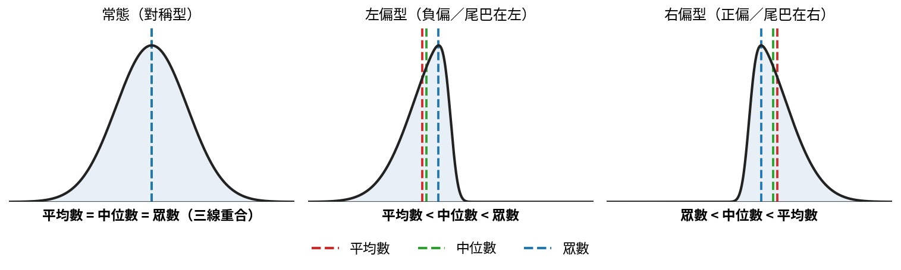

| 型態 | 關係 | 備註 |
|---|---|---|
| 常態(對稱型) | 平均數 = 中位數 = 眾數 | 三個都相等 |
| 左偏型(負偏) | **平均數 < 中位數 < 眾數** | 尾巴在左邊 |
| 右偏型(正偏) | **眾數 < 中位數 < 平均數** | 尾巴在右邊 |

> 記法：
>
> - 偏向哪邊，「**平均數**」就被尾巴拉到哪邊
> - **中位數**永遠在中間

### 3. 位置的衡量（集中趨勢）

| 量數 | 定義 | 例子 |
|---|---|---|
| 平均數 Mean | 各觀察值總和 ÷ 觀察數：X̄ = ΣXᵢ/n | — |
| 中位數 Median | 分配的中央點（= Q2 = 50%）；觀察點為偶數時取中間兩數平均 | 1,2,3,4,5 → 3；1,2,3,4 → (2+3)/2 = 2.5 |
| 眾數 Mode | 出現次數最多的數字 | 1,2,3,3,5 → 3 |

### 4. 散佈的衡量 (measures of spread)

| 量數 | 公式 | 說明 |
|---|---|---|
| 變異數 Variance | S² = Σ(Xᵢ−X̄)²/(n−1) | 分數愈分散，變異數愈大；全部相等則為 0 |
| 標準差 Std. dev. | S = √S² | 變異數的平方根，增加解釋力 |
| 全距 Range | **R = Max − Min** | 只涉及最大最小值，衡量散佈相當粗糙 |
| 四分位**距** IQR | **Q3 − Q1** | (75% − 25%) |
| 四分位**差** | **(Q3 − Q1) / 2** | 注意與四分位距的差別！ |

### 5. 極端值（離群值）與量數選擇 ⭐必考

**核心觀念：資料有極端值時，要挑「不受極端值影響（抗離群值）」的量數。**

| 陣營 | 量數 | 原因 |
|---|---|---|
| **怕**極端值 ✗ | 平均數、變異數、標準差、變異係數、**全距** | 計算時**每個數值都參與**，一個超大值就被拉走；全距最慘，直接由 Max−Min 決定；變異係數 = 標準差/平均數，兩個怕的除在一起 |
| **不怕**極端值 ✓ | **中位數**、四分位數、**四分位距 IQR** | 只看「**排序位置**」，不管數值多極端（中位數=第50%位置；IQR=中間50%的範圍） |

**組合判斷（觀念）**：有極端值時，整組量數要「兩個都抗極端值」才成立——只有**中位數＋四分位距（IQR）**符合；組合中只要含平均數、變異數、標準差、全距、變異係數任一個，就會被極端值拉走。

**直觀例子：** 薪水 {3萬, 4萬, 4萬, 5萬, **100萬**}
- 平均數被拉到 23.2 萬（失真）；**中位數還是 4 萬**（真實反映多數人）
- 全距 = 97 萬（失真）；**IQR 只量中間那群人的散布**（穩定）

> **記法（有極端值 → 報中位數＋IQR）**：
>
> - 「**位置型**」量數（中位數、四分位數、IQR）→ **抗**極端值
> - 「**算全部**」的量數（平均、變異數、標準差、全距）→ **怕**極端值

### 6. 經驗法則 vs 柴比雪夫定理（內容已移至 **第十三章第 7 節**，與機率分配放在一起）

---

## 三、四分位數 (Quartile)

### 1. 定義

| 名稱 | 別名 | 位置 |
|---|---|---|
| Q1 第一四分位數 | 第25百分位數 | 由小到大排列後第 25% |
| Q2 第二四分位數 | **中位數** | 第 50% |
| Q3 第三四分位數 | 第75百分位數 | 第 75% |

四分位距 IQR = Q3 − Q1

### 2. 求法 ⭐計算必考

**公式：O(Qp) = n × p/100**（資料須先由小到大排序）

| 情況 | 規則 |
|---|---|
| Q 是整數 | 取第 Q 與第 Q+1 個的**平均值** |
| Q 不是整數 | **無條件進位**取下一個整數（如 Q=1.2 → 取第 2 個） |

**範例一（n=11）：** 6, 7, 15, 36, 39, 40, 41, 42, 43, 47, 49
- Q1 = 11×25/100 = 2.75 → 第3個 → **Q1 = 15**
- Q2 = 11×50/100 = 5.5 → 第6個 → **Q2 = 40**
- Q3 = 11×75/100 = 8.25 → 第9個 → **Q3 = 43**

**範例二（n=6，整數情況）：** 7, 15, 36, 39, 40, 41
- Q1 = 15，Q2 = (36+39)/2 = **37.5**，Q3 = 40

---

## 四、變異數與標準差計算 ⭐計算必考

### 1. 核心公式表

| 名稱 | 公式 | 分母 |
|---|---|---|
| 平方和 SS (Sum of Square) | SS = Σx² − (Σx)²/n | — |
| 群體變異數 σ² | σ² = SS / **n** | ÷ n |
| 群體標準差 σ | σ = √σ² | — |
| 不偏(樣本)變異數 V | V = SS / **(n−1)** | ÷ (n−1) |
| 估計(樣本)標準差 S | S = √V | — |

> ⭐ 分辨關鍵：
>
> | 對象 | 分母 |
> |---|---|
> | **群體** σ²／σ | ÷ **n** |
> | **樣本** V／S | ÷ **(n−1)** |

### 2. 範例（n=5，資料 1,2,3,4,5）

| 項目 | 計算 | 結果 |
|---|---|---|
| ΣX | 1+2+3+4+5 | 15 |
| Σx² | 1+4+9+16+25 | 55 |
| 平均數 X̄ | 15/5 | 3 |
| SS | 55 − 15²/5 | **10** |
| 群體變異數 σ² | 10/5 | 2 |
| 群體標準差 σ | √2 | 1.414 |
| 樣本變異數 V | 10/(5−1) | 2.5 |
| 樣本標準差 S | √2.5 | 1.581 |

### 3. 🖩 計算機按法（未分組資料）

先完成 **⓪-1** 的 SD 模式設定與 Stat Clear，然後：

**① 輸入數據** — 每筆資料按一次 M+：

```
1 → M+ ；2 → M+ ；3 → M+ ；4 → M+ ；5 → M+
```

（螢幕顯示 n = 已輸入筆數，可確認有沒有少按）

**② SHIFT → 2**，出現三個選項：

| 選項 | 螢幕顯示 | 意義 | 對應公式 |
|---|---|---|---|
| 1 | x̄ | **平均值** | X̄ = ΣX/n |
| 2 | xσn | **群體標準差** σ | √(SS/n) |
| 3 | xσn−1 | **樣本標準差** S | √(SS/(n−1)) |

按法：**SHIFT → 2 → 選(1/2/3) → =** 即得答案

**③ 求變異數**（標準差的平方）：

| 目標 | 按法 |
|---|---|
| 樣本變異數 S² | SHIFT → 2 → 選 3 (xσn−1) → = → **Ans → x² → =** |
| 群體變異數 σ² | SHIFT → 2 → 選 2 (xσn) → = → **Ans → x² → =** |

驗證：資料 1~5 → 樣本標準差 1.581 → 平方 = **2.5** ✓（= SS/(n−1) = 10/4）

**④ 查總和**：SHIFT → 1 → 出現 Σx²(1)、Σx(2)、n(3)

### 4. 變異數 vs 變異係數（絕對 vs 相對離散）⭐必考

| 項目 | 變異數 σ²／S² | 變異係數 CV |
|---|---|---|
| 定義 | 離差平方的平均 | 標準差相對於平均數的比率 |
| 公式 | σ²=SS/n；S²=SS/(n−1) | **CV = (標準差 ÷ 平均數) × 100% = (S/X̄) × 100%** |
| 單位 | 原資料單位的**平方**（有單位） | **無單位**（%，純比率） |
| 衡量 | **絕對**離散程度 | **相對**離散程度 |
| 何時用 | 兩組**單位相同、平均相近**時比誰分散 | 兩組**單位不同**或**平均差很大**時比誰分散 |
| 判讀 | 越大越分散 | 越大越分散／越不穩定、越不一致（品質越差） |
| 抗極端值 | ✗ 怕（每個數值都參與計算） | ✗ 怕（標準差、平均數都怕） |

> ⚠️ **判斷關鍵：要比「誰比較分散」時**
>
> - 單位相同、平均相近 → 直接看**標準差／變異數**即可
> - **單位不同（如身高 cm vs 體重 kg）或平均差很大 → 一定要用 CV**，才公平
> - 陷阱：X̄ 為 0 或負時 CV 無意義；變異數帶「平方單位」，開根號還原成標準差才是原單位

**例：** 甲組身高 平均 170cm、標準差 5cm；乙組體重 平均 60kg、標準差 5kg。誰比較分散？
- 標準差都是 5，但**單位不同不能直接比** → 算 CV。
- 甲：5/170 = **2.94%**；乙：5/60 = **8.33%** → **乙組相對比較分散**。

> 🖩 **Casio fx-350MS（CV 沒有專屬鍵）**：
>
> - 先在 SD 模式求標準差（`SHIFT → 2` → xσn 母體 σ／xσn−1 樣本 S）與 x̄
> - 再算 `標準差 ÷ x̄ × 100`
> - 變異數：取到標準差後 `Ans → x² → =`

---

## 五、已分組數據的平均數與標準差

### 1. 範例資料表（n=40）

| 組中點 X | 1.7 | 2.2 | 2.7 | 3.2 | 3.7 | 4.2 | 4.7 | 合計 |
|---|---|---|---|---|---|---|---|---|
| 次數 f | 2 | 1 | 4 | 15 | 10 | 5 | 3 | 40 |
| fx | 3.4 | 2.2 | 10.8 | 48.0 | 37.0 | 21.0 | 14.1 | Σfx=136.5 |
| fx² | 5.78 | 4.84 | 29.16 | 153.6 | 136.9 | 88.2 | 66.27 | Σ=484.75 |

### 2. 平均數（簡捷法）

X̄ = A + (Σfᵢdᵢ / n) × C，其中 dᵢ = (xᵢ − A)/C（A=假定平均數，C=組距）

範例：X̄ = 3.2 + (17/40) × 0.5 = **3.4125**

### 3. 標準差

- SS = Σfx² − (Σfx)²/n = 484.75 − 136.5²/40 = **18.94**

| 群體 | 樣本(不偏) |
|---|---|
| σ² = SS/n = 18.94/40 = 0.4735 | V = SS/(n−1) = 18.94/39 = 0.4857 |
| σ = √0.4735 = **0.688** | S = √0.4857 = **0.697** |

### 4. 🖩 計算機按法（分組資料）⭐

先完成 **⓪-1** 的 SD 模式設定與 Stat Clear，然後：

| 步驟 | 按法 |
|---|---|
| ① 輸入「組中點；次數」 | 組中點數值 → **SHIFT → 逗號鍵( , )**（出現「;」分號）→ 次數 → **M+**，依序完成所有組 |
| ② 查總和 | **SHIFT → 1** → Σx²(1)、Σx(2)、n(3) |
| ③ 查統計量 | **SHIFT → 2** → x̄(1)、xσn(2)、xσn−1(3) |

> 例：組中點 1.7 次數 2 → 按「1.7 → SHIFT → , → 2 → M+」

---

## 六、機率的定義

機率：測度出象空間中各個事件發生的機會。

**機率 P 的三大條件 ⭐**

| # | 條件 |
|---|---|
| 1 | 任何事件的機率值 **≥ 0** |
| 2 | 整個出象空間的機率值 = **1** |
| 3 | 互斥事件：聯集的機率 = 個別事件機率的**總和** |

**計次法則基礎：**
- 出象空間有 n 種等可能出象 → 每一個出象機率 = **1/n**
- 出象數目太龐大無法列舉時 → 用計次法則 (counting rule) 計算出象總數

---

## 七、計次法則 ⭐核心公式

### 1. 三大法則比較表

| 法則 | 使用時機 | 公式 | 🖩 計算機按法 |
|---|---|---|---|
| 乘積法則 | 一系列步驟，各步驟出象數相乘 | n₁ × n₂ × … | — |
| 排列 Permutation | **考慮順序**（依次放置） | ₙPₘ = n!/(n−m)! = n(n−1)…(n−m+1) | n → **SHIFT** → nCr(=nPr) → m → = |
| 組合 Combination | **不考慮順序**（誰先誰後無意義） | ₙCₘ = ₙPₘ/m! = n!/[m!(n−m)!] | n → nCr → m → = |

> - 判斷關鍵：**有排名／職位／名次 → 排列；只是選出來 → 組合**
> - 🖩 例：₅₀C₃ →「50 → nCr → 3 → =」= 19600；₅₀P₃ →「50 → SHIFT → nCr → 3 → =」= 117600

### 2. 題目關鍵字判斷（手寫重點）⭐

| 題目出現字眼 | 判斷 |
|---|---|
| 前○名、第一名第二名、排名、分派到「不同」站/職位 | 排列 P |
| 任選、選中即可、順序不重要、順序皆可、互選/互相推舉（沒寫排列時） | 組合 C |
| 「同時可以互相支援」 | 組合 C |
| 分成兩群各自選，再問總共 | 各自算組合後**相乘**（乘法定理） |

### 3. 乘積法則例子

| 題目 | 解 |
|---|---|
| 擲骰子 2 次 | 6 × 6 = 36 種 |
| n 個產品品管檢查（每次 2 種出象） | 2ⁿ 種 |
| 管制圖連續 6 點任意升降（每點升或降 2 種） | 2⁶ = **64** 種 |

### 4. 排列例子（考慮順序）

| 題目 | 解 |
|---|---|
| 50 人班級選前三名 | ₅₀P₃ = 50×49×48 = **117,600** 種 |
| 3 名品管員配 3 個檢驗站 | ₃P₃ = 3×2×1 = **6** 種 |
| 20 佳麗選第一名與第二名 | ₂₀P₂ = 20×19 = **380** 種 |
| 48 名成員選會長、副會長、書記、財務 | ₄₈P₄ = 48×47×46×45 = **4,669,920** 種 |
| 12 影片排出前四名 | ₁₂P₄ = 12×11×10×9 = **11,880** 種 |
| 8 個助教分派 8 個時段 | ₈P₈ = 8!/0! = **40,320** 種 |
| 5 母音 (a,e,i,o,u) 任選 2 個「排列」 | ₅P₂ = **20** 種（ae 與 ea 算不同） |

### 5. 組合例子（不考慮順序）

| 題目 | 解 |
|---|---|
| 50 人選 3 人不論排名 | ₅₀C₃ = ₅₀P₃/3! = **19,600** 種 |
| 3 人選 3 人 | ₃C₃ = 1 種 |
| 10 件製品任取 3 件檢驗 | ₁₀C₃ = ₁₀P₃/3! = **120** 種 |
| 5 母音任選 2 個「組合」 | ₅C₂ = **10** 種（ae 與 ea 算同一種） |
| 樂透 45 號碼選中 4 個（順序皆可） | ₄₅C₄ = 45·44·43·42/4! = **148,995** 種 |
| 36 件退稅案選 5 件（順序不重要） | ₃₆C₅ = 36·35·34·33·32/5! = **376,992** 種 |
| 前十名歌手唱片任選 3 片購買 | ₁₀C₃ = 10·9·8/3! = **120** 種 |
| 7 選 2 位企管老師「且」9 選 3 位工管老師 | ₇C₂ × ₉C₃ = 21×84 = **1,764** 種（組合＋乘法定理） |

### 6. 超幾何型計數（重要例題）⭐

100 件製品中有 15 件不良品（85 件良品），任取 10 件，恰有 3 件不良品：

- 方法數 = **₁₅C₃ × ₈₅C₇** 種
- 機率 = (₁₅C₃ × ₈₅C₇) / ₁₀₀C₁₀

> 套路：（不良品取法 × 良品取法）÷ 全部取法

---

## 八、機率論基礎與集合論

### 1. 機率論基本觀念

| 觀念 | 內容 |
|---|---|
| 機率 | 衡量某一事件可能發生的程度（機會），賦予量化數值；衡量**不確定性大小**的工具 |
| 理論基礎 | 群體分配基於機率理論，機率理論又基於**集合論** |
| 集合與元素 | 集合是元素的聚合；元素是集合的單位 |
| 空集 | 無元素的集合，記作 **Φ** |
| 集合元素兩條件 | **可確定性、可區分性** |
| 屬於/不屬於 | ∈ 與 ∉；例 A={0,1}，則 1∈A、2∉A |

### 2. 集合與集合的關係

| 關係 | 符號 | 意義 |
|---|---|---|
| 自集(含於)關係 | A ⊂ B | A 為 B 之子集(subset)，A 中任意元素均可在 B 中找到 |
| 等集關係 | A = B | 兩集合元素完全相同 |
| 對等關係 | A ~ B | A 中每一元素可與 B 中每一元素一一對應 |

### 3. 集合的運算【圖解】

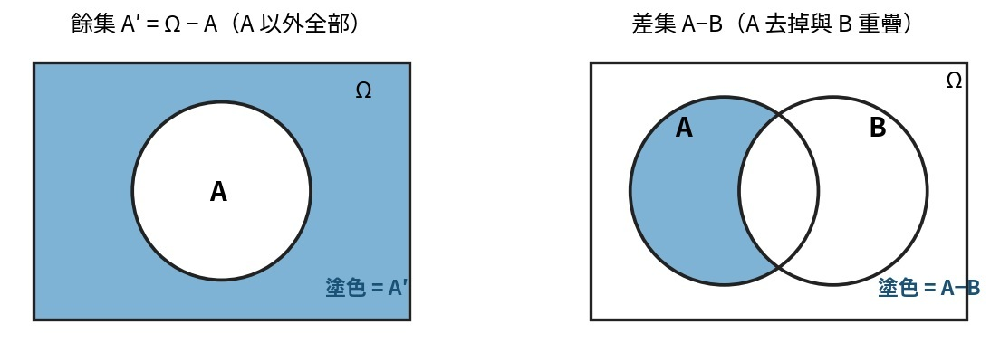

| 運算 | 符號 | 意義 | 例（A={1,2,4,8}, B={−1,1}） |
|---|---|---|---|
| 聯集 | A∪B | 屬於 A **或** 屬於 B | {−1,1,2,4,8} |
| 交集 | A∩B（可寫 AB） | 屬於兩集合**共同**部分 | {1} |
| 差集(去) | A−B | 在 A 中但**不在** B 中 | {2,4,8} |
| 餘集 | A′ | 全集 Ω 扣掉 A（Ω−A） | — |

**餘集性質：** A∪A′ = Ω、AA′ = Φ、(A′)′ = A

### 4. 集合運算定律 ⭐

| 定律 | 公式 |
|---|---|
| 結合律 | A∪B∪C = (A∪B)∪C = A∪(B∪C)；ABC = (AB)C = A(BC) |
| 交換律 | A∪B = B∪A；A∩B = B∩A |
| 分配律 | A∪(B∩C) = (A∪B)∩(A∪C)；A∩(B∪C) = (A∩B)∪(A∩C) |
| **笛摩根律(餘集律)** | **(A∪B)′ = A′∩B′；(A∩B)′ = A′∪B′** |
| **分解式** | **A = AB ∪ AB′**（任一事件拆成「與 B 同時」＋「與 B′ 同時」兩塊；機率版 P(A)=P(AB)+P(AB′)，全機率的雛形，講義 slide 31 明列） |

驗證例（Ω={1,2,3,4}, A={1,2,3}, B={2,3,4}）：A′={4}、B′={1}、A′∪B′={1,4}、A′B′=Φ、(A∪B)′=Φ=A′B′ ✓、AB={2,3}、(AB)′={1,4}=A′∪B′ ✓

### 5. 機率測度的三種方法

| 方法 | 公式 | 說明 |
|---|---|---|
| 古典方法 | P(E) = n(E)/n(S) | 限制：樣本空間必須**有限**；假設：每一樣本點機會**相同** |
| 客觀方法(相對次數法) | P(E) = lim(n/N)，N→∞ | 重複實驗許多次，觀察事件出現次數比例 |
| 主觀方法 | P(E) = 個人對事件 E 發生的信心 | — |

### 6. 機率的公理 ⭐必考

| # | 公理 |
|---|---|
| 1 | 0 ≤ P(Eᵢ) ≤ 1 |
| 2 | E₁, E₂, …, Eₙ 為**互斥**時：P(E₁∪E₂∪…∪Eₙ) = P(E₁)+P(E₂)+…+P(Eₙ) |
| 3 | P(S) = 1；P(Φ) = 0 |

---

## 九、事件機率與事件性質

### 1. 三種事件機率 ⭐必考（事件 vs 交集要分清楚）

| 名稱 | 定義 | 公式 |
|---|---|---|
| 聯合機率 joint probability | 兩個或以上事件**同時發生**的機率 | P(A∩B) |
| 邊際機率 marginal probability | 多類別樣本空間中，**僅考慮一類別**個別發生的機率 | P(A)（表格的合計行/列） |
| 條件機率 conditional probability | **已知 B 發生下**，A 發生的機率 | **P(A\|B) = P(A∩B)/P(B)**，P(B)≠0 |

### 2. 事件的性質

| 性質 | 定義 | 判斷公式 ⭐ |
|---|---|---|
| 獨立事件 Independent | 一事件的發生**不影響**其他事件 | ① P(A\|B)=P(A) ② P(B\|A)=P(B) ③ **P(A∩B)=P(A)·P(B)** |
| 相依事件 Dependent | 一事件的發生**影響**其他事件發生的機率 | 不滿足上述任一條 |
| 互斥事件 Mutually Exclusive | 事件**沒有共同樣本點**，交集為空集合 | **A∩B = Φ** |

**【圖解】三種文氏圖**

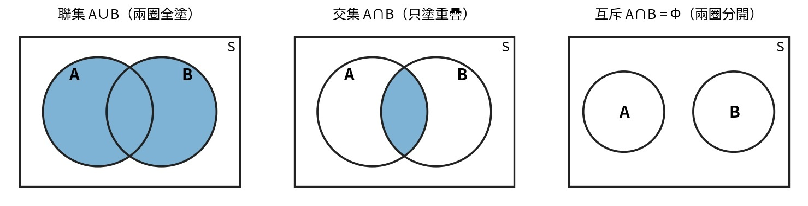

### 3. 事件的運算法則 ⭐核心公式

| 法則 | 公式 |
|---|---|
| 餘集合的機率 | **P(A′) = 1 − P(A)** |
| 加法定理 | **P(A∪B) = P(A) + P(B) − P(A∩B)** |
| 乘法定理 | **P(A∩B) = P(B)·P(A\|B)**（由條件機率移項而來） |
| 分割定理（全機率） | **P(B) = ΣP(B∩Aᵢ) = ΣP(Aᵢ)·P(B\|Aᵢ)**（貝氏定理的分母；老師：用「畫圖」解，不必硬背公式） |

**【圖解】分割定理**

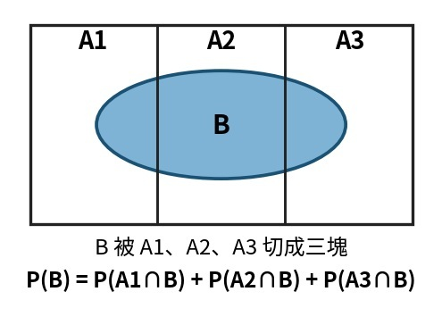

---

## 十、條件機率例題 ⭐計算必考

### 1. 交叉表型（應徵者資料）

| 性別 | 公立(A) | 私立(B) | 合計 |
|---|---|---|---|
| 男(M) | 0.5 | 0.1 | 0.6 |
| 女(F) | 0.25 | 0.15 | 0.4 |
| 合計 | 0.75 | 0.25 | 1 |

求「已知是男性，畢業於公立」：P(A|M) = P(A∩M)/P(M) = 0.5/0.6 = **5/6**

> 套路（列聯表求條件機率）：
>
> - **分子**：找**交叉格**（聯合機率）
> - **分母**：找**合計**（邊際機率）

### 2. 列聯表「在誰之中」→ 分母判斷 ⭐超經典

情境：樣本 200 人的列聯表，「研讀課業且成績不佳」的交叉格 = **20 人**；研讀課業合計 100 人（80+20）、成績不佳合計 90 人。**同一格 20，除以三種分母，出三種題目：**

| 題目說法（先圈這句！） | 分母 | 計算 | 這是什麼 |
|---|---|---|---|
| 「**在樣本中／全體中**，＿% 研讀且成績不佳」 | 總人數 **200** | 20/200 = **10%** | 聯合比例 |
| 「**在研讀課業之學生中**，＿% 成績不佳」 | 該**列**合計 **100** | 20/100 = **20%** | 條件比例 |
| 「**在成績不佳之學生中**，＿% 有研讀」 | 該**行**合計 **90** | 20/90 = **22.22%** | 條件比例（常見陷阱！） |

> 口訣：**先圈「在誰之中」，誰就是分母**
>
> - 「在全體中」→ 分母是總數；「在○○之中」→ 分母縮小成○○的合計
> - 這跟條件機率同一件事：「在 B 之中 A 的比例」= P(A|B) = 交叉格 ÷ B 的合計
> - 題庫愛用同一張表連出兩三題，考試時**先圈分母再動筆**

### 3. 出象個數型

10 個等可能出象，A 含 4 個、B 含 6 個、A∩B 含 2 個：
- P(A)=0.4、P(B)=0.6、P(A∩B)=0.2
- P(A|B) = 2/6 = 0.33；P(B|A) = 2/4 = 0.5
- 檢驗獨立：P(A)·P(B)=0.24 ≠ 0.2=P(A∩B) → **A、B 不獨立**

### 4. 餘集混合型（畫圖解）

已知 P(A)=3/8、P(B)=3/4、P(A∩B)=1/4：

| 求 | 解法 | 答案 |
|---|---|---|
| P(A\|B) | P(A∩B)/P(B) = (1/4)÷(3/4) | **1/3** |
| P(A′\|B) | 先求 P(A′∩B)=P(B)−P(A∩B)=3/4−1/4=1/2，再 ÷P(B) | **2/3** |
| P(A′\|B′) | P(A′∩B′)=1−P(A∪B)=1−[3/8+3/4−1/4]=1/8；P(B′)=1−3/4=1/4；1/8÷1/4 | **1/2** |

**【圖解】畫圖必背套路 ⭐**

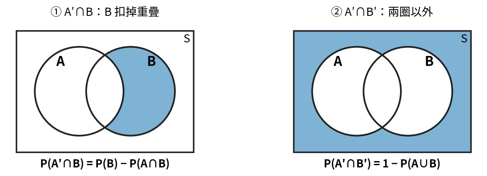

- P(A′∩B) = P(B) − P(A∩B)（B 扣掉重疊）
- P(A′∩B′) = 1 − P(A∪B)（A、B 兩圈**以外**的區域）
- P(A∪B) = P(A) + P(B) − P(A∩B)

---

## 十一、貝氏定理 (Bayes Theorem) ⭐⭐大題必考

### 1. 觀念架構

**事前機率 ＋ 取得新資訊（條件機率）→（應用貝氏定理）→ 事後機率（修正機率）**

**公式：**

P(A|B) = P(A∩B)/P(B) = **P(B|A)·P(A) / P(B)**

| 名稱 | 位置 |
|---|---|
| 事後機率 | 等號左邊 P(A\|B)（所求） |
| 事前機率 | 分子的 P(A) |
| 條件機率(新資訊) | 分子的 P(B\|A) |
| 分母 P(B) | 用**分割定理**展開：ΣP(Aᵢ)·P(B\|Aᵢ) |

### 2. 解題套路（老師：畫圖不背公式）【圖解】

1. 畫一個大矩形，依**事前機率**分割區塊（事前機率**一定合為 1**）
2. 在每個區塊內畫框標**新資訊的條件機率**（各區塊內的條件機率可合為 1 或不合為 1，視題目而定）
3. 事後機率 = **目標框 ÷ 所有框之和**

以例題一（景氣調查）示範：

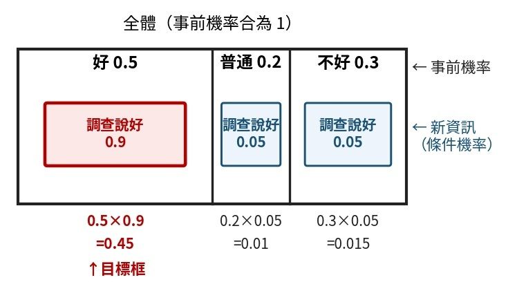

事後機率 = 目標框 ÷ 所有框之和 = 0.45 / (0.45+0.01+0.015) = 0.45/0.475 = **0.95**

> **萬用公式：P(Aₖ|B) = [P(Aₖ)×P(B|Aₖ)] / Σ[P(Aᵢ)×P(B|Aᵢ)]**

### 3. 例題一：景氣調查

主觀判斷（事前）：好 0.5、普通 0.2、不好 0.3；市調正確率 0.9，誤認為其他各 0.05。調查結果為「好」，真正為好的機率？

- 分母 P(B₁) = 0.5×0.9 + 0.2×0.05 + 0.3×0.05 = **0.475**
- P(A₁|B₁) = 0.45/0.475 = **0.95**（圖見上方解題套路）

### 4. 例題二：汽車排放檢測【圖解】

25% 車超標（事前）；超標車 99% 被檢出、未超標車 17% 被誤判。某車沒通過檢測，真的超標機率？

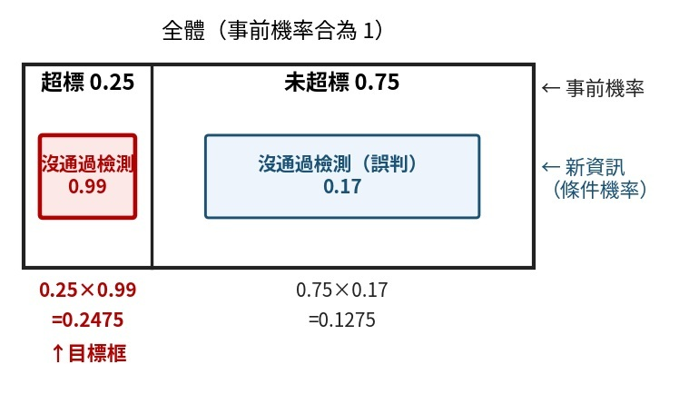

事後機率 = 目標框 ÷ 所有框之和 = 0.2475 / (0.2475+0.1275) = 0.2475/0.3750 = **0.66**

### 5. 例題三：罐頭工廠三條生產線【圖解】

產能佔比（事前）：50%、30%、20%；密封不良率：0.4%、0.6%、1.2%。發現不良罐頭，出自第一線的機率？

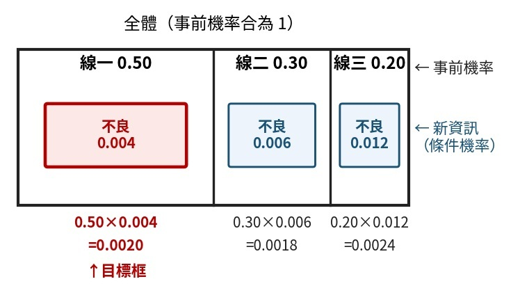

事後機率 = 目標框 ÷ 所有框之和 = 0.0020 / (0.0020+0.0018+0.0024) = 0.0020/0.0062 = **0.32**

> 手寫速算：直接用 (50×0.4)/(50×0.4+30×0.6+20×1.2) = 20/62 = 0.32，百分比不用換算也可以！

---

## 十二、隨機變數、期望值與變異數 ⭐（機率分配的基礎）

### 1. 隨機變數 (Random Variable)

定義：以**樣本空間為定義域的實數值函數**——把每個樣本點對應到一個實數。

例：擲一枚銅板二次，X = 出現正面的次數（樣本空間｛正正、正反、反正、反反｝）

| x | 0（反反） | 1（正反、反正） | 2（正正） |
|---|---|---|---|
| f(x) | 1/4 | 2/4 | 1/4 |

**機率函數的合法條件 ⭐**

| 離散型 | 連續型 |
|---|---|
| 0 ≤ f(xᵢ) ≤ 1 | f(x) ≥ 0 |
| **Σf(xᵢ) = 1** | **∫f(x)dx = 1**（全域積分） |
| P(X=x) 可直接讀 | P(a≤X≤b) = 曲線下面積（單點機率 = 0） |

> **手寫重點**：
>
> - CQT 骰子題**最多 2 顆**——直接**列舉樣本點**（6×6=36 格）用數的，不要硬套公式
> - 分配包含位置 (location)、散佈 (spread)、形狀 (shape) 三種描述

### 2. 期望值與變異數公式 ⭐

| 型態 | 期望值 μ = E(X) | 變異數 σ² = V(X) |
|---|---|---|
| 離散 | Σ x·f(x) | Σ(x−μ)²·f(x) |
| 連續 | ∫x·f(x)dx | ∫(x−μ)²·f(x)dx |

> ⭐ **速算公式（計算題幾乎都用這條）**：
>
> - **V(X) ＝ E(X²) − [E(X)]²**
> - 步驟：先算 **E(X)** 與 **E(X²)** → 變異數一步到位
> - **SD ＝ √V**

### 3. 期望值與變異數的性質 ⭐必考

| 情況 | 期望值 | 變異數 |
|---|---|---|
| 線性轉換 g(X) = aX+b | E(aX+b) = **aE(X)+b** | Var(aX+b) = **a²Var(X)**（b 直接消失！） |
| 常數 b | E(b) = b | Var(b) = **0** |
| 和與差（任意 X、Y） | E(X±Y) = E(X)±E(Y) | ——（要獨立才有下面那條） |
| X、Y **獨立** | E(XY) = E(X)·E(Y) | **Var(X±Y) = Var(X)＋Var(Y)**（減也是**加**！負負得正） |

> ⚠️ **兩大陷阱**：
>
> - ① Var(aX+b)：常數 b **不影響**變異數、係數 a 要**平方**
> - ② 獨立變數**相減**時變異數仍然**相加**，絕不會相減

**經典情境（講義）：**

| 情境 | 解法 | 結果 |
|---|---|---|
| A 零件 σ=3、B 零件 σ=4，兩零件合成新產品，新產品**標準差**？ | 標準差不能直接加：σ = √(3²+4²) = √25 | **5** |
| X、Y 常態，σₓ=4、σᵧ=3，X−Y 的**變異數**？ | V = 4²+3²（相減仍相加） | **25**（注意問的是變異數，別開根號） |
| V(Y)=1，求 V(3Y+4)？ | 3²×1（+4 不算） | **9** |

### 4. 例題：機率分配表求 E、V、SD ⭐計算必考

Y 的機率分配：y = 1~6，P(y) = 0.1、0.2、0.1、**?**、0.2、0.3

| 步驟 | 計算 | 結果 |
|---|---|---|
| ① 先補缺格（Σ機率=1） | P(4) = 1−0.1−0.2−0.1−0.2−0.3 | **0.1** |
| ② E(Y) | 1×0.1+2×0.2+3×0.1+4×0.1+5×0.2+6×0.3 | **4** |
| ③ E(Y²)（x 平方再乘機率） | 1²×0.1+2²×0.2+…+6²×0.3 | **19.2** |
| ④ V(Y) = E(Y²)−[E(Y)]² | 19.2 − 16 | **3.2** |
| ⑤ SD(Y) = √V | √3.2 | **1.789** |

**函數的期望值**（另一例：y=1~4，P=0.1、0.2、0.3、0.4；算得 E(Y)=3、E(Y²)=10）：

| 求 | 拆法 | 答案 |
|---|---|---|
| E(Y²+3Y+1) | E(Y²)+3E(Y)+1 = 10+9+1（逐項拆開） | **20** |
| V(Y) | 10 − 3² | **1** |
| V(3Y+4) | 3²×V(Y) = 9×1 | **9** |
| E(1/Y) | 1×0.1 + (1/2)×0.2 + (1/3)×0.3 + (1/4)×0.4 | **0.4** |

> ⚠️ E(1/Y) 是把 **1/y 逐一乘機率加總**，**不是** 1/E(Y)＝1/3！（函數期望值要重算，不能拿 E(Y) 直接代）

### 5. 累積分配函數 F(y) 反推機率

F(y) = P(Y≤y) 是「累積到 y」的機率，階梯型。**單點機率 = 該階 − 前一階**。

例：F(y)＝0 (y<0)、1/2 (0≤y<1)、3/5 (1≤y<2)、9/10 (2≤y<3.5)、1 (3.5≤y)

| y | 0 | 1 | 2 | 3.5 |
|---|---|---|---|---|
| P(Y=y) | 1/2 | 3/5−1/2 = **1/10** | 9/10−3/5 = **3/10** | 1−9/10 = **1/10** |

求 P(0.5<Y<3.5)：夾在中間的只有 y=1、2 → 1/10 + 3/10 = **2/5**（0.5 與 3.5 都是**開區間**，端點 0、3.5 不含）。

驗算：全部單點機率相加 1/2+1/10+3/10+1/10 = 1 ✓

---

## 十三、重要機率分配 ⭐

### 1. 四大分配總覽（先分「計數值 vs 計量值」）

| 分配 | 資料型態 | 使用時機（一句話） | 參數 | 平均數 | 變異數 |
|---|---|---|---|---|---|
| 超幾何 | 計數值(離散) | 有限母體**不放回**抽樣，算成功次數 | N, D, n | np（p=D/N） | np(1−p)·(N−n)/(N−1) |
| 二項 | 計數值(離散) | n 次**獨立**試驗、成功率 p 固定，算成功次數 | n, p | np | np(1−p) |
| 卜瓦松 | 計數值(離散) | 單位時間/面積內**稀有事件**的次數 | λ | λ | λ |
| 常態 | 計量值(連續) | 對稱**鐘形**連續資料 | μ, σ | μ | σ² |

> 判斷第一刀：
>
> - **計量值**（量測、連續）→ **常態**
> - **計數值**（個數、次數）→ **超幾何／二項／卜瓦松**

### 2. 超幾何分配 Hypergeometric（不放回）

- **時機**：母體 N 個中有 D 個成功(不良)，**不放回**抽 n 個，恰 x 個成功。
- **公式**：P(X=x) = C(D,x)·C(N−D, n−x) ÷ C(N,n)
- 平均數 = np、變異數 = np(1−p)·**(N−n)/(N−1)**（後段是**有限母體修正項**）；p = D/N
- 例：100 件含 15 不良，取 10 件恰 3 不良 = C(15,3)·C(85,7) ÷ C(100,10)（＝第七章超幾何計數例）
- 例（講義例3）：25 件電晶體含 3 件不良，抽 5 件——先判斷 n/N = 5/25 = 1/5 > 1/10 → **有限母體，用超幾何**。
  P(恰1件) = C(3,1)·C(22,4) ÷ C(25,5) = 21945/53130 = **0.413**；P(恰2件) = C(3,2)·C(22,3) ÷ C(25,5) = 4620/53130 = **0.087**

> 🖩 分子分母都用 nCr 直接按，不必展開階乘：「3 → nCr → 1 → × → 22 → nCr → 4 → ÷ → 25 → nCr → 5 → =」。
>
> ⚠️ 題目問「**良品**」時，先換算成不合格品數 d 再套公式：「取 2 件皆良品」＝ d＝0；「1 泡水 1 正常」＝ d＝1（講義補充例：50 件含 5 不良取 2；10 輛車含 2 泡水各買 1）。

### 3. 二項分配 Binomial ⭐

- **時機**：n 次試驗，每次只有成功/失敗兩種、各次**獨立**、成功率 p **固定**（放回，或母體極大 N≥10n）。
- **公式**：P(X=x) = C(n,x)·pˣ·(1−p)ⁿ⁻ˣ，x=0,1,…,n
- 平均數 μ = **np**；變異數 σ² = **np(1−p) = npq**；標準差 = √(npq)
- 例：不良率 p=0.05，抽 20 件恰 2 件不良 = C(20,2)·0.05²·0.95¹⁸

**圖形偏態（p 決定偏向）⭐【圖解】**

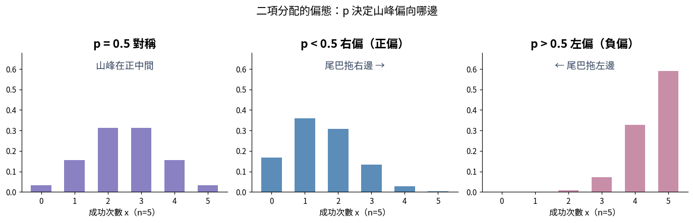

| p 值 | 圖形 | 記法 |
|---|---|---|
| p = 0.5 | 左右**對稱** | 成功失敗機會一樣，山峰在正中間 |
| p < 0.5 | **右偏（正偏）** | 成功機率小 → 山峰擠在左邊（低次數），**尾巴拖右邊** |
| p > 0.5 | **左偏（負偏）** | 成功機率大 → 山峰擠在右邊（高次數），**尾巴拖左邊** |

> 圖像記憶（偏態名稱看「**尾巴**」不是看山峰！）：
>
> - **p 小** → 峰在左、尾在右 → **右偏（正偏）**
> - **p 大** → 峰在右、尾在左 → **左偏（負偏）**

**查表法 ⭐（二項累積表給的是 P{X≤k}）：**

| 題目說法（先圈！） | 查法 |
|---|---|
| 「**最多** k 件」＝ d ≤ k | **P{X≤k} 直接查**一格 |
| 「**恰好** d 件」 | **P{X≤d} − P{X≤d−1}**（兩格相減） |

- 例1（恰好）：p=0.05、n=20，恰 2 件——公式 C(20,2)·0.05²·0.95¹⁸ = **0.189**；查表 P{X≤2}−P{X≤1} = 0.925−0.736 = 0.189 ✓
- 例2（最多）：p=0.1、n=20，**最多 2 件**（d=0,1,2）——查表 P{X≤2} = **0.677** 一格搞定（用公式要 d=0,1,2 三項相加，慢很多）
- 解(3) 也可**卜式近似**：λ = np = 20×0.1 = 2 → 查卜式表 P{X≤2} = **0.677**（無限群體時與二項幾乎同值，見第 6 節）

> **手寫重點**：二項**計算考比較少、多用查表**，主要考**名詞或定義**。伯努利試驗三條件：
>
> - ① 每次只有成功／失敗兩種結果
> - ② p 固定
> - ③ 各次獨立
>
> ⚠️ **超幾何 vs 二項**：
>
> - **不放回、有限母體** → **超幾何**
> - **放回，或 N ≥ 10n** → **二項**（此時超幾何 ≈ 二項）

### 4. 卜瓦松分配 Poisson ⭐

- **時機**：單位時間／長度／面積內，某**稀有事件**平均發生 λ 次，求恰發生 x 次。（講義寫「波瓦松」，同一個分配）
- **典型情境（講義四例，認得出來就會選）**：每 10 分鐘打進公司的電話通數、1 天內停車場停車數、高速公路每 10 公里的坑洞數、每頁報告的錯字數——都是「**單位區間內事件發生的次數**」。
- **卜瓦松實驗三特質**：① 不同區間的發生次數**互相獨立** ② 區間內的期望值與**區間大小成比例** ③ 極短區間內只有「發生一次／不發生」兩種，兩次以上不考慮。
- **公式**：P(X=x) = e⁻λ·λˣ ÷ x!，x=0,1,2,…（e = 2.71828，科學符號）
- 特徵：**平均數 = 變異數 = λ = np**（平均＝變異數是卜瓦松的招牌；σ² = λ）
- **λ 要按區間換算 ⭐（λ 帶著「單位區間」，不能亂除）**：λ = 題目要檢驗的那個區間的平均次數，區間放大幾倍 λ 就乘幾倍。

| 例題 | λ 換算 | 計算 |
|---|---|---|
| 例5：每 20 m² 地毯平均 4 個不合格點，檢驗 **40 m²** 恰 2 點？ | λ = 4×(40÷20) = **8** | 公式 e⁻⁸·8²÷2! = **0.011**；查表 P{X≤2}−P{X≤1} = 0.014−0.003 = 0.011 ✓ |
| 每 7 天平均 2 件退貨，**14 天**內退 5 件？ | λ = 2×(14÷7) = **4** | 公式 e⁻⁴·4⁵÷5! = **0.156**；查表 P{X≤5}−P{X≤4} = 0.785−0.629 = 0.156 ✓ |

**卜式查表句型（和二項查表同一套邏輯）⭐**

| 題目說法（先圈！） | 查法 |
|---|---|
| 「**最多** k 件」 | P{X≤k} **直接查一格** |
| 「**恰好** d 件」 | P{X≤d} − P{X≤d−1}（兩格相減） |
| 「**至少** k 件」 | **1 − P{X≤k−1}**（反面思考：扣掉 k−1 件以內） |

- 例4（至少型）：電路板平均 λ=3 個不合格點，**至少 4 個**？P{X>3} = 1 − P{X≤3} = 1 − 0.647（查表）= **0.353**（公式解要 1 − 四項相加，查表一格搞定）
- 二項的極限：**n > 20 且 np ≤ 7** 時可用卜瓦松近似二項，取 **λ = np**
- 品管應用：單位產品**缺點數**（c 管制圖、u 管制圖）
- 例：每匹布平均 2 個瑕疵(λ=2)，某匹恰 3 個 = e⁻²·2³÷3! ≈ **0.180**

### 5. 常態分配 Normal ⭐⭐（CQT 最重點；連續型分配 CQT **只考這個**）

- 又稱**高斯分配**（Gauss Distribution）。**連續、對稱、鐘形**；μ 決定**中心位置**、σ 決定**胖瘦(離散程度)**。

#### 5-1. 五大特性與 N(μ, σ²) 記號陷阱 ⭐

**常態分配五大特性：**

| # | 特性 |
|---|---|
| 1 | 以平均數 μ 為中心的**對稱**曲線 |
| 2 | **平均數＝眾數＝中位數**（μ = Mo = Me） |
| 3 | μ±1σ 處是曲線的**反曲點**（Inflection Point，凹凸轉換處） |
| 4 | 左右兩尾與橫軸**逐漸接近但絕不相交**（漸近線） |
| 5 | μ±1σ／±2σ／±3σ 的涵蓋比例 → 見**本章 §7-1 經驗法則表**（68.26／95.44／99.73%） |

> ⚠️ **記號陷阱：X~N(μ, σ²) 括號第二個數字是「變異數」不是標準差！**
>
> - N(210, **25**) → σ = √25 = **5**
> - N(50, **4**) → σ = **2**
> - N(10.1, **0.01**) → σ = **0.1**
> - 先開根號再標準化，考題最愛在這裡陰人

#### 5-2. 解題 SOP：先畫圖 → 用背的區塊機率「拼」→ 拼不出才查表 ⭐【圖解】

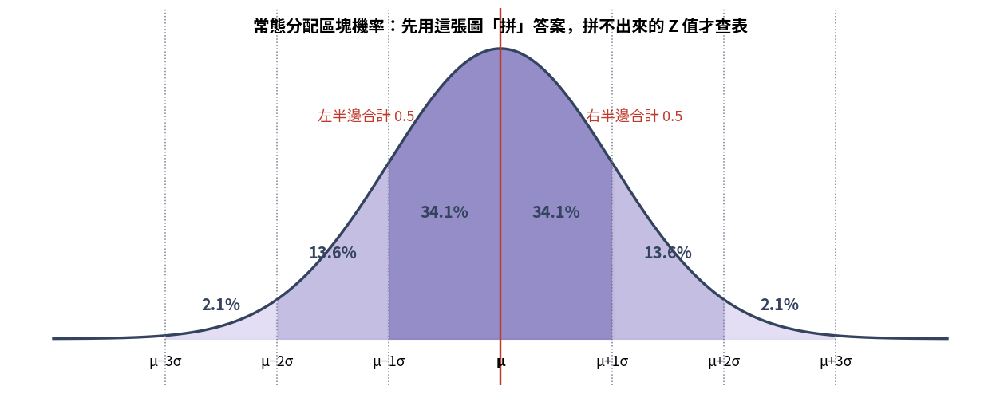

| 步驟 | 動作 |
|---|---|
| ① | 畫鐘形曲線，中間標 μ，把 σ 當刻度標出題目的點 |
| ② | 要求的區域用背的區塊拼：每段 **34.1%、13.6%、2.1%**，半邊 **0.5** |
| ③ | 拼不出來的 Z 值（如 2.5）→ **標準化 Z=(X−μ)/σ 查左尾表** |

#### 5-3. 講義五連發例題（全部先畫圖）

| 題目 | 標準化 | 拼法／查表 | 答案 |
|---|---|---|---|
| 家電壽命 N(4.5, 1²)，保證期 2 年，退貨比例？ | Z=(2−4.5)/1=**−2.5** | 拼不出 → 查左尾表 | **0.0062** |
| 辦公桌裝配 N(56, 4²)，60 分鐘內完成？ | Z=(60−56)/4=**1** | 0.5＋34.1% | **0.8413** |
| 金屬強度 N(210, 25)，≥200psi 合格率？ | σ=5，Z=(200−210)/5=**−2** | 1−左尾 = 0.5+0.341+0.136 | **0.97725** |
| 抗張強度 N(50, 4)，P(X≤46)？P(X≥52)？ | σ=2，Z=−2；Z=1 | 0.5−0.341−0.136；0.5−0.341 | **0.02275**；**0.15866** |
| 外徑 N(10.1, 0.01)，規格 10±0.3 不合格率？ | σ=0.1，Z=(10.3−10.1)/0.1=2、(9.7−10.1)/0.1=−4 | 1−[P(2)−P(−4)]＝1−0.97725 | **0.02275**；調 μ=10.0 後規格＝±3σ → 不合格率 **0.0027** |

- 品管連結：管制圖 **±3σ 界限** ＝ 出界機率僅 0.27%，故**出界視為異常**；製程能力 Cp、Cpk 也建立在常態假設上（外徑例調機後就是 ±3σ＝0.9973 的活用）。

> 🖩 **常態機率怎麼查（兩種表方向相反，先看表頭）**：
>
> - fx-350MS **無**內建常態查表。統計講義附表**左尾、右尾兩種都有**（講義附表頁 10~11＝右尾 P(Z≥z)、頁 12~13＝左尾 P(Z≤z)）——**先看表頭圖示再查**；管制圖課本附表2 是右尾。用左尾表時「P(X≥a)」＝ **1 − 左尾**，或用 0.5± 區塊拼
> - ⚠️《管制圖與製程管制》課本的**附表2（P310~313）是「右邊機率值」（右尾）**——z 查到的直接就是 **P(Z≥z)**

#### 5-4. 外徑例畫圖解法：塗黑規格外的尾巴＝製程置中的威力 ⭐【圖解】

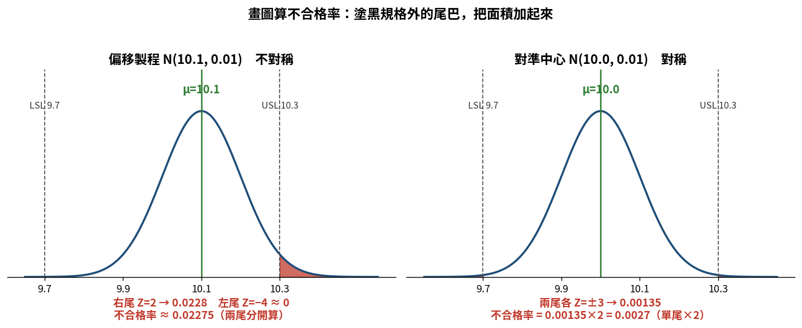

不合格率 = 規格外**兩條尾巴的面積相加**。畫圖時把超出 LSL／USL 的尾巴塗黑，只算塗黑那幾塊，不用先算合格再用 1 去減。

| 步驟 | 偏移製程 μ=10.1 | 對準中心 μ=10.0 |
|---|---|---|
| 上限 Z=(10.3−μ)/0.1 | +2 | +3 |
| 下限 Z=(9.7−μ)/0.1 | −4 | −3 |
| 圖形 | 不對稱，右尾獨大 | 左右對稱 |
| 右尾面積（0.5−中心到Z） | 0.5−0.4772 = **0.0228** | 0.5−0.4987 = **0.00135** |
| 左尾面積 | Z=−4 ≈ **0**（忽略） | **0.00135** |
| 算法 | 兩尾**分開加** | **單尾×2** |
| **不合格率** | 0.0228＋0 = **0.02275** | 0.00135×2 = **0.0027** |

- 只把平均對準中心（σ 完全沒變），不合格率從 2.275% → 0.27%，差約 **8 倍**——這就是品管強調「**製程置中**」的威力。
- 對準中心後規格恰為 **μ±3σ**，呼應管制圖 ±3σ ＝ 出界 0.27% 的由來。

> ⚠️ **判斷關鍵：先看對不對稱，再決定「單尾×2」或「兩尾分開」**
>
> - μ ＝ 規格中心 → **對稱** → 算單尾再 ×2
> - μ ≠ 規格中心 → **不對稱**（本例上限 Z=2、下限 Z=−4）→ 兩尾一定**分開算，不能乘 2**
> - 口訣：問「不合格」塗規格外、問「合格」塗規格內——**塗哪塊算哪塊**，就不會搞混要不要用 1 去減

### 6. 分配選擇判斷 SOP ⭐⭐必考

**解題第一步：先算 n/N，判斷有限／無限群體，再決定用哪個分配。**

| 步驟 | 判斷 | 怎麼解 |
|---|---|---|
| ① n/N **> 1/10** | **有限群體** | **超幾何**——乖乖用公式算（它是精確值，跟其他分配**值差很多**，不能偷懶） |
| ② n/N **≤ 1/10**（或母體無限、不放回也一樣） | **無限群體** | 二項；計算時直接 **λ = np 查卜式表**最快（值**很接近**） |
| ③ 題目只給「平均 λ 次」（沒有 n、p） | — | 卜瓦松，λ 記得先按區間換算 |

**三分配關係鏈（★必考）：**

**超幾何** —（n/N ≤ 0.1 可取代）→ **二項** —（n > 20 且 np ≤ 7 可取代）→ **波瓦松**
（左端＝有限群體，右端＝無限群體；原理：n→∞、λ=np 固定時，二項趨近卜式分配）

> 手寫重點：
>
> - **只要能算出 λ＝np，不用管是哪一個分配函數**
> - **無限群體**：二項與卜式的值很近 → 考試直接**查卜式表**
> - **有限群體**：才需要乖乖用**超幾何公式**

**同一題三種解法比一比（例6／例7，證明「無限群體值很近」）：**

| 題目 | 超幾何 | 二項 | 卜式查表 |
|---|---|---|---|
| 例6：N=80 含 4 不良，n=8，**最多 1 件**（n/N = 8/80 = 1/10 → 可視為無限） | 0.9522 | 0.9428 | λ = 8×0.05 = 0.4 → P{X≤1} = **0.938** |
| 例7：不合格率 p=0.04，n=100，**3 件或以下**（無限群體） | — | 0.429 | λ = 100×0.04 = 4 → P{X≤3} = **0.433** |

三個值都在 0.93~0.95／0.43 附近 → 無限群體時選哪個都對，**查表最快**。

**分配總表（含常態）：**

| 問題特徵 | 選哪個分配 |
|---|---|
| 量測值、連續、鐘形 | 常態 |
| 不放回、**有限母體（n/N > 1/10）**，算成功數 | 超幾何 |
| 獨立試驗、p 固定（**n/N ≤ 1/10 視為無限**），算成功數 | 二項（可用卜式查表） |
| 單位時間/面積內稀有事件的次數（只給平均 λ） | 卜瓦松 |

### 7. 經驗法則 vs 柴比雪夫定理 ⭐必考（三個數字直接背）

#### 7-1. 經驗法則（68-95-99.7 法則）——鐘形／常態 ⭐

適用於**鐘形／常態**分佈：

| 範圍 | 涵蓋比例 | 備註 |
|---|---|---|
| μ ± 1σ | **68.26%** | — |
| μ ± 2σ | **95.44%** | 選項常放 68 和 99.7 等你記錯位置 |
| μ ± 3σ | **99.73%** | ⭐品管關鍵：管制圖 **±3σ 管制界限**就是來自這裡——出界機率只有 **0.27%**，所以**出界視為異常** |

#### 7-2. 柴比雪夫定理——任意／未知分配 ⭐

（講義也寫**謝比雪夫** Chebyshev，同一個定理）適用於**任意／未知**分配：μ±kσ 內至少 **1 − 1/k²**，**範圍外至多 1/k²**

| k | 計算 | 範圍**內**至少 | 範圍**外**至多 |
|---|---|---|---|
| 1 | 1 − 1/1 | **0%**（k=1 套公式沒有資訊） | 1 |
| 2 | 1 − 1/4 | **75%** | 1/4 = 25% |
| 3 | 1 − 1/9 | **88.9%**（8/9） | 1/9 |
| 4 | 1 − 1/16 | **93.75%**（15/16） | 1/16 = 6.25% |

#### 7-3. 解題 SOP：先畫圖再計算＋反向題與判斷關鍵 ⭐【圖解】

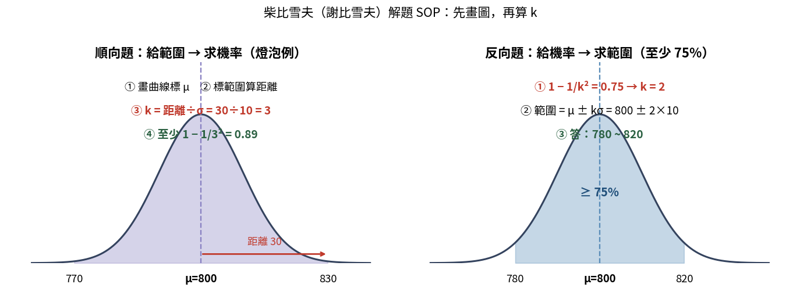

| 步驟 | 動作 | 燈泡例（μ=800、σ=10） |
|---|---|---|
| ① | 畫一條鐘形曲線，中間標 **μ** | 800 在中間 |
| ② | 題目給的範圍標在兩端，算「端點 − μ」的距離 | 770、830 → 距離 30 |
| ③ | **k = 距離 ÷ σ** | k = 30÷10 = **3** |
| ④ | 套 1 − 1/k² | 1 − 1/9 = **0.89** |

**反向題（給比例 → 反推 k → 算範圍 μ±kσ）：**

| 例題 | 解 k | 範圍 |
|---|---|---|
| 燈泡：機率至少 **75%** 的壽命範圍？ | 1−1/k² = 0.75 → k = **2** | 800±2×10 = **780~820** |
| 乳酪（μ=3.50、σ=0.04）：**93.75%** 的脂肪含量範圍？ | 1−1/k² = 0.9375 → 1/k² = 1/16 → k = **4** | 3.50±4×0.04 = **3.34~3.66** |

順向再一例（乳酪）：問 3.38~3.62 之間至少多少比例？ 距離 = 3.62−3.50 = 0.12 = 3σ → k=3 → 1−1/9 = 8/9 = **89%**

> 心算技巧與陷阱：
>
> - 看到 **93.75%** 先想「差 **6.25% ＝ 1/16**」→ k²＝16 → **k＝4**
> - 「μ±4σ 範圍**外**至多 1/16」是同一題的另一面（範圍外 ＝ 1/k²）
> - ⚠️ 陷阱：憑「2σ」印象選 k＝2 → 那是 **75%**，不是 93.75%！
>
> **判斷關鍵**：
>
> - 題目說「**鐘形／常態**」→ 經驗法則（68.26 / 95.44 / 99.73）
> - 題目說「**任意分配／未知分配**」或答案有「**至少**」→ 柴比雪夫
> - 這組數字會反覆出現（例：規格剛好 μ±2σ → 合格率 95.44%），背熟很划算

#### 7-4. 全距與標準差的關係 R ≈ 4s ⭐有考過（標準差的檢查）

> - 由柴比雪夫與經驗法則，大部分量測值落在 **μ±2σ** 內 → 資料組的**全距 R ≈ 4 倍標準差**
> - **R = 4s → s = R/4**（同理 σ = R/4）
> - 用途：想快速檢查標準差算得合不合理，就用全距除以 4 估一下

#### 7-5. 綜合例：pmf 求 E、V 再套柴比雪夫（連第十二章）

擲正常銅幣三次，X = 正面次數，依柴比雪夫求 μ±2σ 內的機率？

| 步驟 | 計算 | 結果 |
|---|---|---|
| ① 列 pmf（直接列舉 8 種出象） | f(x) = 1/8, 3/8, 3/8, 1/8（x=0,1,2,3） | — |
| ② E(X) | 0×1/8+1×3/8+2×3/8+3×1/8 | **1.5** |
| ③ E(X²) | 0+1×3/8+4×3/8+9×1/8 | **3** |
| ④ V(X) = E(X²)−[E(X)]² | 3 − 1.5² = 0.75；σ = √0.75 | **0.87** |
| ⑤ 柴比雪夫 k=2 | P(1.5−2×0.87 < X < 1.5+2×0.87) ≥ 1−1/2² | **≥ 0.75** |

> 這題把「pmf 求期望值變異數」和「柴比雪夫」串在一起，是老師的示範套路：**先求 σ，再畫圖套 k**。

### 8. 其他連續型分配一覽（標「CQE 考」，CQT 認得名字與用途即可）

| 分配 | 一句話用途 | 期望值／變異數 | 備註 |
|---|---|---|---|
| **指數** Exponential | 事件之間的**時間間隔**（失效時間、可靠度） | μ = 1/λ；σ² = 1/λ² | 與**卜瓦松對偶**：卜瓦松算「單位時間**次數**」、指數算「兩次之間**隔多久**」，共用 λ |
| **均等** Uniform | [a,b] 內每點機率相等 | E = (a+b)/2；V = (b−a)²/12 | — |
| **卡方** χ² | **樣本變異數**的分配：χ² = (n−1)S²/σ² | E = v；V = 2v（v=自由度） | 右偏（峰在左）；Z² 的和；適合度檢定 |
| **伽瑪** Gamma | 等到**第 k 個**事件的等候時間 | μ = αβ；σ² = αβ² | α=1、β=1/λ 時退化成指數分配 |
| **貝他** Beta | 定義在 (0,1) 的雙參數分配 | E = α/(α+β) | F 分配的基礎 |
| **魏柏** Weibull | **可靠度分析、壽命檢驗**的理論基礎 | —（含比例α/形狀β/位置δ 三參數） | 記「壽命→魏柏」即可 |

> 手寫重點：連續型 CQT **只考常態**，上表都是 CQE 範圍。選擇題認得這幾組關鍵字配對就夠：
>
> - 指數 ＝ 時間間隔
> - 魏柏 ＝ 壽命
> - 卡方 ＝ 變異數
> - 伽瑪 ＝ 等候時間

---

## 十四、統計量分配（抽樣分配）— CQT 只需懂觀念

> **「統計量分配」是什麼**：
>
> - ＝從母體**重複抽樣**時，樣本統計量（X̄、S²、R…）**本身**的分配
> - 這章 CQT **記用途與時機**即可，不必深入計算（手寫：CQE 考、CQT 懂觀念）
> - 四者都是「從常態母體抽樣」導出的分配

| 分配 | 是誰的分配 | 用途／觀念 | 品管連結 |
|---|---|---|---|
| **X̄ 分配** | 樣本平均數 | **E(X̄) = μ、V(X̄) = σ²/n**，記 X̄~N(μ, σ²/n)——樣本越大，X̄ 越集中 | X̄ 管制圖 |
| **t 分配** (T) | 小樣本 X̄（σ 未知，用 S 估計） | **小樣本(n<30)**、母體 σ 未知時的平均數估計/檢定；比常態**胖尾**，自由度 df=n−1，df 越大越接近常態 | 小樣本平均數檢定 |
| **S 分配** | 樣本標準差／變異數 | 變異數／標準差的分配（與**卡方 χ²**有關）；用於變異數檢定 | **S 管制圖**（標準差圖） |
| **R 分配** | 全距 Range | 全距的抽樣分配；可由 **σ̂ = R̄/d₂** 估計母體 σ | **X̄–R 管制圖** |
| **F 分配** | 兩變異數比 S₁²/S₂² | 比較**兩母體變異數**是否相等；**變異數分析 ANOVA** 的檢定統計量；有分子、分母**兩個**自由度 | ANOVA、變異數比較 |

> 記法（一個字母配一個用途）：
>
> | 分配 | 記什麼 |
> |---|---|
> | **T** | 小樣本平均數 |
> | **S** | 變異數（χ²） |
> | **R** | 全距估 σ |
> | **F** | 兩變異數比／ANOVA |

---

## 十五、管制圖概論：歷史、標準與用途（第三堂課）

### 1. 觀念 → 分析 → 管制：三份 CNS 標準 ⭐（名詞配對必考）

| 標準 | 名稱 | 角色／用途 | 誰主責 |
|---|---|---|---|
| **CNS 2311（Z45）** | **品質管制指南** | 建立 QC 制度、品質政策、組織責任、PDCA 推動 | 品保主管 |
| **CNS 2312（Z46）** | **分析數據用管制圖法** | ＝**解析用**：X̄–R、p、c 圖**離線**分析歷史資料是否穩定 | 品保工程師 |
| **CNS 2580（Z79）** | **生產過程中管制品質之管制圖法** | ＝**管制用**：生產中即時抽樣畫圖，**超 UCL 立即停線** | 製造工程師 |

> - 記法：**2311 ＝ 總指南；2312 ＝ 分析（解析用、離線）；2580 ＝ 生產過程（管制用、線上）**
> - CNS 2312 離線分析：收集資料 → 建立圖表 → 判斷失控 → 改善
> - CNS 2580 線上管制：生產抽樣 → 即時繪圖 → 超限停線 → 找因改善

### 2. 管制圖標準沿革 ⭐（年代題）

| 年 | 事件 | 內容 |
|---|---|---|
| 1924 | **Shewhart 發明管制圖** | SQC（統計品管）之始 |
| 1931 | Shewhart 出版《Economic Control of Quality of Manufactured Product》 | 奠定管制圖基礎 |
| 1932 | Shewhart 赴英國倫敦演講 | 英國工廠**實施比美國早** |
| 1941~42 | 美國戰時三規格 **Z1-1／Z1-2／Z1-3** | 品管指南／分析數據管制圖法／生產中管制品質法（助二戰勝利） |
| 1950 | **Deming** 赴日講習 | 日本品管之父 |
| 1953 | 台灣自美國引進（民國 42 年） | — |
| 1954 | JIS Z 9021 | 規定 X̄–R、p、pn、c、u 管制圖作法 |
| 1959 | JIS Z 9022／9023 | 分別規定 X̄ 管制圖／X（個別值）管制圖（✅已核對課本 P23 原文；⚠️講義 slide 4 印成「X̃ 中位數圖」，兩來源不同，依課本作答） |
| 1964 | **CNS 2311**（民國 53.7.7） | 品質管制指南 |
| 1965 | **CNS 2312**（民國 54.1.6） | 分析數據用管制圖法（解析用） |
| 1967 | **CNS 2580**（民國 56.10.14） | 生產過程中管制品質之管制圖法（管制用） |

**管制圖三大功用（課本 P20）⭐**：① 決定製造工程所能達到的**目標或標準** ② 作為**達到目標**的工具 ③ **判斷是否已達到**目標——對應「設計、製造、檢驗」三階段連成一體。

> 補充用途（課本 P26-27）：
>
> - 制定或變更**規格**／判斷製程符不符規格；提供或變更**檢驗、允收方法**；提供或變更**製造方法**
> - 作允收依據、由小批組成**均勻大批**、了解採購品品質（如 50 盒各抽 4 件成 50 組畫 X̄–R）
> - **非生產性應用**：能源消耗、意外事件頻率、打字錯誤等也能管制
> - **工程觀念 vs 管制圖觀念**：工程＝只求符合「規格」（規格內任其變化、夠好就好）；Shewhart＝要求製程**穩定一致**（Consistency）——規格導向 vs 製程導向的判斷題

### 3. 管制圖的用途 ⭐

分析製程的三個目的：① 判斷製程是否**穩定**（在管制狀態）② 找出**非機遇原因** ③ 提供**改善**依據。

**依用途分兩種：**

| 用途 | 時機 | 細項 |
|---|---|---|
| **解析用** | 事前（先算界限） | ① 決定方針 ② 製程解析 ③ 製程能力研究 ④ 製程管制之準備 |
| **管制用** | 事中（預防性、出界即追查） | ① 追查不正常原因 ② 迅速消除原因 ③ 研究防止再發措施 |

> 流程：**解析用**（蒐集資料、算出界限、確認製程穩定）→ 確定後轉 **管制用**（日常監控）。

**管制圖被廣泛使用的原因（講義 slide 9）⭐選擇題**：① 提升**生產力**之有效工具 ② 有效**預防不合格品** ③ 可預防**不需要的製程調整** ④ 提供**診斷**資訊 ⑤ 提供**製程能力**資訊。

---

## 十六、規格界限 vs 管制界限 ⭐⭐必考（最愛考的對比）

### 1. 對照表 ⭐⭐必考

| 項目 | 規格界限 Specification（Su／Sl） | 管制界限 Control（UCL／LCL） |
|---|---|---|
| 誰決定 | **人為訂定**（設計、顧客、規格） | **製程資料算出**（平均值 ±3σ） |
| 判斷對象 | **個別**單位產品是否合格（允收／拒收） | **一群**（樣本）、製程是否正常 |
| 用途 | 核對每一件產品符不符規格 | 監視製程有無非機遇原因、是否穩定 |
| 圖上線 | — | 中心線 CL 用**藍色或黑色實線**；**UCL／LCL 用紅色虛線** |

### 2. 符號與由來

- 符號：規格上限 **Su**、規格下限 **Sl**；規格界限說明品質特性的最大許可值（講義：常以 **±4σ** 設定），管制界限則以 **±3σ** 最經濟。
- 管制界限是把常態分配圖形「**90° 轉向**」、在平均值處作 CL。

### 3. 易錯：兩者不可混用 ⭐⭐

> ⚠️ **易錯：兩者不可混用**
>
> - 規格界限判「**個別產品**」、管制界限判「**一群／製程**」
> - **管制圖點子在界限內 ≠ 產品都合格**
> - 製程在管制狀態也可能做出超規格品（要看 6σ 與公差比較）

---

## 十七、品質變異的原因與 6M ⭐必考

### 1. 品質變異三來源

| 類型 | 定義 | 例（日光燈） |
|---|---|---|
| **件內變異** | 同一件產品不同部位 | 同一支燈管各段亮度不同 |
| **件間變異** | 同一時間、連續生產的各件之間 | 同批燈管彼此亮度強弱不同 |
| **時間變異** | 不同時間生產之間 | 早班與晚班燈管亮度不同 |

### 2. 機遇原因 vs 非機遇原因 ⭐

| 比較項目 | 機遇原因 Chance／Common（共同、偶然） | 非機遇原因 Assignable／Special（可歸屬、異常） |
|---|---|---|
| 別稱 | 不可避免、非人為、系統的一部分 | 可避免、人為、局部的 |
| 變異 | 每個影響**都小** | 少數幾個即造成**大變異** |
| 次數 | 多 | 少 |
| 例 | 量測微小差異、機器固有振動 | 刀具磨損、材料不良、新手、儀器沒校正 |
| 製程狀態 | 只有它 → **在管制狀態**、穩定、可預測 | 有它 → **不穩定**、不可預測 |
| 對策 | 屬先天，去除不經濟（通常不追） | 現場可追查除去，除去後不再發生 |
| 英文術語 | Chance／Common Cause、Controlled／Inherent Variation、Stable、Unavoidable | Assignable／Special Cause、Uncontrolled／Excess Variation、Unstable、Avoidable |
| 用途口訣 | 用來「**修改(Modify)**」一個穩定製程 | 用來「**創造(Create)**」一個穩定製程（先除掉異常，製程才會穩定） |
| **Shewhart** 看法 | 每個影響都小 | 每個都有明顯影響 |
| **Deming** 看法 | 是系統(system)的一部分 | 本質是局部(local)的 |
| **結論（課本 P35 表2）** | 次數多、影響微小 → **管理層考量**（去除不經濟） | 次數甚少、影響顯著 → **須澈底調查** |

> 課本 P35 並強調：管制圖是區別機遇／非機遇原因之**唯一優良工具**，由統計理論導出，比憑經驗判斷客觀。

### 3. 影響品質的因素 4M → 5M → 6M ⭐（魚骨圖六大骨）

6M ＝ 找「品質變異原因」的六大類，也是**特性要因圖（魚骨圖／石川圖）**的六條主幹。（實務上「用魚骨圖＋柏拉圖決定管制項目」見**第二十四章§1**。）

| 代號 | 英文 | 中文 | 內容舉例 |
|---|---|---|---|
| 人 | **Man** | 人員 | 技術、經驗、新手、情緒、有無照標準做 |
| 機 | **Machine** | 機械設備 | 精度、保養、磨損、震動、參數設定 |
| 料 | **Material** | 物料 | 進料品質、批次差異、規格、儲存 |
| 法 | **Method** | 方法 | 作業標準、製程條件、SOP |
| 測 | **Measurement** | 量測 | 量具校正、量測方法、量測誤差 |
| 環 | **Milieu／Environment** | 環境 | 溫度、濕度、照明、粉塵、噪音 |

> - **演進**：4M（人、機、料、法）→ ＋量測 Measurement ＝ 5M → ＋環境 Environment ＝ 6M；故 6M 也寫成 **5M1E**
> - ⚠️ 英文陷阱：量測＝**Measurement**、環境＝**Milieu**（湊 M）或 **Environment（E）**；出現 Money／Management 是延伸 8M，不算經典 6M
> - 用途：畫**魚骨圖**分析不良原因時，大骨就用這 6 類展開
>
> ⚠️ **易錯（2026-07-25，錯1題）：4M 是哪四個**
>
> - 4M ＝ **原料 Material、機械 Machine、方法 Method、人 Man**。
> - 陷阱：測試／測定（那是 5M 才加的 Measurement）、金錢 Money、市場 Market、士氣 Morale——都不是經典 4M。

---

## 十八、常態分配與管制界限、兩種錯誤 ⭐⭐

### 1. 常態分配是管制圖的統計依據

| 範圍 | 涵蓋比例 | 意義 |
|---|---|---|
| μ ± 0.67σ | 50.00% | 一半一半 |
| μ ± 1σ | **68.26%** | 絕大多數日常波動 |
| μ ± 1.96σ | **95%**（外 5%） | 或然率管制圖的警戒界限 |
| μ ± 2σ | **95.44%** | 幾乎所有正常變異 |
| μ ± 2.58σ | **99%**（外 1%） | — |
| μ ± 3σ | **99.73%** | **管制圖界限的統計依據**（每 1,000 次約 3 次偶然出界，視為機遇不計較） |

> ⚠️ 1.96σ（外 5%）與 2σ（外 4.55%）兩列長得像，抄題時別記反。
>
> - 本表照課本表3（P38~39）印刷值 68.26／95.44（理論精確值 68.27／95.45，與十三章§7 經驗法則表同口徑）。
> - 講義 slide 18 印「μ±2σ → 4.56%」、slide 15 印 4.55%——講義自身不一致，數學上 100−95.45＝**4.55%**，若考題引講義照題目選最接近者。

**管制圖三條界線（對樣本平均值的分配畫界）：**

- **UCL ＝ μ ＋ 3σ**（上管制界限）
- **CL ＝ μ**（中心線／平均值）
- **LCL ＝ μ − 3σ**（下管制界限）

**【圖解】常態分配「90° 轉向」成管制圖（教科書 圖4，P40）**

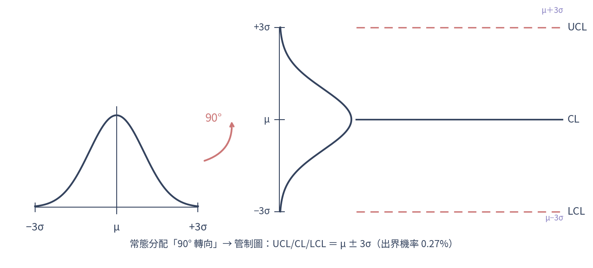

> 超出 ±3σ 的機率僅約 **0.27%**，一旦點子出界，即應調查是否有**特殊原因（Special Cause／非機遇原因）**介入。

### 2. 型 I 誤差 α（虛發警報：製程正常卻有點出界）

| 管制界限 | α 值 |
|---|---|
| ±1σ | 31.74% |
| ±2σ | 4.55% |
| **±3σ** | **0.27%** |
| ±4σ | 63.34 PPM |

### 3. 型 II 誤差 β（漏報：平均值已移動卻沒被偵測）

n＝1、平均值移動 kσ 時：

| 平均值移動 | β（沒偵測到） | 1−β（偵測力） |
|---|---|---|
| ±1σ | 97.72% | 2.28% |
| ±2σ | 84.13% | 15.87% |
| ±3σ | 50% | 50% |
| ±4σ | 15.87% | 84.13% |

### 4. 判定矩陣：α／β／檢定力與 ±3σ 的由來（含 Duncan 經濟設計）⭐

**判定矩陣（判斷關鍵：先看「批／製程實際是誰」，再看「判成什麼」）**

| 實際＼判定 | 判為不合格 | 判為合格 |
|---|---|---|
| 實際**合格** | **α（型 I）**＝生產者冒險 Producer's risk | 1−α（良品判良） |
| 實際**不合格** | 1−β＝**檢定力 power**（壞的被抓到） | **β（型 II）**＝消費者冒險 Consumer's risk |

> - 記法：**1−α＝良品判良、1−β＝不良品判不良＝檢定力**
> - **±3σ 使「型 I ＋型 II」總和最小 → 「最經濟的管制界限」**——用**經濟平衡點（Break Even Point, BEP）**求得：α 曲線遞減、β 曲線遞增，總和曲線最低點恰在 ±3σ
> - 放寬到 ±4σ：型 I↓型 II↑；收緊到 ±2σ：型 I↑型 II↓
>
> ⭐ **Duncan 研究（管制圖經濟設計，課本 P45）**：
>
> - **尋找原因的費用低** → 用 **2σ 甚至 1.5σ** 界限比 3σ 更經濟
> - **尋找原因的費用很高** → 用 **3.5σ 甚至 4σ** 界限比 3σ 更經濟
> - 實際界限由「**經濟＋技術**」共同決定，3σ 只是一般情況的折衷

### 5. 第一種／第二種錯誤：口語定義對照（講義 P41）⭐

| 項目 | 第一種錯誤 Type I | 第二種錯誤 Type II |
|---|---|---|
| 綽號 | **緊張忙亂**之錯誤 | **心不在焉**之錯誤 |
| 定義 | 判定為不正常，事實上**並非**不正常 | 製程實際已異常卻判為正常，喪失尋找異常原因的機會、不良品增加 |
| 白話 | **不該判錯而判錯**：將**優良**產品誤判為**不良** | **該判錯而不判錯**：將**不良**產品誤判為**良品** |
| 冒險率 | **生產者冒險率 α** | **消費者冒險率 β** |
| 後果 | 神經過敏、做徒勞無益的**冤枉工作** | **錯過改正機會**、引起嚴重後果 |

> 記法：
>
> - **型 I ＝太緊張**：好的當成壞的、白忙一場、生產者吃虧 α
> - **型 II ＝太大意**：壞的當成好的、放行不良品、消費者吃虧 β

### 6. 型 II 誤差 β 公式與 ARL ⭐

製程中心偏移 kσ、每組樣本 n、±3σ 界限下，一次抽樣「沒偵測到」的機率：

**β ＝ Φ(3 − k√n) − Φ(−3 − k√n)**

| 名詞 | 定義 |
|---|---|
| 檢定力 power ＝ **1 − β** | 一次抽樣就抓到偏移的機率 |
| **ARL（平均連串長度）＝ 1 ÷ (1−β)** | 平均要抽幾組才發出警報（越小越靈敏） |

**ARL 兩面（在管制 vs 出管制）⭐**

| 情境 | 公式 | 意義 |
|---|---|---|
| **在管制**（假警報） | ARL ＝ **1 ÷ α** ＝ 1/0.0027 ≈ **370** | 製程正常時，平均每 370 點才誤報一次；α 越小、ARL 越大越不會虛驚 |
| **出管制**（偵測偏移） | ARL ＝ **1 ÷ (1−β)** | 製程偏移時，平均抽幾組才發警報；越小越靈敏 |

**計算例：** X̄ 圖 n＝5，製程中心漂移 2σ（k＝2）：
- β ＝ Φ(3−2√5) − Φ(−3−2√5) ＝ Φ(−1.47) − Φ(−7.47) ≈ **0.071**
- 1−β ＝ 0.929；ARL ＝ 1 ÷ 0.929 ≈ **1.08**（平均約 1 組就抓到）

> **判斷關鍵**：
>
> - 偏移越大（k↑）或樣本越大（n↑）→ √n 放大 → β 越小、檢定力越高、ARL 越接近 1
> - 管制圖「**抓大偏移快、抓小偏移慢**」
> - 上表 β（97.72%…）是 **n＝1 的特例**（k＝1 → β＝Φ(2)−Φ(−4)＝0.9772）

---

## 十九、群體與樣本、X̄ 分配與管制界限計算 ⭐

### 1. 群體與樣本、有限／無限判斷

> 🔗 判斷規則 **n/N ＞ 1/10（即 N ＜ 10n）→ 有限母體**，完整表與範例不在本章：
>
> - **定義、判斷四步驟與範例** → **第一章 §4**
> - **用來選機率分配時** → **第十三章 §6**（分配選擇判斷 SOP）
> - 本章只用它決定 σx̄ 要不要乘**有限母體修正係數**

### 2. 樣本平均值的分配（X̄ 分配）

| 項目 | 公式 | 說明 |
|---|---|---|
| 期望值 | E(X̄) = μ | 樣本平均的中心與群體相同 |
| 標準差（無限群體） | **σx̄ = σ/√n** | 樣本平均散佈只有群體的 1/√n，n 越大越集中 |
| 標準差（有限群體 n/N > 1/10） | σx̄ = **√[(N−n)/(N−1)]** × σ/√n | 根號那串是**有限母體修正係數** |
| 由全距估 σ | **σ̂ = R̄/d₂** | R̄＝各組樣本全距的平均；d₂ 依 n 查表 |

> **中央極限定理**：
>
> - 不論群體形狀，**n ≥ 30** 時 X̄ 近似常態 **N(μ, σ²/n)**
> - 群體本身**常態**時，X̄ **不論 n 多少都常態**

### 3. 例題（先算 n/N 再選公式）

| 例題 | 判斷 | 計算 | 答案 |
|---|---|---|---|
| 500 個產品 σ=15.4 克，100 個為一批，各批平均值標準差？ | 100/500 = 1/5 > 1/10 → **有限** | √[(500−100)/(500−1)] × 15.4/√100 | **1.38 克** |
| 化學成份 σ=1.2%，每組取 4 個，樣本平均值標準差？ | 無限 | 1.2%/√4 | **0.6%** |
| 工廠 1000 人調查 150 人；總公司 80 人要 σx̄ 相同，應查幾人？ | 兩邊皆有限 | 令兩 σx̄ 相等解 n₁ | **≈ 55.6 → 56 人** |

> ⚠️ 第三題陷阱：直覺的「**比例抽樣**」（1000 查 150 是 15% → 80 人查 12 人）是**大錯誤**——小母體反而要查到近七成（56/80）才有同樣精度。

### 4. 管制界限寬窄的選擇

- 型 I 成本高（虛驚代價大）→ 用**較寬**界限（如 3σ 甚至更寬）。
- 型 II 成本高（漏掉不良品後果嚴重，如製藥）→ 用**較窄**界限。
- 兩種都重要 → 用較寬界限，但**多抽樣本**以降低型 II。
- 出界情形很多 → 用較窄界限較佳。
- 2σ 太嚴（無的放矢、浪費）；4σ 太寬（非機遇原因藏在 4σ 內漏抓）；**±3σ 最經濟**。

> ⚠️ **易錯（2026-07-25，錯1題）：樣本數 n 與管制界限寬窄**
>
> - X̄ 圖界限寬度 ∝ σ/√n → **n 愈大、界限愈窄**（不是愈寬、也不是不變）。
> - 直覺記法：樣本多 → 平均值愈穩 → 界限可以收緊。

---

## 二十、管制圖的種類與建立步驟 ⭐

### 1. 依數據性質分兩大類（考點：「兩大類」）

| 類別 | 數據 | 管制圖 |
|---|---|---|
| **計量值**（連續、可量測：長度重量成份） | 計量值 | X̄–R、X̄–s、X̃–R、X–Rm |
| **計數值**（間斷、計數：不良／缺點個數） | 計數值 | p、pn（np）、c、u |

### 2. 計量值 vs 計數值管制圖優缺點

| | 計量值管制圖 | 計數值管制圖 |
|---|---|---|
| 資訊量 | 多（保留實際數值） | 少（只記合格與否／缺點數） |
| 靈敏度 | **高**（較早發現異常） | 較低 |
| 成本 | 量測費時、成本高 | 檢驗快、成本低 |
| 樣本 | 需較小樣本即可 | 需較大樣本 |

#### 2-1. 直方圖 vs 管制圖（課本 表8）⭐

| 區別 | 直方圖 | 管制圖 |
|---|---|---|
| 作法 | 製程**完成後**調查**全數** | 製程**進行中**調查**少數** |
| 優點 | 以分配掌握某時期的製程狀態（**靜態**） | 連續流程中瞭解製程**變化**（**動態**、可看趨勢） |

> 名言：「眼睛是靈魂之窗，**管制圖是製造之窗**」——管制圖給的情報＝製程是否處於管制（穩定）狀態。

#### 2-2. 管制圖繪製總流程（解析用 → 管制用，課本 4.2）⭐

搜集數據 → 繪**解析用**管制圖 → **安定嗎？**（不安定：追查、去除異常原因後重新搜集）→ 安定：繪**直方圖** → **滿足規格嗎？**（不滿足：檢討設備、提升製程能力）→ 滿足：轉**管制用**管制圖。

> 判斷關鍵：**先安定（界限內）、再滿足規格**，兩關都過才進入管制用。

### 3. 建立管制圖的步驟（7 步）⭐

1. 決定要管制的**品質特性**（管制項目選定）
2. 選擇**適當的管制圖**（依計量／計數、n 大小）
3. 決定**抽樣間隔、樣本大小（通常 2~5 個一組）、抽樣方法**
4. 決定製程中**哪個階段**要管制
5. 蒐集**至少 20 組**（約 100~150 個）數據以計算管制界限
6. 描點，判斷是否來自**穩定製程**（界限內且無異常型態）
7. 持續抽樣描點，**追蹤製程是否維持穩定**

> 手寫重點：
>
> - 建立界限的基本量 ＝ **至少 20~25 組、每組 4~5 個**
> - 同一組內**勿含異質數據**

#### 3-1. 合理樣組與抽樣間隔（課本 4.3.1）⭐

**合理樣組（Rational Subgroup）＝ 組內變異小、組間變異大**（瞬時法最符合，見第二十一章第 4 節）。

抽樣注意五點：① 組內變異小、組間變異大 ② **經濟性**（費用不高於獲得的效果）③ **迅速**（少阻礙生產線）④ 瞭解製程特性以增加樣本可靠性 ⑤ 抽樣間隔與樣本大小可查下表。

**表 10：生產量 vs 抽樣間隔（每組樣本 n＝4）**

| 每小時生產量 | 製程不穩定時 | 製程穩定時 |
|---|---|---|
| 10 以下 | 8 小時 | 8 小時 |
| 10~19 | 4 小時 | 8 小時 |
| 20~49 | 2 小時 | 8 小時 |
| 50~99 | 1 小時 | 4 小時 |
| 100 以上 | **1 小時** | **2 小時** |

> 表 10 的定位與延伸：
>
> - ⚠️ **這張表是「建立 X̄–R 管制圖（n＝4）」用的**；製程檢查（IPQC）的巡檢頻率表在**第二十七章 §6**，欄位（多一欄「已受管制」）與數值都不同，**別查錯**。
> - ✅ **已核對（08-15）**：本表＝課本第 4 章 P71 表10（建立 X̄–R 管制圖用，亦適用 X̃–R）；二十七章那張是 IPQC 巡檢頻率表，**兩表來源不同、數值本來就不同**，不是抄錯——查表前先確認用途。
> - 另可依 ANSI/ASQ Z1.9 由**批量查樣本大小**（例：日產 5,000 件 → 查表 75 個 → n＝4 時每天抽 75/4 ≈ **19 次**）。
> - 🔗 抽樣方法怎麼選、各圖樣組大小建議、分組三原則的完整整理 → **第二十四章 §3~5**（管制圖之應用法）。

---

## 二十一、計量值管制圖：X̄–R／X̄–s／X̃–R／X–Rm ⭐⭐大題必考

### 1. 選圖流程（依 n）＋一分鐘記憶

| 情況 | 用圖 | 案例（講義） |
|---|---|---|
| 每組 n＝2~10（常用 4、5） | **X̄–R**（最常用） | 螺絲直徑：每小時抽 5 支量直徑 |
| 每組 n＞10 | **X̄–s**（n 大時 R 估 σ 效率差，改用 s） | PET 瓶重量：每批抽 15 瓶量重 |
| 資料可能有極端值、要穩定 | **X̃–R**（中位數，不受極端值影響） | 零件厚度：含極端值時用中位數 |
| 每次只有 1 個（n＝1） | **X–Rm**（個別值–移動全距） | 爐溫監控：每 10 分鐘記一次爐溫 |

> 判讀順序：**先看 R（全距）圖再看 X̄ 圖**——X̄ 界限用 R̄ 算，R 圖不穩則 X̄ 界限不可信。

### 2. 四種計量值圖公式（σ 未知、用樣本估）⭐

**先分清楚 3 個符號（看懂公式的關鍵）：**

| 符號 | 唸法 | 意思 |
|---|---|---|
| X̄ | X bar | **一組**的平均 |
| **X̿** | X double bar | **所有組平均的總平均** ＝ ΣX̄ ÷ 組數 k（管制圖的中心線就用它） |
| R̄ | R bar | 各組**全距的平均** ＝ ΣR ÷ k |

**為什麼「一種圖」要畫「兩張」？⭐（看懂本章的關鍵）**

抽樣是「一組一組」抽的（如每小時抽 5 支），每組都要同時盯兩件事，所以配兩張圖：

| 這張圖 | 盯什麼 | 只有它、漏看的 |
|---|---|---|
| **平均圖**（上）：X̄／X̃／X | 製程中心**準不準**（位置有沒有偏） | 漏掉「平均整個偏掉」 |
| **散布圖**（下）：R／s／Rm | 製程**穩不穩**（變異大不大、一致性） | 漏掉「平均沒動、但變異變大」 |

四種圖 ＝ 一張平均圖 ＋ 一張散布圖，各自用不同係數算界限：

| 圖名 | 平均圖 | 用係數 | 散布圖 | 用係數 | 適用 |
|---|---|---|---|---|---|
| **X̄–R** | 平均數 X̄ | A₂ | 全距 R | D₃、D₄ | n＝2~10（最常用） |
| **X̃–R** | 中位數 X̃ | m₃A₂ | 全距 R | D₃、D₄ | 中位數 |
| **X̄–s** | 平均數 X̄ | A₃ | 標準差 s | B₃、B₄ | n＞10 |
| **X–Rm** | 個別值 X | E₂ | 移動全距 Rm | D₃、D₄ | 個別值 n＝1 |

> - 界限一律 **中心 ± 3σ**（CL＝中心、UCL＝＋3σ、LCL＝−3σ）
> - σ 不知道，用樣本估：**R̄/d₂**（全距估）或 **s̄/C₄**（標準差估）
> - **係數（A₂…）就是把「3σ ÷ 估計」包成一個數字**，直接乘 R̄ 或 s̄ 就好，不必自己算 σ
> - **移動全距 Rm ＝ |Xᵢ − Xᵢ₊₁|**：n＝1 時一組只有一個值、算不出組內全距，改用**相鄰兩點差的絕對值**當變異
>
> 📋 **公式與係數各去哪裡查**：
>
> - **CL／UCL／LCL 完整公式**（四種計量值圖＋四種計數值圖，含適用條件）→ **第二十二章 §5「附表 11 公式總表」**
> - **係數值**（A₂、A₃、D₃、D₄、E₂、m₃A₂、B₃、B₄）→ 本章 **§3 係數表**

### 3. 管制圖係數表（常態抽樣常數）⭐背 n＝4、5

| n | A₂ | A₃ | d₂ | D₃ | D₄ | B₃ | B₄ | E₂ | m₃A₂ | C₄ |
|---|---|---|---|---|---|---|---|---|---|---|
| 2 | 1.880 | 2.659 | 1.128 | — | 3.267 | — | 3.267 | 2.660 | 1.880 | 0.798 |
| 3 | 1.023 | 1.954 | 1.693 | — | 2.574 | — | 2.568 | 1.772 | 1.187 | 0.886 |
| **4** | **0.729** | 1.628 | 2.059 | — | **2.282** | — | 2.266 | 1.457 | 0.796 | 0.921 |
| **5** | **0.577** | 1.427 | 2.326 | — | **2.114** | — | 2.089 | 1.290 | 0.691 | 0.940 |
| 6 | 0.483 | 1.287 | 2.534 | — | 2.004 | 0.030 | 1.970 | 1.184 | 0.549 | 0.952 |
| 7 | 0.419 | 1.182 | 2.704 | 0.076 | 1.924 | 0.118 | 1.882 | 1.109 | 0.509 | 0.959 |
| 8 | 0.373 | 1.099 | 2.847 | 0.136 | 1.864 | 0.185 | 1.815 | 1.054 | 0.432 | 0.965 |
| 9 | 0.337 | 1.032 | 2.970 | 0.184 | 1.816 | 0.239 | 1.761 | 1.010 | 0.412 | 0.969 |
| 10 | 0.308 | 0.975 | 3.078 | 0.223 | 1.777 | 0.284 | 1.716 | 0.975 | 0.363 | 0.973 |

> - 本表列常考的 **n＝2~10**；完整係數表（n＝2~20、更多常數如 m₃、c₄、d₃…）＝**附錄附表1「常態分配統計量抽樣分配常數表」，課本 P308~309**（P308＝d₂、c₄ 等抽樣常數；P309＝A₂、A₃、B₃、B₄、D₃、D₄、E₂ 界限係數）
> - m₃A₂ 之 n＝8/9/10 三值（0.432/0.412/0.363）補自講義 slide 32；同張講義 D₃(n=10) 印 **0.222**、本表採理論值 **0.223**——差在第三位小數，考場以課本附表1（P309）為準
> - 「—」表 LCL 取 0（負值無意義）
> - **D₃：n≤6 為 0；B₃：n≤5 為 0**
> - X–Rm 取相鄰 2 點時 E₂ 用 n＝2 列＝**2.66**、D₄＝3.267
> - 兩種估 σ：**R̄/d₂**（X̄–R 用）、**s̄/C₄**（X̄–s 用），n 越大 C₄ 越接近 1；六種估計式完整列表 → 本章 **§10**

### 4. X̄–R 作法：瞬時法 vs 定時法 ⭐

- 數據分組**通常 25 組**、每組 **4~5 個較佳**，同組內勿含異質數據。
- **瞬時法**（同一瞬間連抽數個）：組內變異**小**、組間變異大——最能凸顯製程隨時間變化，**最常用**。
- **定時法**（一段時間陸續取）：組內變異**大**、組間變異小。
- 公式：X̄ = ΣXᵢ/n；R = max − min；X̿ = ΣX̄/組數；R̄ = ΣR/組數。

### 5. X̄–R 例題（背算法）

紫銅管內徑，n＝5、k＝25，ΣX̄＝1254、ΣR＝120：
X̿＝1254/25＝**50.16**；R̄＝120/25＝**4.8**。查 n＝5：A₂＝0.577、D₄＝2.114、D₃＝0。
- X̄ 圖：CL＝50.16；UCL＝50.16＋0.577×4.8＝**52.93**；LCL＝50.16−2.77＝**47.39**
- R 圖：CL＝4.8；UCL＝2.114×4.8＝**10.15**；LCL＝**0**

### 6. σ 已知與各圖專屬細則：μσ 已知界限／X̄–s／X̃–R／X–Rm（第三堂課下午）⭐

**群體 μ、σ 已知時**（不用樣本估，直接用真值）：

- X̄ 圖：CL＝μ、**UCL＝μ ＋ 3σ/√n、LCL＝μ − 3σ/√n**（σ 可由 R̄/d₂ 得）
- 例：μ＝50、σ＝0.1、n＝4 → UCL＝50 ＋ 3×0.1/√4 ＝ **50.15**

**X̄–s 為什麼 n 大時取代 X̄–R**：

- R 圖只用**最大、最小**兩個值、算得快，但 n 大時受**極端值**影響、效率差
- s 圖用**全部數據**、較準確 → **n＞10（樣本大）改用 X̄–s** 控制離散
- 課本 P89 補充（✅08-16 補拍核對）：n≤10 時兩圖變異相同、可用 X̄–R；**n＞10 必須用 X̄–s**；平時**盡量採用 X̄–R**、特殊情形才用 X̄–s，且 **n 最好不超過 25**；s＝√[Σ(Xᵢ−X̄)²/(n−1)]，s≥0 無上限 → **s 的分配非對稱、向右偏斜**（觀念題）

**X̃–R 中位數圖**：

- 優點：**可免除樣本中極端值影響**；缺點：X̃ 分配比 X̄ **寬**，對異常的**檢出力較差**
- 三情形係數（重點是係數關係）：群體已知 **X̃̄ ± m₃Aσ**；未知小樣本 **X̃̄ ± m₃A₂R̄**（**A₂＝A/d₂**）；未知大樣本 **X̃̄ ± m₃A₃s̄**（**A₃＝A/C₄**）——此處 **A ＝ 3/√n**，見本章係數推導節

**X–Rm 個別值圖**：

- 移動全距 **Rm ＝ |xᵢ − xᵢ₋₁|**（相鄰兩點差絕對值）；**R̄m ＝ ΣRm ÷ (k − n + 1)**（k＝組數、n＝2）
- 使用時機：樣本一次只有 1 個、產品**極均勻**（液體／氣體）、**破壞性檢驗**、量測費時或**昂貴**、製程耗時長
- E₂（n＝2）＝**2.66**；界限見第 2、3 節

### 7. 變異分解：σx² ＝ σb² ＋ σw²（手寫考點）⭐計算必考

核心關係 **σx²（全變動）＝ σb²（組間）＋ σw²（組內）**。名詞對應：**可能變動因素 ＝ 組內 σw**（只剩機遇原因時製程「可能」達到的最小變異）；**全變動因素 ＝ σx**（機遇＋非機遇全部）。

| 量 | 公式 | 意義 | 例（slide36：n=5、k=25） |
|---|---|---|---|
| **組內變動 σw** | **σw ＝ R̄ ÷ d₂**（X̄–s 圖用 s̄/C₄） | 同組內差異＝**機遇原因**（可能變動因素） | 0.021 ÷ 2.326 ＝ **0.009** |
| **全變動 σx** | 全部 k×n 個**個別值**當一批資料，SD 模式直接算標準差 | 實際總變異＝機遇＋非機遇（全變動因素） | **0.010** |
| **組間變動 σb** | **σb ＝ √(σx² − σw²)** | 組與組差異＝**非機遇／時間性原因** | √(0.010²−0.009²) ≈ **0.004** |

> 計算順序與判讀：
>
> - 順序：① σw＝R̄/d₂ → ② σx＝全部個別值直接算 → ③ σb 反推（**平方相減再開根號**，不能直接相減）
> - σx ≈ σw（σb≈0）→ 組間沒差異 → 製程**穩定**、只剩機遇原因
> - σb 明顯大 → 組間在漂移 → 有**非機遇原因**（時間、批次、調機），該追查
> - 呼應合理樣組：瞬時法讓組內只含機遇原因，異常才會被擠到「組間」被看見
> - 🖩 驗算 σb：`0.010 x² − 0.009 x² = √Ans =` → 0.0044
> - 另一例（slide41）：σw＝2.595、σb＝1.651 → σx＝√(1.651²＋2.595²)＝**3.076**

### 8. 係數是怎麼來的（推導，課本 4.3）⭐考「係數來源」

| 係數 | 來源公式 | 說明 |
|---|---|---|
| A | 3/√n | μσ 已知時 X̄ 圖：μ ± Aσ |
| **A₂** | 3/(d₂√n) | σ 用 R̄/d₂ 估 |
| **A₃** | 3/(C₄√n) | σ 用 s̄/C₄ 估 |
| **D₄／D₃** | 1 ± 3d₃/d₂ | σ_R ＝ d₃σ；**n≤6 時 D₃ 算出負值 → 取 0** |
| **B₄／B₃** | 1 ± 3C₅/C₄ | E(s̄)＝C₄σ、σ_s＝C₅σ（C₄、C₅ 恆＜1） |
| E₂ | 3/d₂ | 個別值圖 |

> 補充兩條：
>
> - **μσ 已知時**：R 圖 CL＝d₂σ、UCL＝(d₂＋3d₃)σ、LCL＝(d₂−3d₃)σ；s 圖 CL＝C₄σ、UCL＝(C₄＋3C₅)σ
> - **Rm 也可 3 個、4 個一組**（每組個數 m）：R̄m＝ΣRm/(k−m+1)；E₂ 依 **m** 查（m＝2→2.660、3→1.772、4→1.457、5→1.290，與係數表 E₂ 欄同值）

### 9. 解析用 → 管制用的實務規則（課本 4.3）⭐⭐

**剔除異常點（重算界限）**：

- a. 全部點在界限內 → 直接延用為管制用
- b. 有點出界 → **查明原因並剔除該點**，用剩餘數據**重算界限**
- c. 出界但**原因不明、或已查明卻無法消除** → **不剔除**
- d. 重算後又有點超出**新界限** → **不必再剔除**

**與規格比較（四情形）**：

- a. 管制界限在規格內、中心也對準 → 能力足 → 延用
- b. 界限比規格窄但**中心偏一邊** → 調整**製程平均（Process Average）**對準規格中心後延用
- c. 界限比規格**寬** → 能力不足 → **層別**（原料別／機械別／時間別／人員別）找變異源、工程改善（＝製程能力改善）；改善不了 → **全數檢查（選別）**
- d. 無規格 → 直接延用，由成品品質判斷可否放寬規格

**管制用的判讀與維護**：

- 點出界的意義（**X̄ 管位置、R 管散佈**）→ 見**第二十三章 §1**
- 對策兩要件：**消除當下異常 ＋ 預防再發生**
- 持續一段時間後**定期重算**界限，與先前比較看是否改善

### 10. 母體 σ 的六種估計式（課本 4.3.5）⭐

σ ＝ ① √n·σx̄ ② **R̄/d₂** ③ S_R/d₃ ④ **s̄/C₄** ⑤ σ_s/C₅ ⑥ √(n/(n−1))·S_x

> **以第 ④ 式 s̄/C₄ 最接近 σ 的真值**（選擇題考「哪個最準」就選它）。

### 11. 簡化值（編碼）計算法（例 4.3）

- 數據小數位多時，先**編碼**：簡化值 ＝（原始值 − 基準）× 倍率（例：(x − 6.4)×1000），用簡化值算 CL／UCL／LCL，最後**再換回原單位**。
- 中位數求法：n 奇數 → 排序取中央值；n 偶數 → 中央兩數平均。X̃–R 每組**最好取奇數**（3 或 5），現場常由領班／作業員直接點繪。

> ⚠️ **易錯（2026-07-25，錯6題）：X̄–R 圖的係數由來與判讀順序**
>
> - **n＞10 → 改用 X̄–s 圖**（理由見本章 **§6**：R 只用最大最小兩值，n 大時估計效率差）。
> - **σ̂ ＝ R̄/d₂**（分子是 R̄ 不是 X̄；別選 X̄/d₂）——六種估計式見本章 **§10**。
> - 個別值散佈範圍 ＝ **6σ ＝ 6R̄/d₂**（不是 2A₂R̄、不是 D₄R̄）。
> - 係數由來：**D₄ ＝ 1 ＋ 3d₃/d₂**、D₃ ＝ 1 − 3d₃/d₂（有「1±」！別選 3d₃/d₂）；**σ_R ＝ (1/3)(1−D₃)R̄**。
> - 判讀順序：**先看 R 圖**再看 X̄ 圖——X̄ 的界限（A₂R̄）是用 R̄ 算的，R 不穩定則 X̄ 圖沒意義。

---

## 二十二、計數值管制圖：p／pn／c／u ⭐

### 1. 四圖對照 ⭐必考（率 vs 數、不合格品 vs 缺點、n 固定與否）

| 圖 | 管制對象 | 樣本 n | 中心線 CL | UCL／LCL | 標準差 | 分配 |
|---|---|---|---|---|---|---|
| **p**（不合格率） | 不合格「品」比率 | **可不固定** | p̄＝Σd/Σn | p̄ ± 3√(p̄(1−p̄)/n) | √(p̄(1−p̄)/n) | 二項 |
| **pn**（不合格數） | 不合格「品」個數 | **必須固定** | p̄n＝Σd/k | p̄n ± 3√(p̄n(1−p̄)) | √(p̄n(1−p̄)) | 二項 |
| **c**（缺點數） | 缺點總數 | **必須固定** | c̄＝Σc/k | c̄ ± 3√c̄ | √c̄ | 卜瓦松 |
| **u**（單位缺點數） | 每單位缺點數 | **可不固定** | ū＝Σc/Σn | ū ± 3√(ū/n) | √(ū/n) | 卜瓦松 |

> ⚠️ **易錯（第三堂課講義圖標錯處）：pn 圖樣本大小「必須固定」，不是「不一定」！**
>
> - 正確配對：**p 可變、pn 固定、c 固定、u 可變**
> - 「製品大小」一層：**c 圖**＝製品大小一定**且**樣本固定（如每片手機螢幕同尺寸數缺點）；**u 圖**＝製品／檢驗單位大小不一定（如各批布料長度不同數每公尺缺點）
> - **不合格「品」vs 缺點**：不合格品＝整件判良/不良；缺點＝一件上的瑕疵點數（一件可有多個）。LCL 負值取 0
> - pn 圖又稱 **d 管制圖**；n 通常取 50、100、200 以上。
> - p 圖適用五情況：① 只能以不合格品表示品質 ② 大量剔選依規格分良／不良 ③ 用 GO／NO-GO 量規或自動挑選機 ④ 研究製程有多少廢品 ⑤ **樣本大小可一定或不一定**（p 對 pn 的關鍵優勢）。
> - P̄ 用 % 表示（例 4.6，課本 P125，n 隨組不同）：UCL/LCL＝(10.3 ± **91.17/√n**)%，其中 91.17＝3×√(P̄(100−P̄))＝3×30.39。✅ 已核對課本原文，**√n 在分母**（各組代各自的 n → 界限成階梯狀），先前「缺 ÷n」的疑慮解除。
> - ✅ **已核對課本 P113（08-15）**：p 圖樣本大小的課本依據＝**每組樣本內含 1~5 個不合格品為佳，n＝1/P̄ ~ 5/P̄**（例：P̄=4% → n=25~125）；理由是 n 太小會抽不到不合格品、p=0 的點太多無法判斷製程。「np̄＞4」課本查無出處，**不採**。二十四章 §4 的「n＞50」是另一處對 pn 圖的建議，與此不衝突。講義 slide 53 則寫「抽取含 **0~5** 個不良之樣本、約 20~25 組」——與課本「1~5」不同源，依課本作答。
>
> ⚠️ **易錯（第三堂課下午）：pn 圖的 CL 與 P̄ 分母不同！**
>
> - **CL＝p̄n ＝ Σ(np) ÷ k**（除以**組數** k）
> - **P̄ ＝ Σ(np) ÷ Σn ＝ Σ(np) ÷ (k×n)**（除以**總檢驗數**）
> - 看到求「中心線」用組數 k；求「平均不良率」才除總檢驗數。

### 2. p 圖樣本大小規則 ⭐

- 使每組約含 1~5 個不合格品：**n ＝ 1/p̄ ~ 5/p̄**。
- 要 LCL ≥ 0（不落負）：**n ≥ 9(1−p̄)/p̄**（例 p̄＝0.05 → n≥171）。
- 各組 n 相差 **20% 以內** → 用平均樣本數 n̄ 算共同界限；超過 → 各組個別算（**階梯狀界限**）。

> **平均不良率偏高、製程穩定卻達不到要求時的三種改善法（第三堂課下午）**：
>
> - ① 更改設計
> - ② 放寬規格界線
> - ③ 更換工具或購置新設備以**提高製程能力**

### 3. 近似式與樣本不定時的界限

| 情況 | p／pn 圖 | u 圖 |
|---|---|---|
| **p̄ 很低**（趨近 0）近似式 | p 圖：p̄ ± 3√(p̄/n)；pn 圖：p̄n ± 3√(p̄n) | — |
| **各組樣本大小不定** → 用平均樣本數 n̄ | p 圖：p̄ ± 3√[p̄(1−p̄)/n̄] | ū ± 3√(ū/n̄) |

### 4. 計數值例題

- p 圖（n＝100 固定）：Σd＝125、Σn＝2500 → p̄＝5%；UCL＝5%＋3√(5×95/100)%≈**11.54%**；LCL＝0。
- c 圖：ΣC＝84、k＝20 → c̄＝4.2；UCL＝4.2＋3√4.2≈**10.35**；LCL＝0。
  - ⚠️ 講義例11（P133）印「ΣC＝90 → CL＝4.5、UCL＝10.86」，但其表內 20 個 C 值實際加總＝**84**——講義印刷與自身表格矛盾，本筆記依表格數據（84／4.2／10.35）；對答案時看到 90/4.5/10.86 是講義誤植。
- pn 圖（n＝100）：Σd＝65、k＝25 → p̄n＝2.6；UCL＝2.6＋3√(2.6×0.974)≈**7.4**；LCL＝0。

### 5. 附表 11：管制界限公式總表（計量值＋計數值＋適用條件，一次查；課本 P337）⭐⭐

符號：X̄＝一組平均、**X̿**＝所有組的總平均（ΣX̄/k）、R̄＝各組全距平均、s̄＝各組標準差平均。CL＝中心線、UCL＝＋3σ、LCL＝−3σ。

| 類別 | 管制圖 | 統計量 | 中心線 CL | UCL（＋3σ） | LCL（−3σ） | 適用條件 |
|---|---|---|---|---|---|---|
| **計量值** | X̄–R 平均數與全距 | X̄ | X̿ | X̿ ＋ A₂R̄ | X̿ − A₂R̄ | n＝2~10（最常用） |
| | | R | R̄ | D₄R̄ | D₃R̄（n≤6 為 0） | |
| **計量值** | X̃–R 中位數與全距 | X̃ | X̿̃ | X̿̃ ＋ m₃A₂R̄ | X̿̃ − m₃A₂R̄ | 中位數圖 |
| | | R | R̄ | D₄R̄ | D₃R̄ | |
| **計量值** | X̄–s 平均數與標準差 | X̄ | X̿ | X̿ ＋ A₃s̄ | X̿ − A₃s̄ | n＞10 |
| | | s | s̄ | B₄s̄ | B₃s̄（n≤5 為 0） | |
| **計量值** | X–Rm 個別值與移動全距 | X | X̄ | X̄ ＋ E₂R̄m | X̄ − E₂R̄m | 個別值 n＝1 |
| | | Rm | R̄m | D₄R̄m | D₃R̄m | |
| **計數值** | p 不合格率 | p | p̄ | p̄ ＋ 3√(p̄(1−p̄)/n) | p̄ − 3√(p̄(1−p̄)/n) | 樣本大小**可變** |
| **計數值** | pn 不合格數 | pn | p̄n | p̄n ＋ 3√(p̄n(1−p̄)) | p̄n − 3√(p̄n(1−p̄)) | 樣本大小**固定** |
| **計數值** | c 缺點數 | c | c̄ | c̄ ＋ 3√c̄ | c̄ − 3√c̄ | 單位固定、樣本固定 |
| **計數值** | u 單位缺點數 | u | ū | ū ＋ 3√(ū/n) | ū − 3√(ū/n) | 檢驗單位大小**可變** |

> 配套查法：
>
> - **係數** A₂／A₃／D₃／D₄／E₂／m₃A₂／B₃／B₄ → **第二十一章 §3 係數表**；σ̂＝**R̄/d₂** 或 **s̄/C₄**
> - **註 1**（p̄ 低時近似）、**註 2**（各組樣本不定用 n̄）→ 見**本章 §3**
> - **LCL 算出負值一律取 0**
>
> ⚠️ **易錯（2026-07-25，錯3題）：計數值圖的 n 與標準差**
>
> - p 圖樣本大小：**n ＝ 1/P̄ ～ 5/P̄**（使 nP̄ 落在 1~5；不是 5/P̄~10/P̄）。
> - **σ_c ＝ √c̄**：板玻璃平均 0.25 件缺點 → σ＝√0.25＝**0.50**（開根號，不是照抄 0.25）。
> - σ_p 統計上＝**√(P̄(1−P̄)/n)**；但課本測驗題答案表印 √(nP̄(1−P̄))（那是 **pn 圖**的 σ）——遇到這題**依題目引用的書本作答**，觀念上記清楚兩者差在有沒有除以 n。

---

## 二十三、管制圖判讀：點子動態與判異規則 ⭐⭐（第三堂課下午）

### 1. 正常（管制狀態）四判準

- 多數點集中在**中心線附近**
- 少數點落在**管制界限附近**
- 點的分佈成**隨機狀態**、無規則可循
- **沒有（或極少）點超出界限**

> 正常管制圖 ＝ 點子維持常態分配、符合隨機分佈。
>
> ⚠️ **易錯（2026-07-25，錯2題）：正常動態與出界的意義**
>
> - 「正常管制圖點子動態」的四判準是**同時成立的一組條件，缺一不可**：集中中心線附近＋少數靠近界限＋隨機無規則＋不出界。
> - **X̄ 圖出界 ＝ 製程「平均數」發生變化**；R 圖出界才是「變異」變大——X̄ 管位置、R 管散佈，別答成變異。

### 2. 不正常型態 ⭐

| 型態 | 現象 | 原因 |
|---|---|---|
| **混合型 Mixture** | **中心線附近**幾乎無點 | 樣本來自兩群體（一大一小混合） |
| **層別型 Stratification** | **管制界限附近**幾乎無點（都擠中心線） | 群體已被分層／挑選，變異被人為縮小 |
| **不穩定型 Instability** | 有點子**逸出界限** | 非機遇原因、變異過大 |
| 偏態型 Skewed | 點子分布一側拖尾 | 課本 P150 列有此名稱（四型之一）但未展開說明，記名稱即可 |

### 3. A／B／C 分區（區域界定）⭐【圖解】

以 CL 為中心，每 1σ 分一帶：**C 區＝±1σ 內、B 區＝1σ~2σ、A 區＝2σ~3σ**；±3σ ＝ UCL／LCL。

課本命名（P152）：A 區又稱「**三個標準差區域**」、B 區「**兩個標準差區域**」、C 區「**一個標準差區域**」——依各區**外緣**離 CL 幾個 σ 命名。

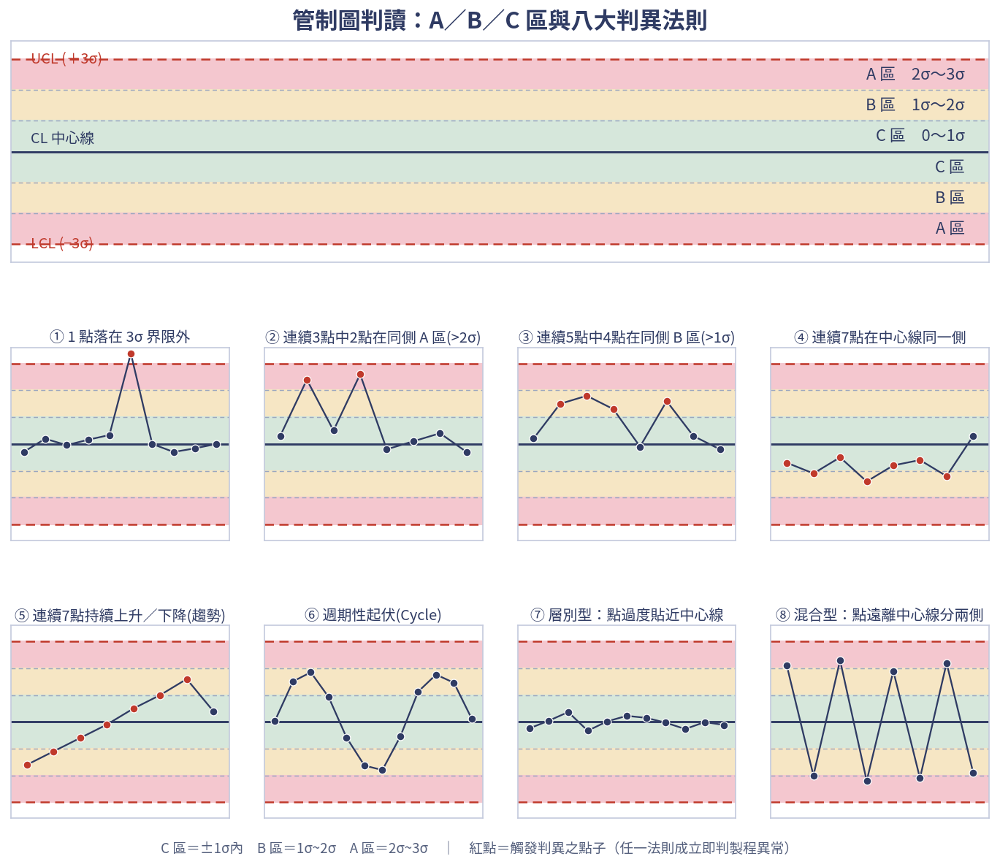

### 4. 不穩定型態之檢定規則（課本 P152~156：規則一～六）⭐⭐必考

任一規則成立即判**不穩定（製程失控）**。檢定原理＝**或然率計算**：正常時點子落在各區有一定比例，比例被破壞即為異常。

| 課本編號 | 內容 | 通用叫法 |
|---|---|---|
| **規則一** | **1 點**落在 **A 區以外**（超 ±3σ、出界，圖25） | 法則1（舒華特原始判異） |
| **規則二** | 連續 **3 點中 2 點**落在**同側 A 區或以外**（超 2σ，圖26） | 法則2 |
| **規則三** | 有 **2 點連續**落在 **1.5σ~3.0σ 之間**（圖27a） | 課本特有 |
| **規則四** | 連續 **5 點中 4 點**落在**同側 B 區或以外**（超 1σ，圖27b） | 法則3 |
| **規則五** | 連續 **8 點落在 C 區**（或其中連續 **7 點**在**中心線同一側**，圖28） | 法則4 |
| **規則六** | **連續幾點同一方向**（趨勢）：5 點注意／6 點調查／7 點必有原因（圖29） | 趨勢規則（詳見下方 6.） |

> ⚠️ **編號陷阱**：
>
> - 課本「規則一～六」與坊間通用「四法則」編號**對不上**（課本規則四＝通用法則3、課本規則五＝通用法則4）——題目報編號時**先看題目怎麼定義規則**，別直接套。
> - 使用註記（課本 P155 註）：規則一～四取管制圖**一半（單側）**說明；規則五採**全部管制圖**。恰好構成不正常型態的點上加「**X**」。
> - 檢定規則確立**以後**才下判斷，以免矯枉過正。
> - ✅ **已核對課本 P155 原文（08-15）**：規則五＝「**連續有八點落在 C 區或甚至於在 C 區以外者**（八個連續點子落在 C 區，**或其中連續七點出現在中心線之同一側者**）」，圖28 畫的是點子全貼中心線（C 區內）。課本規則五**同時涵蓋兩種樣態**：①8 點貼中心線（≈通用系統的「層別型」訊號）②連續 7 點同側（≈通用法則4）——原文如此，非誤植；考題引用時照題目給的定義作答。

**【圖解】八大判異法則（紅點＝觸發判異的點子）**

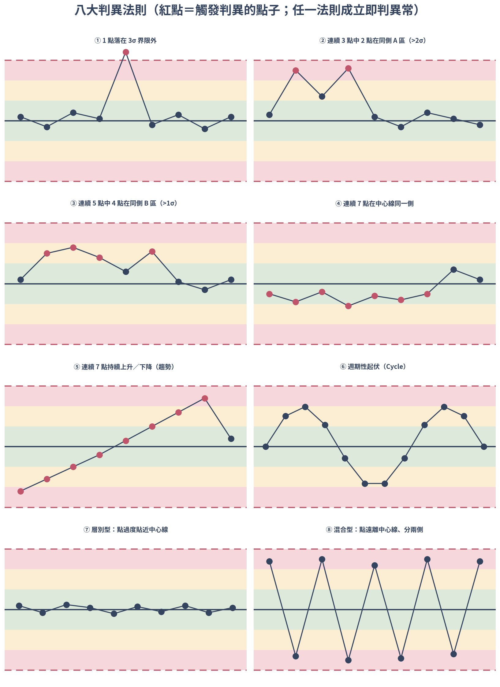

> ⚠️ 規則五（通用法則4）的「同側點數」各版本不同（常見 7／8／9 點）：
>
> - 本教材採「**8 點 C 區**、其中連續**同側 7 點**」（課本 P155 圖28），作答以此為準。
> - 若考題引用其他來源（如 8 點、9 點），依題目定義。

### 5. 其他不穩定型態判讀（課本 5.4，P157）

- **中心線單側連續**：連續 **7 點以上**出現在中心線同一側 → 異常。
- **中心線單側較多**：連續 **11 中 10**、**14 中 12**、**17 中 14**、**20 中 16** → 異常。
- **管制界限近旁**（以**超出 2σ** 之點為調查基準）：連續 **3 中 2**、**7 中 3**、**10 中 4** → 異常。

### 6. 趨勢（連續上升／下降）＝課本檢定規則六 ⭐

- 連續 **5 點**上升或下降 → **注意**後續動態
- 連續 **6 點** → **調查**原因
- 連續 **7 點** → **必有原因，立即採取措施**

### 7. 連串理論 Theory of Runs

- 一點或連續數點在中心線**同一方** ＝ 一個「**串 run**」；數全圖總串數判定隨機性。
- 連串數的抽樣分配接近常態；**串數太多或太少都可能是非隨機（有非機遇原因）**。
- 查連串數判定表（**P＝0.005 處置界限、P＝0.05 警戒界限**，依 n 查臨界值）。

#### 7-1. 連串查表判定法（Swed & Eisenhart，課本 5.5，P158~165）⭐（第四堂課）

判定步驟：

1. 數中心線上方、下方的**點數**：點數少的一側＝**r**、多的一側＝**s**（s≥r）
2. 數全圖**總串數**
3. 查「成串之最低總數表」：**表27＝α0.005（處置）、表28＝α0.05（警戒）**（課本 **P160~161**），以 (r, s) 查臨界值
4. **總串數 ＞ 臨界值 → 隨機（正常）；總串數 ≤ 臨界值 → 串數太少 → 非隨機（有非機遇原因）**

補充規則：恰落在**中心線（中位線）上**的點，可視實際需要**任意分屬上方或下方**再統計；**中位數管制圖**上下點數必相等（r＝s），改查**表29「低於和高於中位值之最低總串數表」**（課本 **P162~165**）。

| 例題 | 兩側點數 | 總串數 | 臨界值（0.005／0.05） | 判定 |
|---|---|---|---|---|
| p 圖（P̄＝0.013，圖30） | 上 14（r）、下 20（s） | 8＋7＝**15** | 9／12 | 15＞12 → **隨機** |
| 中位數圖（X̃＝1.7495，圖31） | 上下各 39（r＝s） | **42** | 28／32 | 42＞32 → **隨機** |

> ⚠️ 陷阱：
>
> - r、s 是「中心線上下**兩側的點數**」，不是串數；別跟總串數混用。
> - 課本查表法只給「**最低**總串數」→ 只檢定**串數太少**；理論上串數**太多**（交互跳動）也可能非隨機，但作答以「≤ 臨界值＝異常」為準。

### 8. ARL（平均連串長度）→ 已併入第十八章 §6

> 🔗 ARL 兩面（在管制 1/α ≈ 370、出管制 1/(1−β)）與 β 公式、例題，統一收在**十八章§6**，跟 α、β、檢定力放在一起看觀念才完整。

---

## 二十四、管制圖之應用法（課本第6章，P168~183）⭐（第四堂課）

### 1. 管制項目之決定（6.1）

- 先決定**管制項目**（特性之選擇與數量）→ 再決定用計量值或計數值管制圖；取捨視**經濟性、技術性與品質要求程度**。
- 項目多時用**重點分析**：**柏拉圖（Pareto）**或**特性要因圖（魚骨圖）**找出有問題之因素優先管制。
- **不宜由少數人單獨決定** → 有關人員（操作員、領班、管理員、主管）公開研討，以免偏差。

### 2. 管制標準（管制界限）之決定（6.2）⭐

- 使用管制圖前，先將現有**製程、步驟、工作方法標準化**——否則日後不易區別機遇 vs 非機遇原因。
- 第一張圖＝**解析用**：除去不正常因素後**重新計算界限**；用了一段時間後應重新檢討。

**應重新檢討管制界限的 4 時機**：① 經營政策或消費者要求明確改變 ② 技術標準、規格、作業／檢驗標準變更 ③ 確知**製程已有變化** ④ 管制圖**已使用一段時間**。

**重新計算界限注意 5 點**：

1. 製程始終不穩、常出界 → **縮短**檢討期間
2. 管制狀態良好 → 檢討期間可酌量**延長**
3. 點子向**好方向**出界（如 p 圖跌破 LCL）→ **仍應追查原因**，並檢討檢驗標準與管制標準
4. 出界點**查得出原因 → 除去後重算**；**原因不明 → 重算時仍予使用**（不可任意剔除）
5. 步驟宜**標準化＋專人負責**，按規定記錄保存

> ⚠️ 易錯：
>
> - 「往好方向出界」不是好消息就不管——一樣要追查（可能是量測或檢驗標準出問題）。
> - 只有「**原因查明**」的出界點才能剔除重算；原因不明的數據要**保留**。

### 3. 抽樣方法之決定（6.3）

- 核心＝**合理樣組**（定義見**第二十章 §3-1**：組內變異小、組間變異大）。失效機制：組內變異大 → R̄ 大 → **界限變寬** → 組間異常落在界限內 → **檢出力下降**。
- 檢查現行取樣是否適當：點子全集中在 **CL±1.5σ 內** → 必是**分組不妥**（層別型徵兆）。
- p 圖樣本大小原則 → 見**第二十二章 §2**（**n ＝ 1/p̄ ～ 5/p̄**）。
- **樣本小、組數多較有利**（及早發現異常）：**n＝4×20 組 優於 n＝8×10 組**。
- **抽樣頻率**：間隔愈大、期間發生變化的風險愈大；可靠**過去記錄**（刀具磨耗率、溶液廢損率）決定；**開始時多抽**，有信心後再減少。

| | 依製造次序連續取樣 | 小批內隨機抽樣 |
|---|---|---|
| 作法 | 每次連續測量**最後 n 個**製品 | 一段時間的小批內**隨機**抽 n 個 |
| 優點 | 組內變異小，σ 代表**製程理想能力**；對**平均值移動靈敏** | 樣組**代表該時段製品品質** |
| 適用 | **製造程序間之管制** | **成品驗收**；批內常有修正或速度快難分辨改變時 |
| 注意 | 抽樣間隔**之間**的改變不會表現在圖上 | **R 圖出界≠變異變大**——批內平均值移動也會使 R 出界 |

### 4. 樣組大小 n 之建議（6.4.1）⭐

| 管制圖 | 建議樣組大小 |
|---|---|
| **X̄–R** | **n＝2~5** 最適當；n＝6 → 分 2 組各 3；n＝10 → 分 2 組各 5 |
| **X̃–R** | 取**奇數**（中位數好找），n＝3 或 5 |
| **p、pn** | **n＞50**，可能時 n＞100；使各組**不良個數 ≥1**（可能時 ≥5） |
| **c、u** | 使各組**平均缺點數 ≥1**（可能時 ≥3） |

### 5. 分組抽樣：目的、原則與分組方法（6.4、6.4.2）⭐

**分組目的 2 個**：① 求**組內變動**大小，進一步**層別**求層間差異 ② 瞭解組內變動是否在管制狀態、是否隨時間變化。

**分組 3 原則**：① 組內變異**只含機遇原因** ② 組內與組間變異的原因在技術上**能明顯區別** ③ **要管制的變異必須顯示在組間**。

**例（表30~33，課本 P174~177）**：機械 I、II 各 2 位作業者，2 日，各人上、下午各測 2 件——同一批數據、三種分組法：

| 分組法 | 組內變動包含 | 組間變動包含 |
|---|---|---|
| 法1：各人「上午2個」「下午2個」各成組（n=2） | 半天內變動＋抽樣／測量誤差 | 作業者間、上下午間、日間、機械間 |
| 法2：各人「上午1＋下午1」成組（n=2） | **一天內（上午到下午）之變動**＋誤差 | 作業者間、日間、機械間 |
| 法3：每機械每半天 4 個數據成組（n=4） | 半天內變動＋誤差＋**同機械兩作業者間之變動** | 機械間、上下午間、日間 |

> 判斷關鍵：
>
> - 想偵測哪個原因，就把它**留在組間**；被放進**組內**的原因會被當成「機遇」而看不見
> - **變更分組方法後比較各圖，即可解析出異常原因的成份**

### 6. 不正常現象之改正措施（6.5）＝時效問題

- 實施管制圖**最重要者＝時效**：發現愈早 → 對策愈簡單、收效愈快；行動太慢 → 不良品大增、影響產量與交期，且**事過境遷，失去找出真正原因的機會**。

**點子出界（或形狀不正常）時的檢討 5 步驟（P178）**：

1. 先確認**計算**有無錯誤、抽樣是否正確、測定是否準確
2. 調查**原料、零件**是否與原來不同；人員是否照**作業標準**工作
3. 改變**分組方式**或用**層別**比較（機械別、原料別、作業者別）
4. 與**其他管制圖比較**（成品圖出界 → 回頭比對原料、加工、前製程的圖）
5. 用**簡單檢定或實驗計劃**找出原因與最佳條件

### 7. 如何使管制圖生效（6.6）

**三大前提**：① **全體員工合作（Team Work）** ② **適當時間採取適當行動**（管理效能） ③ **自始至終熱心追查**，防止毛病重複發生。

詳細方法精華：

- 品質特性選**使毛病發生最大者**；測定量要一致（同一人、混亂順序**重複測 5 次**，以 **R̄/d₂** 算出**測定誤差**）。
- **計量值管制圖比計數值管制圖更容易找出問題原因**——無量具時應設法添置。
- 儘量靠近毛病發生的**道次**取樣並立即試驗；與操作者、檢驗員、領班、工程師商討。
- 新數據用**同一人、同一量具**測定；舊數據仍值得作比較用。
- 證明一種非機遇原因＝**一項實驗工作**；改正行動往往要花錢，**需高層主管支持**。
- 報告**簡要、清楚、確實**＋圖表輔助；**繼續追蹤**（圖延續用、間隔可放長），否則操作易越軌。

### 8. 管制圖上異常原因之分析檢討（6.7）⭐

| 分類 | 細項舉例 | 管制圖上的表現與對策 |
|---|---|---|
| **管理不善** | 未推行標準化、訓練不夠、機械未保養、工具不當、不良材料混入、設計／藍圖錯誤、儀器未校正 | p／pn／c／u 圖**不良（缺點）很多**；X̄–R 呈**甚大變動**。對策＝**先確立管理制度、推行標準化** |
| **技術不足** | 機械精度不足、環境不當、設計矛盾、測定儀器／方法不當、缺技術人才、綜合製程能力不足 | **界限很寬**、品質分散**比規格界限寬**、**p̄ 或 u 比規定大**。對策＝**加強製程能力**，否則只能全數檢查 |
| **其他因素** | 人員疏忽、未按標準作業、標準不完備、未隨機抽樣、計算錯誤、**機械自然磨損**、操作條件突變、異質材料突入、日夜班困擾 | **有系統可尋 → 用層別分析**；不規則出現 → 較易被發現而消除 |

> ⚠️ 判斷關鍵：
>
> - 「界限寬、分散比規格寬、p̄ 偏大」→ 選**技術不足（製程能力不足）**，不是管理不善。
> - 「不良／缺點很多、大變動」→ 選**管理不善**，對策先**標準化**。
> - 「刀具自然磨損、日夜班、異質材料突入」→ **其他因素**，有系統性就用**層別**。

---

## 二十五、雜式管制圖（課本第7章，P185~213）⭐（第四堂課）

**第7章全覽**：7.1 修正管制界限｜7.2 趨勢管制圖（傾斜界限管制圖）｜7.3 或然率界限管制圖｜7.4 警戒界限（複式）管制圖｜7.5 最大值與最小值管制圖｜7.6 個別值管制圖｜7.7 中位值管制圖｜7.8 變異值管制圖｜7.9 移動平均值管制圖。

### 1. 修正管制界限（Modified Control Limits，7.1）⭐

**用途**：**規格允差遠寬於製程變異**時，不必死守 ±3σx̄——改依**規格允差**定管制界限，允許製程均數在規格內移動；特別有利於**設備逐漸耗損**（如刀具磨損）的場合。

**推導**（個別值不出規格 → 均數最多移到離規格界限 d 處）：

- d ＝ 3σx − 3σx̄ ＝ 3(σx − σx/√n) ＝ 3(1 − 1/√n)σx ＝ (3/d₂)(1 − 1/√n)R̄ ＝ **KR̄**
- **修正 UCL ＝ SU − KR̄；修正 LCL ＝ SL ＋ KR̄**（由規格界限往內縮）

**表34 修正界限之 R̄ 乘數**（K＝(3/d₂)(1−1/√n)、L＝6/d₂；課本 **P188**）：

| n | K | L | n | K | L |
|---|---|---|---|---|---|
| 2 | 0.779 | 5.317 | 7 | 0.690 | 2.219 |
| 3 | 0.749 | 3.545 | 8 | 0.681 | 2.107 |
| 4 | 0.728 | 2.914 | 9 | 0.673 | 2.020 |
| 5 | 0.713 | 2.579 | 10 | 0.667 | 1.949 |
| 6 | 0.701 | 2.368 | 12 | 0.655 | 1.841 |

> ⚠️ 使用前提與陷阱：
>
> - 先算 **LR̄（＝6σx）**，確認 **LR̄ ＜ 規格公差（SU−SL）** 才能用修正界限（公差須 ＞ 6σx）。
> - K、L 都是乘 **R̄**（不是乘 σ）；K 已內含 3/d₂ 與 (1−1/√n)。
> - 要更保證合格可加大 d：英國式 **d ＝ 3.09σx − 1.96σx̄**（0.005／0.025 或然率水準）。
> - ✅ **已核對（08-15）**：n＝6 的 L＝6/d₂＝6/2.534＝**2.368**（原誤抄 2.388，上表已更正）。
>
> ⚠️ **易錯（2026-07-25，錯3題）：修正管制界限**
>
> - 「特別有利於**設備逐漸耗損**場合之個別值或平均值管制」——課本測驗題答案是**修正管制界限圖**（不是趨勢管制圖；趨勢圖是均數「以一定速率」變動時畫斜線那張，兩題敘述很像，依題目用詞作答）。
> - **K 值等價式**：K＝(3/d₂)(1−1/√n)＝3/d₂ − 3/(d₂√n)＝(1/d₂)(3−3/√n)——只要能化成這個形的都對；**2/d₂ 之類「換掉 3」的就是錯的**（考「何者錯誤」）。
> - 先決條件：**規格公差 (U−L) ＞ 6σ**（個別值的 6σ，**不是 6σx̄**）。

### 2. 趨勢管制圖（傾斜界限管制圖，7.2）⭐⭐大題

**適用**：R（或 σ）圖在管制狀態、變異穩定不變，但 **X̄ 之均數以一定速率隨時間升降**——典型例：**刀具磨損**（幾乎＝趨勢管制圖的代名詞）。老師補充：又稱**迴歸直線管制圖**；判斷關鍵＝「**X̄ 有趨勢性、R 無趨勢性**」。

| 項目 | 一般 X̄ 圖 | 趨勢管制圖 |
|---|---|---|
| 中心線 | 水平線 X̿ | **斜直線 X̄ ＝ a ＋ bh**（h＝樣組號） |
| 管制界限 | CL ± A₂R̄（水平） | 中心斜線上下 **± A₂R̄ 的平行斜線** |

**最小平方法求 a、b**：聯立 ΣX̄＝ka＋bΣh、ΣhX̄＝aΣh＋bΣh²（k＝組數）。
**簡化技巧：修正組號使 Σh＝0**（k 奇數時 h＝…−2,−1,0,1,2…）→ **a ＝ ΣX̄/k（＝X̿）、b ＝ ΣhX̄/Σh²**。

**例題（表35、36，課本 P190~191）**：規格 0.644±0.004 吋（SL＝0.6400、SU＝0.6480），每半小時抽 n＝5、k＝13 組；X̿＝0.6437、R̄＝0.0010。取 h＝−6…0…＋6，編碼後 ΣX̄＝481、ΣhX̄＝599、Σh²＝182：

- a ＝ 481/13 ＝ 37.0、b ＝ 599/182 ＝ 3.29（編碼值）→ 還原：**中心線 X̄ ＝ 0.6437 ＋ 0.000329h**（h＝−6 → 0.6417；h＝＋6 → 0.6457）
- 界限 ＝ 中心斜線 ± **A₂R̄ ＝ 0.577×0.0010 ≈ 0.0006**（課本取 0.58）

**安裝機器與換刀時機 6 步驟**：

1. 估計 σ ＝ R̄/d₂ ＝ 0.0010/2.326 ＝ 0.00043
2. 檢查公差 vs 6σ：SU−SL ＝ 0.0080 ≈ **18.6σ ≫ 6σ**（可用）
3. 安裝機器中心初值 ＝ **SL ＋ 4σ** ＝ 0.6417
4. 均數升至 **SU − 4σ** ＝ 0.6463 時**更換刀具**
5. 換刀間隔 ＝ (0.6463−0.6417) ÷ 0.000329 ＝ **14 樣組**
6. 每半小時一樣組 → 換刀時機 ＝ 0.5×14 ＝ **7 小時**

**脫離管制之可能原因有三**：① 非機遇原因 ② 趨勢管制界限**建立錯誤**（新作業沿用舊界限、磨損不穩定） ③ 不符合條件（規格公差須遠大於自然公差、均數須以一定速率變動）。

> ⚠️ 判斷關鍵：
>
> - 換刀點取「**規格界限內縮 4σ**」；可移動距離 ÷ 斜率 b ＝ 樣組數，再乘抽樣間隔換成時間。
> - 趨勢圖只有**位置（中心線）**在變，分配形態與變異都不變；樣組間產量應大致相等、組內製品連續取得。

### 3. 或然率界限管制圖（Probability Limits，7.3）⭐

**英國工業界**主張：X̄ 分佈不一定常態、不一定對稱，硬用 3σx̄ 欠妥——改「**先規定機率，再回推界限**」（美式 3σ 則是先定界限、機率 0.27% 為結果，兩者出發點相反）。

| 或然率（雙尾合計） | 兩尾各佔 | 界限內機率 | 界限 |
|---|---|---|---|
| **0.002** | 0.001 | 99.8% | X̿ ± **3.09σx̄**（行動／處置界限） |
| 0.010 | 0.005 | 99.0% | （常用三檔之一，見表37） |
| **0.05** | 0.025 | 95% | X̿ ± **1.96σx̄**（警戒界限） |

**係數修正（7.3.1）**——附表之 A、A₁、A₂ 皆按 3σ 制定，改用或然率界限時查表值要**乘一個換算係數**：

| 改用的界限 | 換算 | 查表值 |
|---|---|---|
| **0.002**（3.09σx̄） | 3.09 ÷ 3 | **× 1.03** |
| **0.05**（1.96σx̄） | 1.96 ÷ 3 | **× 0.653** |

> 成對記：**0.002 → ×1.03、0.05 → ×0.653**（分子就是 3.09 或 1.96，分母都是 3）。
>
> ⚠️ **易錯（2026-07-25，錯2題）：或然率界限的實際套用**
>
> - X̄ 圖 0.05 警戒界限公式 ＝ **X̄ ± 0.653A₂R̄**（把 A₂ 乘 0.653，不是乘 1.96、也不是直接 ±1.96）。
> - 或然率 **R 圖**照樣查 D 係數：0.05、n＝4 → 查表38 之 **D₀.₉₇₅＝1.93** → UCL_R＝1.93×R̄＝1.93×5＝**9.65**（下限配 D₀.₀₂₅；0.05 → 每尾 0.025 成對查）。
> - 手寫速記（P196）：UCL＝X̿＋(3.09/3)A₂R̄、LCL＝X̿−(3.09/3)A₂R̄；0.05 用 (1.96/3)A₂R̄；機率值查**附表2（P310）**：z＝3.09 右尾 0.001×2＝0.002、z＝1.96 右尾 0.025×2＝0.05。
>
> ⚠️ 陷阱：
>
> - 「0.002 或然率界限」是**雙尾合計**（單尾 0.001）；「0.05」單尾各 0.025——別把雙尾當單尾。
> - 3.09σ ↔ 99.8%、1.96σ ↔ 95%，與第十八章常態表對應。

#### 3-1. R 與 S 之或然率管制圖（7.3.2，P197~199）（第四堂課第二節）

**為什麼 R、S 要另訂界限**：R 及 S 之分配**非常態、向右偏**（樣本愈小愈偏）→ 超出上限與下限的機率**不相等**，須另訂**兩條與 R̄（S̄）不對稱**的管制界限（美式 D₃R̄／D₄R̄ 的對稱推法不適用）。

| 圖 | 界限公式 | 係數來源 | 查表 |
|---|---|---|---|
| 或然率 R 圖 | **UCL_R／LCL_R ＝ D_R × R̄** | W＝R/σₓ 之機率分配 | **表38（P199）**：D₀.₀₀₁／D₀.₀₀₅／D₀.₀₂₅（下限）、D₀.₉₇₅／D₀.₉₉₅／D₀.₉₉₉（上限） |
| 或然率 S 圖 | **UCL_S／LCL_S ＝ B × σ** | B 由 **χ² 分配**演算而來 | **表39（P199）** |

> ⚠️ 判斷關鍵：
>
> - 下標＝**單尾累積機率**：0.002 雙尾界限查 D₀.₀₀₁＋D₀.₉₉₉ 成對；0.05 查 D₀.₀₂₅＋D₀.₉₇₅。
> - R 圖係數乘 **R̄**；S 圖係數乘 **σ**（不是 s̄），σ 未知時用不偏估計值。

### 4. 警戒界限或複式管制圖（7.4，P200~202）⭐（第四堂課第二節）

同一張圖設**兩組管制界限**（圖37＝美式 3σ＋2σ，P200；圖36＝英式 0.002＋0.05，P201）：

| 名稱 | 別名 | 美式（3σ 制） | 英式（或然率制） | 作用 |
|---|---|---|---|---|
| **外側界限（Outer limits）** | **行動／處置界限（Action limits）** | 3σx̄ | **0.002**（3.09σx̄） | 超出即採取行動 |
| **內側界限（Inner limits）** | **警戒界限（Warning limits）** | 2σx̄ | **0.05**（1.96σx̄） | 落在內外之間 → 懷疑態度、密切注意 |

- 單獨一點落在 2σ~3σ 警戒區的機率＝½×4.28%＝**2.14%**，偶而一點不稀奇。
- 但警戒區出現**連串**就要行動：**連續 2 點**、**3 中 2**、**7 中 3**、**10 中 4**（與二十三章「管制界限近旁」判異同源）。
- 此圖只適合**品管造詣較深**之人員使用。

> ⚠️ 名詞配對是考點：
>
> - Outer＝**Action（行動）**＝3σ／0.002；Inner＝**Warning（警戒）**＝2σ／0.05——選擇題最愛對調。
> - 美式＝先定 σ 倍數（2σ、3σ）；英式＝先定或然率（0.05、0.002）再回推倍數。

### 5. 最大值與最小值管制圖（L−S 圖，7.5，P202~203）⭐考過（第四堂課第二節）

**適用**：計量值；產品或零件之**不圓、不均勻、偏心、面之不平行**等問題（老師註明「如何應用」考試考過）。每樣組測 n 個，只點**最大值 L 與最小值 S**（圖39：●＝L、×＝S），可與 R 管制圖併用。

- CL ＝ M̄ ＝ **(L̄＋S̄)/2**
- UCL／LCL ＝ **M̄ ± A₉R̄**，式中 **R̄ ＝ L̄ − S̄**

**表40 L−S 係數 A₉（P203）**：

| n | 2 | 3 | 4 | **5** | 6 | 7 | 8 | 9 | 10 |
|---|---|---|---|---|---|---|---|---|---|
| A₉ | 2.695 | 1.826 | 1.522 | **1.363** | 1.263 | 1.194 | 1.143 | 1.104 | 1.072 |

**例題（講義）**：n＝5，L̄＝60、S̄＝40、R̄＝10 → CL＝(60＋40)/2＝**50**；UCL＝50＋1.363×10＝**63.63**。🖩 50 ＋ 1.363 × 10 ＝

> ⚠️ 陷阱：
>
> - A₉ 乘的是 **R̄＝L̄−S̄**（不是除以 2）；CL 才是取平均。
> - n＝5 → A₉＝**1.363**，跟 X̄ 圖 A₂＝0.577 不同表，別查錯。
> - L−S 圖**檢出力不好**，但可用圖形表明工程狀況，**現場使用效果仍佳**（是非題考點）。

### 6. 個別值管制圖（點圖）與中位值管制圖（7.6~7.7，P204~206）（第四堂課第二節）

**個別值管制圖（7.6）＝點圖（Dot Chart）**（圖40，P204）：

- 作法：按適當間隔抽 **3~5 個**，量得值**直接點在圖上**。
- 特點：非常簡單易懂、**對工作者饒有教育意義**；用於**不需要 X̄–R 敏銳性**之場合。
- 界限：**X̄ ± 3σ**；亦可設在**距規格界限 1σ** 處——有點出界，再觀察是否超出 D₄R̄ 範圍後採取措施。

**中位值管制圖（7.7）**＝個別值圖之特型（圖41，P206）：

- **兼有 X̄–R 圖之敏銳性**；奇數個數據的**中位值加圓圈**代替 X̄（省算平均）。
- 界限：與 X̄ 圖同法但**加寬 25%**（小樣組時中位值效用不及平均值）。
- 最大優點：讓工作者明瞭「**平均值（中位值）與個別值應有不同之管制界限**」。

> ⚠️ 區分：
>
> - 此處「個別值管制圖」＝第7章的**現場簡易點圖**（每次點 3~5 個、靠目視）；**X–Rm**（二十一章）是 n＝1、用 E₂ 算界限——不同脈絡。
> - 考「最簡單／對工作者最有教育意義」→ 點圖；考「兼有敏銳性、界限寬 25%」→ 中位值圖。

### 7. 變異值管制圖（7.8，P207~208）（第四堂課第二節）

**新式管制圖**，專門表現「**品性本身（Within Piece）**」之變異——**不均勻、不圓、偏心、面不平行**（與 L−S 圖同用途、互為備選）。

- 這些小變異有時可**大到超過機器能力（Machine Capability）**，不可忽視。
- 作法：**一直線代表一樣本**，直線繪於該尺度的**最大值與最小值之間**；由線長直接看出不圓等範圍，並可與機器能力、刀具損耗比較。
- 圖42（P207）三種型態：① 個別樣本身變異大 ② 樣本間變異大 ③ 因時間的變異大。
- 界限與個別值圖同法，設在**距規格界限 1σ** 處。

> ⚠️ 關鍵詞配對：
>
> - **Within Piece（品性本身）＝ 變異值管制圖**
> - 「**不圓／偏心／面不平行**」同時是 **L−S 圖**與**變異值圖**的場景（兩者互為備選）

### 8. 移動平均值管制圖（X̄ₘ 圖，7.9，P208~213）⭐（第四堂課第二節）

**適用**：**連續式化學品製造廠**之原料及半成品管制。X̄ₘ 變化微小 ＝ 製程內**摻和（blending）與混合（mixing）**均勻。

**步驟（m＝3 日移動，k＝20 日，製酒酒精含量%例，表40，P210）**：每日分析值 → 3 日移動平均 X̄ₘ（共 k−m＋1＝18 個）→ 3 日移動全距 Rₘ。

- X̿ₘ ＝ ΣX̄ₘ/(k−m＋1) ＝ 293.94/18 ＝ **16.33**
- R̄ₘ ＝ ΣRₘ/(k−m＋1) ＝ 17.7/18 ＝ **0.98**
- 以 **m 當 n 查 A₂**（m＝3 → A₂＝1.02）：CL＝**16.33**、UCL＝16.33＋1.02×0.98＝**17.33**、LCL＝**15.33**（圖43，P213）

> ⚠️ 判讀特殊規則（必考觀念）：
>
> - 移動平均的**相鄰點彼此相關**（共用同批數據）→ **連串（連續超限）規則在此不適用**：m＝3 時圖上 3 點成串超限，實際只相當於 R 圖**一點**超限。
> - 點成串出現在中心線一側的解釋，也與 X̄／R 圖不同。
> - 分母都是 **k−m＋1**（與二十一章 R̄ₘ 同形）；曲線比個別值圖**平滑**，看的是**趨勢**不是點間變動。

---

## 二十六、規格與公差（課本第8章，P215~226）⭐（第四堂課下午）

**第8章全覽**：8.1 規格之訂定｜8.2 由實驗工廠（Pilot plant）之實驗結果制定公差｜8.3 公差問題之討論｜8.4 製造過程中公差之決定。

### 1. 規格之訂定（8.1，P216~217）

**規格常較實際需要「嚴」的理由有二**：① 設計人員沒時間及資料，為**安全計**訂嚴一點 ② 設計者知道藍圖規格與實際有差別，為配合實際而訂嚴。→ 公差訂**過嚴會增加費用**。

**設計人員訂規格之方法有五**：① 根據物品或零件上面之規格 ② 根據**製程能力** ③ 產品與現有規格比較後決定要不要修正 ④ 依設計出來的公差 ⑤ 依上下游廠商之要求。

> ⚠️ 兩個補充：
>
> - **製程能力不足** → 重工／報廢等額外費用增加；可用 **X̄–R 管制圖**找原因
> - **新產品**規格可**參考類似產品**來訂

### 2. 由實驗工廠（Pilot plant）制定公差（8.2，P217~219）

- 不用統計：以實驗**最高與最低測定值**作上下限（粗糙，不建議）。
- 統計法：數據整理成**次數分配** → 求 μ、σ → **μ±3σ 內 99.73%**（設常態）；依實驗順序分組用 X̄–R 圖確認穩定，σ 用 **R̄/d₂ 或 s̄/C₄** 估。
- **自然公差（Natural tolerance）＝ X̿ ± 3σx**：穩定製程個別產品之上下界限。次數分配法**優於**取最高最低值法。

### 3. 公差合成（8.3，P219~223）⭐計算必考

**核心：裝配物尺寸＝零件之和，但公差 ≠ 零件公差直接相加**（沒考慮機率——零件同時取極端值的機率極小）。

獨立變數之「和」與「差」，標準差都是**平方和開根號**：

- σs ＝ √(σ₁² ＋ σ₂² ＋ … ＋ σn²)（**差也是「＋」**，不是相減）
- 公差界限與 σ 成比例時：(U−L)組合 ＝ √[(U−L)₁² ＋ (U−L)₂² ＋ …]
- 反推零件公差（n 個零件 σ 相等）：σ零件 ＝ √(σ²組合 ÷ n)

**例題（P220~221，圖4-4：AB＋BC＝AC）**：AB：μ＝1.205、σ＝0.0020；BC：μ＝3.250、σ＝0.0005；規格設 ±4σ。

| 件 | 規格 | 公差範圍 |
|---|---|---|
| AB | 1.205±0.0080 | 0.0160 |
| BC | 3.250±0.0020 | 0.0040 |
| （直接相加，錯誤示範） | 4.455±0.010 | 0.0200 |

σ_AC＝√(0.0020²＋0.0005²)＝**0.0021** → AC 規格＝**4.455±0.008**（比直接相加的 ±0.010 **小**）；(U−L)_AC＝√(0.0160²＋0.0040²)＝**0.0165**。
🖩 0.002 x² ＋ 0.0005 x² ＝ √Ans ＝

> ⚠️ 前提與陷阱：
>
> - 變數必須**彼此獨立**（例：五片金屬片出自同一製程按順序組合＝非獨立，除非製程穩定）。
> - 是**變異數（σ²）相加**再開根號，不是 σ 直接相加。
> - 「差」的標準差仍是 √(σ₁²＋σ₂²)，**不是相減**。

### 4. 製造過程中公差之決定（8.4，P223~225）⭐計算必考

顧客只給成品規格 → 中間過程公差**由成品往前反推**（平方「相減」再開根號）：

- σ₁ ＝ √(σ和² − σ₂²)；(U−L)₁ ＝ √[(U−L)和² − (U−L)₂²]

**例題（P224~225）**：成品規格 0.650±0.020（公差範圍 0.040），最後一過程公差範圍 0.015 → (U−L)₁＝√(0.040²−0.015²)＝**0.0371**（課本印 0.036742，驗算 √0.001375＝0.0371，疑課本誤植）。
🖩 0.04 x² − 0.015 x² ＝ √Ans ＝

> ⚠️ 判斷關鍵（差在加號還是減號）：
>
> - **組合（往後算裝配物）** → 平方和「**＋**」再開根號
> - **反推中間過程（往前算零件）** → 平方「**−**」再開根號

**第8章習題附答案（P226）**：習題05：σ組合＝√(0.0020²＋0.0004²)≈**0.0020**；習題06：規格 0.500±0.020、最後過程公差 0.005 → (U−L)₁＝√(0.040²−0.005²)＝**0.0397**。

---

## 二十七、製程管制（課本 9.1~9.12，P227~255）⭐（第四堂課下午）

### 1. 定義（9.1~9.3，P228~230）⭐名詞必考

| 名詞 | 定義 |
|---|---|
| 製程（一般） | **原材料上線開始至成品包裝完成**之一切生產過程（投入至產出） |
| 製程管制 | 對製程中「**產量、品質、交期、成本**」四大項做完全之控制 |
| 別名 | **IPQC**（In Process Quality Control，在製品品質管制）＝**PQC**（Process Quality Control） |
| 內涵 | 將**製造條件標準化**；不符規格之缺點**即時發現、予以矯正** |

- 目的：依標準管制確保品質；重視變異、**預防**不良再發生；**對下工程做品質保證**。
- 管制不當之後果：廠內失敗成本↑（報廢、再加工）、廠外失敗成本↑（訴怨索賠）→ 競爭力降低、危害安全、回收再製費用、存貨失衡。
- 產品規格訂定資料來源：國家法令、國家標準（**CNS、JIS、CSA、DIN、UL**）、同業品質水準、客戶要求、經驗累積（客訴資料）。

### 2. 品管活動兩層面（9.5，P232）⭐分類題

| 層面 | 內容 |
|---|---|
| **狹義（技術面）** | 直方圖、管制圖、品質稽核、可靠性試驗、機具管制、製程能力分析、QC七手法、5S、TPM |
| **廣義（人性面）** | 高昂之工廠士氣、激勵與維持品質意願、品質目標之溝通 |

### 3. 作業三階段與三組（9.6~9.7，P233~234）

**三階段**：

| 階段 | 內容 |
|---|---|
| ① **量試** | 流程選定 → 機具人員配置 → 各種標準訂定 → 品管方案編定 |
| ② **量產時之品管** | 巡迴檢查、管制圖、異常追查、檢查站抽驗 |
| ③ **製程分析與改善** | 情報分析 → 能力分析評價 → 對策 → 追蹤 |

**三組**：

| 組別 | 人員 | 工作 |
|---|---|---|
| 第一組 | **線上操作人員** | 自檢、工作中即分開不良品 |
| 第二組 | **線上品管檢驗人員** | 第一件檢驗、巡迴檢驗、檢驗記錄、物料抽檢 |
| 第三組 | **試驗室人員** | 冶金／化學／物理／非破壞試驗、溶液分析、儀器校正保養 |

### 4. 人員責任劃分（9.8，P234~236）⭐⭐「誰做什麼」選擇題最愛

| 人員 | 責任 |
|---|---|
| **作業員** | 製造條件之**設定**；**第一件製品檢查**；製造中條件查核；簡單檢驗；**簡單異常之處置** |
| **班長** | 製程條件之**覆核**；管制情形之監督；**異常處置之指示** |
| **現場主管** | **管制圖之查閱**；管制情況判斷；**較複雜原因**之追查與處置指示；處置效果覆核 |
| **品管員** | 第一件檢查之**覆核**；製造條件覆核；製品抽試；**管制圖之點繪**；**異常通知單之填發**；處置效果調查 |
| **品管主管** | 測試儀器與方法之管制；品管員調配；管制情形調查；重要品質問題之連絡報告 |

> ⚠️ 陷阱：
>
> - **第一件檢查＝作業員做、品管員覆核**。
> - **管制圖「點繪」＝品管員；「查閱判斷」＝現場主管**。

### 5. 管制項目：查核點 vs 管制點（石川馨，9.9.1，P238）⭐

| | 查核點 Check point | 管制點 Control point |
|---|---|---|
| 對應 | **原因**（製造條件、作業條件） | **結果**（品質特性、產量、成本） |

> ⚠️ 三個考點：
>
> - 「**誰是因、誰是果**」必考：查核點＝**原因**、管制點＝**結果**
> - **管制項目 ＝ 查核點 ＋ 管制點兩者**
> - 全列或漏列都不對——連顧客不重視的特性都管 ＝ **徒增成本、得不償失**

### 6. 製程檢查抽樣頻率表（P239）

| 每小時產量 | 不穩定 | 穩定 | 已受管制 |
|---|---|---|---|
| 10 以下 | 8 小時 | 8 小時 | 8 小時 |
| 10~19 | 4 小時 | 8 小時 | 8 小時 |
| 20~49 | 3 小時 | 4 小時 | 8 小時 |
| 50~99 | 2 小時 | 2 小時 | 4 小時 |
| 100 以上 | ½ 小時 | 1 小時 | 2 小時 |

> 這張表的定位與判讀：
>
> - 判讀：產量越大、越不穩定 → 間隔越**短**。
> - ⚠️ 這張表是**製程檢查（IPQC）巡檢頻率**用（三欄：不穩定／穩定／已受管制）；**建立 X̄–R 管制圖**的抽樣間隔表（兩欄）在**第二十章 §3-1 表 10**，別查錯。
> - ✅ **已核對（08-15）**：本表（IPQC 巡檢）與二十章表10（建立管制圖，課本 P71）**來源不同、數值本來就不同**，不是抄錯——查表前先確認用途。

### 7. 製程中常用之檢查方式（P240）⭐

| 名稱 | 樣本 | 負責人 | 重點 |
|---|---|---|---|
| 首件產品檢查 | 2~10／批 | 作業員或QC | 用首件檢查記錄表 |
| **自主檢查** | 全數 | 作業員 | 檢查**自己**的作業 |
| **順序檢查** | 全數 | 作業員 | **下工程檢查上工程**（人人品管） |
| 巡迴檢查 | 2~10 | QC或班組長 | 用**檢核表**；查原因＋品質特性 |
| 檢查站檢查 | 全數 | 檢驗人員 | 生產線式 100% 全檢 |
| 單位別檢查 | 抽樣或全檢 | 作業員或QC | 半成品跨單位移轉時 |
| 實驗室檢查 | N/批 | QC人員 | 費時特性（物性、化性、耐久性） |
| 成品檢查 | 抽樣或全檢 | QC人員 | 入庫前，站在**客戶立場** |

> ⚠️ 最愛互換考的兩種檢查：
>
> | 名稱 | 誰查誰 |
> |---|---|
> | **自主檢查** | 作業員查**自己**的作業 |
> | **順序檢查** | **下工程**檢查**上工程**（人人品管） |

### 8. 書面資料與製造流程圖（9.9.3~9.10，P244~251）

書面資料 11 項擇要：產品規範、操作標準、製造流程圖、**QC 工程表（＝製程管制方案＝工程品質管理表）**、檢驗規範、檢驗記錄（**至少存放 2 年**）。

**製造流程圖符號 ⭐老師註明必考**：

| 符號 | 意義 |
|---|---|
| **○** | 操作（改變物理／化學性質、裝上拆下） |
| **□** | 檢驗（與規格比對；區分時 □＝**數量**檢驗） |
| **◇** | **品質**檢驗——有 ◇ 處＝**檢查站**所在 |
| **D** | 遲延（預定行動未能即刻發生） |
| **▽** | 儲存 |
| **⇨** | 搬運 |

- 寫法：主流程**垂直**、副流程（準備線）從旁插入；管制項目含**製造條件與品質特性**兩者。
- 應用（IE 改善）：好製程＝不良品不易產生之製程；**⇨（搬運）與 ▽（儲存）減到最少**。例9.1 馬達蓋廠：產量 1.6→5.1 個/人時、人員 6→4；例9.2：搬運距離 210M→4.1M。

### 9. 在製品轉移與品質異常處理（9.11~9.12，P252~255）

- 在製品容器定量放置＋**傳票**（名稱、編號、數量、機械、人員、時間），利於異常追查。
- 異常處理：追查原因 → 矯正措施＝**暫時對策（治標）＋防止再發對策（治本）** → 確認 → 發「品質異常連絡單」。
- 不合格品：立即**隔離＋紅色標籤**；可修理者依標準修理，修畢經檢驗員**驗收**才交下站。

> ⚠️ 考點：暫時對策 vs 防止再發對策 ＝ **治標 vs 治本**。
>
> ⚠️ **易錯（2026-07-25，錯4題）：製程管制觀念選擇題**
>
> - 「製程管制即是」→ **在製品之管制**（IPQC；不是製成品、也不能籠統選品質管制）。
> - 製造程序中實施品管，求得的變化狀態 → **「可以預測」**（管制狀態＝穩定可預測，此題答案取「可以預測」）。
> - 詳細的製造流程圖 → **可以節省許多文字的敘述**（不是要雙語、顏色密碼或幹部姓名）。
> - 從取得原料到準時交貨、符合品質，生產之前必須有 → **精密的計劃**。

---

## 二十八、製程能力分析：Ca／Cp／Cpk／Cr（課本 9.13~9.14，P256~281）⭐⭐（第四堂課下午，老師註明有考過）

### 1. 前提與定義（9.13，P256~259）

- 製程能力＝製程在**固定生產因素、穩定管制下**之品質能力；評估前提：**先在統計管制狀態**、最好 **≥25 樣組**、假設**常態**。
- 只能得**粗略估計**的 3 理由：①抽樣誤差 ②沒有製程能 100% 在管制狀態 ③沒有製品批完全常態。
- 工具：次數分配、管制圖、點值圖、實驗計劃。**製程能力＝6σ̂**（＝自然公差）。
- σ̂ 推定：樣本直接算（xσn−1）／次數分配表／**σ̂＝R̄/d₂（最常用）**。
- **計數值**的製程能力＝**管制圖中心線之值**（如 p̄＝3.0%）。

### 2. 三大指標總表（課本 P261；講義投影片，老師手寫重點）⭐⭐必背

| 指標 | 全名 | 衡量 | 公式（雙邊規格） | 判斷方向 |
|---|---|---|---|---|
| **Ca** | 製程準確度 Capability of Accuracy | 實績中心 vs **規格中心**的偏移（**集中**） | Ca＝(X̄−M)/(T/2)×100% | **越小越佳**（手寫強調） |
| **Cp** | 製程精密度 Capability of Precision | 變異寬度 vs 公差（**離散**） | Cp＝T/6σ̂ | **越大越佳**（手寫強調） |
| **Cpk** | 製程能力指數 | 準確＋精密合併 | Cpk＝(1−\|Ca\|)×Cp | 越大越佳 |

符號：**M ＝ 規格中心值**（＝(Su＋SL)/2；老師紅筆：**不是**樣本平均值。課本原文寫 μ，本筆記改用 **M**，以免與 ⓪-2 符號表的母體平均數 μ 混淆）、X̄＝實績平均、T＝Su−SL＝公差、σ̂＝製程標準差估計。靶心圖記憶：**準確 Ca＝打得正；精密 Cp＝打得密**。

**單邊規格**：Cp＝(Su−X̄)/3σ̂（只有上限）或 (X̄−SL)/3σ̂（只有下限）；**單邊沒有規格中心 → 不能算 Ca**（螢光重點）；**單邊時 Cpk 即以 Cp 計**。

> ⚠️ 共同陷阱：
>
> - 題目給「實績 X̄±b」時 **b＝3σ → 6σ＝2b**，Cp＝T/(2b)——別把 b 當 6σ。
> - Ca 的分母用**規格**的 T/2；Cp 的分母用**實績**的 6σ——兩者取的數不同，最易混。
> - Cpk 帶入 |Ca| 用**小數**（40%→0.4）；恆有 **Cpk ≤ Cp**；Ca＝0 時 Cpk＝Cp；X̄ 恰在規格界限上時 Cpk＝0。

### 3. Ca 等級與處置（P262~264）

| 等級 | \|Ca\| | 處置 |
|---|---|---|
| A | ≦12.5% | 維持現狀 |
| B | 12.5%＜~≦25% | 改進為 A 級 |
| C | 25%＜~≦50% | 立即檢討改進（作業員可能看錯規格） |
| D | ＞50% | 緊急措施、全面檢討，必要時**停止生產** |

**例9.3**：規格 560±10；一月 X̄＝561 → Ca＝1/10＝**10%（A 級）**；二月 557 → Ca＝**−30%（C 級）**（分母是 T/2＝10，實績的 ±9、±8 **不用**）。

### 4. Cp 等級與處置（P264~267；講義五級版）

| 等級 | Cp | 處置 |
|---|---|---|
| A⁺ | ≧1.67 | 能力過高，可考慮管理簡化或降成本 |
| A | 1.33~1.67 | 維持現狀 |
| B | 1.00~1.33 | 確實製程管理，改進為 A |
| C | 0.83~1.00 | 有不良品，立即檢討改進 |
| D | ＜0.83 | 緊急措施、全面檢討，必要時停止生產 |

**例9.4**：硬度規格 65±2.0；一月實績 64±1.4 → Cp＝4/(1.4×2)＝**1.43（A 級）**；二月 65±2.5 → Cp＝4/5＝**0.80（D 級）**。🖩 4 ÷ ( 1.4 × 2 ) ＝

> ⚠️ **易錯（2026-07-25，錯3題）：製程能力與 Cp 的數字題**
>
> - 「一般定義製程能力＝幾個 σ」→ **6σ**（不是 3σ、8σ）。
> - **Cp＞1 ＝ B 級「尚佳」**，不是「良好」——「A 級（良好）」要 Cp≧1.33，分級用詞是考點。
> - Cp 換算 σ 倍數：**T/2 ＝ 3σ×Cp**。例：Cp＝1.67 → 規格＝μ±3×1.67σ＝**μ±5σ**（順向 T＝6σ×Cp 也通）。

**Cp 與不良率對照（P268）**：

| Cp | 公差相當於 | 雙邊不良率 |
|---|---|---|
| 0.67 | ±2σ | 4.55% |
| 1.00 | ±3σ | 0.27% |
| 1.33 | ±4σ | 63.6 PPM |
| 2.00 | ±6σ | ≈0 |

### 5. 綜合評價：推定不合格率 p（P267~270）⭐計算題

**Z₁＝−3Cp(1＋Ca)** → 查常態表得 P₁；**Z₂＝3Cp(1−Ca)** → 得 P₂；**p＝P₁＋P₂**。

| 等級 | p |
|---|---|
| A | ≦0.44% |
| B | 0.44%＜~≦1.22% |
| C | 1.22%＜~≦6.68% |
| D | ＞6.68% |

**例9.5**：規格 165±5、實績 164±6：Ca＝−20%（B）、Cp＝5/6＝0.83（C）；Z₁＝−3×0.83×0.8≈−2 → P₁＝2.28%；Z₂＝3×0.83×1.2≈3 → P₂＝0.13%；**p＝2.41%（C）**。
**練習（老師手寫解）**：規格 28±3、實績 27.8±5.1：Ca＝−6.7%、Cp＝6/10.2＝0.588；Z₁＝−1.65 → 4.95%、Z₂＝1.88 → 3.01%；**p＝7.96%（D）**。（同題以 N(27.8, 2.89) 出：σ＝√2.89＝1.7，直接算規格外兩尾，答案同。）

> ⚠️ 推定不合格率兩個要點：
>
> - **Ca 帶正負號代入**：Ca＝−20% → (1＋Ca)＝**0.8**、(1−Ca)＝**1.2**，別搞反
> - **驗算用直接法**：Z ＝ (規格界限 − X̄) ÷ σ

### 6. Cpk 製程能力指數（P271~272；講義五級版含 ppm）

- 已知規格中心（或單邊）：**Cpk＝(1−|Ca|)×Cp**（設 k＝|X̄−μ|/(T/2)＝|Ca|）；未知規格中心：**Cpk＝Zmin＝Min{(Su−X̄)/3σ̂, (X̄−SL)/3σ̂}**。
- **Ca＝0 時 Cpk＝Cp**；**單邊規格時 Cpk 即以 Cp 值計，但需取絕對值**（課本 P271 原文）。

**課本 P271 分級（只有三級）⭐以課本為準**：

| 等級 | 分級基準 | 處置 |
|---|---|---|
| A | **1.33 ≦ Cpk** | 製程能力足夠 |
| B | **1.0 ≦ Cpk ＜ 1.33** | 有不合格品之虞，宜注意管制 |
| C | **Cpk ＜ 1.0** | 產生不合格品，應改善製程 |

**講義五級版（含 ppm，另一套）**：

| 等級 | Cpk | 能力 | 不良機率 |
|---|---|---|---|
| A⁺ | ≧1.67 | 過高 | ＜0.6 ppm |
| A | 1.33~1.67 | 充分 | 0.6~60 ppm |
| B | 1.00~1.33 | 尚可 | 60~2700 ppm |
| C | 0.67~1.00 | 不足 | 2700~45500 ppm |
| D | ＜0.67 | 嚴重不足 | — |

**例9.6**：承例9.5 → Cpk＝(1−0.2)×0.83＝**0.664** → 依**課本 P271 三級表**判 **C 級**（Cpk＜1.0，✅ 課本沒印錯——08-15 核對 P271 確認課本分級只有 A/B/C 三級）；若題目用**講義五級表**則落 D（＜0.67）——依題目出處的分級表作答。**例9.7**（Min 式）：Cpk＝Min{6/6, 4/6}＝**0.67**。
**例9.8（P280）**：規格 32±0.05、實績 32.02±0.04 → Ca＝0.02/0.05＝**40%（C）**、Cp＝0.1/0.08＝**1.25（B）**、Cpk＝0.6×1.25＝**0.75**。

> ⚠️ **分級表多版並存，先看題目用哪套**：
>
> | 指標 | 課本（管制圖） | 講義 | 七手法課本（第7章） |
> |---|---|---|---|
> | **Cp**（五級 A⁺/A/B/C/D） | C/D 切點 **0.83**（P261） | 同課本 **0.83**（slide 93） | 五級但切點用 **0.67** |
> | **Cpk** | **三級 A/B/C**，C＝＜1.0（P271） | 五級，D＝＜**0.67** | — |
>

### 7. Cr 製程能力比率（P273）

**Cr ＝ 6σ/T ＝ 1/Cp**，**越小越好**；目標 **Cr ≦ 0.75**（螢光），建立在**公差＝8σ**上（8σ 時 Cp＝1.33、Cr＝0.75）。

### 8. 6σ（自然公差）vs 規格公差三情況（9.13.8，P274~276；與第十六章對照）

| 情況 | 關係 | 意義 |
|---|---|---|
| 1 | **6σ ＜ T** | 最理想；管制狀態下中心線可在規格內依經濟性移動 |
| 2 | 6σ ≒ T | 恰好符合；須**嚴控變異**，平均值一偏移就出不良品 |
| 3 | 6σ ＞ T | 超出規格 → 檢討放寬公差、改善製程或**全數選別** |

### 9. 用途與評價時期（9.13.10~12，P278~279）

- 用途擇要：供設計部門訂新產品規格、決定新設備能否滿足要求、分派工作到機器、選作業員與材料、建立經濟管制界限與機器調整界限——**最具價值之技術情報資料**。
- 評價時期：**定期**＝一／三／六個月一次；**不定期** 7 時機＝買入新設備、機器修理完成、工作方法變更、製造條件變更、發生不良、客戶特別要求、開發新產品。

### 10. 以 R̄/d₂ 判斷能否符合規格＋管制程序（P280~281）

**例9.9**：n＝4、R̄＝17.59、規格 0~60：σ̂＝17.59/2.059＝8.543（d₂ 查附表1）→ 30±3×8.543/√4 ＝ 17.19~42.81，在規格內 → **符合規格**。
**利用管制圖管制製程 5 步（9.14）**：① 流程圖＋特性要因圖找因素 → ② 制訂操作標準 → ③ 教育訓練 → ④ 製程能力解析、定管制界限 → ⑤ 制訂品管方案。

> ⚠️ **觀念說明：為什麼判規格要用自然公差 X̿±3σ̂，不是 X̄ 界限？**
>
> - 規格是給「**個別產品**」判合格用的；個別值的散布範圍＝**X̿±3σ̂（自然公差，寬 6σ̂）**。
> - X̄±3σ̂/√n 是「**樣本平均**」的管制界限——平均值的散布比個別值**窄 √n 倍**（n=4 時窄一半）。
> - 用 X̄ 界限判規格會**高估能力**：界限在規格內不代表個別品都在規格內。
> - 本例：自然公差＝30±25.63＝4.37~55.63，落在規格 0~60 內 → 符合（6σ̂＝51.3＜T＝60）。課本例9.9 用 X̄ 界限 17.19~42.81 判，結論湊巧相同但依據有疑慮，正規解法用自然公差。

### 11. 提高製程管制之主要因素（9.15~9.16，P282~287）

課本第 9 章收尾的分類清單，題型同 9.8 責任劃分／9.9 查核點（問「哪一項屬於○○方面」）：

| 方面 | 要點 |
|---|---|
| **人員** | ① 品管教育訓練 ② 責任感與士氣 ③ 依標準作業 ④ 提案改善participation（4 項） |
| **材料** | ① 進料管制、供應商品質（交貨品質之確保） ② ABC 分類管理（2 項） |
| **機器設備** | ① 良好之保養（使性能穩定） ② 精度定期查核 ③ 治工具管理（3 項） |
| **工作方法** | ① 標準化（作業標準） ② 製程條件設定 ③ 方法改善 ④ 檢查方式合理化（4 項） |

> 記法：人 4、料 2、機 3、法 4——「人最多、料最少」。

---

## 二十九、課本查表索引：哪個表在第幾頁 ⭐考場翻書用

《管制圖與製程管制》課本。**附錄目次在 P307**，找不到表先翻它。

### 1. 章節內的重要表格

| 表 | 名稱／用途 | 課本頁 |
|---|---|---|
| 表8 | 直方圖 vs 管制圖之區別（見筆記二十章 §2-1，內容已全抄） | 第4章 |
| **表23** | **p 管制圖界限表**——以 p(%)×n 直接查 UCL/LCL 免開根號（功能同附表3~6） | **P126~129** |
| 圖24~29 | A/B/C 分區與檢定規則一～六示意圖 | P152~156 |
| **表27** | 成串之最低總數表 **α＝0.005（處置界限）**——(r,s) 查臨界值 | **P160** |
| **表28** | 成串之最低總數表 **α＝0.05（警戒界限）** | **P161** |
| **表29** | 低於和高於中位值之最低總串數表（中位數圖用，r＝s） | **P162~165** |
| 表30~33 | 分組方法例（機械×作業者×日×上下午） | P174~177 |
| **表34** | 修正管制界限之 R̄ 乘數（n → K、L） | **P188** |
| 表35、36 | 刀具磨損趨勢管制圖例題數據與編碼計算 | P190~191 |
| 表37 | R 及 S 管制圖常用之或然率（α → 每尾 ½α） | P197 |
| **表38** | 或然率 R 管制圖係數 D_R（n → D₀.₀₀₁~D₀.₉₉₉） | **P199** |
| 表39 | 或然率 S 管制圖係數 B（χ² 演算） | P199 |
| **表40** | L−S 管制圖係數 A₉（n＝2~10）⚠️課本表號重複 | **P203** |
| 表40（重號） | 移動平均與移動全距計算例（製酒酒精 %） | P210 |
| 圖4-4 | 公差合成例（AB＋BC＝AC，平方和開根號） | P221 |
| （無表號） | 製程檢查抽樣頻率表（產量×穩定度→間隔） | P239 |
| （無表號） | 製程中常用之檢查方式（8 種）總表 | P240 |
| （無表號） | 製造流程圖五種符號（○□◇D▽⇨） | P246~247 |
| （無表號） | σ̂ 三種推定式與 Cp＝T/6σ̂ | P258~259 |
| （無表號） | **Ca／Cp 評價計算公式及分級基準總表** | **P261** |
| （無表號） | Cp 與不良率對照表 | P268 |
| （無表號） | Cpk 公式與等級表 | P271 |

### 2. 書末附錄（P306~337）

| 附表 | 名稱 | 查什麼 | 課本頁 |
|---|---|---|---|
| **附表1** | 常態分配統計量抽樣分配常數表（n＝2~20） | P308：n → m₃、d₂、d₃、c₂~c₅；P309：n → **A₂、A₃、B₃、B₄、D₃、D₄、E₂** | **P308~309** |
| **附表2** | 標準常態分配**右邊**機率值（z＝0~6.00） | z → 右尾機率 P(Z≥z)（⚠️是右尾不是左尾） | **P310~313** |
| 附表3 | A＝3/√n 之表（p 圖用，n＝1~1000） | n → A，用於 P̄±A√P̄(1−P̄) | P314 |
| 附表4 | √P̄(1−P̄) 之表（p 圖用） | P̄（0.1%~50%）→ 根號值，免開根號 | P315 |
| 附表5 | 3√P̄n 之表（pn 圖用） | P̄n（1.01~6.00）→ 3√P̄n | P316~317 |
| 附表6 | √(1−P̄) 表（pn 圖用） | P̄ → √(1−P̄)，與附表5 相乘得精確式 | P318 |
| 附表7 | √n 表（n＝1~2100） | n → √n | P319~333 |
| 附表8 | c 管制圖的管制界限表 | c̄ → 直接查 UCL／LCL，免計算 | P334 |
| 附表9 | 1/√n 之表（u 圖用） | n → 1/√n，用於 ū±3√ū·(1/√n) | P335 |
| 附表10 | 管制圖所用記號一覽表 | 符號定義（x̿、Rₘ、m₃A₂…） | P336 |
| **附表11** | 求管制圖之管制界限的公式 | **所有管制圖 CL／UCL／LCL 公式一頁查**＋P̄ 低時近似式＋n̄ 註 | **P337** |

> 🎯 考場翻書優先順序：
>
> - 界限公式忘了 → **附表11（P337）**；係數值 → **附表1（P309）**。
> - 連串判定 → **表27／28（P160~161）**；中位數圖 → 表29。
> - 常態機率 → 附表2（P310~313，**右尾**）。
> - 修正界限 K、L → 表34（P188）。

### 3. 🏷️ 甲場帶書貼標籤清單（考前照這張貼）⭐⭐

100 題／2 小時＝**平均 72 秒一題**，翻書只能靠標籤直達。「筆記有縮版」的表平常用筆記，標籤是保險。

**《管制圖與製程管制》課本（甲場主要翻這本）**：

| 標籤寫什麼 | 貼哪頁 | 什麼時候翻 | 筆記有無縮版 |
|---|---|---|---|
| **公式總表** | **P337**（附表11） | 任何管制圖界限公式忘了 | ✅ 22章§5（標籤當保險） |
| **係數表** | **P308~309**（附表1） | n＞10 的 A₂/D₃/D₄…、m₃/c₂~c₅ | 縮版只有 n=2~10（21章§3），**n>10 必翻** |
| **常態表(右尾)** | **P310**（附表2） | 非常用 z 值的機率 | 常用值在筆記，冷門值要翻 |
| **連串表** | **P160~161**（表27/28） | 連串 run 判定臨界值 | ❌ 無縮版，**必翻** |
| **p圖速查** | **P126**（表23）或 P314~315（附表3/4） | p 圖免開根號直接查界限 | 公式在筆記，查表版免計算 |
| **c圖速查** | **P334**（附表8，同頁順帶附表9） | c 圖／u 圖直接查界限 | 公式在筆記 |
| **修正界限** | **P188**（表34） | K、L 乘數（n=6 用 **2.368**，課本誤印 2.388） | ✅ 25章有縮版 |
| **或然率係數** | **P199**（表38/39） | 或然率 R／S 圖 D_R、B 係數 | ❌ 無縮版 |
| **附錄目次** | **P307** | 忘了哪個附表在哪頁 | — |

**統計講義附表小冊（機率分配查表）**：

| 標籤寫什麼 | 貼哪 | 什麼時候翻 |
|---|---|---|
| **二項表** | 講義附表頁 1 | 二項「最多 k 件」P(x≤k) 直接查（無法用背的，**必翻**） |
| **卜氏表** | 講義附表頁 8 | 卜瓦松累計 P(x≤k)（**必翻**） |
| **常態右尾** | 講義附表頁 10 | P(Z≥z) |
| **常態左尾** | 講義附表頁 12 | P(Z≤z)——**先看表頭圖示分清左右尾再查** |

**《品管七手法》課本（第 7~9 章）**：

| 標籤寫什麼 | 貼哪頁 | 什麼時候翻 |
|---|---|---|
| 符號檢定表 | **P294**（表7.9-5） | 散佈圖符號檢定 N≠30 的臨界值（筆記只有 N=30 一列） |
| 係數表(n=2~6) | P300（表7.10-2） | 備用（與管制圖課本附表1 重複） |
| Cp五級 0.67 | P279 | 七手法課本版分級表（切點 0.67 vs 管制圖課本 0.83，依題目出處） |

> 標籤顏色建議：紅＝必翻無縮版（連串表、二項/卜氏表）、藍＝保險用（公式總表、係數表）、黃＝分級切點對照。

---

## 三十、QC七手法總覽與收集數據（第七堂課）⭐

品管七手法（QC7手法）＝**層別法、查檢表（檢核表）、柏拉圖、特性要因圖（魚骨圖）、直方圖、散佈圖、管制圖**（廣義另含圖表）。課本第7章 P216~310。

### 1. 七手法口訣與功能一覽 ⭐

| 手法 | 口訣 | 要點 | 主要用途 |
|---|---|---|---|
| 層別法 | **層別作解析** | 將問題區分類別，瞭解各項目間差異 | 問題細分類；QC7手法皆可搭配層別 |
| 查檢表 | **查檢集數據** | 使數據容易記錄、統計、整理 | 收集數據、問題檢核確認 |
| 柏拉圖 | **柏拉抓重點** | 掌握重要問題（重要的少數） | 數據歸納、重點分析 |
| 魚骨圖 | **魚骨追原因** | 整理原因與結果的關係 | 要因分析、找真正原因 |
| 直方圖 | **直方顯分布** | 掌握數據變異的形態 | 瞭解製程能力、判斷數據狀態 |
| 散佈圖 | **散布看相關** | 掌握成對數據間的關係 | 兩因素相互影響程度、判斷正負相關 |
| 管制圖 | **管制找異常** | 掌握數據的時間性動向 | 管制製程、判斷數據狀態 |
| （圖表） | — | 數字化成點線面圖形 | 日常管理（看板）、簡報、存檔 |

> ⚠️ **必考：七手法中唯一的「語言情報」＝魚骨圖**
>
> - 魚骨圖處理的是**語言（定性）情報**，其他手法皆為**數據資料**。
> - 考「哪一個手法不是處理數據？」→ 特性要因圖（魚骨圖）。

### 2. 各手法「由來」出處對照 ⭐（選擇題最愛）

| 項目 | 人物／年代 | 內容 |
|---|---|---|
| 柏拉法則（80/20 法則） | **柏拉圖 Pareto，1897**（義大利經濟學家） | 分析財富分配：少數人擁有大部分財富 |
| 柏拉圖**原理**（用於品管） | **朱蘭 Juran**（美國品管專家） | 「Vital Few, Trivial Many」重要的少數、瑣細的多數 |
| 特性要因圖（石川圖） | **石川馨 Ishikawa，1952**（日本） | 別名：魚骨圖、因果圖、石川圖 |
| 管制圖 | **Shewhart 舒華特，1924**（美國） | 詳見十五章 |

> ⚠️ **易混陷阱**
>
> - Pareto 的角色：**發現** 80/20 的財富分配現象（1897）。
> - 朱蘭的角色：把它**應用到品管**、命名「柏拉圖原理」。
> - 考法：「誰把柏拉法則用在品管上」→ **朱蘭**，不是柏拉圖本人。

### 3. QC七手法與改善步驟（QC Story）對應

◎＝特別適用（記◎就夠應付考試）：

| 改善步驟 | 特別適用（◎） |
|---|---|
| 1 主題選定 | 層別法、柏拉圖、圖表 |
| 2 目標設定 | （圖表類為主，課本 P217 表無◎） |
| 3 計畫擬定 | （無◎） |
| 4 現狀把握 | 查檢表、柏拉圖、直方圖、管制圖、圖表 |
| 5 要因分析 | **魚骨圖**、直方圖、散佈圖、管制圖、圖表 |
| 6 對策擬定 | **柏拉圖** |
| 7 對策實施與檢討 | 層別法、柏拉圖、直方圖、管制圖、圖表 |
| 8 效果確認 | 層別法、查檢表、柏拉圖、直方圖、管制圖、圖表 |
| 9 標準化 | 查檢表 |
| 10 檢討改進 | （無◎） |

- 記法：**選題靠柏拉、找因靠魚骨、收數靠查檢、確認靠柏拉＋直方＋管制**；**對策擬定也是柏拉圖**（步驟 6，容易漏）。
- ⚠️ 課本 P217 原表只有 7 欄手法、**沒有「圖表」欄**——上表「圖表」的◎是廣義補充，若考題嚴格依 P217 表，以 7 手法欄為準。

### 4. 收集數據

品管是「**根據事實（數據）來管理**」——名言：「一百個自覺不如一個正確的數據」。

**收集數據的目的（5 項）**：

| 目的 | 說明 |
|---|---|
| 製程調節 | 測定數據、調節要因，安定品質、掌握能力 |
| 製程管理（**突發**） | 根據變異判斷製程，異常即去除、恢復正常（＝**維持現狀**） |
| 製程改善與解析（**慢性**） | 追求真因、採取對策、標準化 |
| 檢查 | 特性與基準對照，區分良品／不良品 |
| 報告用及其他 | 充實報告內容及保存 |

> ⚠️ **判斷關鍵**：**突發**異常 → 製程「管理」；**慢性**問題 → 製程「改善與解析」。

**收集數據的步驟（7 步）**：①主題是什麼 → ②層別主題的問題 → ③確立管理項目（要因）→ ④設定群體或樣本、計數或計量 → ⑤決定收集條件、期間、統計量 → ⑥統計後用圖表顯示 → ⑦分析報告。

**注意事項**：

- 以 **5W1H** 明確化：WHAT 主題／WHY 目的／WHERE 地點工程／WHEN 期間／WHO 誰做／HOW 方法、量測具。
- 要**隨機取樣**；**樣本數需有代表性**。
- 因與果的數據要相對應（層別清楚，應能獲得**層別的情報**）。
- 數據必須**真實**，不可作假或修正；查檢基準需一致。
- **明確測定、檢查的方法**；明確樣本收集方式、**記錄方式與符號代表意義**。
- 慎用他人提供的數據。

**收集數據的要領（講義 P219，5 項）**：①了解品質的**變異要因** ②用**簡易的數值**記錄（查檢表） ③設定**適當樣本數**收集正確真實數據 ④從**不同角度**看數據形態 ⑤用統計方法看出**時間與數據的變化**。

- 計量值（量測而得，連續）vs 計數值（點計而得，離散）、群體 vs 樣本 → 定義詳見**一章**。

---

## 三十一、層別法與圖表（課本 7.3~7.4）

### 1. 層別法定義

以**機械別、操作員別、原料別**等，分別收集數據資料，找出其間**是否有差異**，並針對差異加以改善的方法（分層法）。層別的維度即 **6M**（見十七章）。

### 2. 層別的對象和項目（9 類）⭐

| 類別 | 例 |
|---|---|
| 時間別 | 日、午前午後、白天晚上、週、月、季 |
| 作業者別 | 個人、年齡、經驗年數、男女、資深資淺 |
| 機械設備別 | 機種、號機、型式、性能、新舊、治工具 |
| 作業方法・條件別 | 方法、場所、溫度、壓力、速度、轉數 |
| 原材料別 | 產地、時期、成分、貯藏期間、場所 |
| 測定別 | 測定器、測定者、測定方法 |
| 檢查別 | 檢查員、檢查場所、檢查方法 |
| 環境・天候別 | 氣溫、濕度、晴雨、雨期乾期、照明 |
| 其他 | 新製品、良品不良品、包裝、運搬方法 |

- 例句對應：「白天和晚上的加工製品數據」→ 時間別；「夏天和冬天」→ 時間（季節）別。

### 3. 製作步驟（5 步）

①指定影響品質特性的要因 → ②製作記錄卡 → ③記錄成品特性值（良／不良、長度、強度等）→ ④整理資料（依層別對象分別整理）→ ⑤**比較分析**——**不要用主觀判斷，要用統計方法判斷**。

### 4. 經典例題

- **真空管 5 條生產線**：整體不良率 7% 居高不下 → 按生產線層別：NO.1＝3.5%、NO.2＝3.2%、NO.3＝4.2%、**NO.4＝18.0%**、NO.5＝2.4% → 停 NO.4（其他線加班補產能），不良率立降為 3.4%；NO.4 查出**排氣台有一小缺口**，修復後降至 3.1%。
- **空調製冷液泄漏**：按人員層別（甲 0.32／乙 0.16／丙 0.53）差異大 → 人員技術是主因；按配件廠商層別（A 0.39／B 0.37）差異小 → 廠商不是主因。（✅ 已對講義原稿：講義印乙＝0.25、人員表合計不泄漏＝31，均為**講義誤植**——正確為乙＝3/19≈0.16、合計不泄漏＝13+16+9＝38；判讀結論不變。）
- 判讀重點：**層別後「哪個維度差異大，哪個就是問題所在」**；層別可與圖表、柏拉圖、魚骨圖、直方圖、散佈圖、管制圖併用（例：直方圖按機台層別，1號機 x̄=21.7, s=2.82 vs 2號機 x̄=18.8, s=1.41 → 比較平均與變異）。

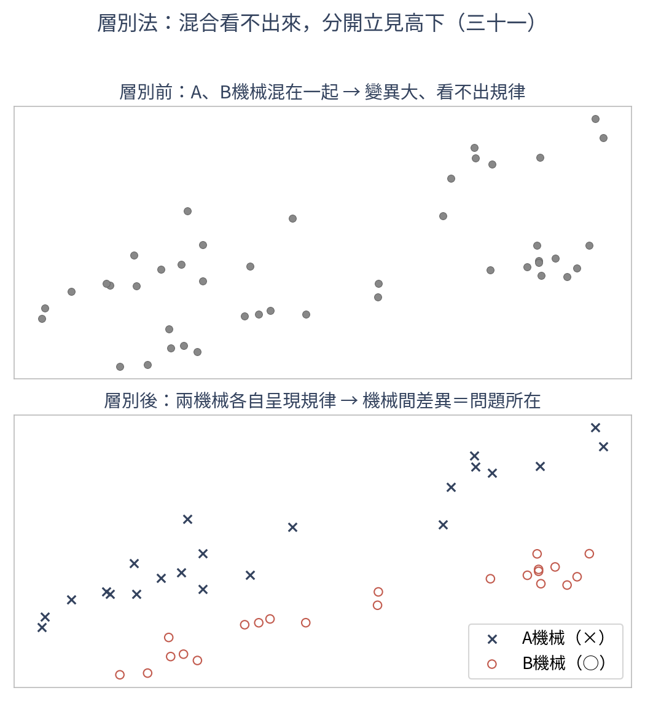

### 5. 圖表（7.4）

「圖」＝以點線面體表示數據；「表」＝數據作縱橫行列的系統安排。**主題標示位置：圖在下方、表在上方**。刻度要等距、刻度線標內側、數值一般取 3 位數。

**圖表總論（課本 P228~229）**：使用目的 4 種＝**解析用／管理用／說明用／記錄用**；好處＝一目瞭然、引起興趣、節省時間、便於比較與分析。

**甘特圖製作 5 步（課本 P234~235）**：①擬定管制項目 → ②決定全期期限 → ③細虛線畫**預定** → ④分配責任者 → ⑤粗實線畫**實際**進度。
**雷達圖製作步驟（課本 P236）**：畫適當大小的圓 → 按項目數等分、畫軸線 → 定刻度 → 各軸打點 → 連結成多邊形 → 比較分析（課本 P237 表7.4-1 自我評價表＝改善前後兩多邊形對照的計算例）。

| 圖種 | 別名／定義 | 必考規則 |
|---|---|---|
| 長條圖 | 柱形圖、棒圖：比較兩筆以上資料大小 | **縱軸必以 0 為基準**；刻度須涵蓋全部數據、不可截斷；刻度 5~10 個；縱橫比 1:1 或 1:2；**棒寬 ≧ 棒間**（比例 1:1 或 1:1/2） |
| 圓形圖 | 扇形圖：各項目佔全體的百分比 | **12 點鐘方向為起點、順時針、由大而小**；「其他」排最後；有指定順序者（如滿意度等級）依其順序 |
| 推移圖 | 歷史線圖、折線圖：隨時間變動的趨勢 | **縱軸不一定要以 0 為基準**（可放大區間看趨勢），但刻度仍須涵蓋全部數據 |
| 活動計畫表 | 甘特圖、進度圖 | **預定線＝細虛線；實際線＝粗實線**；預定與實際有差異時備註說明即可 |
| 雷達圖 | 依項目數畫等角度軸線，看**各項目間平衡度** | 一般**目標值在外側、實際達成在內側**；品管圈活動常以**改善前在內側、改善後在外側**比較 |

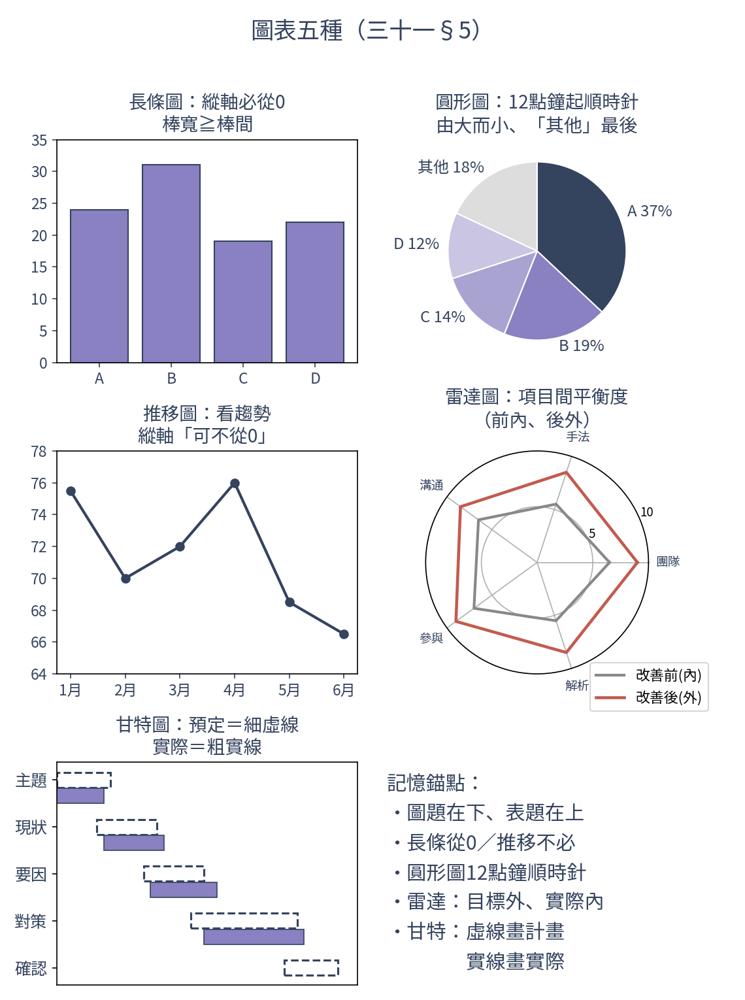

> ⚠️ **對比必考：長條圖 vs 推移圖的縱軸**
>
> - 長條圖：縱軸**必須從 0** 開始（比的是「量的大小」，從 20 起跳會誇大差異）。
> - 推移圖：縱軸**可不從 0** 開始（看的是「趨勢變化」，可取 60~76 區間放大變化）。
> - 兩者共同鐵則：刻度必須涵蓋所有數據，不可用截斷符號硬塞。

---

## 三十二、查檢表（檢核表）（課本 7.5）

### 1. 定義與目的

用簡單易於記錄的**表格或圖形**，使記錄者依規定作查檢記號或數據，即時瞭解狀況並統計整理的工具。

**使用目的（3 項）**：

- **日常管理**：點檢作業準備、設備安全、標準遵守。
- **特別調查**：設計層別項目收集數據。
- **取得記錄**：供報告、統計分析。

### 2. 兩大類型 ⭐必考

| | 防止不小心失誤的查檢表（**點檢用**） | 收集數據資料的查檢表（**記錄用**） |
|---|---|---|
| 功用 | 確認作業實施、設備狀況；防止遺漏疏忽 | 調查不良項目、不良主因、工程分布、缺點位置 |
| 記錄符號 | **○、×、✓** | **正字或劃記（⧻）** |
| 表格結構 | 縱欄＝檢查項目（按點檢順序列出）、橫欄＝時間 | 同左；統計後可作圖（**推移圖、柏拉圖**） |
| 例 | 上班出門前查檢、汽車駕駛前點檢 | 鑄造不良檢核表、部品不良種類劃記 |

> ⚠️ **判斷關鍵**：問「哪類查檢表用○×✓」→ 點檢用（防失誤）；「哪類用正字劃記」→ 記錄用（收數據）。

### 3. 製作步驟與要領

製作步驟：①確立點檢目的 → ②依 **5W1H** 設定記載項目 → ③縱欄列檢查項目、橫欄為時間 → ④依時間順序逐項檢查 → ⑤以符號記錄（點檢用○×✓；記錄用正字）→ ⑥（記錄用）整理統計後作圖。

製作要領：

- 檢查項目要先**層別分類**、有系統排列。
- 縱、橫向都要有**合計欄**（每日統計供**推移圖**用；項目統計供**柏拉圖**用）。
- 初期可**留幾個空欄**備臨時新增項目。
- **原因和結果之項目不可混在一起**；項目間判斷基準避免重疊。

注意事項（課本 P239 共 7 項）：①**忠於項目查檢，不可遺漏** ②充分瞭解**判定基準** ③以**當場記錄**為原則 ④**全員瞭解**用法並施以在職訓練 ⑤異常即時反應處理 ⑥結果讓相關人員瞭解 ⑦採取**防止再發**之處置。

### 4. 管制項目的來源（與魚骨圖串聯）

- 從魚骨圖的**小要因**取管制項目 → **原因檢核**。
- 小要因太多或原因不明時，用**大要因（分類項目）** → **結果檢核**。

---

## 三十三、柏拉圖（課本 7.6）⭐必考

### 1. 定義

以項目別分類數據、**按大小順序排列**的圖，可看出「**哪一項目是重大問題**」及「**其影響程度如何**」。原理：80% 的問題僅來源於 20% 的主要原因（由來見三十章§2）。

### 2. 使用目的（4 項）

①**找出真正問題點**（項目雖多，影響大的只有 2~3 項）②**從結果到原因**（先做「結果分類」柏拉圖把握問題點，再做「**原因別**柏拉圖」以採取對策）③整理報告或記錄 ④**確認改善效果**（改善前後兩張並排）。

- 可整理成柏拉圖的數據四大類：**品質**（不良數、損失金額、抱怨件數）、**時間**（作業時間、故障時間）、**成本**（單價、時間成本）、**安全**（災害件數）。
- 柏拉圖符號：**n＝檢查總數、pn＝不良總件數、p＝不良率**（例：n=7251、pn=111、p=1.53%）。
- **應用範圍（講義 8 項）**：時間管理、安全、士氣、不良率、成本、營業額、醫療、品質——搭配 **ABC 法**：A 類（累積約 70~80%）重點管理（如時間管理）、B 類（~90%）次之（如倉務管理）、C 類其餘。

### 3. 製作步驟（6 步）與樹脂部品例

①決定調查事項收集數據（期間約一週~一季）→ ②整理數據：**依大小排序、「其他」排最後、項目 5~7 個為原則**，求累積數、比率、累積比率 → ③繪柱狀圖（橫軸項目由左至右遞減、**縱橫比例 1:1**）→ ④繪累積曲線（各柱右上角累計點折線連接）→ ⑤繪累積比率線（右端縱軸終點 100%、0~100% **10 等分**刻度）→ ⑥記入必要事項（**N 與工程名記縱軸右上方；期間、作成者記橫軸右下方**）。

樹脂部品外觀不良例（N=137）：

| No. | 不良項目 | 不良數 | 累積數 | 比率% | 累積比率% |
|---|---|---|---|---|---|
| 1 | 無光澤 | 56 | 56 | 40.8 | 40.8 |
| 2 | 異物 | 38 | 94 | 27.7 | 68.5 |
| 3 | 氣泡 | 15 | 109 | 10.9 | 79.4 |
| 4 | 擦傷 | 10 | 119 | 7.3 | 86.7 |
| 5 | 脹大 | 8 | 127 | 5.8 | 92.5 |
| 6 | 髒污 | 4 | 131 | 2.9 | 95.4 |
| 7 | 其他（4項合併） | 6 | 137 | 4.6 | 100 |

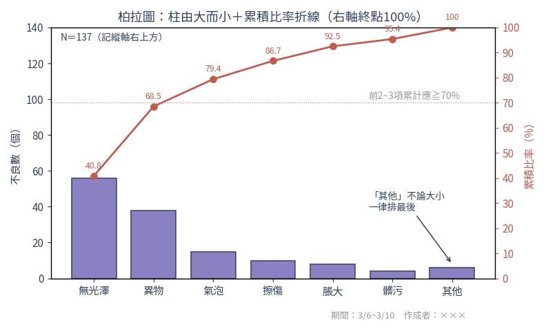

### 4. 製作要領與注意事項 ⭐

> ⚠️ **柏拉圖鐵則（每一條都考過類似觀念）**
>
> - 「**其他**」項一律排**最右端**——即使其數值比前面某些項目大。
> - 前 2~3 項累計影響度應在 **70% 以上**（講義）；目標設定取累積比率 **60~100%** 之間的重要項目。
> - 縱軸**盡量用金額**表示（找出影響成本最大的項目）。
> - **改善前後比較：兩張圖縱軸刻度要一致**才能比。
> - 圖形要約略**正方形**，不要狹長。

**縱軸單位改變 → 順位改變**（必考例）：同一批數據——

| 縱軸 | 第一位 | 數值 |
|---|---|---|
| 不良數 | 材料不良 | 48 個 |
| 損失金額 | **尺寸不合** | 32 個 × 100 元 = 3,200 元 |

（材料不良 48 個 × 20 元僅 960 元，退居第三。）→ 用「不良數」與用「損失金額」畫出的柏拉圖**不一定相同**。

### 5. 應用 ⭐計算會考

**(1) 目標設定（80/20 法則）**：

- **改善值 ＝ 現狀值 × 累積比率 × 改善能力**；**目標值 ＝ 現狀值 − 改善值**。
- 例：現狀 N=50 個，選 A、B 二項（累積比率 68%），改善能力 80% → 改善值 = 50 × 0.68 × 0.8 = **27.2** → 目標值 = 50 − 27.2 = **22.8**。
- fx-350MS：`50 × 0.68 × 0.8 =` → 27.2；`50 − 27.2 =` → 22.8。

**(2) 與其他手法串聯**：柏拉圖選出前 2 大項 → 各以**魚骨圖展開「要因」**；要展開「**對策**」則接**系統圖**。（展開要因＝魚骨圖；展開對策＝系統圖。）

**(3) 改善前後比較**：整體柱高下降的差＝「效果」；改善後項目順位可能改變。

### 6. 柏拉圖看法（可讀出什麼）

①最大的問題點 ②問題大小順位 ③各項目佔全體的份量 ④減少不良項目對全體效果的**預測** ⑤不良項目的內容變化。

---

## 三十四、特性要因圖（魚骨圖）（課本 7.7）⭐必考

### 1. 定義與別名 ⭐

將造成問題的要因逐次整理其**因果關係**，一目瞭然表示**結果（特性）受原因（要因）影響**情形的圖。

| 別名 | 由來 |
|---|---|
| 魚骨圖 | 圖形似魚骨（魚頭＝特性／結果，大骨＝要因） |
| 石川圖 | **1952 年日本石川馨（Ishikawa）博士**開發 |
| 因果圖／原因型魚骨圖 | 表示因果關係 |
| 對策型魚骨圖 | 尋找解決問題的對策方法（反轉型） |

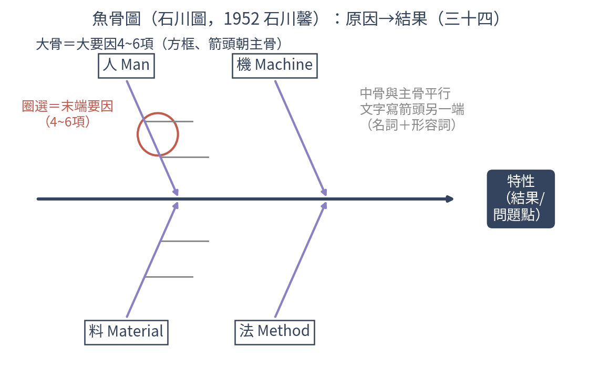

### 2. 使用目的（4 項）

**改善解決用**（現狀解析抓重點）、**製程管理用**（抱怨或不良異常時找原因、防止措施）、**制定標準用**（制訂／修改作業標準時列入消除變異的對策）、**品管教育用**（全員參與討論）。

### 3. 兩種製作法 ⭐

| | 大骨展開法 | 小骨集約法 |
|---|---|---|
| 順序 | 先設定**大要因分類**（4~6 項）→ 往下找中、小要因 | 先**腦力激盪**列出原因 → 分類整理集約（4~6 類） |
| 適用 | 對問題掌握**比較清楚**時 | 要**全員共同討論**瞭解時 |
| 共同後段 | 確認因果關係 → 找出主要原因 → 完成製作 | 同左 |

- 大要因（大骨）以**方框**表示、箭頭朝主骨；**中骨與主骨平行**；小骨朝向中骨。
- 腦力激盪（Brain Storming）原則：**嚴禁批評、自由奔放**。
- 4M1E 大骨展開＋5W1H 小骨集約思維；創造性思考法（希望點例舉、缺點列舉等）。

### 4. 大要因分類：4M（→4M1E→5M1E／6M）

| 大要因 | 內容 |
|---|---|
| 人（Man） | 素質、技術、經驗、態度 |
| 機（Machine） | 機器、維護、精密度、稼動率、治工具、量測儀器 |
| 料（Material） | 材料品質、數量、規格、儲存、運送 |
| 法（Method） | 作業方法、規定、標準、場所配置、安全、制度 |

＋環境（Environment）＝4M1E；＋量測（Measurement）＝5M1E；6M 詳見**十七章**（管制圖的 6M 同一套）。

### 5. 製作要領與注意事項 ⭐

> ⚠️ **魚骨圖鐵則**
>
> - 因果要明確，**不要倒因為果**（反覆質問「什麼原因造成這個結果」）。
> - 圈選主要原因以 **4~6 項**為宜（目標已設挑戰值時可視需要增減）。
> - 改善以**末端要因**為基礎 → **圈選要圈在末端要因上**。
> - 中、小要因文字要「**名詞＋形容詞**」表達明確（不要只有名詞的中性要因），寫在**箭頭的另一端**，不要寫在線上。
> - 五個以上小要因成一個中要因時，儘可能再分成兩個中要因。
> - 箭頭方向＝**由原因到結果**。

**真因驗證（四法）⭐**：①以魚骨圖要因收集數據做**柏拉圖** ②**三現原則**（到現場、看現場、瞭解現況）逐一確認 ③**實驗**方式確認 ④**經驗法則**評價表決（此法只能在改善案檢討及效果確認中證實）。

### 6. 原因型 vs 對策型（問題點反轉法）

| | 原因型 | 對策型 |
|---|---|---|
| 特性寫法 | **名詞＋形容詞**（例：交通阻塞） | **動詞＋名詞**（例：疏導交通） |
| 圖形 | 箭頭向右收斂指向特性 | 箭頭由特性向外展開 |

### 7. 與其他手法比較 ⭐

**魚骨圖 vs 柏拉圖**：

| 魚骨圖 | 柏拉圖 |
|---|---|
| 整理問題追查原因 | 整理問題追查原因（同） |
| 偏向**經驗**導向 | 注重**事實的數據** |
| 主要原因多靠工作**經驗法則** | 主要原因多靠**收集數據**證實 |
| 設計查檢表收集數據 | 以**日常報表**為根據 |

**魚骨圖 vs 系統圖**：兩者皆解析／解決問題；**魚骨圖用在「原因型」、系統圖用在「對策型」**；要因單純用魚骨圖、要因多而需系統整理可用系統圖（兩者可一一對應轉換、亦可串聯使用）。

---

## 三十五、直方圖（課本 7.8）⭐⭐計算必考

### 1. 定義與使用目的

就**次數分配表**，以各組**組界**為分界、**組距**為底邊、各組**次數**為高度繪成的矩形圖。目的：測知**製程能力**、分配中心（平均值）、分散範圍、與規格比較**計算不良率**、測知分配型態。收集數據一般 **50~200 個**。

### 2. 製作步驟與公式 ⭐（老師板書＋課本同一例）

| 步驟 | 公式 | 例（部品H動作時間，n=100，規格 81.00±2.55 → 78.45~83.55 ms） |
|---|---|---|
| ① 求 L、S | 最大值 L、最小值 S | L＝82.8、S＝77.5 |
| ② 組數 K | **K＝√n**（取整數） | K＝√100＝10 |
| ③ 組距 h | **h＝(L−S)/K**，修整為**測定單位的整數倍**（常取 5 或 2 的倍數） | (82.8−77.5)/10＝0.53 → 取 **0.5**（測定單位 0.1） |
| ④ 第一組下界 | **S −（最小測定單位/2）** | 77.5−0.05＝**77.45** |
| ⑤ 各組組界 | 下界＋h＝上界，逐組遞推 | 77.45~77.95、77.95~78.45、… |
| ⑥ 組中點 | **（組下界＋組上界）/2** | (77.45＋77.95)/2＝77.7 |
| ⑦ 次數表 | 劃記統計各組次數 | 見下表（實際做出 **11 組**） |

> ⚠️ **必考步驟陷阱**
>
> - 組距要**修整成測定單位的整數倍**（0.53→0.5），不能直接用 0.53。
> - 第一組下界＝**最小值 − 測定單位/2**（77.45），目的是避免數據剛好落在組界上。
> - K 算出 10 組，**實際可能做出 11 組**（本例即 11 組）——組數公式是「約略值」。
> - 組數另法（講義）：**Sturges 公式 K＝1＋3.32 log n**，一般 10 組左右；分組參照：n=50~100→6~10 組、100~250→7~14 組、250 以上→10~12 組。

次數表（n=100）：

| 組 | 組界 | 組中點 | 次數 |
|---|---|---|---|
| 1 | 77.45~77.95 | 77.7 | 2 |
| 2 | 77.95~78.45 | 78.2 | 3 |
| 3 | 78.45~78.95 | 78.7 | 6 |
| 4 | 78.95~79.45 | 79.2 | 11 |
| 5 | 79.45~79.95 | 79.7 | 19 |
| 6 | 79.95~80.45 | 80.2 | 22 |
| 7 | 80.45~80.95 | 80.7 | 17 |
| 8 | 80.95~81.45 | 81.2 | 9 |
| 9 | 81.45~81.95 | 81.7 | 7 |
| 10 | 81.95~82.45 | 82.2 | 3 |
| 11 | 82.45~82.95 | 82.7 | 1 |

### 3. 平均值與標準差：簡捷法（u 變換）

- **u＝(組中點 x − x₀)/h**，x₀＝次數最多那一組的組中點（u＝0）。（＝**五章§2** 的簡捷法，符號對應：x₀=A、h=C、u=d。）
- **X̄＝x₀＋(Σuf/Σf)×h**＝80.2＋(−8/100)×0.5＝**80.16**
- **S＝h×√[(Σu²f−(Σuf)²/n)÷(Σf−1)]**＝0.5×√[(404−64/100)/99]＝0.5×√(403.36/99)＝**1.01**
- 本例 Σuf＝−8、Σu²f＝404。
- ⚠️ 課本圖7.8.1（P271）直接標「S＝1.00」，與 P274 計算過程 1.01 不一致（1.00 是 ÷n 的算法）——以計算過程 **1.01**（÷(n−1)）為準，看課本圖時勿以為筆記有誤。
- 🖩 免簡捷法：fx-350MS SD 模式直接輸入「組中點×次數」——**按法詳見五章§4**；輸入本表 11 組即得 X̄＝80.16、S（xσn−1）≒1.01。

### 4. 分配型態判讀 ⭐（選擇題必考）

| 型態 | 圖形特徵 | 原因／處置 |
|---|---|---|
| 常態型 | 左右對稱鐘形 | 正常製程 |
| 鋸齒型（缺齒型） | 柱高交錯如鋸齒 | **作圖方法或數據收集（測定、換算）不正確**、分組不當 |
| 絕壁型（削壁型） | 靠一側如陡壁切斷 | **工程能力不足、為合乎規格實行全數檢驗**（剔除規格外）所常見；也用來**測知有無假數據** |
| 雙峰型 | 兩個峰 | **混入兩個不同群體**（兩機台、兩原料、兩操作員）→ 應**層別**後再作圖 |
| 離島型 | 主體外有孤立小島 | **測定錯誤、工程調節錯誤或使用不同原材**——必有異常原因，去除即可 |
| 高原型 | 頂部平坦 | **多個不同平均值的分配混合**在一起 |
| 偏態型 | 一側拖長尾 | 往往為**加工習慣**造成 |

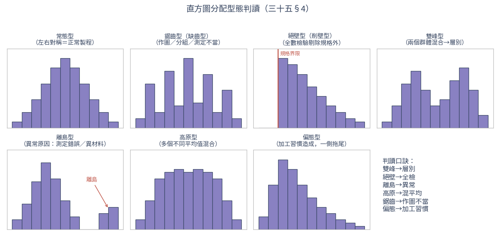

### 5. 直方圖之應用與規格比較

應用八項：測知製程能力／計算產品不合格率／**調查是否混入不同群體**（雙峰→層別）／**測知有無假數據**（絕壁）／設計管制界限／**測知分配型態**／藉以訂定規格界限／**與規格或標準值比較**。

- 與規格比較的判讀：**中心偏**向規格一側（偏高／偏低）→ 追查「**固定**」因素：**設備、機器、原料**；**兩邊超出**規格（分散過大）→ 追查「**變動**」因素：**人員、方法**。

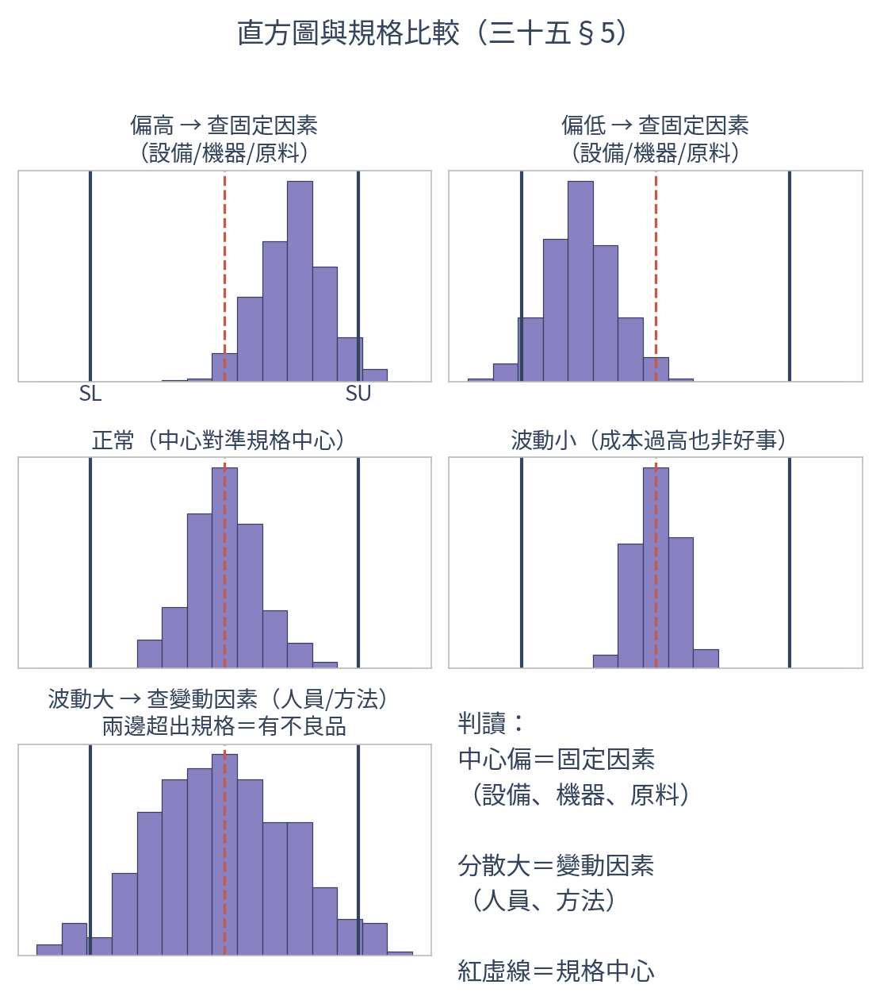

- 理想：平均數接近規格中心、標準差越小越好；但**分布遠窄於規格**＝花太多成本，也非好現象（能滿足顧客所需品質才是目標）。
- 不良率計算例：規格外 6 件／130 件＝**4.62%**。
- 用直方圖**訂規格**：若為常態分配，規格界限＝**平均數 ± 4×標準差**。
- 供應商層別判讀例（講義）：偏高→供應商C、偏低→供應商B、正常→供應商A；再看波動大小。

### 6. 製程能力指數（課本第 7 章版）

- 公式、單邊規格與等級處置 → 詳見**二十八章**（第 7 章課本以 K＝|Ca| 表示、Cpk＝(1−K)×Cp，同一套公式）。
- 本章例（承 §2~§3 直方圖例）：Su=83.55、SL=78.45、X̄=80.16、S=1.01 → Cp＝5.1/6.06＝**0.84**；K＝0.84/2.55＝**0.329**；Cpk＝0.671×0.84＝**0.56**。

> ⚠️ **分級切點多版並存**：第 7 章課本的 Cp 五級用 **0.67** 切點；管制圖課本與講義的 Cp 五級用 **0.83**；Cpk 課本 P271 只有三級（C＝＜1.0）。完整對照表見**二十八章§6**，依題目出處作答。

**製程能力調查步驟（4 步）**：

- ① 明確品質特性、收集數據。
- ② **先作管制圖，確認製程安定**（不安定時算出的能力指數沒有意義）。
- ③ 作直方圖、計算能力指數。
- ④ 判定並改善。

---

## 三十六、散佈圖（課本 7.9）

### 1. 定義

為研究**兩個變量間的相關性**，收集**成對**的二組數據（如溫度與濕度、燒入溫度與硬度），在座標上以點表示兩特性值間相關情形的圖形（有對應的散佈圖又稱**相關圖**）。

- 一種獨立數據 → 用**直方圖、柏拉圖**；二種相互關係的數據 → 用**散佈圖**。
- 可檢視的關係：要因對特性（因→果）、結果對結果、要因對要因。
- 是**特性要因圖的後續工作**——提供直觀的相關性驗證（驗證魚骨圖圈選的要因）。

### 2. 製作步驟 ⭐

- 收集對應數據**約 100 組、至少 30 組（30 對）以上**。
- **橫軸 x＝要因（原因）；縱軸 Y＝特性（結果）**；同為原因或同為結果時任取一軸。
- 刻度：x 範圍與 Y 範圍的寬度約略相等 → 圖面**近似正方形**；橫軸由左至右、縱軸由下至上、由小而大。
- 相同數據重複打點：二點重疊用◉、三點用◎。
- 記入：**n、期間記上方；製品名、工程名、作成者、日期記下方**。

### 3. 判讀型態 ⭐

| 型態 | 特徵 |
|---|---|
| 強正相關 | X 增大 Y 隨之增大，點密貼上升直線（相關係數近 +1） |
| 弱正相關（正相關不顯著） | 上升趨勢但點散開 |
| 強負相關 | X 增大 Y 反而減小，點密貼下降直線（近 −1） |
| 弱負相關（負相關不顯著） | 下降趨勢但點散開 |
| 曲線相關 | X 增大 Y 先增後減（倒 U 形）——直線相關係數看不出來 |
| 無相關 | 點呈圓形雲狀（相關係數＝0） |

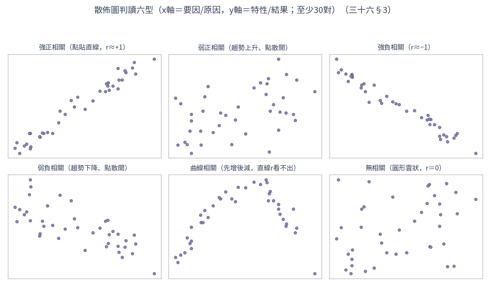

**判讀注意事項**：①注意有無**異常點** ②看是否有**層別**必要（混雜不同來源→整體看似無相關，層別後各群各自呈現相關）③是否為**假相關** ④勿依技術、經驗作直覺判斷 ⑤數據太少易誤判。

- **相關表**：對應數據很多時，做成縱(Y)×橫(x)的**次數分配表**（劃記），也是散佈圖的一種；次數集中於對角線 → 正相關。

### 4. 相關的檢定：符號檢定法（中位數法）⭐

現場簡易統計檢定法，步驟：

1. 作散佈圖（例 n=30）。
2. **縱分界線**：左右同數分開（n 奇數以中央點為界；偶數在中間分開）。
3. **橫分界線**：上下同數分開（同法）→ 分成四個象限。
4. 從**右上起「逆時針」**編號 (1)(2)(3)(4)，記各區點數。例：n(1)=12、n(2)=3、n(3)=12、n(4)=3。
5. **對角相加**：n(1)+n(3)＝24；n(2)+n(4)＝6；N＝30。
6. 查**符號檢定表**（課本表 7.9-5）：N=30 → α=0.01 判定數 7；α=0.05 判定數 9。

| 判定條件 | 結論 |
|---|---|
| 判定數 ＞ n(2)+n(4)（左上＋右下） | **正相關** |
| 判定數 ＞ n(1)+n(3)（右上＋左下） | **負相關** |

例：7＞6 且 9＞6 → **危險率 1% 有正相關**。

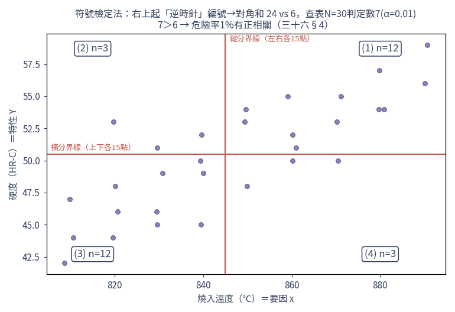

> ⚠️ **判斷關鍵**
>
> - 拿「**較少的那組對角和**」跟判定數比；「判定數比它**大**」才成立相關。
> - 右上＋左下（n1＋n3）多 ＝ **正**相關傾向。
> - 左上＋右下（n2＋n4）多 ＝ **負**相關傾向。

---

## 三十七、管制圖在七手法中的定位（課本 7.10；主體見十五~二十五章）

管制圖的完整內容已在**十五~二十五章**（歷史、種類、界限計算、判讀）。本章只補第 7 章（七手法脈絡）的考點與不同數字版本。

### 1. 七手法脈絡下的重點回顧

- 1924 年 **Shewhart** 發明（十五章）；管制界限用來判別**機遇原因（共同原因）vs 非機遇原因（特殊原因）**（十七章）。
- **3σ 法**：μ±3σ 含 99.7%，1000 個約 3 個誤判 → 危險率 0.3%＝**第一種錯誤（α）**（十八章）。
- 使用目的：**解析用＝先有數據、後有管制界限**（決定方針、製程解析、能力研究、管制準備）；**管制用＝先有管制界限、後有數據**（追查原因、消除、防止再發）——「先有誰」是常考陷阱（二十章）。
- 計量值圖：X̄–R、X̃–R（中位數免計算）、X–Rm、X̄–σ、L–S；計數值圖：P（n 不一定）、Pn（n 一定）、C（樣本大小一定的缺點數）、U（每單位缺點數，n 不一定）（二十一、二十二章）。
- P̄＝**總不良數 ÷ 總檢查數**（≠各批不良率的平均）；例：187/1250＝0.150，UCL＝0.150＋3√(0.15×0.85/50)＝0.302，LCL 為負 → 不考慮。
- Pn 圖例：P̄n＝68/25＝2.72；UCL＝2.72＋3√P̄n×√(1−P̄)＝2.72＋4.95×0.99＝7.62；**公式同時用 P̄n 與 P̄＝P̄n/n**（2.72/100＝0.0272），勿混淆。
- n≦6 時 D₃＝「−」→ R 圖 **LCL 不考慮**。

### 2. 課本第 7 章的判讀數字（QCC 版；與二十三章判異規則對照用）⭐

> ⚠️ **點恰好在管制界限線上 → 視為「超出界限外」**（常考陷阱）。

**解析過去數據時，可視為「管制狀態」的認定**：

| 條件 | 數字 |
|---|---|
| 連續點全在界限內 | **25 點**以上 |
| 連續 35 點中，超出界限 | **1 點以內** |
| 連續 100 點中，超出界限 | **2 點以內** |

**點連續出現於中心線一側（連串）**：

| 連續點數 | 處置 |
|---|---|
| 5 點 | **注意**工程的進行 |
| 6 點 | 開始**原因調查** |
| 7 點 | **有異常**，採取處理措施 |

**點多出現於中心線一側**：連續 11 點中至少 10 點／14 中 12／17 中 14／20 中 16 → 異常。

**上昇（下降）傾向**：連續 7 點上昇或下降 → 處理措施；實務上常未到 7 點就已超出界限，應在技術上設定「傾向」判斷基準。

- 與**二十三章**（課本管制圖篇 P155）的判異規則數字略有出入（如「連續 N 點」的門檻），考題出自哪本教材就用哪套；上表是**七手法章（QCC 教材）**的版本。

---

## 三十八、新QC七手法總覽（第七堂課）⭐

新QC七手法（品管新七大手法）＝**關連圖法、親和圖（KJ法）、系統圖法、矩陣圖法、矩陣數據解析法、PDPC法、箭線圖法**。課本第 8 章 P312~411。

### 1. 由來年表 ⭐（選擇題愛考「哪一年做什麼」）

| 年份 | 事件 |
|---|---|
| 1972 | 日本科技聯盟**整理**出七個新手法 |
| 1977 | 開始在企業中**推行**實施 |
| 1978 | **水野滋、近藤良夫**教授召開研討會**命名**「品管新七大手法」 |
| 1979 | 日本科技聯盟**正式公佈** |

- 記法：**72 整理 → 77 推行 → 78 命名 → 79 公佈**。

### 2. 七手法一覽（名稱＋英文＋一句話用途）

| 手法 | 英文 | 一句話用途 |
|---|---|---|
| 關連圖法 | Cause Effect（Relation Diagram） | 理清**複雜因素糾纏**的因果關係，找出源流主因 |
| 親和圖（KJ法） | Kawakita Jiro Chart | 從雜亂的**語言資料**中汲取資訊、使問題明確 |
| 系統圖法 | End-Means（Tree Diagram） | 系統地展開「**目的—手段**」，尋求實現目標的最適手段 |
| 矩陣圖法 | Matrix Diagram | **多角度（行×列）**考察問題、明確變數關係 |
| 矩陣數據解析法 | Factor Analysis | **多變數**化為**少變數**的數據解析（主成分分析） |
| PDPC法 | Process Decision Program Chart | **預測**過程中可能的**障礙**，事先備妥多重應變計劃 |
| 箭線圖法 | Arrow Diagram Method | 合理制定**進度計劃**（PERT／CPM 網圖） |

> ⚠️ **兩個「唯一」（必考）**
>
> - 新七手法中**唯一處理「數據（數值）資料」**的＝**矩陣數據解析法**（其他六個都是語言情報）——與舊七手法「唯一語言情報＝魚骨圖」（三十章）成對記。
> - 新七手法中**唯一偏「右腦／情念／感性」**的＝**KJ法**；其餘（關連圖、系統圖、箭線圖、矩陣圖、矩陣數據解析、PDPC）皆屬左腦理性分析。

### 3. 新舊七手法比較 ⭐⭐（最愛考的對比）

| | 品管七手法（舊） | 品管新七大手法 |
|---|---|---|
| 性質 | **理性面**（data） | **感性面**（文字） |
| 資料 | 大量的**數據**資料 | 大量的**語言**資料 |
| 時機 | **問題發生後**的改善 | **問題發生前**的計劃、構想 |
| 使用者 | 品質、工程的管理手法；解決**單純**問題 | **幕僚、管理階層**的手法；解決**複雜纏繞**問題 |
| PDCA | 主用於 D、C、A（現場改善） | 強化 **Plan（計畫）階段** |

- 兩者**並不取代、相輔相成**（考「新七手法取代舊七手法」→ 錯）。
- Plan 三階段定位：**Plan 1** 混沌事象整理、問題設定＝**KJ法（依情念）＋關連圖法（依論理）**；**Plan 2** 手段展開＝**系統圖法＋矩陣圖法**；**Plan 3** 依時序作實行計劃＝**箭線圖法（確定事象）＋PDPC法（不確定要素，隨時修正）**。

### 4. 新舊七手法一對一對照（課本 8.9.5）

| 原有手法 | 新手法 |
|---|---|
| 特性要因圖 | 關連圖法 |
| 柏拉圖 | KJ 法（親和圖） |
| 檢核表 | 系統圖法 |
| 直方圖 | 矩陣圖法 |
| 散佈圖 | 矩陣數據解析法 |
| 管制圖（圖表） | PDPC 法 |
| 層別法 | 箭線圖法 |

### 5. 圖形文字四系分類（課本表 8.9-2）⭐

| 圖形文字系 | 新QC手法 | 舊QC手法 |
|---|---|---|
| **領域系** | KJ 法 | — |
| **網圖系** | 關連圖、系統圖、箭線圖、PDPC | 特性要因圖 |
| **行列系** | 矩陣圖法 | 檢核表 |
| **座標系** | 矩陣數據解析法 | 柏拉圖、直方圖、散佈圖、管制圖、圖表 |

### 6. 新七手法與改善步驟（◎＝常用）

| 改善步驟 | 常用（◎） |
|---|---|
| 1 主題選定 | **關連圖、KJ法** |
| 3 活動計畫擬定 | **箭線圖** |
| 4 現狀把握 | 矩陣圖 |
| 5 要因分析 | **關連圖、KJ法、系統圖** |
| 6 對策擬定 | **系統圖、矩陣圖、PDPC** |
| 9 標準化 | 矩陣圖 |

- 「效果確認」整列空白 → 用**舊七手法**（管制圖、柏拉圖）確認。

---

## 三十九、關連圖法與親和圖（KJ法）（課本 8.2~8.3）

### 1. 關連圖法

**定義**：把關係複雜、相互糾纏的問題及其因素，用**箭線**連接（原因→結果；目的←手段），找出主要因素的方法。60 年代由日本應慶大學**千住鎮雄**教授開發，正式全名《管理指標間的關聯分析》。

- 卡片用語（與魚骨圖同規則）：**原因型＝名詞＋形容詞；對策型＝動詞＋名詞**。
- 原因查找從 **4M1E**（人機料法環）考慮。
- 類型：多目的型／單目的型／**中央集中型**（問題點置中央、要因由近而遠）／**單向匯集型**（問題點置左右側、逐層順延）／**關係表示型**（無中心問題點，適用活動推行說明）／應用型（與系統圖、矩陣圖聯用）。
- **三角大富翁法（Design Sugoroku）**：關連圖的一種，主題置中央＋**3 個極**展開，又稱**強制思考法**。

> ⚠️ **關連圖判別法（最常考的判讀規則）**
>
> | 箭頭狀態 | 判定 |
> |---|---|
> | 箭頭**只進不出** | 是**問題**（結果） |
> | 箭頭**只出不進** | 是**主因** |
> | 有進有出 | 中間因素 |
> | **出多於進**的中間因素 | **關鍵中間因素**（也要當主因對待） |

> ⚠️ **關連圖 vs 魚骨圖**（老師上課特別強調的差異）
>
> | 關連圖 | 魚骨圖（特性要因圖） |
> |---|---|
> | **原因與原因可以互相連結** | 單向關連 |
> | 不受圖形限制、視野廣闊 | 有形式拘束 |
> | 可**打破先入為主觀念**（客觀） | 課本 P322 原文：特性要因圖是「**主觀的**」 |
>
> 補充（課本 P323~324）：關連圖陷入阻塞時，用「**為何、為何**」的問答繼續展開；因果相連成**循環**時，要考慮**從哪裡切斷**再選出主因。

### 2. 親和圖（KJ法）

**定義**：從混沌狀態收集**語言資料**，依相互**親和性**（相近性）歸納整理，使問題明確化的方法。日本**筑波大學**人類文化學者**川喜田二郎（Kawakita Jiro）**在**喜馬拉雅山**調查土著文化時開發（課本 P331 原文；「1953 年、尼泊爾」為講義補充說法，年份地點勿寫死），稱「**野外科學**」（亦稱**現場科學**），以其姓名字首命名 KJ 法。

| 考點 | 內容 |
|---|---|
| 個人 vs 團隊 | **個人**親和圖→重點在**資料的組織**；**團隊**親和圖→重點在**策略方針** |
| TKJ 法 | **牌式 KJ 法**＝小組活動手法（KJ 法原為個人手法）；理想人數 **6~7 人**、每人填卡 **6~7 張**、全組共 **40~50 張**，由 360° 觀點提意見（課本 8.3.9，13 步驟） |
| 特性 | 打破現狀產生新思想；**每個人的意見都採納**；按**相似性分類** |
| 禁忌 | **不適應速戰速決**的問題和簡單的問題；**不應與其他 QC 手法一起用** |

**圖解步驟與顏色體系** ⭐：卡片（**黑字**寫原始意見，簡潔短句）→ 聚小群（**1 群約 2~3 張**，4 張勉強；無法歸類者＝「單卡」）→ 小群標籤用**紅字** → 聚中群、標籤用**藍字** → 編大群、標籤用**黑字** → 聚至 **5~10 群** → 圖解（貼模造紙、描輪廓線）→ 文章化口述 → 評價（**投票**計分，最重要 5 分）→ 領會。

- 記法：**標籤紅→藍→黑（小→中→大）**；單卡在左上角依階段累加紅／藍／黑記號。
- KJ 法**不是分類法**：不要以文句共同性「先粗分再細分」，而是以情念親和性聚集。

**關係線記號**（KJ 圖解用，常考記號題）：

| 記號 | 意義 |
|---|---|
| ＝ | 相同 |
| ―（實線） | 有關係 |
| ----（虛線） | 多少有關係 |
| → | 因果關係 |
| ←→ | 互相干涉 |
| >―<（對向箭頭） | 對立關係 |

**比較表**（考試常考）：

| 關連圖法 | KJ 法 |
|---|---|
| 知性、理性、分析性、語言性 | 情念、可親性、總合性、非語言性 |
| 用於**已知**事項 | 用於**未知模糊**事項 |
| 用於複雜**纏繞**事項 | 用於**混沌**事項 |
| 演繹法 | 親和性、發想的 |

| 統計方法（SQC） | KJ 法 |
|---|---|
| **假說檢定型** | **問題發現型** |
| 現象數量化（數值資料） | 現象非數量化（語言資料） |
| 分析性、分層別類 | 綜合性、異中求同 |
| 理性的把握 | 感情的親和 |
| **歐美**思考手法 | **東方**思考手法 |

- 經典例：「交期不準」——18 條語言資料依親和性歸成 6 組（品質不合／缺能源／機器故障／工作效率低／原料管理差／生產計畫不周）。

---

## 四十、系統圖法與矩陣圖法（含矩陣數據解析法）（課本 8.4~8.6）

### 1. 系統圖法

**定義**：把要實現的**目的**與需要採取的**手段**系統地展開繪圖，尋找最適手段的方法（樹狀展開；上一級手段成為下一級的目的）。

| 兩型 | 展開關係 | 說明 |
|---|---|---|
| **對策型** | **目的—手段** | 最常用；7 步驟：設定目的→擬出手段（BS 越多越好）→評價可行性→作卡片→**手段展開**（質問1「要達成目的用什麼手段？」、質問2「以手段為目的再用什麼手段？」）→**確認目的**（質問3 由最下位反向確認）→實施計畫（訂進度、責任人→接**甘特圖**）。⚠️講義 P90 把「手段展開」排在「作卡片」之前——排序題出現兩版時，依題目出處作答 |
| **原因型** | **結果—原因** | 以因果關係系統展開，明確問題重點 |

- 用途：設計品質展開、品質保證計劃（保證品質系統圖：要求品質→設計品質→工程管理項目）、**與特性要因圖結合**、可應用 **5WHY**、方針目標展開、部門職能明確化。
- 類型：**結構因素展開型**（目的→手段逐級鏈狀）／**方法展開型**（樹狀分解）。
- 應用手法三種 ⭐：**關連樹木法**（relevance tree）、**FTA**（fault tree analysis，失誤樹——應用於系統**信賴性**解析與評價）、**逆 PERT**（新製品開發徑路明確化）。（⚠️講義 P91 印成「FAT」為印刷誤植，正確縮寫是 **FTA**。）
- 選用判斷 ⭐：手段／原因可「**一元性展開**」→ 系統圖；目的／結果有二種以上要「**多元性展開**」→ 矩陣圖。

**KJ 法 vs 系統圖法**（課本 8.4.6，考過類似對比）：

| KJ 法 | 系統圖法 |
|---|---|
| 情念的、異質的組合 | 理性的、演繹的、同質的組合 |
| **立體**的 | **平面**的 |
| **茫然**的問題可應用 | 問題要**稍有明確性** |
| 需要**長時間**（夜型） | **短時間**可完成（晝型） |
| 尋找問題本質、把握完全 | 問題的系統關連、有時限於表面 |

### 2. 矩陣圖法

**定義**：把事象要素配置成**行與列**，由**交點**表示關連（或關連深度），經多元性思考明確問題點、從交點得到解決構想的方法。

**五種型式** ⭐（最愛考「幾個元素用哪型」）：

| 型式 | 元素數 | 結構 |
|---|---|---|
| **L 型** | 2 元素（A×B） | 基本二維表 |
| **T 型** | 3 元素 | 共用軸 A 上下接 B、C（A×B＋A×C 兩個 L 型） |
| **Y 型** | 3 元素 | 三軸**立體**，A×B、B×C、C×A 三面 |
| **X 型** | 4 元素 | 十字四軸，相鄰兩兩成面（A×B、B×C、C×D、D×A） |
| **C 型** | 3 元素 | **立方體**，交點表 A、B、C **三要素同時**關連 |

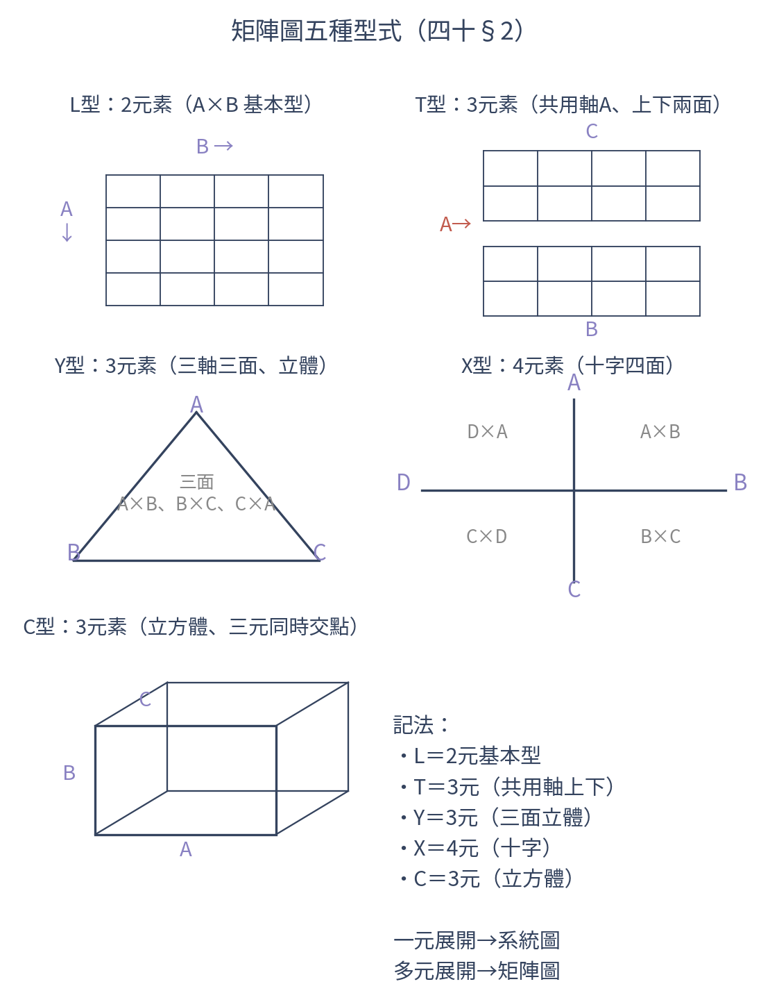

- 用途：品質保證責任表（部門×責任，◯直接 v連帶 △有關係）、不良原因追求（T 型：現象—原因—工程）、**要求品質展開表**（要求品質×代用特性＝QFD 品質表雛形；可作抱怨查核／比較他廠／自製品種間比較）。
- 其他應用：**形態分析法**（2 變數→L 型、3 變數→C 型）、**決策矩陣**、PESIC 管理體系化。

> ⚠️ **矩陣圖注意事項（考試陷阱）**：評價「有無關聯」時要**獲得全體參與者的同意**，不可按**多數決**通過。

### 3. 矩陣數據解析法

- 定義：矩陣圖交點的關連能**定量化**（數據）時，經計算簡潔整理的方法＝**新QC七手法中唯一的數據解析法**（結果仍用圖表示）。
- 核心＝**主成分分析法**（多變量解析法之一）：把**多個變數**化為**少數綜合變數**（主成分）；計算上由**相關係數行列**求出**固有值、固有向量**，需運用電腦。
- 步驟：收集資料 → 求相關係數 r → 電腦求固有值/固有向量 → 作矩陣圖 → 下判斷。
- 老師板書例：10 個變數（溫度、壓力、精度、速度…）縮減成 3 個主成分（PC1、PC2、PC3）並命名解釋。
- 加權計算例（講義）：影響程度＝各交點關聯分數 × 該輸出因素重要度（Rank），加總後化成百分比排序。
- 課本例：40 種布用途 × 25 項要求品質矩陣 → 取第 1、2 主成分繪散佈圖 → 新製品 A 布落點靠近「裙、褲」→ 適合外衣類。判讀：**主成分圖上距離近＝性質相似**。

---

## 四十一、PDPC法與箭線圖法（課本 8.7~8.8）⭐箭線圖計算會考

### 1. PDPC法（過程決定計畫圖法）

**定義**：**事前預測**過程中可能出現的障礙和結果，相應提出**多種應變計劃**，且在進展中**隨時修正**，將過程導向期望結果的方法。日本**近藤次郎**博士在東大紛爭（1968~1969）時剖析事件前途所發展（手寫重點：「風險應變」）。

| 分類 | 內容 |
|---|---|
| 運用二大類 | **事故預測**／**目標達成** |
| 展開二型 | **逐次展開型**／**強制連結型** |

- **逐次展開型**：從現狀 A₀ **順推**各中途事象 Aᵢ 到各種最後狀態 Bᵢ，並附**發生或然率**；不容壞狀態 Bₚ 發生時，切斷通往它的事象連鎖、誘導到好徑路。（事例：鐵路落石→出軌事故的安全檢討、產品開發瑕疵處理。）
- **強制連結型**：先假定最後狀態 B，**由 B 逆溯** A₀ 找中間事象連鎖；展開時特別注意**非線型要素、「人的舉動」**。（事例：出口貨箱防倒置——課本 P389 用**酒杯圖示＋標記警語**；講義 P114 四分支＝①中英文對照標示→安全卸運 ②不懂英文→**圖畫（酒杯）表示** ③看不懂圖→**頂端安裝掛鉤** ④不看標示→**預警裝置出聲**。）

**PDPC 作法 7 步（課本 P386）**：①召開討論會 → ②提出檢討事項 → ③預測結果 → ④檢討事項分類 → ⑤決定優先順序 → ⑥決定實施部門 → ⑦**定期檢討修正**（PDPC 的精神＝計畫要隨事態進展隨時改）。
- 注意：發生預期外事態要**迅速修改 PDPC**（最初的 PDPC 為查核基準）；避免與系統圖、網狀圖（箭線圖）、關連圖混淆。

### 2. 箭線圖法（PERT／CPM）

**定義**：把計畫必要的各作業依**從屬關係**連接構成**作業網**，擬定最適日程計畫、有效管理進度的方法。表示 **PERT**（計劃評核術）或 **CPM**（要徑法）的日程計畫圖；1957 年美國**杜邦公司**首先推出（講義）。

**圖示記號** ⭐：

| 記號 | 名稱 | 意義 |
|---|---|---|
| ○ | 結點 | 作業的始點和終點（編號 **i＜j**，正整數） |
| →（實線） | 作業 | **需要時間**的作業 |
| ⇢（虛線） | **虛業（dummy）** | 表示作業互相關係，**不需要任何時間** |

**作圖規則**：

- 兩結點間不可同時有多條作業（用**虛業**分開）。
- **不用不必要的虛業**（課本規則(7)，圖8.8-9：兩個虛業可省成一個就省）；結點編號由左向右遞增、**i＜j**（規則(8)）。
- 同一作業只能畫一次。
- **不得有迴路**；順序由左向右。
- 「有結束才有開始」；考慮平行作業。

> ⚠️ **虛業經典考法（課本圖8.8-6 代號）**：C 的先行作業是 A、B，而 D 只需 B → B 完成的結點用**虛業**連到 C 的起點（①→A→④→C；②→B→③，③⇢虛業→④）。若考題直接引用課本圖8.8-6，記這組 A/B/C/D 代號。

**日程計算** ⭐⭐（計算必考）：

| 項目 | 公式 | 口訣 |
|---|---|---|
| 最早結點日程 tᴱ | 起點 tᴱ=0；tⱼᴱ＝tᵢᴱ＋Dᵢⱼ；多條匯入取 **max** | **順推取大** |
| 最遲結點日程 tᴸ | 終點 tᴸ＝tᴱ；tᵢᴸ＝tⱼᴸ−Dᵢⱼ；多條分出取 **min** | **逆推取小** |
| 要徑（Critical Path） | 起點到終點的**最長徑路**＝ **tᴱ＝tᴸ** 的結點連線（用粗線） | 浮時＝0 |

- 課本計算例（圖 8.8-13）：A(①→②)=5、B(②→③)=3、C(②→④)=9、D(②→⑤)=10、E(③→⑤)=4、虛業(④→⑤)、F(④→⑥)=4、G(⑤→⑥)=5 → ⑤的 tᴱ=max{8+4, 5+10, 14+0}=15 → 要徑＝**A–D–G＝5+10+5＝20**。

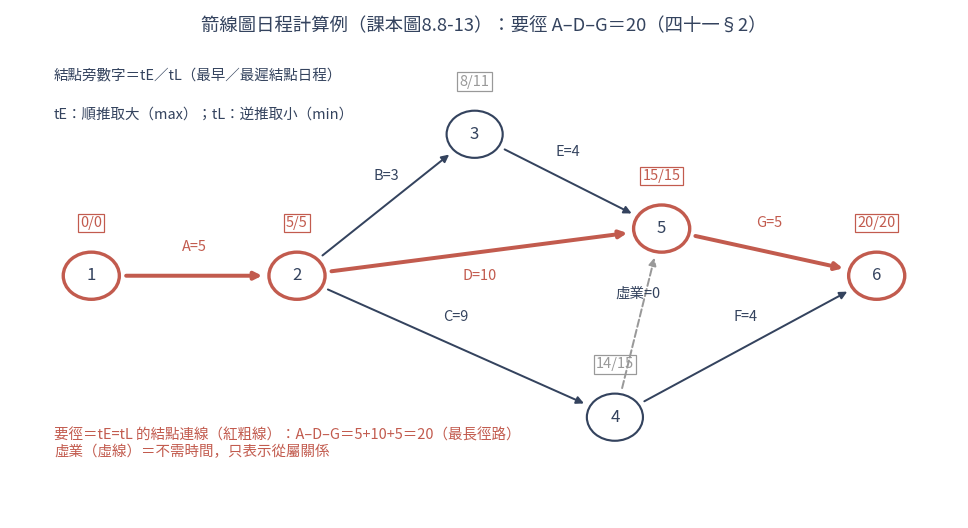

- 老師板書（節點時間法）：**ES／EF＝順推；LS／LF＝後推法（由終點 LF 逆推 LS=LF−DU）；浮時 Float＝LS−ES（或 LF−EF）；Float＝0 者＝要徑活動**。板書例：A(6)、C(9)、F(8) 浮時 0 → 要徑 A–C–F＝23。
- 講義小例：管件（A 加工管子 30 分）與盤件（B 加工盤體 20 分→C 鑽孔 25 分）平行，最後 D 焊接 15 分 → 要徑 B–C–D＝60 分。
- 施工演練：A 基礎(2)→B 骨架(4)→C 建具(3)→J 內壁粉刷(2)→K 驗收(1)＝**12 個月**為要徑。
- fx-350MS：要徑計算就是「各路徑時間加總比大小」，如 `5 + 10 + 5 =`＝20 vs `5 + 3 + 4 + 5 =`＝17 vs `5 + 9 + 4 =`＝18 → 取最大 20。

**縮短日程**：一律從**要徑（CP）上日數長的作業**下手檢討；縮短後要重算（要徑可能改變），並評估投資是否值得。

**甘特圖 vs 箭線圖** ⭐：甘特圖簡單易看進度，但**作業間從屬關係與遲延影響不明確**；箭線圖能表現**從屬關係與要徑**、部分作業遲延對全體的影響可迅速量化。（甘特圖畫法見三十一章。）

---

*（待續：後續講義內容會依上傳陸續補充）*
