# 統計品管 — 考試速查筆記

---

## ⓪ 考前必看：工程計算機設定（Casio fx-350MS）

### 進入統計模式（SD 模式）＋清除舊資料

| 步驟 | 按法 | 畫面 |
|---|---|---|
| 一：進入統計模式 | **MODE → 選 SD → 按 2** | COMP(1) / SD(2) / REG(3) |
| 二：清除舊資料 | **SHIFT → MODE → 選 Scl → 按 1 → = → AC** | 出現 Stat clear |

> ⚠️ 每次計算新一組資料前都要 Stat Clear，避免舊數據混入！

### 考完／算完恢復正常模式 ⚠️

| 步驟 | 按法 |
|---|---|
| 恢復一般計算模式 | **MODE 連按 3 次 → 選 Norm 按 3 → Norm 1~2? 選擇** |

> 統計算完記得切回正常狀態模式，否則一般計算會出錯！

---

## ⓪-2 符號速查表

### 統計符號

| 符號 | 唸法 | 意義 | 備註 |
|---|---|---|---|
| N | — | **群體**大小 | 大寫 = 群體 |
| n | — | **樣本**大小 | 小寫 = 樣本 |
| X̄ | X bar | 平均數 | ΣX/n |
| σ | sigma（小寫） | **群體**標準差 | 分母 ÷ n；是一個**數值** |
| σ² | sigma 平方 | **群體**變異數 | 分母 ÷ n |
| **S** | — | **樣本**（估計）標準差 | 分母 ÷ (n−1)；英文字母給樣本、希臘字母給群體 |
| S²、V | — | **樣本**（不偏）變異數 | 分母 ÷ (n−1) |
| **SS** | — | **平方和** Sum of Square | = Σx² − (Σx)²/n；兩個字母，跟標準差 S 無關！ |
| Σ | sigma（大寫） | 總和**運算** | ΣX = 全部加起來；**後面一定接東西**（ΣX、Σfx），σ 則單獨出現是數值 |
| Q1/Q2/Q3 | — | 四分位數 | Q2 = 中位數 |
| R | — | 全距 Range | Max − Min |
| CV | — | 變異係數 | 標準差 ÷ 平均數 |

### 機率與集合符號

| 符號 | 唸法 | 意義 | 備註 |
|---|---|---|---|
| **S**、Ω | 樣本空間／omega | 所有可能出象的**全體** | P(S)=1；文氏圖的大矩形；集合論寫 Ω、機率寫 S，同一個東西 |
| Φ | phi | **空集合**（無元素） | P(Φ)=0；互斥 = A∩B=Φ |
| ∈ / ∉ | 屬於／不屬於 | 元素與集合的關係 | 1∈{0,1}、2∉{0,1} |
| ⊂ | 含於 | A⊂B：A 是 B 的子集 | — |
| ∪ | 聯集（或） | A∪B：屬於 A **或** B | 加法定理 |
| ∩ | 交集（且） | A∩B：**同時**屬於 A 和 B | 可簡寫 AB；乘法定理 |
| A′ | A 補／餘集 | **不屬於** A 的部分 | P(A′) = 1−P(A) |
| A−B | A 去 B | 在 A 但不在 B | = A∩B′ |
| P(A) | — | 事件 A 的機率 | 邊際機率 |
| P(A∩B) | — | A、B **同時**發生 | 聯合機率 |
| P(A\|B) | A given B | **已知 B 發生**下 A 的機率 | 條件機率 = P(A∩B)/P(B)；直線後面是「已知」 |
| ₙPₘ | — | 排列（考慮順序） | n!/(n−m)! |
| ₙCₘ | — | 組合（不考慮順序） | n!/[m!(n−m)!] |
| ! | 階乘 | n! = n×(n−1)×…×1 | 0! = 1 |

### 計算機螢幕符號（fx-350MS）

| 螢幕顯示 | 意義 | 出現位置 | 對應筆記符號 |
|---|---|---|---|
| COMP / SD / REG | 一般計算／**統計**／迴歸 模式 | 按 MODE 後的選單（統計選 **SD 按 2**） | — |
| Scl → Stat clear | 清除統計舊資料 | SHIFT → MODE → 1 | — |
| n | 已輸入的資料筆數 | 每按一次 M+ 後顯示 | 樣本大小 n |
| x̄ | 平均值 | SHIFT → 2 → **選 1** | X̄ |
| **xσn** | **群體**標準差（÷n） | SHIFT → 2 → **選 2** | σ |
| **xσn−1** | **樣本**標準差（÷(n−1)） | SHIFT → 2 → **選 3** | S |
| Σx² | 所有資料平方的總和 | SHIFT → 1 → 選 1 | Σx²（算 SS 用） |
| Σx | 所有資料的總和 | SHIFT → 1 → 選 2 | ΣX |
| Ans | 上一個計算結果 | 按 Ans 鍵叫出 | 求變異數：Ans → x² → = |
| ; （分號） | 分組輸入的「組中點**；**次數」分隔 | SHIFT → 逗號鍵 | 分組資料輸入 |
| M+ | 輸入一筆統計資料 | 每筆資料按一次 | — |
| nCr / nPr | 組合／排列 | nCr 直接按；nPr 要 **SHIFT**＋nCr | ₙCₘ／ₙPₘ |
| **^**（xʸ） | **次方**（乘冪） | 底數 → **^** → 指數 → =（例：0.95 → ^ → 18 → = ≈ 0.3972） | pˣ、(1−p)ⁿ⁻ˣ |
| Norm | 一般顯示模式 | MODE 連按 3 次 → Norm（考完恢復用） | — |

> 記法（跟公式表完全對應）：
>
> - 螢幕 **σn** 結尾 = 除以 n = **群體**
> - 螢幕 **σn−1** 結尾 = 除以 n−1 = **樣本**

---

## 一、數據的搜集與整理

### 1. 資料分類總覽

| 分類方式 | 內容 |
|---|---|
| 三大類 | **文字資料**(語言資料)、**屬性資料**、**屬量資料** |
| 統計資料 | 屬性資料(資料的性質) + 屬量資料(數字、數據) |
| 屬量資料再分 | **計數值**(間斷資料)、**計量值**(連續資料，有小數點) |
| 依來源區分 | 原材料及製品市場、製程資料、檢驗資料 |
| 依時間區分 | 過去資料、日常資料、新資料 |

### 2. 離散型（計數值）vs 連續型（計量值）⭐必考

**判斷關鍵：這個數值是「用數的」還是「用量的」？**

| 類型 | 別名 | 判斷 | 特徵 | 例子 |
|---|---|---|---|---|
| 離散型 | 計數值、間斷資料 | **用數的**（可數） | 通常是整數（個數、次數、人數），數值之間有**跳躍** | 員工數、不良品件數、缺點數 |
| 連續型 | 計量值、連續資料 | **用量的**（測量） | 在一個範圍內可取**任意值**（含小數） | 長度、重量、體積、時間、溫度 |

**例題：** 下列何者為離散型？(A) 道瓊指數 (B) 開車的距離 (C) 員工的數量 (D) 水的容積

| 選項 | 分析 | 判斷 |
|---|---|---|
| (A) 道瓊指數 | 計算出的平均值，可為 34,721.12 之類任意小數 | 連續型 |
| (B) 開車的距離 | 長度測量，可以是 12.7、12.73 公里…… | 連續型 |
| (C) 員工的數量 | 只能是 0、1、2、3……人，不可能有 25.5 個員工 | **離散型 ✓** |
| (D) 水的容積 | 體積測量 | 連續型 |

> 快速口訣：
>
> - 看到「**數量、個數、次數、件數**」→ 幾乎都是**離散型**
> - 看到「**距離、重量、容積、時間、溫度**」→ 都是**連續型**

### 3. 四種資料尺度 ⭐必考

| 資料類型 | 英文 | 例子 | 特性 |
|---|---|---|---|
| 名目資料 | nominal data | 婚姻狀況、性別(男女)、球衣號碼 | 只有類別，不能比大小 |
| 順序資料 | ordinal data | 礦物硬度、學歷 | 可排大小 |
| 區間資料 | interval data | 溫度 | 可做加減 |
| 比例資料 | ratio data | 長度、金錢 | 可以 0 做原點 |

### 4. 群體與樣本

| 項目 | 定義 | 符號 |
|---|---|---|
| 群體 | 整個製程所有製品(或半製品)之全部測定值 | **N** |
| 樣本 | 自群體中選取一部分之測定值，構成必須**最能夠代表群體** | **n** |

**無限／有限群體判斷 ⭐**（核心概念：樣本佔群體的比例夠小，抽走樣本對群體幾乎沒影響，就可當作無限群體）

| 判斷步驟 | 結果 |
|---|---|
| ① N 無限多（數不完、不知道總數，如產線未來所有產品） | 無限群體 |
| ② N 有限（有具體數字，如這批 100 件） | 原則上有限群體 |
| ③ 特例：N 有限但 **N ≥ 10n**（群體 ≥ 樣本的十倍），即 **n/N ≤ 1/10** | **可視為無限群體** |
| ④ N < 10n，即 n/N > 1/10 | 有限群體 |

範例：
- N=1000 抽 n=50 → 10n=500，1000 ≥ 500 ✓（n/N=5% ≤ 1/10）→ **視為無限群體**
- N=100 抽 n=50 → 10n=500，100 < 500 ✗（n/N=50% > 1/10）→ **有限群體**

### 5. 參數 vs 統計量 ⭐必考

**判斷方法只有一條：這個數值是「從誰」算出來的？**

| 名稱 | 從誰算出 | 特性 | 對應符號 |
|---|---|---|---|
| **參數** Parameter | **母體**（全體） | 通常**未知**，是我們想推論的目標 | 希臘字母：μ、σ |
| **統計量** Statistic | **樣本**（抽出的那群） | 可以**實際算出來**，用來估計參數 | 英文字母：X̄、S |

> - 記法：**樣本 → 統計量；母體 → 參數**（統計量拿來估計參數）
> - 用樣本統計量估計母體參數，就叫**統計推論**（例：用 1000 個家庭的樣本平均數估計母體平均數）

**例題（同題幹連環出題）：** 校長想了解全校學生去酒吧的比例，助理隨機抽取 250 名學生調查。

| 題目問的是 | 角色 | 答案 |
|---|---|---|
| 「**樣本中**（250 人）去酒吧的比例」 | 從樣本算出的數值 | **統計量** |
| 「校長想了解的、**全校學生**去酒吧的比例」 | 描述母體的未知真實值 | **參數** |
| 陷阱選項：「樣本」 | 指那 250 名學生**本身**，不是「比例」這個數值 | ✗ |
| 陷阱選項：「母體」 | 指全校所有學生本身 | ✗ |

> 考試技巧：這類「同題幹連環出題」是題庫固定套路。先圈出題目最後在問**哪個角色**——是「**抽出來的那群**」還是「**想了解的全體**」，答案就出來了。

### 6. 數據整理的步驟（依順序）

1. 原始資料的審核
2. 分類項目的確定
3. 施行歸類整理
4. 列表
5. 繪圖

### 7. 分類的標準

| 標準 | 依據 |
|---|---|
| 時間分類 | 發生先後順序 |
| 空間分類 | 發生地區不同 |
| 特性分類 | 事務特性不同，分「質」與「量」的特性 |

### 8. 數據整理的方法 ⭐

| 方法 | 特點 | 適用 | 細分 |
|---|---|---|---|
| 人工整理法 | 費時但**費用較省** | 較少資料，如**現場改善活動** | 畫記法、卡片法 |
| 機器整理法 | 迅速但**費用較鉅** | 大量資料，如**大規模實驗計畫、市場調查** | — |

### 9. 統計圖表的選擇 ⭐必考（圖表題五條套路全通吃）

| 資料情境 | 用什麼圖 | 特徵 |
|---|---|---|
| **類別**比較（幾種類別的次數） | **長條圖** | 橫軸放「名字」，長條之間**分開**（類別間無連續性） |
| **數值**分配（一批測量值的形狀） | **直方圖**、莖葉圖 | 橫軸放「數字區間」，長條**相連**（橫軸連續） |
| 部分佔全體的**比例** | 圓餅圖 | 同一時間點各部分佔比，無法表達時間變化 |
| **兩個類別**變數交叉 | 列聯表 | 例：性別 × 贊成/反對 |
| 隨**時間**變化（趨勢） | **時間序列圖**（折線圖） | 橫軸年份、縱軸數量，看趨勢與轉折 |

> **長條圖 vs 直方圖 判斷口訣（經典考點）：橫軸放的是「名字」→ 長條圖；橫軸放的是「數字區間」→ 直方圖。**
> **時間序列口訣：題目出現「某年至某年」「逐年／逐月／逐季」→ 直接找時間序列圖。**

**例題一：** 想呈現「六種面試錯誤」（遲到、服裝不當、沒準備……）各自的次數，用哪種圖？

| 選項 | 分析 | 判斷 |
|---|---|---|
| 長條圖 | 六個類別彼此沒有數值大小或連續關係 = **類別型資料** | **✓** |
| 直方圖 | 專門呈現**數值型**資料的分配（橫軸是連續數值區間，如通話時間 0~5、5~10 分） | ✗ 經典陷阱 |
| 列聯表 | 要**兩個**類別變數交叉才用，這裡只有一個變數 | ✗ |
| 莖葉圖 | 用於數值型資料 | ✗ |

**例題二：** 想呈現「1995 年至 2010 年間，使用網路繳費的家庭數量」變化，用哪種圖？

| 選項 | 分析 | 判斷 |
|---|---|---|
| 時間序列圖 | 沿時間軸逐年記錄同一個量 = **時間序列資料**，折線連起來一眼看出 15 年趨勢 | **✓** |
| 群組長條圖 | 用於類別×類別比較；16 個年份的長條看不出趨勢連續性又雜亂，不是「最佳」 | ✗ |
| 圓餅圖 | 只呈現同一時間點的佔比，無法表達時間變化 | ✗ |
| 莖葉圖 | 呈現一批數值的分配形狀，跟時間無關 | ✗ |

---

## 二、基本統計量數

### 1. 五大統計量數定義

| 量數 | 定義 |
|---|---|
| 平均數 | 量測觀察值散佈情形的**中間值** |
| 標準差 | 衡量觀察值散佈情形**偏離平均值有多遠** |
| 偏度 | 描述一個分配**偏離對稱性**的情形 |
| 峰度 | 衡量觀察值**偏離平均數有多快** |
| 變異係數 | 獲得**相對的**變異情形；**變異係數 = 標準差 ÷ 平均數** |

### 2. 分配型態與三數關係 ⭐必考【圖解】

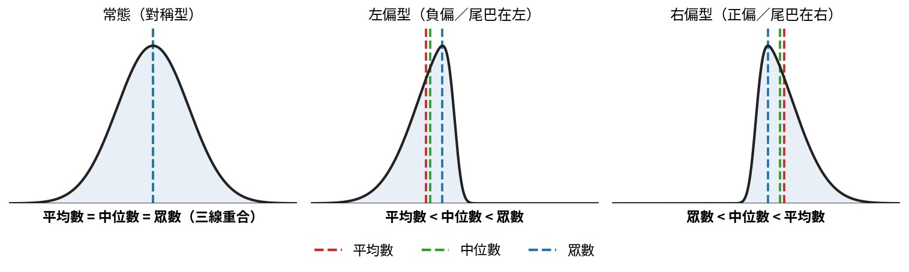

| 型態 | 關係 | 備註 |
|---|---|---|
| 常態(對稱型) | 平均數 = 中位數 = 眾數 | 三個都相等 |
| 左偏型(負偏) | **平均數 < 中位數 < 眾數** | 尾巴在左邊 |
| 右偏型(正偏) | **眾數 < 中位數 < 平均數** | 尾巴在右邊 |

> 記法：偏向哪邊，「平均數」就被尾巴拉到哪邊；中位數永遠在中間。

### 3. 位置的衡量（集中趨勢）

| 量數 | 定義 | 例子 |
|---|---|---|
| 平均數 Mean | 各觀察值總和 ÷ 觀察數：X̄ = ΣXᵢ/n | — |
| 中位數 Median | 分配的中央點（= Q2 = 50%）；觀察點為偶數時取中間兩數平均 | 1,2,3,4,5 → 3；1,2,3,4 → (2+3)/2 = 2.5 |
| 眾數 Mode | 出現次數最多的數字 | 1,2,3,3,5 → 3 |

### 4. 散佈的衡量 (measures of spread)

| 量數 | 公式 | 說明 |
|---|---|---|
| 變異數 Variance | S² = Σ(Xᵢ−X̄)²/(n−1) | 分數愈分散，變異數愈大；全部相等則為 0 |
| 標準差 Std. dev. | S = √S² | 變異數的平方根，增加解釋力 |
| 全距 Range | **R = Max − Min** | 只涉及最大最小值，衡量散佈相當粗糙 |
| 四分位**距** IQR | **Q3 − Q1** | (75% − 25%) |
| 四分位**差** | **(Q3 − Q1) / 2** | 注意與四分位距的差別！ |

### 5. 極端值（離群值）與量數選擇 ⭐必考

**核心觀念：資料有極端值時，要挑「不受極端值影響（抗離群值）」的量數。**

| 陣營 | 量數 | 原因 |
|---|---|---|
| **怕**極端值 ✗ | 平均數、變異數、標準差、變異係數、**全距** | 計算時**每個數值都參與**，一個超大值就被拉走；全距最慘，直接由 Max−Min 決定；變異係數 = 標準差/平均數，兩個怕的除在一起 |
| **不怕**極端值 ✓ | **中位數**、四分位數、**四分位距 IQR** | 只看「**排序位置**」，不管數值多極端（中位數=第50%位置；IQR=中間50%的範圍） |

**例題：** 資料有極端值時，應選用哪組量數？

| 選項 | 分析 | 判斷 |
|---|---|---|
| 變異數＋四分位距 | ✗＋✓，有一個怕 | ✗ |
| 平均數＋標準差 | ✗＋✗，兩個都怕 | ✗ |
| **四分位距＋中位數** | ✓＋✓，兩個都抗極端值 | **✓** |
| 變異係數＋全距 | ✗＋✗ | ✗ |

**直觀例子：** 薪水 {3萬, 4萬, 4萬, 5萬, **100萬**}
- 平均數被拉到 23.2 萬（失真）；**中位數還是 4 萬**（真實反映多數人）
- 全距 = 97 萬（失真）；**IQR 只量中間那群人的散布**（穩定）

> 記法：「**位置型**」量數（中位數、四分位數、IQR）抗極端值；「**算全部**」的量數（平均、變異數、標準差、全距）怕極端值。**有極端值 → 報中位數＋IQR。**

### 6. 經驗法則 vs 柴比雪夫定理（內容已移至 **第十三章第 7 節**，與機率分配放在一起）

---

## 三、四分位數 (Quartile)

### 1. 定義

| 名稱 | 別名 | 位置 |
|---|---|---|
| Q1 第一四分位數 | 第25百分位數 | 由小到大排列後第 25% |
| Q2 第二四分位數 | **中位數** | 第 50% |
| Q3 第三四分位數 | 第75百分位數 | 第 75% |

四分位距 IQR = Q3 − Q1

### 2. 求法 ⭐計算必考

**公式：O(Qp) = n × p/100**（資料須先由小到大排序）

| 情況 | 規則 |
|---|---|
| Q 是整數 | 取第 Q 與第 Q+1 個的**平均值** |
| Q 不是整數 | **無條件進位**取下一個整數（如 Q=1.2 → 取第 2 個） |

**範例一（n=11）：** 6, 7, 15, 36, 39, 40, 41, 42, 43, 47, 49
- Q1 = 11×25/100 = 2.75 → 第3個 → **Q1 = 15**
- Q2 = 11×50/100 = 5.5 → 第6個 → **Q2 = 40**
- Q3 = 11×75/100 = 8.25 → 第9個 → **Q3 = 43**

**範例二（n=6，整數情況）：** 7, 15, 36, 39, 40, 41
- Q1 = 15，Q2 = (36+39)/2 = **37.5**，Q3 = 40

---

## 四、變異數與標準差計算 ⭐計算必考

### 1. 核心公式表

| 名稱 | 公式 | 分母 |
|---|---|---|
| 平方和 SS (Sum of Square) | SS = Σx² − (Σx)²/n | — |
| 群體變異數 σ² | σ² = SS / **n** | ÷ n |
| 群體標準差 σ | σ = √σ² | — |
| 不偏(樣本)變異數 V | V = SS / **(n−1)** | ÷ (n−1) |
| 估計(樣本)標準差 S | S = √V | — |

> ⭐ 分辨關鍵：**群體 ÷ n；樣本 ÷ (n−1)**

### 2. 範例（n=5，資料 1,2,3,4,5）

| 項目 | 計算 | 結果 |
|---|---|---|
| ΣX | 1+2+3+4+5 | 15 |
| Σx² | 1+4+9+16+25 | 55 |
| 平均數 X̄ | 15/5 | 3 |
| SS | 55 − 15²/5 | **10** |
| 群體變異數 σ² | 10/5 | 2 |
| 群體標準差 σ | √2 | 1.414 |
| 樣本變異數 V | 10/(5−1) | 2.5 |
| 樣本標準差 S | √2.5 | 1.581 |

### 3. 🖩 計算機按法（未分組資料）

先完成 ⓪ 的 SD 模式設定與 Stat Clear，然後：

**① 輸入數據** — 每筆資料按一次 M+：

```
1 → M+ ；2 → M+ ；3 → M+ ；4 → M+ ；5 → M+
```

（螢幕顯示 n = 已輸入筆數，可確認有沒有少按）

**② SHIFT → 2**，出現三個選項：

| 選項 | 螢幕顯示 | 意義 | 對應公式 |
|---|---|---|---|
| 1 | x̄ | **平均值** | X̄ = ΣX/n |
| 2 | xσn | **群體標準差** σ | √(SS/n) |
| 3 | xσn−1 | **樣本標準差** S | √(SS/(n−1)) |

按法：**SHIFT → 2 → 選(1/2/3) → =** 即得答案

**③ 求變異數**（標準差的平方）：

| 目標 | 按法 |
|---|---|
| 樣本變異數 S² | SHIFT → 2 → 選 3 (xσn−1) → = → **Ans → x² → =** |
| 群體變異數 σ² | SHIFT → 2 → 選 2 (xσn) → = → **Ans → x² → =** |

驗證：資料 1~5 → 樣本標準差 1.581 → 平方 = **2.5** ✓（= SS/(n−1) = 10/4）

**④ 查總和**：SHIFT → 1 → 出現 Σx²(1)、Σx(2)、n(3)

### 4. 變異數 vs 變異係數（絕對 vs 相對離散）⭐必考

| 項目 | 變異數 σ²／S² | 變異係數 CV |
|---|---|---|
| 定義 | 離差平方的平均 | 標準差相對於平均數的比率 |
| 公式 | σ²=SS/n；S²=SS/(n−1) | **CV = (標準差 ÷ 平均數) × 100% = (S/X̄) × 100%** |
| 單位 | 原資料單位的**平方**（有單位） | **無單位**（%，純比率） |
| 衡量 | **絕對**離散程度 | **相對**離散程度 |
| 何時用 | 兩組**單位相同、平均相近**時比誰分散 | 兩組**單位不同**或**平均差很大**時比誰分散 |
| 判讀 | 越大越分散 | 越大越分散／越不穩定、越不一致（品質越差） |
| 抗極端值 | ✗ 怕（每個數值都參與計算） | ✗ 怕（標準差、平均數都怕） |

> ⚠️ **判斷關鍵：要比「誰比較分散」時**
>
> - 單位相同、平均相近 → 直接看**標準差／變異數**即可
> - **單位不同（如身高 cm vs 體重 kg）或平均差很大 → 一定要用 CV**，才公平
> - 陷阱：X̄ 為 0 或負時 CV 無意義；變異數帶「平方單位」，開根號還原成標準差才是原單位

**例：** 甲組身高 平均 170cm、標準差 5cm；乙組體重 平均 60kg、標準差 5kg。誰比較分散？
- 標準差都是 5，但**單位不同不能直接比** → 算 CV。
- 甲：5/170 = **2.94%**；乙：5/60 = **8.33%** → **乙組相對比較分散**。

> 🖩 **Casio fx-350MS**：CV 沒有專屬鍵。先在 SD 模式求標準差（`SHIFT → 2` → xσn 母體 σ／xσn−1 樣本 S）與 x̄，再 `標準差 ÷ x̄ × 100`。變異數則是取到標準差後 `Ans → x² → =`。

---

## 五、已分組數據的平均數與標準差

### 1. 範例資料表（n=40）

| 組中點 X | 1.7 | 2.2 | 2.7 | 3.2 | 3.7 | 4.2 | 4.7 | 合計 |
|---|---|---|---|---|---|---|---|---|
| 次數 f | 2 | 1 | 4 | 15 | 10 | 5 | 3 | 40 |
| fx | 3.4 | 2.2 | 10.8 | 48.0 | 37.0 | 21.0 | 14.1 | Σfx=136.5 |
| fx² | 5.78 | 4.84 | 29.16 | 153.6 | 136.9 | 88.2 | 66.27 | Σ=484.75 |

### 2. 平均數（簡捷法）

X̄ = A + (Σfᵢdᵢ / n) × C，其中 dᵢ = (xᵢ − A)/C（A=假定平均數，C=組距）

範例：X̄ = 3.2 + (17/40) × 0.5 = **3.4125**

### 3. 標準差

- SS = Σfx² − (Σfx)²/n = 484.75 − 136.5²/40 = **18.94**

| 群體 | 樣本(不偏) |
|---|---|
| σ² = SS/n = 18.94/40 = 0.4735 | V = SS/(n−1) = 18.94/39 = 0.4857 |
| σ = √0.4735 = **0.688** | S = √0.4857 = **0.697** |

### 4. 🖩 計算機按法（分組資料）⭐

先完成 ⓪ 的 SD 模式設定與 Stat Clear，然後：

| 步驟 | 按法 |
|---|---|
| ① 輸入「組中點；次數」 | 組中點數值 → **SHIFT → 逗號鍵( , )**（出現「;」分號）→ 次數 → **M+**，依序完成所有組 |
| ② 查總和 | **SHIFT → 1** → Σx²(1)、Σx(2)、n(3) |
| ③ 查統計量 | **SHIFT → 2** → x̄(1)、xσn(2)、xσn−1(3) |

> 例：組中點 1.7 次數 2 → 按「1.7 → SHIFT → , → 2 → M+」

---

## 六、機率的定義

機率：測度出象空間中各個事件發生的機會。

**機率 P 的三大條件 ⭐**

| # | 條件 |
|---|---|
| 1 | 任何事件的機率值 **≥ 0** |
| 2 | 整個出象空間的機率值 = **1** |
| 3 | 互斥事件：聯集的機率 = 個別事件機率的**總和** |

**計次法則基礎：**
- 出象空間有 n 種等可能出象 → 每一個出象機率 = **1/n**
- 出象數目太龐大無法列舉時 → 用計次法則 (counting rule) 計算出象總數

---

## 七、計次法則 ⭐核心公式

### 1. 三大法則比較表

| 法則 | 使用時機 | 公式 | 🖩 計算機按法 |
|---|---|---|---|
| 乘積法則 | 一系列步驟，各步驟出象數相乘 | n₁ × n₂ × … | — |
| 排列 Permutation | **考慮順序**（依次放置） | ₙPₘ = n!/(n−m)! = n(n−1)…(n−m+1) | n → **SHIFT** → nCr(=nPr) → m → = |
| 組合 Combination | **不考慮順序**（誰先誰後無意義） | ₙCₘ = ₙPₘ/m! = n!/[m!(n−m)!] | n → nCr → m → = |

> 判斷關鍵：**有排名/職位/名次 → 排列；只是選出來 → 組合**
> 🖩 例：₅₀C₃ →「50 → nCr → 3 → =」= 19600；₅₀P₃ →「50 → SHIFT → nCr → 3 → =」= 117600

### 2. 題目關鍵字判斷（手寫重點）⭐

| 題目出現字眼 | 判斷 |
|---|---|
| 前○名、第一名第二名、排名、分派到「不同」站/職位 | 排列 P |
| 任選、選中即可、順序不重要、順序皆可、互選/互相推舉（沒寫排列時） | 組合 C |
| 「同時可以互相支援」 | 組合 C |
| 分成兩群各自選，再問總共 | 各自算組合後**相乘**（乘法定理） |

### 3. 乘積法則例子

| 題目 | 解 |
|---|---|
| 擲骰子 2 次 | 6 × 6 = 36 種 |
| n 個產品品管檢查（每次 2 種出象） | 2ⁿ 種 |
| 管制圖連續 6 點任意升降（每點升或降 2 種） | 2⁶ = **64** 種 |

### 4. 排列例子（考慮順序）

| 題目 | 解 |
|---|---|
| 50 人班級選前三名 | ₅₀P₃ = 50×49×48 = **117,600** 種 |
| 3 名品管員配 3 個檢驗站 | ₃P₃ = 3×2×1 = **6** 種 |
| 20 佳麗選第一名與第二名 | ₂₀P₂ = 20×19 = **380** 種 |
| 48 名成員選會長、副會長、書記、財務 | ₄₈P₄ = 48×47×46×45 = **4,669,920** 種 |
| 12 影片排出前四名 | ₁₂P₄ = 12×11×10×9 = **11,880** 種 |
| 8 個助教分派 8 個時段 | ₈P₈ = 8!/0! = **40,320** 種 |
| 5 母音 (a,e,i,o,u) 任選 2 個「排列」 | ₅P₂ = **20** 種（ae 與 ea 算不同） |

### 5. 組合例子（不考慮順序）

| 題目 | 解 |
|---|---|
| 50 人選 3 人不論排名 | ₅₀C₃ = ₅₀P₃/3! = **19,600** 種 |
| 3 人選 3 人 | ₃C₃ = 1 種 |
| 10 件製品任取 3 件檢驗 | ₁₀C₃ = ₁₀P₃/3! = **120** 種 |
| 5 母音任選 2 個「組合」 | ₅C₂ = **10** 種（ae 與 ea 算同一種） |
| 樂透 45 號碼選中 4 個（順序皆可） | ₄₅C₄ = 45·44·43·42/4! = **148,995** 種 |
| 36 件退稅案選 5 件（順序不重要） | ₃₆C₅ = 36·35·34·33·32/5! = **376,992** 種 |
| 前十名歌手唱片任選 3 片購買 | ₁₀C₃ = 10·9·8/3! = **120** 種 |
| 7 選 2 位企管老師「且」9 選 3 位工管老師 | ₇C₂ × ₉C₃ = 21×84 = **1,764** 種（組合＋乘法定理） |

### 6. 超幾何型計數（重要例題）⭐

100 件製品中有 15 件不良品（85 件良品），任取 10 件，恰有 3 件不良品：

- 方法數 = **₁₅C₃ × ₈₅C₇** 種
- 機率 = (₁₅C₃ × ₈₅C₇) / ₁₀₀C₁₀

> 套路：（不良品取法 × 良品取法）÷ 全部取法

---

## 八、機率論基礎與集合論

### 1. 機率論基本觀念

| 觀念 | 內容 |
|---|---|
| 機率 | 衡量某一事件可能發生的程度（機會），賦予量化數值；衡量**不確定性大小**的工具 |
| 理論基礎 | 群體分配基於機率理論，機率理論又基於**集合論** |
| 集合與元素 | 集合是元素的聚合；元素是集合的單位 |
| 空集 | 無元素的集合，記作 **Φ** |
| 集合元素兩條件 | **可確定性、可區分性** |
| 屬於/不屬於 | ∈ 與 ∉；例 A={0,1}，則 1∈A、2∉A |

### 2. 集合與集合的關係

| 關係 | 符號 | 意義 |
|---|---|---|
| 自集(含於)關係 | A ⊂ B | A 為 B 之子集(subset)，A 中任意元素均可在 B 中找到 |
| 等集關係 | A = B | 兩集合元素完全相同 |
| 對等關係 | A ~ B | A 中每一元素可與 B 中每一元素一一對應 |

### 3. 集合的運算【圖解】

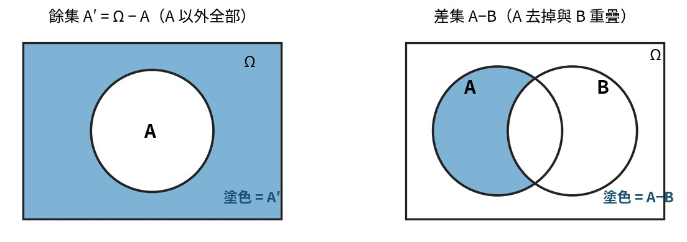

| 運算 | 符號 | 意義 | 例（A={1,2,4,8}, B={−1,1}） |
|---|---|---|---|
| 聯集 | A∪B | 屬於 A **或** 屬於 B | {−1,1,2,4,8} |
| 交集 | A∩B（可寫 AB） | 屬於兩集合**共同**部分 | {1} |
| 差集(去) | A−B | 在 A 中但**不在** B 中 | {2,4,8} |
| 餘集 | A′ | 全集 Ω 扣掉 A（Ω−A） | — |

**餘集性質：** A∪A′ = Ω、AA′ = Φ、(A′)′ = A

### 4. 集合運算定律 ⭐

| 定律 | 公式 |
|---|---|
| 結合律 | A∪B∪C = (A∪B)∪C = A∪(B∪C)；ABC = (AB)C = A(BC) |
| 交換律 | A∪B = B∪A；A∩B = B∩A |
| 分配律 | A∪(B∩C) = (A∪B)∩(A∪C)；A∩(B∪C) = (A∩B)∪(A∩C) |
| **笛摩根律(餘集律)** | **(A∪B)′ = A′∩B′；(A∩B)′ = A′∪B′** |

驗證例（Ω={1,2,3,4}, A={1,2,3}, B={2,3,4}）：A′={4}、B′={1}、A′∪B′={1,4}、A′B′=Φ、(A∪B)′=Φ=A′B′ ✓、AB={2,3}、(AB)′={1,4}=A′∪B′ ✓

### 5. 機率測度的三種方法

| 方法 | 公式 | 說明 |
|---|---|---|
| 古典方法 | P(E) = n(E)/n(S) | 限制：樣本空間必須**有限**；假設：每一樣本點機會**相同** |
| 客觀方法(相對次數法) | P(E) = lim(n/N)，N→∞ | 重複實驗許多次，觀察事件出現次數比例 |
| 主觀方法 | P(E) = 個人對事件 E 發生的信心 | — |

### 6. 機率的公理 ⭐必考

| # | 公理 |
|---|---|
| 1 | 0 ≤ P(Eᵢ) ≤ 1 |
| 2 | E₁, E₂, …, Eₙ 為**互斥**時：P(E₁∪E₂∪…∪Eₙ) = P(E₁)+P(E₂)+…+P(Eₙ) |
| 3 | P(S) = 1；P(Φ) = 0 |

---

## 九、事件機率與事件性質

### 1. 三種事件機率 ⭐必考（事件 vs 交集要分清楚）

| 名稱 | 定義 | 公式 |
|---|---|---|
| 聯合機率 joint probability | 兩個或以上事件**同時發生**的機率 | P(A∩B) |
| 邊際機率 marginal probability | 多類別樣本空間中，**僅考慮一類別**個別發生的機率 | P(A)（表格的合計行/列） |
| 條件機率 conditional probability | **已知 B 發生下**，A 發生的機率 | **P(A\|B) = P(A∩B)/P(B)**，P(B)≠0 |

### 2. 事件的性質

| 性質 | 定義 | 判斷公式 ⭐ |
|---|---|---|
| 獨立事件 Independent | 一事件的發生**不影響**其他事件 | ① P(A\|B)=P(A) ② P(B\|A)=P(B) ③ **P(A∩B)=P(A)·P(B)** |
| 相依事件 Dependent | 一事件的發生**影響**其他事件發生的機率 | 不滿足上述任一條 |
| 互斥事件 Mutually Exclusive | 事件**沒有共同樣本點**，交集為空集合 | **A∩B = Φ** |

**【圖解】三種文氏圖**

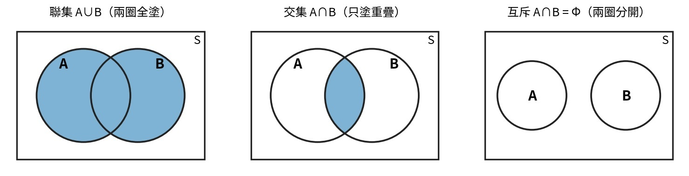

### 3. 事件的運算法則 ⭐核心公式

| 法則 | 公式 |
|---|---|
| 餘集合的機率 | **P(A′) = 1 − P(A)** |
| 加法定理 | **P(A∪B) = P(A) + P(B) − P(A∩B)** |
| 乘法定理 | **P(A∩B) = P(B)·P(A\|B)**（由條件機率移項而來） |
| 分割定理（全機率） | **P(B) = ΣP(B∩Aᵢ) = ΣP(Aᵢ)·P(B\|Aᵢ)**（貝氏定理的分母；老師：用「畫圖」解，不必硬背公式） |

**【圖解】分割定理**

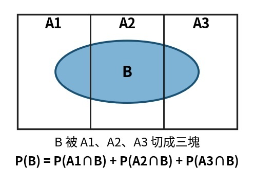

---

## 十、條件機率例題 ⭐計算必考

### 例題 1：交叉表型（應徵者資料）

| 性別 | 公立(A) | 私立(B) | 合計 |
|---|---|---|---|
| 男(M) | 0.5 | 0.1 | 0.6 |
| 女(F) | 0.25 | 0.15 | 0.4 |
| 合計 | 0.75 | 0.25 | 1 |

求「已知是男性，畢業於公立」：P(A|M) = P(A∩M)/P(M) = 0.5/0.6 = **5/6**

> 套路：分子找**交叉格**（聯合機率），分母找**合計**（邊際機率）。

### 例題 1-2：列聯表「在誰之中」→ 分母判斷 ⭐超經典

情境：樣本 200 人的列聯表，「研讀課業且成績不佳」的交叉格 = **20 人**；研讀課業合計 100 人（80+20）、成績不佳合計 90 人。**同一格 20，除以三種分母，出三種題目：**

| 題目說法（先圈這句！） | 分母 | 計算 | 這是什麼 |
|---|---|---|---|
| 「**在樣本中／全體中**，＿% 研讀且成績不佳」 | 總人數 **200** | 20/200 = **10%** | 聯合比例 |
| 「**在研讀課業之學生中**，＿% 成績不佳」 | 該**列**合計 **100** | 20/100 = **20%** | 條件比例 |
| 「**在成績不佳之學生中**，＿% 有研讀」 | 該**行**合計 **90** | 20/90 = **22.22%** | 條件比例（常見陷阱選項！） |

> 口訣：**先圈「在誰之中」，誰就是分母**
>
> - 「在全體中」→ 分母是總數；「在○○之中」→ 分母縮小成○○的合計
> - 這跟條件機率同一件事：「在 B 之中 A 的比例」= P(A|B) = 交叉格 ÷ B 的合計
> - 題庫愛用同一張表連出兩三題，考試時**先圈分母再動筆**

### 例題 2：出象個數型

10 個等可能出象，A 含 4 個、B 含 6 個、A∩B 含 2 個：
- P(A)=0.4、P(B)=0.6、P(A∩B)=0.2
- P(A|B) = 2/6 = 0.33；P(B|A) = 2/4 = 0.5
- 檢驗獨立：P(A)·P(B)=0.24 ≠ 0.2=P(A∩B) → **A、B 不獨立**

### 例題 3：餘集混合型（畫圖解）

已知 P(A)=3/8、P(B)=3/4、P(A∩B)=1/4：

| 求 | 解法 | 答案 |
|---|---|---|
| P(A\|B) | P(A∩B)/P(B) = (1/4)÷(3/4) | **1/3** |
| P(A′\|B) | 先求 P(A′∩B)=P(B)−P(A∩B)=3/4−1/4=1/2，再 ÷P(B) | **2/3** |
| P(A′\|B′) | P(A′∩B′)=1−P(A∪B)=1−[3/8+3/4−1/4]=1/8；P(B′)=1−3/4=1/4；1/8÷1/4 | **1/2** |

**【圖解】畫圖必背套路 ⭐**

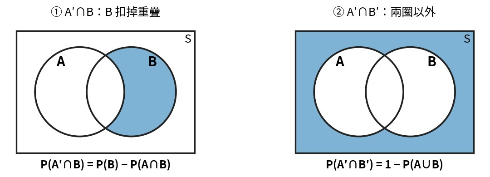

- P(A′∩B) = P(B) − P(A∩B)（B 扣掉重疊）
- P(A′∩B′) = 1 − P(A∪B)（A、B 兩圈**以外**的區域）
- P(A∪B) = P(A) + P(B) − P(A∩B)

---

## 十一、貝氏定理 (Bayes Theorem) ⭐⭐大題必考

### 1. 觀念架構

**事前機率 ＋ 取得新資訊（條件機率）→（應用貝氏定理）→ 事後機率（修正機率）**

**公式：**

P(A|B) = P(A∩B)/P(B) = **P(B|A)·P(A) / P(B)**

| 名稱 | 位置 |
|---|---|
| 事後機率 | 等號左邊 P(A\|B)（所求） |
| 事前機率 | 分子的 P(A) |
| 條件機率(新資訊) | 分子的 P(B\|A) |
| 分母 P(B) | 用**分割定理**展開：ΣP(Aᵢ)·P(B\|Aᵢ) |

### 2. 解題套路（老師：畫圖不背公式）【圖解】

1. 畫一個大矩形，依**事前機率**分割區塊（事前機率**一定合為 1**）
2. 在每個區塊內畫框標**新資訊的條件機率**（各區塊內的條件機率可合為 1 或不合為 1，視題目而定）
3. 事後機率 = **目標框 ÷ 所有框之和**

以例題一（景氣調查）示範：

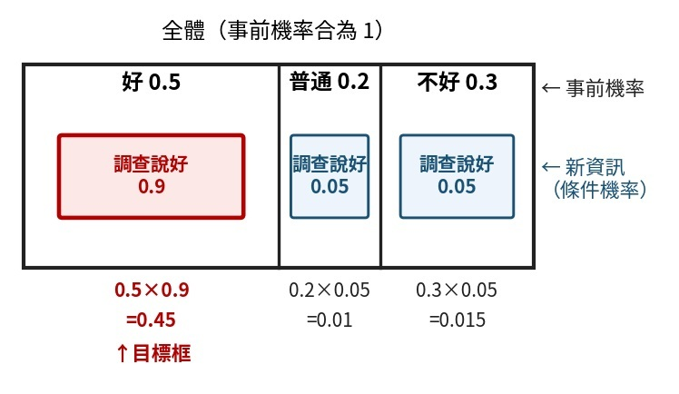

事後機率 = 目標框 ÷ 所有框之和 = 0.45 / (0.45+0.01+0.015) = 0.45/0.475 = **0.95**

> **萬用公式：P(Aₖ|B) = [P(Aₖ)×P(B|Aₖ)] / Σ[P(Aᵢ)×P(B|Aᵢ)]**

### 3. 例題一：景氣調查

主觀判斷（事前）：好 0.5、普通 0.2、不好 0.3；市調正確率 0.9，誤認為其他各 0.05。調查結果為「好」，真正為好的機率？

- 分母 P(B₁) = 0.5×0.9 + 0.2×0.05 + 0.3×0.05 = **0.475**
- P(A₁|B₁) = 0.45/0.475 = **0.95**（圖見上方解題套路）

### 4. 例題二：汽車排放檢測【圖解】

25% 車超標（事前）；超標車 99% 被檢出、未超標車 17% 被誤判。某車沒通過檢測，真的超標機率？

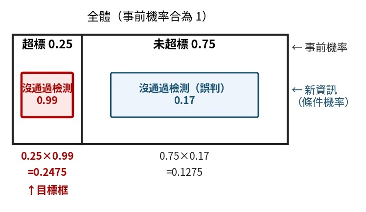

事後機率 = 目標框 ÷ 所有框之和 = 0.2475 / (0.2475+0.1275) = 0.2475/0.3750 = **0.66**

### 5. 例題三：罐頭工廠三條生產線【圖解】

產能佔比（事前）：50%、30%、20%；密封不良率：0.4%、0.6%、1.2%。發現不良罐頭，出自第一線的機率？

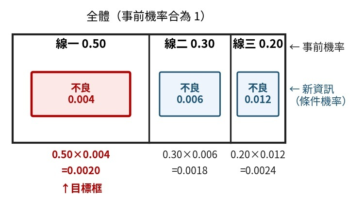

事後機率 = 目標框 ÷ 所有框之和 = 0.0020 / (0.0020+0.0018+0.0024) = 0.0020/0.0062 = **0.32**

> 手寫速算：直接用 (50×0.4)/(50×0.4+30×0.6+20×1.2) = 20/62 = 0.32，百分比不用換算也可以！

---

## 十二、隨機變數、期望值與變異數 ⭐（機率分配的基礎）

### 1. 隨機變數 (Random Variable)

定義：以**樣本空間為定義域的實數值函數**——把每個樣本點對應到一個實數。

例：擲一枚銅板二次，X = 出現正面的次數（樣本空間｛正正、正反、反正、反反｝）

| x | 0（反反） | 1（正反、反正） | 2（正正） |
|---|---|---|---|
| f(x) | 1/4 | 2/4 | 1/4 |

**機率函數的合法條件 ⭐**

| 離散型 | 連續型 |
|---|---|
| 0 ≤ f(xᵢ) ≤ 1 | f(x) ≥ 0 |
| **Σf(xᵢ) = 1** | **∫f(x)dx = 1**（全域積分） |
| P(X=x) 可直接讀 | P(a≤X≤b) = 曲線下面積（單點機率 = 0） |

> **手寫重點**：
>
> - CQT 骰子題**最多 2 顆**——直接**列舉樣本點**（6×6=36 格）用數的，不要硬套公式
> - 分配包含位置 (location)、散佈 (spread)、形狀 (shape) 三種描述

### 2. 期望值與變異數公式 ⭐

| 型態 | 期望值 μ = E(X) | 變異數 σ² = V(X) |
|---|---|---|
| 離散 | Σ x·f(x) | Σ(x−μ)²·f(x) |
| 連續 | ∫x·f(x)dx | ∫(x−μ)²·f(x)dx |

> ⭐ **速算公式（計算題幾乎都用這條）：V(X) = E(X²) − [E(X)]²**。先算 E(X) 與 E(X²)，變異數一步到位；SD = √V。

### 3. 期望值與變異數的性質 ⭐必考

| 情況 | 期望值 | 變異數 |
|---|---|---|
| 線性轉換 g(X) = aX+b | E(aX+b) = **aE(X)+b** | Var(aX+b) = **a²Var(X)**（b 直接消失！） |
| 常數 b | E(b) = b | Var(b) = **0** |
| 和與差（任意 X、Y） | E(X±Y) = E(X)±E(Y) | ——（要獨立才有下面那條） |
| X、Y **獨立** | E(XY) = E(X)·E(Y) | **Var(X±Y) = Var(X)＋Var(Y)**（減也是**加**！負負得正） |

> ⚠️ **兩大陷阱**：
>
> - ① Var(aX+b)：常數 b **不影響**變異數、係數 a 要**平方**
> - ② 獨立變數**相減**時變異數仍然**相加**，絕不會相減

**經典考題（講義選擇題）：**

| 題目 | 解法 | 答案 |
|---|---|---|
| A 零件 σ=3、B 零件 σ=4，兩零件合成新產品，新產品**標準差**？ | 標準差不能直接加：σ = √(3²+4²) = √25 | **5** |
| X、Y 常態，σₓ=4、σᵧ=3，X−Y 的**變異數**？ | V = 4²+3²（相減仍相加） | **25**（注意問的是變異數，別開根號） |
| V(Y)=1，求 V(3Y+4)？ | 3²×1（+4 不算） | **9** |

### 4. 例題：機率分配表求 E、V、SD ⭐計算必考

Y 的機率分配：y = 1~6，P(y) = 0.1、0.2、0.1、**?**、0.2、0.3

| 步驟 | 計算 | 結果 |
|---|---|---|
| ① 先補缺格（Σ機率=1） | P(4) = 1−0.1−0.2−0.1−0.2−0.3 | **0.1** |
| ② E(Y) | 1×0.1+2×0.2+3×0.1+4×0.1+5×0.2+6×0.3 | **4** |
| ③ E(Y²)（x 平方再乘機率） | 1²×0.1+2²×0.2+…+6²×0.3 | **19.2** |
| ④ V(Y) = E(Y²)−[E(Y)]² | 19.2 − 16 | **3.2** |
| ⑤ SD(Y) = √V | √3.2 | **1.789** |

**函數的期望值**（另一例：y=1~4，P=0.1、0.2、0.3、0.4；算得 E(Y)=3、E(Y²)=10）：

| 求 | 拆法 | 答案 |
|---|---|---|
| E(Y²+3Y+1) | E(Y²)+3E(Y)+1 = 10+9+1（逐項拆開） | **20** |
| V(Y) | 10 − 3² | **1** |
| V(3Y+4) | 3²×V(Y) = 9×1 | **9** |
| E(1/Y) | 1×0.1 + (1/2)×0.2 + (1/3)×0.3 + (1/4)×0.4 | **0.4** |

> ⚠️ E(1/Y) 是把 **1/y 逐一乘機率加總**，**不是** 1/E(Y)＝1/3！（函數期望值要重算，不能拿 E(Y) 直接代）

### 5. 累積分配函數 F(y) 反推機率

F(y) = P(Y≤y) 是「累積到 y」的機率，階梯型。**單點機率 = 該階 − 前一階**。

例：F(y)＝0 (y<0)、1/2 (0≤y<1)、3/5 (1≤y<2)、9/10 (2≤y<3.5)、1 (3.5≤y)

| y | 0 | 1 | 2 | 3.5 |
|---|---|---|---|---|
| P(Y=y) | 1/2 | 3/5−1/2 = **1/10** | 9/10−3/5 = **3/10** | 1−9/10 = **1/10** |

求 P(0.5<Y<3.5)：夾在中間的只有 y=1、2 → 1/10 + 3/10 = **2/5**（0.5 與 3.5 都是**開區間**，端點 0、3.5 不含）。

驗算：全部單點機率相加 1/2+1/10+3/10+1/10 = 1 ✓

---

## 十三、重要機率分配 ⭐

### 1. 四大分配總覽（先分「計數值 vs 計量值」）

| 分配 | 資料型態 | 使用時機（一句話） | 參數 | 平均數 | 變異數 |
|---|---|---|---|---|---|
| 超幾何 | 計數值(離散) | 有限母體**不放回**抽樣，算成功次數 | N, D, n | np（p=D/N） | np(1−p)·(N−n)/(N−1) |
| 二項 | 計數值(離散) | n 次**獨立**試驗、成功率 p 固定，算成功次數 | n, p | np | np(1−p) |
| 卜瓦松 | 計數值(離散) | 單位時間/面積內**稀有事件**的次數 | λ | λ | λ |
| 常態 | 計量值(連續) | 對稱**鐘形**連續資料 | μ, σ | μ | σ² |

> 判斷第一刀：**計量值(量測、連續) → 常態**；**計數值(個數、次數) → 超幾何／二項／卜瓦松**。

### 2. 超幾何分配 Hypergeometric（不放回）

- **時機**：母體 N 個中有 D 個成功(不良)，**不放回**抽 n 個，恰 x 個成功。
- **公式**：P(X=x) = C(D,x)·C(N−D, n−x) ÷ C(N,n)
- 平均數 = np、變異數 = np(1−p)·**(N−n)/(N−1)**（後段是**有限母體修正項**）；p = D/N
- 例：100 件含 15 不良，取 10 件恰 3 不良 = C(15,3)·C(85,7) ÷ C(100,10)（＝第七章超幾何計數例）
- 例（講義例3）：25 件電晶體含 3 件不良，抽 5 件——先判斷 n/N = 5/25 = 1/5 > 1/10 → **有限母體，用超幾何**。
  P(恰1件) = C(3,1)·C(22,4) ÷ C(25,5) = 5700/13800 = **0.413**；P(恰2件) = C(3,2)·C(22,3) ÷ C(25,5) = 1200/13800 = **0.087**

> 🖩 分子分母都用 nCr 直接按，不必展開階乘：「3 → nCr → 1 → × → 22 → nCr → 4 → ÷ → 25 → nCr → 5 → =」。

### 3. 二項分配 Binomial ⭐

- **時機**：n 次試驗，每次只有成功/失敗兩種、各次**獨立**、成功率 p **固定**（放回，或母體極大 N≥10n）。
- **公式**：P(X=x) = C(n,x)·pˣ·(1−p)ⁿ⁻ˣ，x=0,1,…,n
- 平均數 μ = **np**；變異數 σ² = **np(1−p) = npq**；標準差 = √(npq)
- 例：不良率 p=0.05，抽 20 件恰 2 件不良 = C(20,2)·0.05²·0.95¹⁸

**圖形偏態（p 決定偏向）⭐【圖解】**

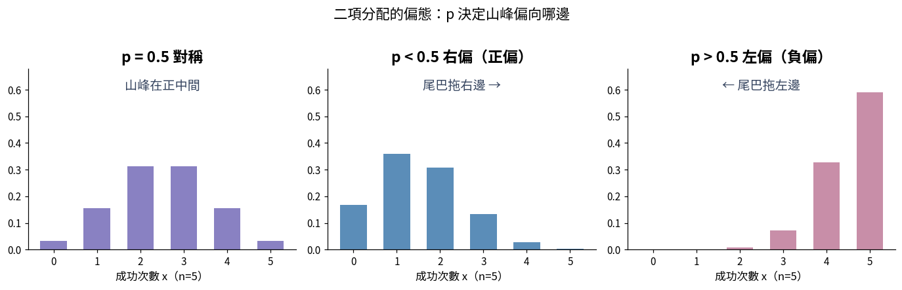

| p 值 | 圖形 | 記法 |
|---|---|---|
| p = 0.5 | 左右**對稱** | 成功失敗機會一樣，山峰在正中間 |
| p < 0.5 | **右偏（正偏）** | 成功機率小 → 山峰擠在左邊（低次數），**尾巴拖右邊** |
| p > 0.5 | **左偏（負偏）** | 成功機率大 → 山峰擠在右邊（高次數），**尾巴拖左邊** |

> 圖像記憶：**p 小 → 峰在左、尾在右（右偏）；p 大 → 峰在右、尾在左（左偏）**。偏態名稱看「尾巴」不是看山峰！

**查表法 ⭐（二項累積表給的是 P{X≤k}）：**

| 題目說法（先圈！） | 查法 |
|---|---|
| 「**最多** k 件」＝ d ≤ k | **P{X≤k} 直接查**一格 |
| 「**恰好** d 件」 | **P{X≤d} − P{X≤d−1}**（兩格相減） |

- 例1（恰好）：p=0.05、n=20，恰 2 件——公式 C(20,2)·0.05²·0.95¹⁸ = **0.189**；查表 P{X≤2}−P{X≤1} = 0.925−0.736 = 0.189 ✓
- 例2（最多）：p=0.1、n=20，**最多 2 件**（d=0,1,2）——查表 P{X≤2} = **0.677** 一格搞定（用公式要 d=0,1,2 三項相加，慢很多）
- 解(3) 也可**卜式近似**：λ = np = 20×0.1 = 2 → 查卜式表 P{X≤2} = **0.677**（無限群體時與二項幾乎同值，見第 6 節）

> **手寫重點**：二項**計算考比較少、多用查表**，主要考**名詞或定義**。伯努利試驗三條件：
>
> - ① 每次只有成功／失敗兩種結果
> - ② p 固定
> - ③ 各次獨立

> ⚠️ 超幾何 vs 二項：**不放回、有限母體 → 超幾何**；**放回，或 N≥10n → 二項**（此時超幾何≈二項）。

### 4. 卜瓦松分配 Poisson ⭐

- **時機**：單位時間／長度／面積內，某**稀有事件**平均發生 λ 次，求恰發生 x 次。（講義寫「波瓦松」，同一個分配）
- **典型情境（講義四例，認得出來就會選）**：每 10 分鐘打進公司的電話通數、1 天內停車場停車數、高速公路每 10 公里的坑洞數、每頁報告的錯字數——都是「**單位區間內事件發生的次數**」。
- **卜瓦松實驗三特質**：① 不同區間的發生次數**互相獨立** ② 區間內的期望值與**區間大小成比例** ③ 極短區間內只有「發生一次／不發生」兩種，兩次以上不考慮。
- **公式**：P(X=x) = e⁻λ·λˣ ÷ x!，x=0,1,2,…（e = 2.71828，科學符號）
- 特徵：**平均數 = 變異數 = λ = np**（平均＝變異數是卜瓦松的招牌；σ² = λ）
- **λ 要按區間換算 ⭐（λ 帶著「單位區間」，不能亂除）**：λ = 題目要檢驗的那個區間的平均次數，區間放大幾倍 λ 就乘幾倍。

| 例題 | λ 換算 | 計算 |
|---|---|---|
| 例5：每 20 m² 地毯平均 4 個不合格點，檢驗 **40 m²** 恰 2 點？ | λ = 4×(40÷20) = **8** | 公式 e⁻⁸·8²÷2! = **0.011**；查表 P{X≤2}−P{X≤1} = 0.014−0.003 = 0.011 ✓ |
| 每 7 天平均 2 件退貨，**14 天**內退 5 件？ | λ = 2×(14÷7) = **4** | 公式 e⁻⁴·4⁵÷5! = **0.156**；查表 P{X≤5}−P{X≤4} = 0.785−0.629 = 0.156 ✓ |

**卜式查表句型（和二項查表同一套邏輯）⭐**

| 題目說法（先圈！） | 查法 |
|---|---|
| 「**最多** k 件」 | P{X≤k} **直接查一格** |
| 「**恰好** d 件」 | P{X≤d} − P{X≤d−1}（兩格相減） |
| 「**至少** k 件」 | **1 − P{X≤k−1}**（反面思考：扣掉 k−1 件以內） |

- 例4（至少型）：電路板平均 λ=3 個不合格點，**至少 4 個**？P{X>3} = 1 − P{X≤3} = 1 − 0.647（查表）= **0.353**（公式解要 1 − 四項相加，查表一格搞定）
- 二項的極限：**n > 20 且 np ≤ 7** 時可用卜瓦松近似二項，取 **λ = np**
- 品管應用：單位產品**缺點數**（c 管制圖、u 管制圖）
- 例：每匹布平均 2 個瑕疵(λ=2)，某匹恰 3 個 = e⁻²·2³÷3! ≈ **0.180**

### 5. 常態分配 Normal ⭐⭐（CQT 最重點；連續型分配 CQT **只考這個**）

- 又稱**高斯分配**（Gauss Distribution）。**連續、對稱、鐘形**；μ 決定**中心位置**、σ 決定**胖瘦(離散程度)**。

**常態分配五大特性：**

| # | 特性 |
|---|---|
| 1 | 以平均數 μ 為中心的**對稱**曲線 |
| 2 | **平均數＝眾數＝中位數**（μ = Mo = Me） |
| 3 | μ±1σ 處是曲線的**反曲點**（Inflection Point，凹凸轉換處） |
| 4 | 左右兩尾與橫軸**逐漸接近但絕不相交**（漸近線） |
| 5 | μ±1σ = 0.683、μ±2σ = 0.954、μ±3σ = 0.997 |

> ⚠️ **記號陷阱：X~N(μ, σ²) 括號第二個數字是「變異數」不是標準差！**
>
> - N(210, **25**) → σ = √25 = **5**
> - N(50, **4**) → σ = **2**
> - N(10.1, **0.01**) → σ = **0.1**
> - 先開根號再標準化，考題最愛在這裡陰人

**解題 SOP：先畫圖 → 用背的區塊機率「拼」→ 拼不出才查表 ⭐【圖解】**

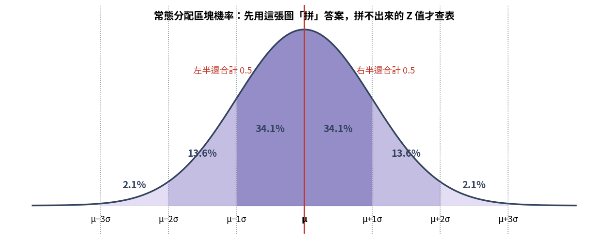

| 步驟 | 動作 |
|---|---|
| ① | 畫鐘形曲線，中間標 μ，把 σ 當刻度標出題目的點 |
| ② | 要求的區域用背的區塊拼：每段 **34.1%、13.6%、2.1%**，半邊 **0.5** |
| ③ | 拼不出來的 Z 值（如 2.5）→ **標準化 Z=(X−μ)/σ 查左尾表** |

**講義五連發例題（全部先畫圖）：**

| 題目 | 標準化 | 拼法／查表 | 答案 |
|---|---|---|---|
| 家電壽命 N(4.5, 1²)，保證期 2 年，退貨比例？ | Z=(2−4.5)/1=**−2.5** | 拼不出 → 查左尾表 | **0.0062** |
| 辦公桌裝配 N(56, 4²)，60 分鐘內完成？ | Z=(60−56)/4=**1** | 0.5＋34.1% | **0.8413** |
| 金屬強度 N(210, 25)，≥200psi 合格率？ | σ=5，Z=(200−210)/5=**−2** | 1−左尾 = 0.5+0.341+0.136 | **0.97725** |
| 抗張強度 N(50, 4)，P(X≤46)？P(X≥52)？ | σ=2，Z=−2；Z=1 | 0.5−0.341−0.136；0.5−0.341 | **0.02275**；**0.15866** |
| 外徑 N(10.1, 0.01)，規格 10±0.3 不合格率？ | σ=0.1，Z=(10.3−10.1)/0.1=2、(9.7−10.1)/0.1=−4 | P(2)−P(−4)=0.97725−0 | **0.02275**；調 μ=10.0 後規格＝±3σ → 不合格率 **0.0027** |

- 品管連結：管制圖 **±3σ 界限** ＝ 出界機率僅 0.27%，故**出界視為異常**；製程能力 Cp、Cpk 也建立在常態假設上（外徑例調機後就是 ±3σ＝0.9973 的活用）。

> 🖩 fx-350MS **無**內建常態查表，考試用**附表（左尾）**；「P(X≥a)」記得 = 1 − 左尾，或用 0.5±區塊拼。

**外徑例的畫圖解法：塗黑規格外的尾巴（製程置中的威力）⭐【圖解】**

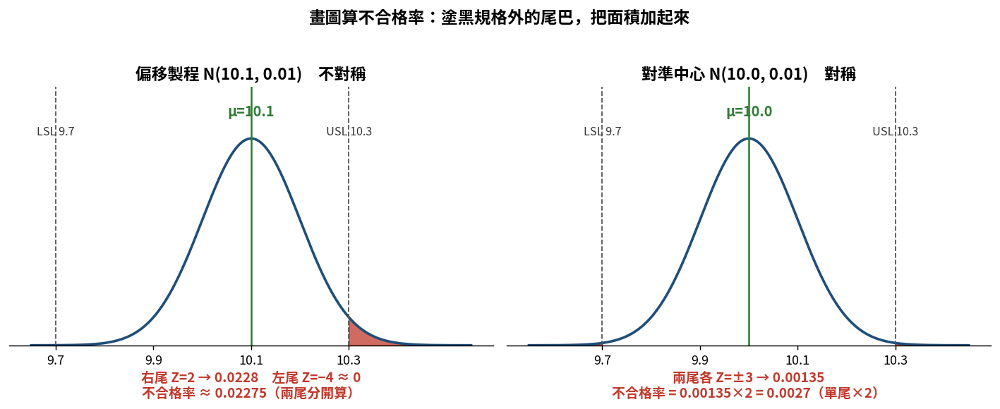

不合格率 = 規格外**兩條尾巴的面積相加**。畫圖時把超出 LSL／USL 的尾巴塗黑，只算塗黑那幾塊，不用先算合格再用 1 去減。

| 步驟 | 偏移製程 μ=10.1 | 對準中心 μ=10.0 |
|---|---|---|
| 上限 Z=(10.3−μ)/0.1 | +2 | +3 |
| 下限 Z=(9.7−μ)/0.1 | −4 | −3 |
| 圖形 | 不對稱，右尾獨大 | 左右對稱 |
| 右尾面積（0.5−中心到Z） | 0.5−0.4772 = **0.0228** | 0.5−0.4987 = **0.00135** |
| 左尾面積 | Z=−4 ≈ **0**（忽略） | **0.00135** |
| 算法 | 兩尾**分開加** | **單尾×2** |
| **不合格率** | 0.0228＋0 = **0.02275** | 0.00135×2 = **0.0027** |

- 只把平均對準中心（σ 完全沒變），不合格率從 2.275% → 0.27%，差約 **8 倍**——這就是品管強調「**製程置中**」的威力。
- 對準中心後規格恰為 **μ±3σ**，呼應管制圖 ±3σ ＝ 出界 0.27% 的由來。

> ⚠️ **判斷關鍵：先看對不對稱，再決定「單尾×2」或「兩尾分開」**
>
> - μ ＝ 規格中心 → **對稱** → 算單尾再 ×2
> - μ ≠ 規格中心 → **不對稱**（本例上限 Z=2、下限 Z=−4）→ 兩尾一定**分開算，不能乘 2**
> - 口訣：問「不合格」塗規格外、問「合格」塗規格內——**塗哪塊算哪塊**，就不會搞混要不要用 1 去減

### 6. 分配選擇判斷 SOP ⭐⭐必考

**解題第一步：先算 n/N，判斷有限／無限群體，再決定用哪個分配。**

| 步驟 | 判斷 | 怎麼解 |
|---|---|---|
| ① n/N **> 1/10** | **有限群體** | **超幾何**——乖乖用公式算（它是精確值，跟其他分配**值差很多**，不能偷懶） |
| ② n/N **≤ 1/10**（或母體無限、不放回也一樣） | **無限群體** | 二項；計算時直接 **λ = np 查卜式表**最快（值**很接近**） |
| ③ 題目只給「平均 λ 次」（沒有 n、p） | — | 卜瓦松，λ 記得先按區間換算 |

**三分配關係鏈（★必考）：**

**超幾何** —（n/N ≤ 0.1 可取代）→ **二項** —（n > 20 且 np ≤ 7 可取代）→ **波瓦松**
（左端＝有限群體，右端＝無限群體；原理：n→∞、λ=np 固定時，二項趨近卜式分配）

> 手寫重點：**只要能算出 λ＝np，不用管是哪一個分配函數**——無限群體時二項與卜式的值很近，考試直接查卜式表；有限群體才需要超幾何公式。

**同一題三種解法比一比（例6／例7，證明「無限群體值很近」）：**

| 題目 | 超幾何 | 二項 | 卜式查表 |
|---|---|---|---|
| 例6：N=80 含 4 不良，n=8，**最多 1 件**（n/N = 8/80 = 1/10 → 可視為無限） | 0.9522 | 0.9428 | λ = 8×0.05 = 0.4 → P{X≤1} = **0.938** |
| 例7：不合格率 p=0.04，n=100，**3 件或以下**（無限群體） | — | 0.429 | λ = 100×0.04 = 4 → P{X≤3} = **0.433** |

三個值都在 0.93~0.95／0.43 附近 → 無限群體時選哪個都對，**查表最快**。

**分配總表（含常態）：**

| 問題特徵 | 選哪個分配 |
|---|---|
| 量測值、連續、鐘形 | 常態 |
| 不放回、**有限母體（n/N > 1/10）**，算成功數 | 超幾何 |
| 獨立試驗、p 固定（**n/N ≤ 1/10 視為無限**），算成功數 | 二項（可用卜式查表） |
| 單位時間/面積內稀有事件的次數（只給平均 λ） | 卜瓦松 |

### 7. 經驗法則 vs 柴比雪夫定理 ⭐必考（三個數字直接背）

**經驗法則（68-95-99.7 法則）**——適用於**鐘形／常態**分佈：

| 範圍 | 涵蓋比例 | 備註 |
|---|---|---|
| μ ± 1σ | **68.26%** | — |
| μ ± 2σ | **95.44%** | 選項常放 68 和 99.7 等你記錯位置 |
| μ ± 3σ | **99.7%** | ⭐品管關鍵：管制圖 **±3σ 管制界限**就是來自這裡——出界機率只有 0.3%，所以**出界視為異常** |

**柴比雪夫定理**（講義也寫**謝比雪夫** Chebyshev，同一個定理）——適用於**任意／未知**分配：μ±kσ 內至少 **1 − 1/k²**，**範圍外至多 1/k²**

| k | 計算 | 範圍**內**至少 | 範圍**外**至多 |
|---|---|---|---|
| 1 | 1 − 1/1 | **0%**（k=1 套公式沒有資訊） | 1 |
| 2 | 1 − 1/4 | **75%** | 1/4 = 25% |
| 3 | 1 − 1/9 | **88.9%**（8/9） | 1/9 |
| 4 | 1 − 1/16 | **93.75%**（15/16） | 1/16 = 6.25% |

**解題 SOP：看到柴比雪夫的題目，先畫圖再計算 ⭐【圖解】**

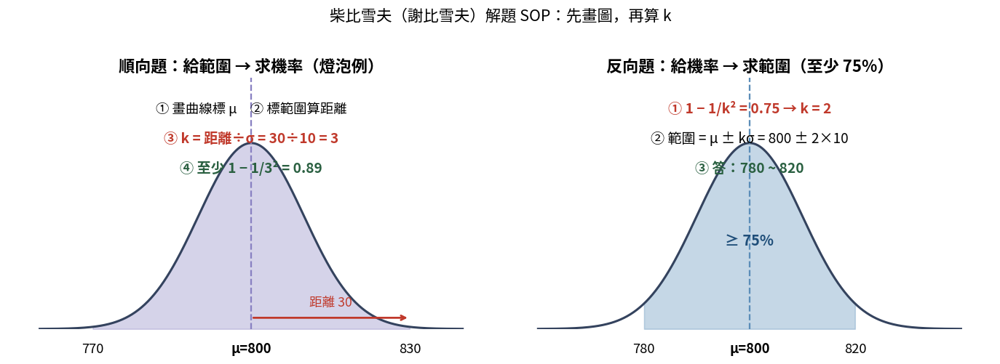

| 步驟 | 動作 | 燈泡例（μ=800、σ=10） |
|---|---|---|
| ① | 畫一條鐘形曲線，中間標 **μ** | 800 在中間 |
| ② | 題目給的範圍標在兩端，算「端點 − μ」的距離 | 770、830 → 距離 30 |
| ③ | **k = 距離 ÷ σ** | k = 30÷10 = **3** |
| ④ | 套 1 − 1/k² | 1 − 1/9 = **0.89** |

**反向題（給比例 → 反推 k → 算範圍 μ±kσ）：**

| 例題 | 解 k | 範圍 |
|---|---|---|
| 燈泡：機率至少 **75%** 的壽命範圍？ | 1−1/k² = 0.75 → k = **2** | 800±2×10 = **780~820** |
| 乳酪（μ=3.50、σ=0.04）：**93.75%** 的脂肪含量範圍？ | 1−1/k² = 0.9375 → 1/k² = 1/16 → k = **4** | 3.50±4×0.04 = **3.34~3.66** |

順向再一例（乳酪）：問 3.38~3.62 之間至少多少比例？ 距離 = 3.62−3.50 = 0.12 = 3σ → k=3 → 1−1/9 = 8/9 = **89%**

> 心算技巧：看到 93.75% 先想「**差 6.25% = 1/16**」→ k²=16 → k=4。「μ±4σ 範圍**外**至多 1/16」是同一題的另一面（範圍外 = 1/k²）。
> ⚠️ 陷阱：憑「2σ」印象選 k=2 → 那是 75%，不是 93.75%！

> **判斷關鍵**：
>
> - 題目說「**鐘形／常態**」→ 經驗法則（68.26 / 95.44 / 99.7）
> - 題目說「**任意分配／未知分配**」或答案有「**至少**」→ 柴比雪夫
> - 這組數字會反覆出現（例：規格剛好 μ±2σ → 合格率 95.44%），背熟很划算

**全距與標準差的關係 R ≈ 4s ⭐有考過（標準差的檢查）**

> - 由柴比雪夫與經驗法則，大部分量測值落在 **μ±2σ** 內 → 資料組的**全距 R ≈ 4 倍標準差**
> - **R = 4s → s = R/4**（同理 σ = R/4）
> - 用途：想快速檢查標準差算得合不合理，就用全距除以 4 估一下

**綜合例（pmf 求 E、V 再套柴比雪夫，連第十二章）：** 擲正常銅幣三次，X = 正面次數，依柴比雪夫求 μ±2σ 內的機率？

| 步驟 | 計算 | 結果 |
|---|---|---|
| ① 列 pmf（直接列舉 8 種出象） | f(x) = 1/8, 3/8, 3/8, 1/8（x=0,1,2,3） | — |
| ② E(X) | 0×1/8+1×3/8+2×3/8+3×1/8 | **1.5** |
| ③ E(X²) | 0+1×3/8+4×3/8+9×1/8 | **3** |
| ④ V(X) = E(X²)−[E(X)]² | 3 − 1.5² = 0.75；σ = √0.75 | **0.87** |
| ⑤ 柴比雪夫 k=2 | P(1.5−2×0.87 < X < 1.5+2×0.87) ≥ 1−1/2² | **≥ 0.75** |

> 這題把「pmf 求期望值變異數」和「柴比雪夫」串在一起，是老師的示範套路：**先求 σ，再畫圖套 k**。

### 8. 其他連續型分配一覽（標「CQE 考」，CQT 認得名字與用途即可）

| 分配 | 一句話用途 | 期望值／變異數 | 備註 |
|---|---|---|---|
| **指數** Exponential | 事件之間的**時間間隔**（失效時間、可靠度） | μ = 1/λ；σ² = 1/λ² | 與**卜瓦松對偶**：卜瓦松算「單位時間**次數**」、指數算「兩次之間**隔多久**」，共用 λ |
| **均等** Uniform | [a,b] 內每點機率相等 | E = (a+b)/2；V = (b−a)²/12 | — |
| **卡方** χ² | **樣本變異數**的分配：χ² = (n−1)S²/σ² | E = v；V = 2v（v=自由度） | 右偏（峰在左）；Z² 的和；適合度檢定 |
| **伽瑪** Gamma | 等到**第 k 個**事件的等候時間 | μ = αβ；σ² = αβ² | α=1、β=1/λ 時退化成指數分配 |
| **貝他** Beta | 定義在 (0,1) 的雙參數分配 | E = α/(α+β) | F 分配的基礎 |
| **魏柏** Weibull | **可靠度分析、壽命檢驗**的理論基礎 | —（含比例α/形狀β/位置δ 三參數） | 記「壽命→魏柏」即可 |

> 手寫重點：連續型 CQT **只考常態**，上表都是 CQE 範圍。選擇題認得這幾組關鍵字配對就夠：
>
> - 指數 ＝ 時間間隔
> - 魏柏 ＝ 壽命
> - 卡方 ＝ 變異數
> - 伽瑪 ＝ 等候時間

---

## 十四、統計量分配（抽樣分配）— CQT 只需懂觀念

> **「統計量分配」是什麼**：
>
> - ＝從母體**重複抽樣**時，樣本統計量（X̄、S²、R…）**本身**的分配
> - 這章 CQT **記用途與時機**即可，不必深入計算（手寫：CQE 考、CQT 懂觀念）
> - 四者都是「從常態母體抽樣」導出的分配

| 分配 | 是誰的分配 | 用途／觀念 | 品管連結 |
|---|---|---|---|
| **X̄ 分配** | 樣本平均數 | **E(X̄) = μ、V(X̄) = σ²/n**，記 X̄~N(μ, σ²/n)——樣本越大，X̄ 越集中 | X̄ 管制圖 |
| **t 分配** (T) | 小樣本 X̄（σ 未知，用 S 估計） | **小樣本(n<30)**、母體 σ 未知時的平均數估計/檢定；比常態**胖尾**，自由度 df=n−1，df 越大越接近常態 | 小樣本平均數檢定 |
| **S 分配** | 樣本標準差／變異數 | 變異數／標準差的分配（與**卡方 χ²**有關）；用於變異數檢定 | **S 管制圖**（標準差圖） |
| **R 分配** | 全距 Range | 全距的抽樣分配；可由 **σ̂ = R̄/d₂** 估計母體 σ | **X̄–R 管制圖** |
| **F 分配** | 兩變異數比 S₁²/S₂² | 比較**兩母體變異數**是否相等；**變異數分析 ANOVA** 的檢定統計量；有分子、分母**兩個**自由度 | ANOVA、變異數比較 |

> 記法：**T → 小樣本平均數**、**S → 變異數(χ²)**、**R → 全距估 σ**、**F → 兩變異數比／ANOVA**。

---

## 十五、管制圖概論：歷史、標準與用途（第三堂課）

### 1. 觀念 → 分析 → 管制：三份 CNS 標準 ⭐（名詞配對必考）

| 標準 | 名稱 | 角色／用途 | 誰主責 |
|---|---|---|---|
| **CNS 2311（Z45）** | **品質管制指南** | 建立 QC 制度、品質政策、組織責任、PDCA 推動 | 品保主管 |
| **CNS 2312（Z46）** | **分析數據用管制圖法** | ＝**解析用**：X̄–R、p、c 圖**離線**分析歷史資料是否穩定 | 品保工程師 |
| **CNS 2580（Z79）** | **生產過程中管制品質之管制圖法** | ＝**管制用**：生產中即時抽樣畫圖，**超 UCL 立即停線** | 製造工程師 |

> - 記法：**2311 ＝ 總指南；2312 ＝ 分析（解析用、離線）；2580 ＝ 生產過程（管制用、線上）**
> - CNS 2312 離線分析：收集資料 → 建立圖表 → 判斷失控 → 改善
> - CNS 2580 線上管制：生產抽樣 → 即時繪圖 → 超限停線 → 找因改善

### 2. 管制圖標準沿革 ⭐（年代題）

| 年 | 事件 | 內容 |
|---|---|---|
| 1924 | **Shewhart 發明管制圖** | SQC（統計品管）之始 |
| 1953 | 台灣自美國引進 | — |
| 1954 | JIS Z 9021 | 規定 X̄–R、p、pn、c、u 管制圖作法 |
| 1964 | **CNS 2311** | 品質管制指南 |
| 1965 | **CNS 2312** | 分析數據用管制圖法（解析用） |
| 1967 | **CNS 2580** | 生產過程中管制品質之管制圖法（管制用） |

### 3. 管制圖的用途 ⭐

分析製程的三個目的：① 判斷製程是否**穩定**（在管制狀態）② 找出**非機遇原因** ③ 提供**改善**依據。

**依用途分兩種：**

| 用途 | 時機 | 細項 |
|---|---|---|
| **解析用** | 事前（先算界限） | ① 決定方針 ② 製程解析 ③ 製程能力研究 ④ 製程管制之準備 |
| **管制用** | 事中（預防性、出界即追查） | ① 追查不正常原因 ② 迅速消除原因 ③ 研究防止再發措施 |

> 流程：**解析用**（蒐集資料、算出界限、確認製程穩定）→ 確定後轉 **管制用**（日常監控）。

---

## 十六、規格界限 vs 管制界限 ⭐⭐必考（最愛考的對比）

| 項目 | 規格界限 Specification（Su／Sl） | 管制界限 Control（UCL／LCL） |
|---|---|---|
| 誰決定 | **人為訂定**（設計、顧客、規格） | **製程資料算出**（平均值 ±3σ） |
| 判斷對象 | **個別**單位產品是否合格（允收／拒收） | **一群**（樣本）、製程是否正常 |
| 用途 | 核對每一件產品符不符規格 | 監視製程有無非機遇原因、是否穩定 |
| 圖上線 | — | 中心線 CL 實線；**UCL／LCL 用紅色虛線** |

- 符號：規格上限 **Su**、規格下限 **Sl**；規格界限說明品質特性的最大許可值（講義：常以 **±4σ** 設定），管制界限則以 **±3σ** 最經濟。
- 管制界限是把常態分配圖形「**90° 轉向**」、在平均值處作 CL。

> ⚠️ **易錯：兩者不可混用**
>
> - 規格界限判「**個別產品**」、管制界限判「**一群／製程**」
> - **管制圖點子在界限內 ≠ 產品都合格**
> - 製程在管制狀態也可能做出超規格品（要看 6σ 與公差比較）

---

## 十七、品質變異的原因 ⭐必考

### 1. 品質變異三來源

| 類型 | 定義 | 例（日光燈） |
|---|---|---|
| **件內變異** | 同一件產品不同部位 | 同一支燈管各段亮度不同 |
| **件間變異** | 同一時間、連續生產的各件之間 | 同批燈管彼此亮度強弱不同 |
| **時間變異** | 不同時間生產之間 | 早班與晚班燈管亮度不同 |

### 2. 機遇原因 vs 非機遇原因 ⭐

| 比較項目 | 機遇原因 Chance／Common（共同、偶然） | 非機遇原因 Assignable／Special（可歸屬、異常） |
|---|---|---|
| 別稱 | 不可避免、非人為、系統的一部分 | 可避免、人為、局部的 |
| 變異 | 每個影響**都小** | 少數幾個即造成**大變異** |
| 次數 | 多 | 少 |
| 例 | 量測微小差異、機器固有振動 | 刀具磨損、材料不良、新手、儀器沒校正 |
| 製程狀態 | 只有它 → **在管制狀態**、穩定、可預測 | 有它 → **不穩定**、不可預測 |
| 對策 | 屬先天，去除不經濟（通常不追） | 現場可追查除去，除去後不再發生 |
| 英文術語 | Chance／Common Cause、Controlled／Inherent Variation、Stable、Unavoidable | Assignable／Special Cause、Uncontrolled／Excess Variation、Unstable、Avoidable |
| 用途口訣 | 用來「**修改(Modify)**」一個穩定製程 | 用來「**創造(Create)**」一個穩定製程（先除掉異常，製程才會穩定） |
| **Shewhart** 看法 | 每個影響都小 | 每個都有明顯影響 |
| **Deming** 看法 | 是系統(system)的一部分 | 本質是局部(local)的 |

---

## 十八、常態分配與管制界限、兩種錯誤 ⭐⭐

### 1. 常態分配是管制圖的統計依據

| 範圍 | 涵蓋比例 | 意義 |
|---|---|---|
| μ ± 1σ | **68.27%** | 絕大多數日常波動 |
| μ ± 2σ | **95.45%** | 幾乎所有正常變異 |
| μ ± 3σ | **99.73%** | **管制圖界限的統計依據** |

**管制圖三條界線（對樣本平均值的分配畫界）：**

- **UCL ＝ μ ＋ 3σ**（上管制界限）
- **CL ＝ μ**（中心線／平均值）
- **LCL ＝ μ − 3σ**（下管制界限）

**【圖解】常態分配「90° 轉向」成管制圖（教科書 圖4，P40）**

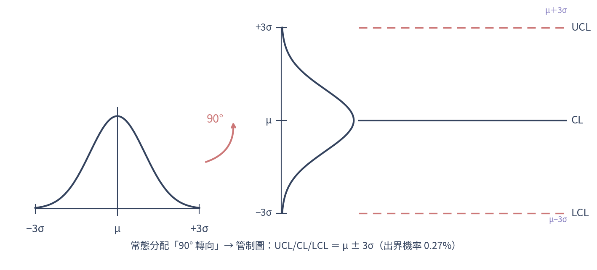

> 超出 ±3σ 的機率僅約 **0.27%**，一旦點子出界，即應調查是否有**特殊原因（Special Cause／非機遇原因）**介入。

### 2. 型 I 誤差 α（虛發警報：製程正常卻有點出界）

| 管制界限 | α 值 |
|---|---|
| ±1σ | 31.74% |
| ±2σ | 4.55% |
| **±3σ** | **0.27%** |
| ±4σ | 63.34 PPM |

### 3. 型 II 誤差 β（漏報：平均值已移動卻沒被偵測）

n＝1、平均值移動 kσ 時：

| 平均值移動 | β（沒偵測到） | 1−β（偵測力） |
|---|---|---|
| ±1σ | 97.72% | 2.28% |
| ±2σ | 84.13% | 15.87% |
| ±3σ | 50% | 50% |
| ±4σ | 15.87% | 84.13% |

**判定矩陣 ⭐（判斷關鍵：先看「批／製程實際是誰」，再看「判成什麼」）**

| 實際＼判定 | 判為不合格 | 判為合格 |
|---|---|---|
| 實際**合格** | **α（型 I）**＝生產者冒險 Producer's risk | 1−α（良品判良） |
| 實際**不合格** | 1−β＝**檢定力 power**（壞的被抓到） | **β（型 II）**＝消費者冒險 Consumer's risk |

> - 記法：**1−α＝良品判良、1−β＝不良品判不良＝檢定力**
> - **±3σ 使「型 I ＋型 II」總和最小 → 「最經濟的管制界限」**
> - 放寬到 ±4σ：型 I↓型 II↑；收緊到 ±2σ：型 I↑型 II↓

**口語定義對照（講義 P41）⭐**

| 項目 | 第一種錯誤 Type I | 第二種錯誤 Type II |
|---|---|---|
| 綽號 | **緊張忙亂**之錯誤 | **心不在焉**之錯誤 |
| 定義 | 判定為不正常，事實上**並非**不正常 | 製程實際已異常卻判為正常，喪失尋找異常原因的機會、不良品增加 |
| 白話 | **不該判錯而判錯**：將**優良**產品誤判為**不良** | **該判錯而不判錯**：將**不良**產品誤判為**良品** |
| 冒險率 | **生產者冒險率 α** | **消費者冒險率 β** |
| 後果 | 神經過敏、做徒勞無益的**冤枉工作** | **錯過改正機會**、引起嚴重後果 |

> 記法：
>
> - **型 I ＝太緊張**：好的當成壞的、白忙一場、生產者吃虧 α
> - **型 II ＝太大意**：壞的當成好的、放行不良品、消費者吃虧 β

### 4. 型 II 誤差 β 公式與 ARL ⭐

製程中心偏移 kσ、每組樣本 n、±3σ 界限下，一次抽樣「沒偵測到」的機率：

**β ＝ Φ(3 − k√n) − Φ(−3 − k√n)**

| 名詞 | 定義 |
|---|---|
| 檢定力 power ＝ **1 − β** | 一次抽樣就抓到偏移的機率 |
| **ARL（平均連串長度）＝ 1 ÷ (1−β)** | 平均要抽幾組才發出警報（越小越靈敏） |

**例題：** X̄ 圖 n＝5，製程中心漂移 2σ（k＝2）：
- β ＝ Φ(3−2√5) − Φ(−3−2√5) ＝ Φ(−1.47) − Φ(−7.47) ≈ **0.071**
- 1−β ＝ 0.929；ARL ＝ 1 ÷ 0.929 ≈ **1.08**（平均約 1 組就抓到）

> **判斷關鍵**：
>
> - 偏移越大（k↑）或樣本越大（n↑）→ √n 放大 → β 越小、檢定力越高、ARL 越接近 1
> - 管制圖「**抓大偏移快、抓小偏移慢**」
> - 上表 β（97.72%…）是 **n＝1 的特例**（k＝1 → β＝Φ(2)−Φ(−4)＝0.9772）

---

## 十九、群體與樣本、X̄ 分配與管制界限計算 ⭐

### 1. 群體與樣本、有限／無限判斷

判斷關鍵：**n/N > 1/10（即 N < 10n）→ 有限母體**；否則（或母體無限）視為無限母體。

### 2. 樣本平均值的分配（X̄ 分配）

| 項目 | 公式 | 說明 |
|---|---|---|
| 期望值 | E(X̄) = μ | 樣本平均的中心與群體相同 |
| 標準差（無限群體） | **σx̄ = σ/√n** | 樣本平均散佈只有群體的 1/√n，n 越大越集中 |
| 標準差（有限群體 n/N > 1/10） | σx̄ = **√[(N−n)/(N−1)]** × σ/√n | 根號那串是**有限母體修正係數** |
| 由全距估 σ | **σ̂ = R̄/d₂** | R̄＝各組樣本全距的平均；d₂ 依 n 查表 |

> 中央極限定理：不論群體形狀，**n ≥ 30** 時 X̄ 近似常態 N(μ, σ²/n)；群體本身常態時，X̄ 不論 n 多少都常態。

### 3. 例題（先算 n/N 再選公式）

| 例題 | 判斷 | 計算 | 答案 |
|---|---|---|---|
| 500 個產品 σ=15.4 克，100 個為一批，各批平均值標準差？ | 100/500 = 1/5 > 1/10 → **有限** | √[(500−100)/(500−1)] × 15.4/√100 | **1.38 克** |
| 化學成份 σ=1.2%，每組取 4 個，樣本平均值標準差？ | 無限 | 1.2%/√4 | **0.6%** |
| 工廠 1000 人調查 150 人；總公司 80 人要 σx̄ 相同，應查幾人？ | 兩邊皆有限 | 令兩 σx̄ 相等解 n₁ | **≈ 55.6 → 56 人** |

> ⚠️ 第三題陷阱：直覺的「**比例抽樣**」（1000 查 150 是 15% → 80 人查 12 人）是**大錯誤**——小母體反而要查到近七成（56/80）才有同樣精度。

### 4. 管制界限寬窄的選擇

- 型 I 成本高（虛驚代價大）→ 用**較寬**界限（如 3σ 甚至更寬）。
- 型 II 成本高（漏掉不良品後果嚴重，如製藥）→ 用**較窄**界限。
- 兩種都重要 → 用較寬界限，但**多抽樣本**以降低型 II。
- 出界情形很多 → 用較窄界限較佳。
- 2σ 太嚴（無的放矢、浪費）；4σ 太寬（非機遇原因藏在 4σ 內漏抓）；**±3σ 最經濟**。

---

## 二十、管制圖的種類與建立步驟 ⭐

### 1. 依數據性質分兩大類（考點：「兩大類」）

| 類別 | 數據 | 管制圖 |
|---|---|---|
| **計量值**（連續、可量測：長度重量成份） | 計量值 | X̄–R、X̄–s、X̃–R、X–Rm |
| **計數值**（間斷、計數：不良／缺點個數） | 計數值 | p、pn（np）、c、u |

### 2. 計量值 vs 計數值管制圖優缺點

| | 計量值管制圖 | 計數值管制圖 |
|---|---|---|
| 資訊量 | 多（保留實際數值） | 少（只記合格與否／缺點數） |
| 靈敏度 | **高**（較早發現異常） | 較低 |
| 成本 | 量測費時、成本高 | 檢驗快、成本低 |
| 樣本 | 需較小樣本即可 | 需較大樣本 |

### 3. 建立管制圖的步驟（7 步）⭐

1. 決定要管制的**品質特性**（管制項目選定）
2. 選擇**適當的管制圖**（依計量／計數、n 大小）
3. 決定**抽樣間隔、樣本大小（通常 2~5 個一組）、抽樣方法**
4. 決定製程中**哪個階段**要管制
5. 蒐集**至少 20 組**（約 100~150 個）數據以計算管制界限
6. 描點，判斷是否來自**穩定製程**（界限內且無異常型態）
7. 持續抽樣描點，**追蹤製程是否維持穩定**

> 手寫重點：**至少 20~25 組、每組 4~5 個**是建立界限的基本量；同一組內勿含異質數據。

---

## 二十一、計量值管制圖：X̄–R／X̄–s／X̃–R／X–Rm ⭐⭐大題必考

### 1. 選圖流程（依 n）＋一分鐘記憶

| 情況 | 用圖 | 案例（講義） |
|---|---|---|
| 每組 n＝2~10（常用 4、5） | **X̄–R**（最常用） | 螺絲直徑：每小時抽 5 支量直徑 |
| 每組 n＞10 | **X̄–s**（n 大時 R 估 σ 效率差，改用 s） | PET 瓶重量：每批抽 15 瓶量重 |
| 資料可能有極端值、要穩定 | **X̃–R**（中位數，不受極端值影響） | 零件厚度：含極端值時用中位數 |
| 每次只有 1 個（n＝1） | **X–Rm**（個別值–移動全距） | 爐溫監控：每 10 分鐘記一次爐溫 |

> 判讀順序：**先看 R（全距）圖再看 X̄ 圖**——X̄ 界限用 R̄ 算，R 圖不穩則 X̄ 界限不可信。

### 2. 四種計量值圖公式（σ 未知、用樣本估）⭐

**先分清楚 3 個符號（看懂公式的關鍵）：**

| 符號 | 唸法 | 意思 |
|---|---|---|
| X̄ | X bar | **一組**的平均 |
| **X̿** | X double bar | **所有組平均的總平均** ＝ ΣX̄ ÷ 組數 k（管制圖的中心線就用它） |
| R̄ | R bar | 各組**全距的平均** ＝ ΣR ÷ k |

**為什麼「一種圖」要畫「兩張」？⭐（看懂本章的關鍵）**

抽樣是「一組一組」抽的（如每小時抽 5 支），每組都要同時盯兩件事，所以配兩張圖：

| 這張圖 | 盯什麼 | 只有它、漏看的 |
|---|---|---|
| **平均圖**（上）：X̄／X̃／X | 製程中心**準不準**（位置有沒有偏） | 漏掉「平均整個偏掉」 |
| **散布圖**（下）：R／s／Rm | 製程**穩不穩**（變異大不大、一致性） | 漏掉「平均沒動、但變異變大」 |

四種圖 ＝ 一張平均圖 ＋ 一張散布圖，各自用不同係數算界限：

| 圖名 | 平均圖 | 用係數 | 散布圖 | 用係數 | 適用 |
|---|---|---|---|---|---|
| **X̄–R** | 平均數 X̄ | A₂ | 全距 R | D₃、D₄ | n＝2~10（最常用） |
| **X̃–R** | 中位數 X̃ | m₃A₂ | 全距 R | D₃、D₄ | 中位數 |
| **X̄–s** | 平均數 X̄ | A₃ | 標準差 s | B₃、B₄ | n＞10 |
| **X–Rm** | 個別值 X | E₂ | 移動全距 Rm | D₃、D₄ | 個別值 n＝1 |

> - 界限一律 **中心 ± 3σ**（CL＝中心、UCL＝＋3σ、LCL＝−3σ）
> - σ 不知道，用樣本估：**R̄/d₂**（全距估）或 **s̄/C₄**（標準差估）
> - **係數（A₂…）就是把「3σ ÷ 估計」包成一個數字**，直接乘 R̄ 或 s̄ 就好，不必自己算 σ
> - **移動全距 Rm ＝ |Xᵢ − Xᵢ₊₁|**：n＝1 時一組只有一個值、算不出組內全距，改用**相鄰兩點差的絕對值**當變異

> 📋 **四種計量值圖 ＋ 四種計數值圖的 CL／UCL／LCL 完整公式（含適用條件），已合併成一張總表** → 見 **第二十二章第 5 節「附表 11 公式總表」**；係數值查下面第 3 節係數表。

### 3. 管制圖係數表（常態抽樣常數）⭐背 n＝4、5

| n | A₂ | A₃ | d₂ | D₃ | D₄ | B₃ | B₄ | E₂ | m₃A₂ | C₄ |
|---|---|---|---|---|---|---|---|---|---|---|
| 2 | 1.880 | 2.659 | 1.128 | — | 3.267 | — | 3.267 | 2.660 | 1.880 | 0.798 |
| 3 | 1.023 | 1.954 | 1.693 | — | 2.574 | — | 2.568 | 1.772 | 1.187 | 0.886 |
| **4** | **0.729** | 1.628 | 2.059 | — | **2.282** | — | 2.266 | 1.457 | 0.796 | 0.921 |
| **5** | **0.577** | 1.427 | 2.326 | — | **2.114** | — | 2.089 | 1.290 | 0.691 | 0.940 |
| 6 | 0.483 | 1.287 | 2.534 | — | 2.004 | 0.030 | 1.970 | 1.184 | 0.549 | 0.952 |
| 7 | 0.419 | 1.182 | 2.704 | 0.076 | 1.924 | 0.118 | 1.882 | 1.109 | 0.509 | 0.959 |
| 8 | 0.373 | 1.099 | 2.847 | 0.136 | 1.864 | 0.185 | 1.815 | 1.054 | — | 0.965 |
| 9 | 0.337 | 1.032 | 2.970 | 0.184 | 1.816 | 0.239 | 1.761 | 1.010 | — | 0.969 |
| 10 | 0.308 | 0.975 | 3.078 | 0.223 | 1.777 | 0.284 | 1.716 | 0.975 | — | 0.973 |

> - 「—」表 LCL 取 0（負值無意義）
> - **D₃：n≤6 為 0；B₃：n≤5 為 0**
> - X–Rm 取相鄰 2 點時 E₂ 用 n＝2 列＝**2.66**、D₄＝3.267
> - 兩種估 σ：**R̄/d₂**（X̄–R 用）、**s̄/C₄**（X̄–s 用），n 越大 C₄ 越接近 1

### 4. X̄–R 作法：瞬時法 vs 定時法 ⭐

- 數據分組**通常 25 組**、每組 **4~5 個較佳**，同組內勿含異質數據。
- **瞬時法**（同一瞬間連抽數個）：組內變異**小**、組間變異大——最能凸顯製程隨時間變化，**最常用**。
- **定時法**（一段時間陸續取）：組內變異**大**、組間變異小。
- 公式：X̄ = ΣXᵢ/n；R = max − min；X̿ = ΣX̄/組數；R̄ = ΣR/組數。

### 5. X̄–R 例題（背算法）

紫銅管內徑，n＝5、k＝25，ΣX̄＝1254、ΣR＝120：
X̿＝1254/25＝**50.16**；R̄＝120/25＝**4.8**。查 n＝5：A₂＝0.577、D₄＝2.114、D₃＝0。
- X̄ 圖：CL＝50.16；UCL＝50.16＋0.577×4.8＝**52.93**；LCL＝50.16−2.77＝**47.39**
- R 圖：CL＝4.8；UCL＝2.114×4.8＝**10.15**；LCL＝**0**

---

## 二十二、計數值管制圖：p／pn／c／u ⭐

### 1. 四圖對照 ⭐必考（率 vs 數、不合格品 vs 缺點、n 固定與否）

| 圖 | 管制對象 | 樣本 n | 中心線 CL | UCL／LCL | 標準差 | 分配 |
|---|---|---|---|---|---|---|
| **p**（不合格率） | 不合格「品」比率 | **可不固定** | p̄＝Σd/Σn | p̄ ± 3√(p̄(1−p̄)/n) | √(p̄(1−p̄)/n) | 二項 |
| **pn**（不合格數） | 不合格「品」個數 | **必須固定** | p̄n＝Σd/k | p̄n ± 3√(p̄n(1−p̄)) | √(p̄n(1−p̄)) | 二項 |
| **c**（缺點數） | 缺點總數 | **必須固定** | c̄＝Σc/k | c̄ ± 3√c̄ | √c̄ | 卜瓦松 |
| **u**（單位缺點數） | 每單位缺點數 | **可不固定** | ū＝Σc/Σn | ū ± 3√(ū/n) | √(ū/n) | 卜瓦松 |

> ⚠️ **易錯（第三堂課講義圖標錯處）：pn 圖樣本大小「必須固定」，不是「不一定」！**
>
> - 正確配對：**p 可變、pn 固定、c 固定、u 可變**
> - 「製品大小」一層：**c 圖**＝製品大小一定**且**樣本固定（如每片手機螢幕同尺寸數缺點）；**u 圖**＝製品／檢驗單位大小不一定（如各批布料長度不同數每公尺缺點）
> - **不合格「品」vs 缺點**：不合格品＝整件判良/不良；缺點＝一件上的瑕疵點數（一件可有多個）。LCL 負值取 0

### 2. p 圖樣本大小規則 ⭐

- 使每組約含 1~5 個不合格品：**n ＝ 1/p̄ ~ 5/p̄**。
- 要 LCL ≥ 0（不落負）：**n ≥ 9(1−p̄)/p̄**（例 p̄＝0.05 → n≥171）。
- 各組 n 相差 **20% 以內** → 用平均樣本數 n̄ 算共同界限；超過 → 各組個別算（**階梯狀界限**）。

### 3. 近似式與樣本不定時的界限

| 情況 | p／pn 圖 | u 圖 |
|---|---|---|
| **p̄ 很低**（趨近 0）近似式 | p 圖：p̄ ± 3√(p̄/n)；pn 圖：p̄n ± 3√(p̄n) | — |
| **各組樣本大小不定** → 用平均樣本數 n̄ | p 圖：p̄ ± 3√[p̄(1−p̄)/n̄] | ū ± 3√(ū/n̄) |

### 4. 計數值例題

- p 圖（n＝100 固定）：Σd＝125、Σn＝2500 → p̄＝5%；UCL＝5%＋3√(5×95/100)%≈**11.54%**；LCL＝0。
- c 圖：ΣC＝84、k＝20 → c̄＝4.2；UCL＝4.2＋3√4.2≈**10.35**；LCL＝0。
- pn 圖（n＝100）：Σd＝65、k＝25 → p̄n＝2.6；UCL＝2.6＋3√(2.6×0.974)≈**7.4**；LCL＝0。

### 5. 附表 11：管制界限公式總表（計量值＋計數值＋適用條件，一次查）⭐⭐

符號：X̄＝一組平均、**X̿**＝所有組的總平均（ΣX̄/k）、R̄＝各組全距平均、s̄＝各組標準差平均。CL＝中心線、UCL＝＋3σ、LCL＝−3σ。

| 類別 | 管制圖 | 統計量 | 中心線 CL | UCL（＋3σ） | LCL（−3σ） | 適用條件 |
|---|---|---|---|---|---|---|
| **計量值** | X̄–R 平均數與全距 | X̄ | X̿ | X̿ ＋ A₂R̄ | X̿ − A₂R̄ | n＝2~10（最常用） |
| | | R | R̄ | D₄R̄ | D₃R̄（n≤6 為 0） | |
| **計量值** | X̃–R 中位數與全距 | X̃ | X̿̃ | X̿̃ ＋ m₃A₂R̄ | X̿̃ − m₃A₂R̄ | 中位數圖 |
| | | R | R̄ | D₄R̄ | D₃R̄ | |
| **計量值** | X̄–s 平均數與標準差 | X̄ | X̿ | X̿ ＋ A₃s̄ | X̿ − A₃s̄ | n＞10 |
| | | s | s̄ | B₄s̄ | B₃s̄（n≤5 為 0） | |
| **計量值** | X–Rm 個別值與移動全距 | X | X̄ | X̄ ＋ E₂R̄m | X̄ − E₂R̄m | 個別值 n＝1 |
| | | Rm | R̄m | D₄R̄m | D₃R̄m | |
| **計數值** | p 不合格率 | p | p̄ | p̄ ＋ 3√(p̄(1−p̄)/n) | p̄ − 3√(p̄(1−p̄)/n) | 樣本大小**可變** |
| **計數值** | pn 不合格數 | pn | p̄n | p̄n ＋ 3√(p̄n(1−p̄)) | p̄n − 3√(p̄n(1−p̄)) | 樣本大小**固定** |
| **計數值** | c 缺點數 | c | c̄ | c̄ ＋ 3√c̄ | c̄ − 3√c̄ | 單位固定、樣本固定 |
| **計數值** | u 單位缺點數 | u | ū | ū ＋ 3√(ū/n) | ū − 3√(ū/n) | 檢驗單位大小**可變** |

> 係數 A₂／A₃／D₃／D₄／E₂／m₃A₂／B₃／B₄ 查第二十一章第 3 節係數表；σ̂＝R̄/d₂ 或 s̄/C₄。
> **註 1（p̄ 低時近似）**、**註 2（各組樣本不定用 n̄）** 的公式見本章第 3 節。LCL 算出負值一律取 0。

---

## 二十三、製程管制與品質變異因素（補充，課堂尚未上到）

> 📌 佔位小節：這章 CQT 課堂尚未上到，先放 6M。之後上到「製程管制／特性要因圖」再補齊。

### 1. 影響品質的因素 4M → 5M → 6M ⭐

6M ＝ 找「品質變異原因」的六大類，也是**特性要因圖（魚骨圖／石川圖）**的六條主幹。

| 代號 | 英文 | 中文 | 內容舉例 |
|---|---|---|---|
| 人 | **Man** | 人員 | 技術、經驗、新手、情緒、有無照標準做 |
| 機 | **Machine** | 機械設備 | 精度、保養、磨損、震動、參數設定 |
| 料 | **Material** | 物料 | 進料品質、批次差異、規格、儲存 |
| 法 | **Method** | 方法 | 作業標準、製程條件、SOP |
| 測 | **Measurement** | 量測 | 量具校正、量測方法、量測誤差 |
| 環 | **Milieu／Environment** | 環境 | 溫度、濕度、照明、粉塵、噪音 |

> - **演進**：4M（人、機、料、法）→ ＋量測 Measurement ＝ 5M → ＋環境 Environment ＝ 6M；故 6M 也寫成 **5M1E**
> - ⚠️ 英文陷阱：量測＝**Measurement**、環境＝**Milieu**（湊 M）或 **Environment（E）**；出現 Money／Management 是延伸 8M，不算經典 6M
> - 用途：畫**魚骨圖**分析不良原因時，大骨就用這 6 類展開

---

*（待續：後續講義內容會依上傳陸續補充）*
